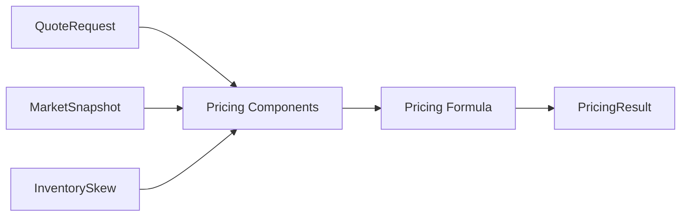
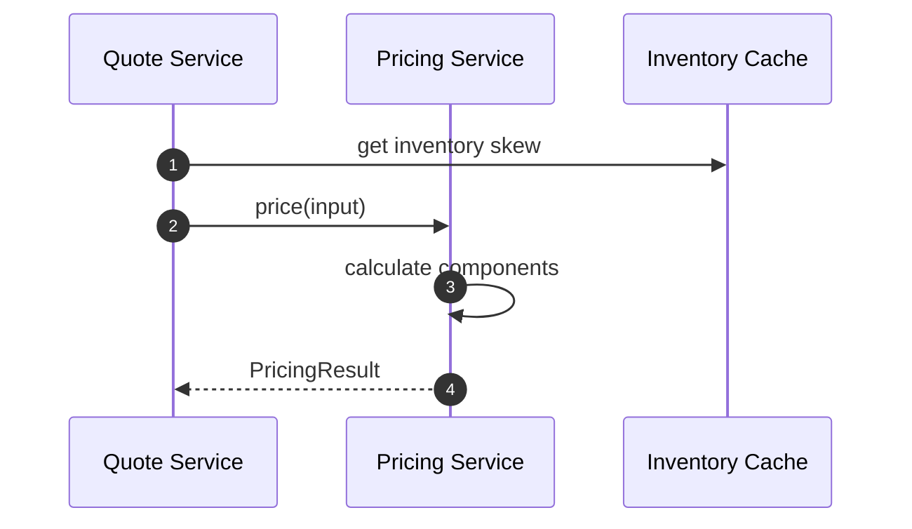
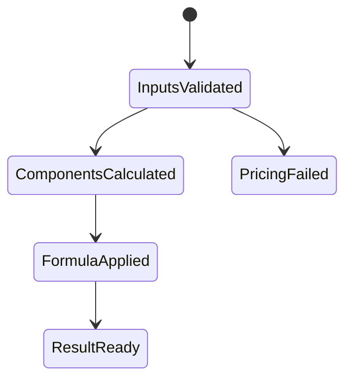

# Chapter 03: Pricing Service

## Abstract

Pricing Service 实现 Prop AMM 报价模型。它接收 QuoteRequest、MarketSnapshot 和 Inventory State，输出 amountOut、minAmountOut 和解释字段。Pricing Service 不决定是否签名，最终批准权在 Risk Service。

## Learning Objectives

- 理解 Pricing Service 的输入输出。
- 明确 pricing formula 与 risk limit 的边界。
- 说明 pricingVersion 的作用。
- 设计可测试的定价模块。

## Background

Volume2 已定义市场数据和定价公式。后端实现需要把这些设计转化为接口、纯函数和可观测结果。

## Problem Statement

如果定价逻辑散落在 Quote Service 中，后续很难替换模型、测试参数和做 PnL 归因。Pricing Service 必须独立。

## Requirements

### Functional Requirements

- 输入 request、snapshot、inventory skew。
- 计算 spread、size impact、volatility premium、hedge cost。
- 输出 amountOut、minAmountOut 和 pricingVersion。
- 支持模型版本切换。

### Non-Functional Requirements

- 定价函数应尽量纯函数化。
- 参数必须版本化。
- 中间解释字段必须记录。

## Existing Solutions

固定 spread 模型简单但不足。复杂机器学习模型难以解释。第一版使用可解释 bps 模型。

## Trade-Off Analysis

可解释模型比黑盒模型更适合开源参考实现和面试项目。后续可以在接口不变的情况下增强模型。

## System Design



## Architecture Diagram

Pricing Service 依赖 Market Data、Routing plan 和 Inventory projection，但不直接访问 Signer。Routing Engine 选择报价路径失败时，Quote Service 应在调用 Pricing Service 前返回 `ROUTING_UNAVAILABLE`。

## Sequence Diagram



## State Machine



## Data Model

`PricingResult` includes amount fields and component bps fields. It should match backend `pricing.engine.ts` and later extend with volatility and hedge cost.

当前实现返回 `amountOut`、`minAmountOut`、`spreadBps`、`sizeImpactBps`、`inventorySkewBps` 和 `pricingVersion`。其中 `spreadBps` 表示已经聚合后的总报价调整，包括 base spread、internal inventory buffer、volatility premium、size impact、inventory skew，以及 Hedge Service 在 post-trade hedge failure 后提供的 quote risk penalty。

## API Design

Internal interface:

```ts
price(input: PricingInput): Promise<PricingResult>
```

## Engineering Decisions

- Pricing Service 不调用 Signer。
- PricingResult 进入 Risk Service。
- pricingVersion 写入 quote record。
- Routing failure 是 quote dependency failure，不应落入通用 500，也不应继续执行 pricing/risk/signer。
- Pricing input is validated before formula execution: request addresses and amounts, snapshot identifiers and market fields, route venue/liquidity, route token pair alignment, slippage bps and inventory skew bounds must be sane before any signed quote candidate can be produced.

## Failure Scenarios

- Snapshot stale：pricing failed。
- Routing unavailable：return `ROUTING_UNAVAILABLE` before pricing。
- Decimals missing：pricing failed。
- amountOut zero：pricing failed。
- Guardrail exceeded：pricing failed or risk rejected。

## Security Considerations

定价参数是策略信息，不应通过公开 API 暴露。内部日志需要脱敏。

## Performance Considerations

实时定价应避免 IO 密集操作，依赖预加载 snapshot 和缓存 inventory。

## Testing Strategy

测试 fixed inputs、component bps、slippage、decimals、guardrails 和 pricingVersion。

## Interview Notes

Pricing Service 给出价格，不代表可以签名。Risk Service 是签名前 gate。

## Summary

Pricing Service 是 Prop AMM 的工程实现边界，输出必须可解释并可被 Risk Service 审查。

## References

- Volume2 Market Data And Pricing
- Inventory-based pricing
