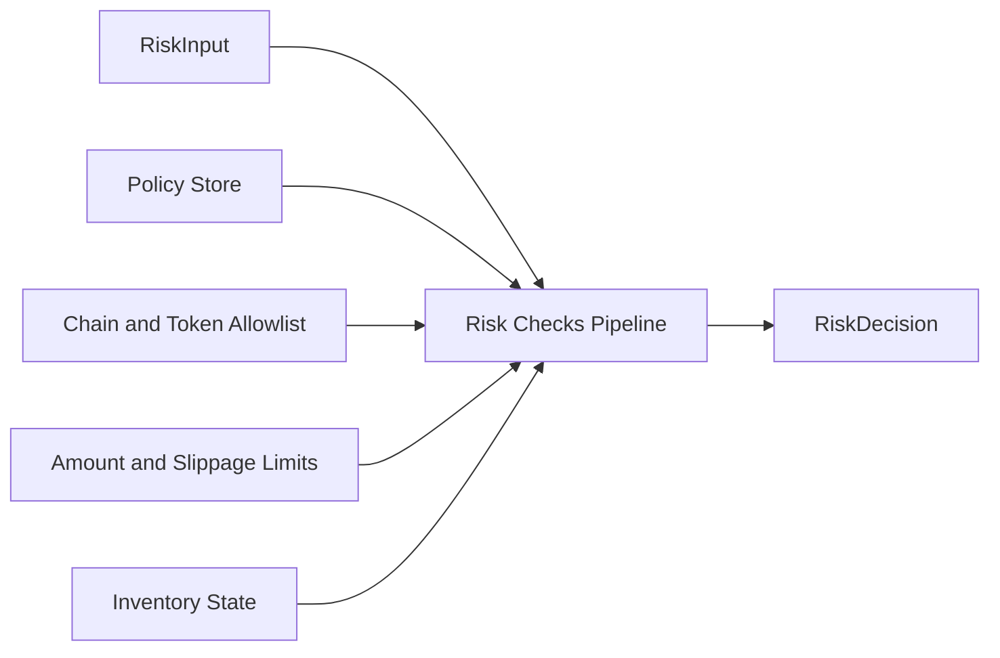
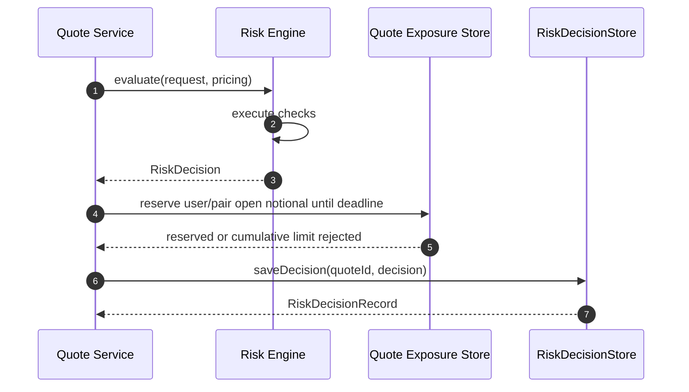
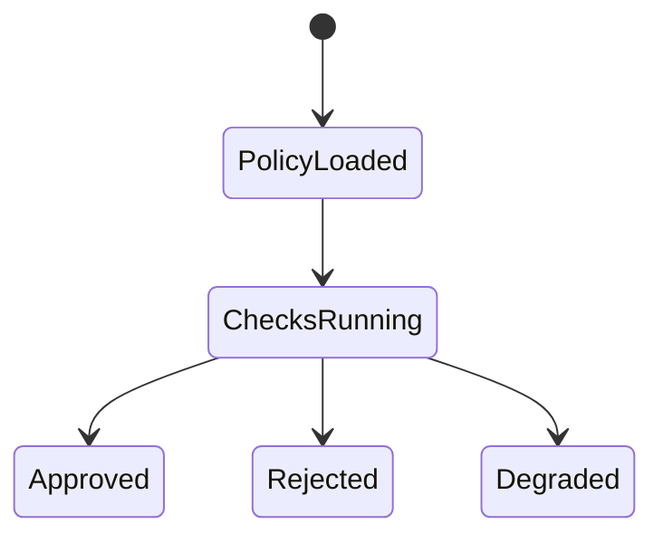

# Chapter 04: Risk Service

## Abstract

Risk Service 是签名前风控服务。它接收 QuoteRequest、PricingResult 和 projected inventory，读取库存、限额、VaR 和 toxic flow 信号，输出 RiskDecision。只有 RiskDecision 为 approved 时，Quote Service 才能调用 Signer Service。默认运行时使用 `TokenLimitRiskEngine`，以 `(chainId, tokenAddress)` 为授权和限额键，覆盖 chain allowlist、per-token amount/min-output/inventory limit、max slippage、quoted spread guard、toxic-flow gate 和 `piecewise-convexity-v1` Gamma-like 组合 guardrail。`BasicRiskEngine` 保留为嵌入式基础策略，但不再作为默认生产 wiring。

## Learning Objectives

- 理解 Risk Service 与 Pricing Service 的边界。
- 定义 RiskDecision。
- 说明 policyVersion 和 reasonCode。
- 设计风控状态机的工程实现。

## Background

Volume3 定义了风险模型。后端需要把模型实现为可测试 pipeline，并确保 Signer 无法被未批准请求调用。

## Problem Statement

风控如果只是注释或人工流程，就无法保护资金。Risk Service 必须成为代码路径中的强制步骤。

## Requirements

### Functional Requirements

- 校验市场状态、定价结果、库存、限额、VaR、toxic flow。
- 第一阶段代码至少校验 enabled chain、chain-scoped token limit、per-token max amount/min output/projected inventory、max slippage 和 max quoted spread。
- 输出 approved 或 rejected。
- 输出 reasonCode 和 policyVersion。
- 持久化 risk decision。

### Non-Functional Requirements

- 决策必须可回放。
- reasonCode 稳定。
- policy 变更可审计。

## Existing Solutions

简单系统只做全局 amount limit，但 raw units 无法跨 token 比较，同一地址也不能跨 chain 隐式共享权限。当前默认实现使用 `TokenLimitRiskEngine`：`RFQ_RISK_POLICY_JSON` 为每个 chain/token 分别给出 `maxAmountIn`、`minAmountOut`、`maxNotionalUsd` 和 `maxAbsoluteInventory` canonical uint256 string，并用全局 `maxUserOpenNotionalUsd`、`maxPairOpenNotionalUsd`、`minLiquidityUsd`、`maxVolatilityBps` 控制累计签名敞口和市场状态；Quote Service 把定价使用的同一份已验证 snapshot 与成交后的 tokenIn/tokenOut 库存投影传入 Risk Engine。单笔名义金额采用两侧 token limit 中更小的 `maxNotionalUsd`，只信任 token registry 标记的 USD-reference token 和 decimals，并通过 BigInt 比较，避免 USDC 6 decimals 与 WETH 18 decimals 被浮点或 raw-unit 混算。`gammaGuardrail` 再对两条投影库存腿、所有 USD-reference 名义金额腿和 snapshot 波动率做向上取整利用率，按 balanced/elevated/critical、small/large/block、normal/elevated/extreme 三档累加风险乘数；达到审核上限返回 `GAMMA_GUARDRAIL_TRIGGERED`，投影缺失返回 `RISK_ENGINE_UNAVAILABLE`。交易对没有 USD-reference token、snapshot 流动性不足或波动率越界时同样 fail closed。生产活动签名报价由 Redis/Valkey TTL-bound exposure ledger 原子计数，portfolio VaR 与 Delta 使用 versioned chain snapshot、hot inventory 和 valuation snapshots；CAS commit 只有在 generation 未变化时才写入 exact user/pair/Treasury 聚合与 Stream event，否则重新读取并评估，避免多个并发 quote 越过组合限额。动态 toxic-flow、日损、settlement-indexer、USD-reference、quote-control 和 hedge-risk 输入也由启动预热与后台刷新维护为不可变 process-local generation；默认 `/quote` 风控不再同步查询 PostgreSQL 或 RPC，二者保留为控制面、审计源和刷新依赖。

Risk Engine 本身也是签名前依赖。只要 `evaluate(input)` 抛出异常，Quote Service 必须 fail closed：保存 rejected quote，返回 `RISK_REJECTED`，内部稳定 reasonCode 为 `RISK_ENGINE_UNAVAILABLE`，并且不调用 Signer Service。这个选择把未知风控状态等价处理为拒绝，而不是让 dependency failure 变成可签名路径或通用 500。Risk decision 审计存储同样位于 signer 边界之前：`RiskDecisionStore` 写入失败时返回 `QUOTE_STORE_UNAVAILABLE`，best-effort 将 requested quote 标记为 `failed`，并阻断签名，因为一个不可回放的 approved decision 不应生成可执行签名。

## Trade-Off Analysis

多维风控增加延迟，但能显著降低错误签名风险。实时路径应缓存必要输入。

## System Design



## Architecture Diagram

Risk Service 是 Signer 前的强制 gate。Signer request 必须携带 approved decision context。

## Sequence Diagram



## State Machine



## Data Model

`TokenLimitRiskPolicy` 包含 `policyVersion`、`enabledChainIds`、`tokenLimits`、`restrictedUsers`、`toxicFlowScores`、`maxUserOpenNotionalUsd`、`maxPairOpenNotionalUsd`、`portfolioVar`、`portfolioDelta`、`gammaGuardrail`、`minLiquidityUsd` 和四个 bps 上限。`portfolioVar` 固定 model version、USD VaR budget、confidence multiplier、horizon、snapshot age/future-skew bounds 和显式 valuation pairs；`portfolioDelta` 固定 chain/token asset 与 portfolio gross/net soft/hard USD limits，且 asset limits 必须与非现金 valuation assets 一一对应；`gammaGuardrail` 固定三组 utilization 阈值和最大组合乘数。每个 `TokenRiskLimit` 固定 `chainId`、`tokenAddress`、`maxAmountIn`、`minAmountOut`、`maxNotionalUsd`、`maxAbsoluteInventory`。稳定 reasonCode 还包含 `USER_OPEN_NOTIONAL_LIMIT_EXCEEDED`、`PAIR_OPEN_NOTIONAL_LIMIT_EXCEEDED`、`TREASURY_LIQUIDITY_INSUFFICIENT`、`PORTFOLIO_VAR_LIMIT_EXCEEDED`、`PORTFOLIO_DELTA_LIMIT_EXCEEDED` 和 `GAMMA_GUARDRAIL_TRIGGERED`；它们写入 `risk_decisions`，但不向公共 API 暴露阈值。`quote_exposure_reservations` 同时保存 user/pair 名义敞口、方向性 `tokenIn/amountIn/tokenOut/amountOut`、可选 same-block Treasury 余额证据、`var_evaluation` 和 `delta_evaluation` JSONB；它不替代成交后的 inventory ledger。

其他稳定拒绝原因继续包括 `CHAIN_NOT_ENABLED`、`TOKEN_NOT_ALLOWED`、`MARKET_LIQUIDITY_TOO_LOW`、`MARKET_VOLATILITY_LIMIT_EXCEEDED`、`AMOUNT_IN_LIMIT_EXCEEDED`、`AMOUNT_OUT_TOO_SMALL`、`QUOTE_NOTIONAL_LIMIT_EXCEEDED`、`USD_REFERENCE_REQUIRED`、`USD_REFERENCE_DEPEG`、`DAILY_LOSS_LIMIT_EXCEEDED`、`SLIPPAGE_TOO_WIDE`、`QUOTED_SPREAD_TOO_WIDE`、toxic-flow 与 inventory limit 原因，以及依赖失败时的 `RISK_ENGINE_UNAVAILABLE`。

默认生产 Risk Engine 还组合 `UsdReferenceRiskEngine`。`RFQ_USD_REFERENCE_CONFIG_JSON` 必须为每个 managed `usdReference` token 指定独立 Chainlink token/USD feed；配置覆盖、token symbol 与 `description` 在启动时交叉校验。每次基础风控通过后，guard 才读取或复用短 TTL 的 feed 证据，验证 RPC chain ID、Aggregator 元数据、round 完整性、新鲜度、未来偏差、L2 sequencer 与 answer bounds。超过 `maxDeviationBps` 返回 `USD_REFERENCE_DEPEG`，任何不可判定状态抛错并由 Quote Service 收敛为 `RISK_ENGINE_UNAVAILABLE`。健康证据的 chain、token、aggregator 和 round identity 会进入 policy-version digest，使 risk decision 和 signer audit 可以关联到被检查的 oracle round；readiness 的固定 `risk` component 同时检查全部配置 feed，并通过 `rfq_usd_reference_health_safe` 与固定 reason 的 failure counter 在零 quote 流量时继续暴露 oracle/depeg 风险。

最外层 `DailyLossRiskEngine` 使用 `RFQ_DAILY_LOSS_CONFIG_JSON` 为每个 managed USD-reference token 配置正数 `maxLossUsdE18`。PostgreSQL provider 按数据库时间聚合当前 UTC 自然日内 `hedge_net_pnl_status='complete'` 的 `hedge_net_pnl_quote_quantity`，全程使用 decimal string 与 `BigInt`，不会经过浮点数。两腿均为 reference token 时沿用 hedge planner 的 tokenIn 归属；其余交易使用唯一 reference token。净 PnL 达到 `-maxLossUsdE18` 时返回 `DAILY_LOSS_LIMIT_EXCEEDED`，证据缺失、格式错误或数据库失败则 fail closed 为 `RISK_ENGINE_UNAVAILABLE`。policy-version digest 包含基础策略、日损策略、chain/token、净 PnL 和 UTC window identity；readiness 检查全部配置 limit，因此零流量下预算耗尽仍会阻断签名。当前 UTC 日内只要存在已终结但 `hedge_net_pnl_status='unavailable'` 的行，整份日损证据就判为无效；未完成、不可估值或部分未闭合的 PnL 不会被伪装成零。

Risk decision audit persistence rejects malformed root payloads, missing `decision` objects, inherited `quoteId` / `decision` fields, inherited required decision fields, and inherited rejected `reasonCode` before field access or state mutation；it validates `quoteId` as an own primitive-string `SafeIdentifier` and validates the derived `riskDecisionId` before storing。同一 quote 的 decision/status/reason/policyVersion 不允许被改写；PostgreSQL store 使用 `INSERT ... ON CONFLICT DO NOTHING` 后读取并逐字段核对，禁止通过 upsert 覆盖已签名链路的风险证据。数据库强制 approved decision 的 `reasonCode` 为 NULL，而 rejected decision 必须携带稳定且非空的 `reasonCode`。PostgreSQL `risk_decisions.reason_code` CHECK constraint 必须匹配后端 `RiskRejectReasonCode` union，新增或删除稳定原因时由 schema consistency gate 阻止单边变更。

## API Design

Internal interface:

```ts
evaluate(input: RiskInput): Promise<RiskDecision>
```

## Engineering Decisions

- Risk Service owns policyVersion.
- Audit write failure blocks signing.
- RiskDecisionStore mirrors the PostgreSQL risk_decisions contract and participates in readiness / metrics as `riskDecisionStore`.
- Rejected quotes do not receive signature.
- 默认 `TokenLimitRiskEngine` 是签名前强制 gate；代码库不提供 allow-all 风控实现，测试需要放行时应显式注入局部 test double。
- `maxQuotedSpreadBps` 是 pricing engine 的安全护栏；即使 pricing 依赖返回可计算 quote，只要最终 quoted spread 超过 policy，就拒绝签名。
- `BasicRiskPolicy` 在构造期 fail fast：malformed policy object、inherited policy fields、policy array fields、toxic-flow score entries and inherited score fields must be rejected before field access，之后 `policyVersion` 必须非空，`enabledChainIds` 和 `tokenAllowlist` 必须非空且不能包含重复项，`restrictedUsers` 和 per-user `toxicFlowScores` 也不能包含重复用户，地址字段必须是 20-byte hex address，amount / inventory bigint limit 必须为正，所有 bps 字段和 toxic-flow score 必须是 0 到 10000 bps 内的安全整数。这样可以避免错误 policy 以静默全拒绝、静默放宽、覆盖 toxic-flow score 或畸形 allowlist 的形式进入签名前路径。
- `BasicRiskEngine` snapshots `BasicRiskPolicy` at construction after validation. External callers must not be able to mutate `policyVersion`, limits, allowlists, restricted users or toxic-flow scores after construction and silently change signing risk gates.
- `TokenLimitRiskPolicy` 使用 exact-field parser，拒绝 unknown/inherited fields、重复 chain id、重复大小写地址、未启用 chain 的 token limit、没有任何 token limit 的 enabled chain、非 canonical/超 uint256 的 amount 或 liquidity limit，以及越界 bps。构造器复制 policy，`getTokenLimit()` 返回 defensive copy。
- 默认 wiring 在启动时逐项检查 risk-policy token 存在于 `RFQ_TOKEN_REGISTRY_JSON` 且已 whitelist，并要求每个 managed market pair 的 tokenIn/tokenOut 都有同 chain 的 limit。自定义 Pricing Engine 不能绕过默认 Risk Engine 的 policy/registry 校验；自定义 Risk Engine 则明确接管该责任。
- `RiskInput` is validated before policy evaluation: malformed root payloads, missing required own top-level `request` / `pricing` fields, inherited optional `inventoryProjection`, and missing required own projection / position fields fail before nested field access, then request fields, pricing amounts, spread/impact/skew bps, pricingVersion and optional inventory projection chain/token alignment must be sane before the engine can return `approved`. Address and uint-like fields must be real strings before regex validation, and positive uint fields must use canonical decimal form without leading zeros, so direct service callers cannot bypass `/quote` validation through inherited object properties or JavaScript regex coercion. Quote Service also validates projected inventory before calling the risk adapter, so malformed `projectSettlement` output cannot be ignored by a custom risk engine that would otherwise return `approved`.
- 活动签名报价的累计 user/pair 限额使用 18-decimal USD integer。生产 Redis/Valkey ledger 在 chain-scoped bounded lease 内读取 exact decimal-string aggregates，Lua commit 原子执行过期清理、user/pair/Treasury 检查、token delta 更新和 stream append；同一 pair 正反方向共享聚合键，精确等于限额允许，超过才拒绝。
- Reservation 保留到 signed deadline 之后的 bounded ledger grace；submitted/settled quote 也不会因异步库存尚未刷新而立即释放。该设计会短暂低估可用额度，但避免 inventory refresh 窗口同时漏掉已成交 quote 和新库存。Signer、持久化或显式 expiry 失败可发出 risk-reducing release；mirror 故障不阻止 release。
- Treasury 流动性聚合按 `(chainId, tokenOut)` 计数，并与 user/pair 和 token delta 同一个 Lua commit。默认生产 provider 在启动时预热并后台刷新所有 managed chain/token target，只有完整且已验证的 immutable generation 才能发布；`getLiquidity()` 只读进程内存。source refresh、Redis AOF/replica acknowledgement、backlog、lease、hot-state freshness 或 mirror health 失败都会让 `risk` readiness degraded 并阻断新增签名。生产绝不在请求内回源 RPC，也不自动回退到 PostgreSQL authority。
- `DynamicToxicFlowRiskEngine` 先执行基础引擎，基础拒绝不会访问 score store；基础批准后按 `(chainId, normalized user)` 读取动态状态。null 表示未知用户并保留基础批准；已知 score 只有在样本达到 `RFQ_TOXIC_FLOW_MIN_SAMPLE_SIZE` 且超过 `maxToxicScoreBps` 时返回 `TOXIC_FLOW_SCORE_EXCEEDED`。无论是否越过阈值，fresh score version 都组合进 risk `policyVersion`，使历史 quote 可关联 `toxic_flow_score_audit`。
- 动态 score 的 observed time 必须在配置的最大年龄和未来时钟偏差内；已知 score 过期、畸形、读失败或 migration 缺失都抛出依赖错误，由 Quote Service 保存 `RISK_ENGINE_UNAVAILABLE` 并阻断签名。readiness 将 score store health 合并到固定 `risk` component，避免动态组件 label，同时保证 pod 不在共享 score 存储不可用时继续接流量。
- Receipt-confirmed runtime 在 signer 前执行 settlement-indexer inventory freshness guard。它复用 Treasury hot snapshot 的 observed block number，减去该链 confirmations 后再与 PostgreSQL `next_block` 比较；cursor 缺失、合约地址不一致、超过 `RFQ_SETTLEMENT_INDEXER_MAX_CURSOR_AGE_MS` 或确认后 lag 超过 `RFQ_SETTLEMENT_INDEXER_MAX_BLOCK_LAG` 均收敛为 `RISK_ENGINE_UNAVAILABLE`。Readiness 会独立验证所有 receipt chain 的 RPC identity、head 和 cursor，因此初次 backfill 或 worker 停滞期间 API 不会继续签发依赖陈旧库存的报价。内部 observer 只产生七个固定 failure code，并更新 `rfq_settlement_indexer_risk_guard_safe` 与 `rfq_settlement_indexer_risk_guard_failures_total`；未配置的请求 chain ID 仍然 fail closed，但不会成为 Prometheus label，observer 异常也被隔离，不能改变风险判定。
- `PUT /admin/toxic-flow/scores/:chainId/:user` 以 `expectedVersion=0` 创建 version 1，后续通过单条 PostgreSQL CTE 做 CAS upsert 并从 changed row 写 immutable audit；冲突必须重新读取，不能 last-write-wins。注入自定义 Risk Engine 时默认 wrapper 不叠加，调用方承担完整动态评分边界。
- 自动 analyzer 不经过 HTTP admin endpoint，而是使用独立最小权限数据库角色调用同一 `PostgresToxicFlowScoreStore`。Migration 021 trigger 把 settlement canonical revision 投递到 `toxic_flow_markout_jobs`；worker 以 lease 领取、保存 `toxic_flow_markouts`、按用户窗口重聚合，并在 score CAS 冲突时重新读取聚合与当前版本。admin endpoint 保留给人工诊断和受审查回填，不能作为内部 worker 的网络依赖。
- Risk Engine dependency failure or malformed `RiskDecision` output 必须 fail closed 为 `RISK_REJECTED` / `RISK_ENGINE_UNAVAILABLE`，并阻断签名。Quote Service 在写入 RiskDecisionStore 或调用 Signer 前验证 risk adapter 返回值：approved 只能包含 `status` 和非空 `policyVersion`，rejected 必须包含稳定 `reasonCode`，未知字段、继承字段、空 policyVersion 或临时 reasonCode 都不能进入签名前路径。

## Failure Scenarios

- Policy store unavailable：reject。
- Inventory stale：degrade or reject。
- Audit write failed：return `QUOTE_STORE_UNAVAILABLE`, best-effort mark the requested quote `failed`, and block Signer。
- Toxic score unavailable：未知用户按基础 policy；已知 score 过期、畸形或 store 不可用时 fail closed 为 `RISK_ENGINE_UNAVAILABLE`。
- Risk engine unavailable：reject with `RISK_ENGINE_UNAVAILABLE`，不调用 Signer，不返回 signature。
- Quote exposure store unavailable：`risk` readiness degraded，quote 请求 fail closed；签名或审计写入失败时释放预留，释放失败也不会越过 `expires_at` 继续计数。
- Treasury liquidity unavailable or malformed：记录 `RISK_ENGINE_UNAVAILABLE` 并阻断 Signer；余额不足记录 `TREASURY_LIQUIDITY_INSUFFICIENT`，不得用离线 inventory 替代真实 custody balance。
- Rejected quote persistence unavailable：preserve `RISK_REJECTED` as the API result, keep Signer blocked, and repair requested quote state through reconciliation。

## Security Considerations

RiskDecision 不能由客户端提供。Signer Service 应验证调用方身份和 approved context。
Public API responses must not expose internal risk thresholds, inventory limits, toxic-flow scores, quoted-spread caps, policyVersion or internal reasonCode values. Quote rejection is returned as stable `RISK_REJECTED` with traceId, while detailed `reasonCode` and `policyVersion` stay in internal audit records, metrics labels and operator logs.
这里的 Public API 指 quote、submit 和用户状态面。受 `admin:read/admin:write` 保护的 toxic-flow 控制面必须返回 score evidence 与 analyzer `policyVersion`，否则操作员无法执行 CAS、审计模型部署或关联历史 risk decision；它仍不得返回阈值推导规则、其他用户批量数据或 signer 信息。

## Performance Considerations

Risk checks 应短路失败，但仍记录失败节点。重型分析异步完成，实时路径读取缓存。

## Testing Strategy

测试每个 reasonCode、cross-chain address isolation、6/18 decimals 限额、policy/registry mismatch、inventory、quoted spread、Gamma 分段 exact boundary 与组合拒绝、活动报价 exact boundary、反向 pair、TTL、failure release、Treasury startup warmup、全 target 原子 generation、失败 refresh 不发布、stale fail-closed、same-block target evidence、同 tokenOut 并发超卖、portfolio VaR、chain/token + gross/net delta soft/hard 和 dependency fail-closed。Backend CI 的 `make quote-exposure-redis-integration-check quote-exposure-ledger-integration-check` 使用真实 Redis 与 PostgreSQL，验证超 IEEE-754 exact arithmetic、幂等重放、Treasury 原子限额、version conflict 重算、release、reserve/release projection 和 append-only audit；`make quote-exposure-integration-check` 继续验证 PostgreSQL 兼容实现的 advisory-lock ordering。动态 score 还要覆盖 unknown user、低样本、阈值边界、fresh rejection、stale/future/store failure、CAS 冲突、audit 原子性和 policyVersion 关联。Treasury 余额不足、hot view 过期、Gamma 触发、RPC 不可用与已知 score 不可用测试都必须断言 Signer 调用仍为 0。

## Interview Notes

Risk Service 是 RFQ 系统区别于普通报价 API 的关键。回答时强调“签名前强制 gate”。

## Summary

Risk Service 将风险模型转化为工程执行路径，是保护 signer 和资金的核心服务。

## References

- Volume3 Risk Engine
- Pre-trade risk checks
