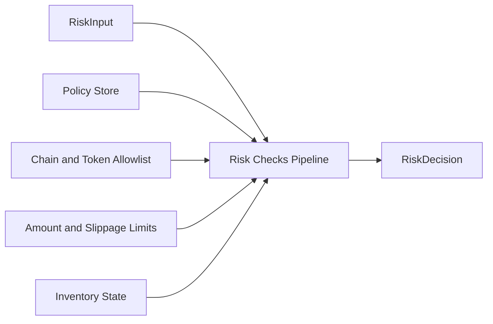
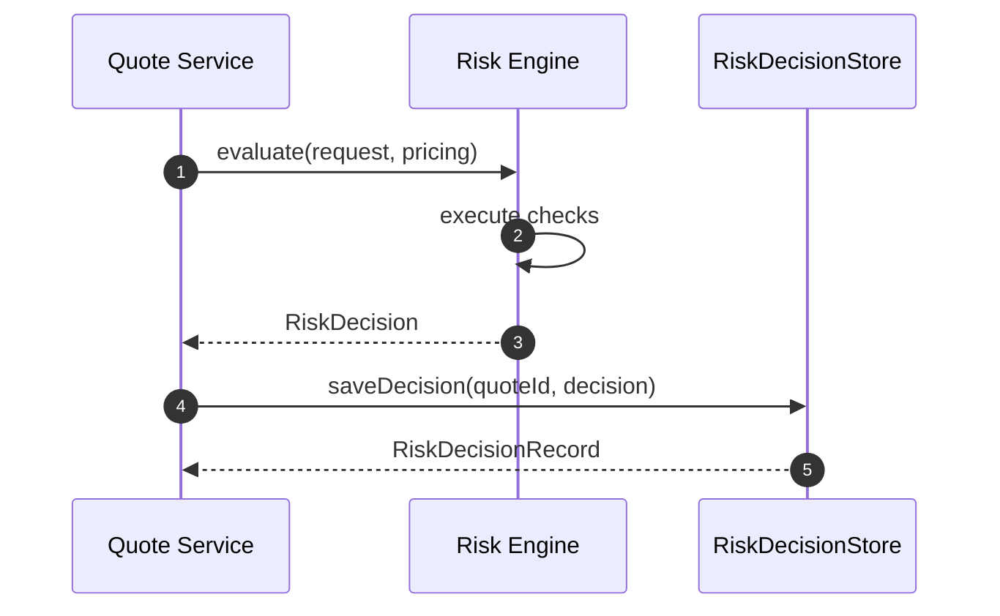
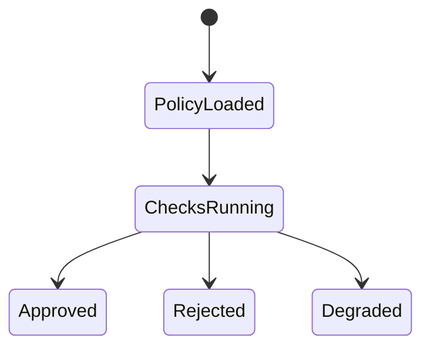

# Chapter 04: Risk Service

## Abstract

Risk Service 是签名前风控服务。它接收 QuoteRequest、PricingResult 和 projected inventory，读取库存、限额、VaR 和 toxic flow 信号，输出 RiskDecision。只有 RiskDecision 为 approved 时，Quote Service 才能调用 Signer Service。当前后端实现提供 `BasicRiskEngine`，覆盖 chain allowlist、token allowlist、amount limit、min amount out、max slippage、quoted spread guard、toxic-flow user gate 和 projected token inventory hard limit 等硬 gate。

## Learning Objectives

- 理解 Risk Service 与 Pricing Service 的边界。
- 定义 RiskDecision。
- 说明 policyVersion 和 reasonCode。
- 设计风控状态机的工程实现。

## Background

Volume3 定义了风险模型。后端需要把模型实现为可测试 pipeline，并确保 Signer 无法被未批准请求调用。

## Problem Statement

风控如果只是注释或人工流程，就无法保护资金。Risk Service 必须成为代码路径中的强制步骤。

## Requirements

### Functional Requirements

- 校验市场状态、定价结果、库存、限额、VaR、toxic flow。
- 第一阶段代码至少校验 enabled chain、token allowlist、max amount、min output、max slippage、max quoted spread 和 projected inventory hard limit。
- 输出 approved 或 rejected。
- 输出 reasonCode 和 policyVersion。
- 持久化 risk decision。

### Non-Functional Requirements

- 决策必须可回放。
- reasonCode 稳定。
- policy 变更可审计。

## Existing Solutions

简单系统只做 amount limit。当前实现使用 `BasicRiskEngine` 作为可配置硬 gate，并在 Quote Service 中传入本次 quote 成交后的 tokenIn/tokenOut 库存投影。`BasicRiskEngine` 也支持 restricted user 和 per-user toxic score gate，用于表达第一版可解释 toxic-flow 防护。生产系统需要在同一接口下继续扩展 VaR、动态 toxic score cache 和外部依赖健康检查。

Risk Engine 本身也是签名前依赖。只要 `evaluate(input)` 抛出异常，Quote Service 必须 fail closed：保存 rejected quote，返回 `RISK_REJECTED`，内部稳定 reasonCode 为 `RISK_ENGINE_UNAVAILABLE`，并且不调用 Signer Service。这个选择把未知风控状态等价处理为拒绝，而不是让 dependency failure 变成可签名路径或通用 500。Risk decision 审计存储同样位于 signer 边界之前：`RiskDecisionStore` 写入失败时返回 `QUOTE_STORE_UNAVAILABLE`，best-effort 将 requested quote 标记为 `failed`，并阻断签名，因为一个不可回放的 approved decision 不应生成可执行签名。

## Trade-Off Analysis

多维风控增加延迟，但能显著降低错误签名风险。实时路径应缓存必要输入。

## System Design



## Architecture Diagram

Risk Service 是 Signer 前的强制 gate。Signer request 必须携带 approved decision context。

## Sequence Diagram



## State Machine



## Data Model

`RiskDecision` includes `status`, `reasonCode`, `policyVersion`, `checks`, `createdAt`, `traceId`. 当前实现输出稳定 reasonCode：`CHAIN_NOT_ENABLED`、`TOKEN_NOT_ALLOWED`、`AMOUNT_IN_LIMIT_EXCEEDED`、`AMOUNT_OUT_TOO_SMALL`、`SLIPPAGE_TOO_WIDE`、`QUOTED_SPREAD_TOO_WIDE`、`TOXIC_FLOW_RESTRICTED_USER`、`TOXIC_FLOW_SCORE_EXCEEDED`、`TOKEN_IN_INVENTORY_LIMIT_EXCEEDED`、`TOKEN_OUT_INVENTORY_LIMIT_EXCEEDED`。当 Risk Engine 依赖不可用或抛出异常时，Quote Service 使用 `RISK_ENGINE_UNAVAILABLE` 作为内部拒绝原因。持久化记录必须保留同一契约：`policyVersion` 非空，approved decision 的 `reasonCode` 为 NULL，rejected decision 的 `reasonCode` 为非空稳定代码。PostgreSQL `risk_decisions.reason_code` CHECK constraint 必须匹配后端 `RiskRejectReasonCode` union，避免审计表保存未被运行时定义的临时字符串。当前 runtime 的 `RiskDecisionStore` mirrors the PostgreSQL risk_decisions contract：`InMemoryRiskDecisionRepository` 使用 `quoteId` 建立幂等记录，允许完全相同 decision 重放，拒绝同一 quote 的 decision/status/reason/policyVersion 改写，并从 `findByQuoteId` 返回 defensive copy。Risk decision audit persistence rejects malformed root payloads and missing `decision` objects before field access or state mutation，避免审计写入路径因为畸形 envelope 抛出非预期 TypeError 或留下部分状态。

## API Design

Internal interface:

```ts
evaluate(input: RiskInput): Promise<RiskDecision>
```

## Engineering Decisions

- Risk Service owns policyVersion.
- Audit write failure blocks signing.
- RiskDecisionStore mirrors the PostgreSQL risk_decisions contract and participates in readiness / metrics as `riskDecisionStore`.
- Rejected quotes do not receive signature.
- 默认 `BasicRiskEngine` 是签名前强制 gate；代码库不提供 allow-all 风控实现，测试需要放行时应显式注入局部 test double。
- `maxQuotedSpreadBps` 是 pricing engine 的安全护栏；即使 pricing 依赖返回可计算 quote，只要最终 quoted spread 超过 policy，就拒绝签名。
- `BasicRiskPolicy` 在构造期 fail fast：malformed policy object, policy array fields and toxic-flow score entries must be rejected before field access，之后 `policyVersion` 必须非空，`enabledChainIds` 和 `tokenAllowlist` 必须非空且不能包含重复项，`restrictedUsers` 和 per-user `toxicFlowScores` 也不能包含重复用户，地址字段必须是 20-byte hex address，amount / inventory bigint limit 必须为正，所有 bps 字段和 toxic-flow score 必须是 0 到 10000 bps 内的安全整数。这样可以避免错误 policy 以静默全拒绝、静默放宽、覆盖 toxic-flow score 或畸形 allowlist 的形式进入签名前路径。
- `BasicRiskEngine` snapshots `BasicRiskPolicy` at construction after validation. External callers must not be able to mutate `policyVersion`, limits, allowlists, restricted users or toxic-flow scores after construction and silently change signing risk gates.
- `RiskInput` is validated before policy evaluation: malformed root payloads and missing `request` / `pricing` / `inventoryProjection` position objects fail before field access, then request fields, pricing amounts, spread/impact/skew bps, pricingVersion and optional inventory projection chain/token alignment must be sane before the engine can return `approved`.
- Risk Engine dependency failure 必须 fail closed 为 `RISK_REJECTED` / `RISK_ENGINE_UNAVAILABLE`，并阻断签名。

## Failure Scenarios

- Policy store unavailable：reject。
- Inventory stale：degrade or reject。
- Audit write failed：return `QUOTE_STORE_UNAVAILABLE`, best-effort mark the requested quote `failed`, and block Signer。
- Toxic score unavailable：fallback by policy。
- Risk engine unavailable：reject with `RISK_ENGINE_UNAVAILABLE`，不调用 Signer，不返回 signature。
- Rejected quote persistence unavailable：preserve `RISK_REJECTED` as the API result, keep Signer blocked, and repair requested quote state through reconciliation。

## Security Considerations

RiskDecision 不能由客户端提供。Signer Service 应验证调用方身份和 approved context。
Public API responses must not expose internal risk thresholds, inventory limits, toxic-flow scores, quoted-spread caps, policyVersion or internal reasonCode values. Quote rejection is returned as stable `RISK_REJECTED` with traceId, while detailed `reasonCode` and `policyVersion` stay in internal audit records, metrics labels and operator logs.

## Performance Considerations

Risk checks 应短路失败，但仍记录失败节点。重型分析异步完成，实时路径读取缓存。

## Testing Strategy

测试每个 reasonCode、policy missing、policy config fail-fast、inventory stale、quoted spread guard、approved path、audit persistence failure、risk decision store idempotency/conflict/defensive copy、rejected quote persistence failure 和 risk engine unavailable fail-closed 路径。风险引擎不可用测试必须同时断言 `rfq_quote_rejections_total{reason="RISK_ENGINE_UNAVAILABLE"}` 增加，且 `rfq_signer_requests_total{operation="sign"}` 仍为 0。

## Interview Notes

Risk Service 是 RFQ 系统区别于普通报价 API 的关键。回答时强调“签名前强制 gate”。

## Summary

Risk Service 将风险模型转化为工程执行路径，是保护 signer 和资金的核心服务。

## References

- Volume3 Risk Engine
- Pre-trade risk checks
