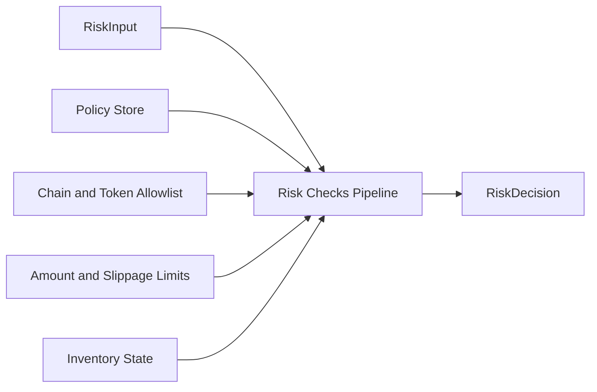
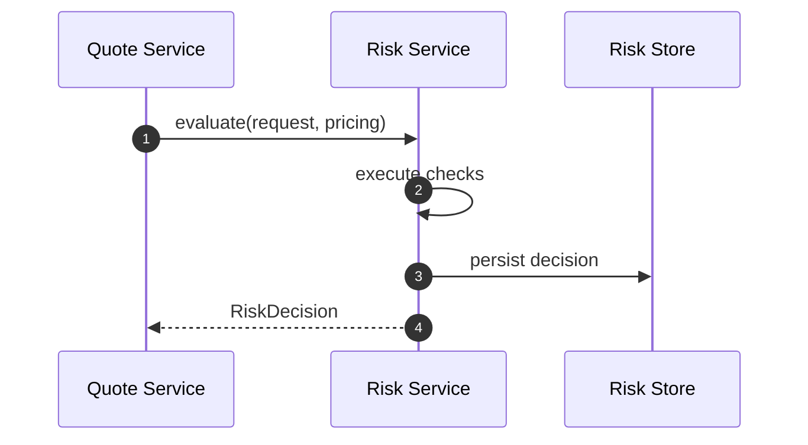
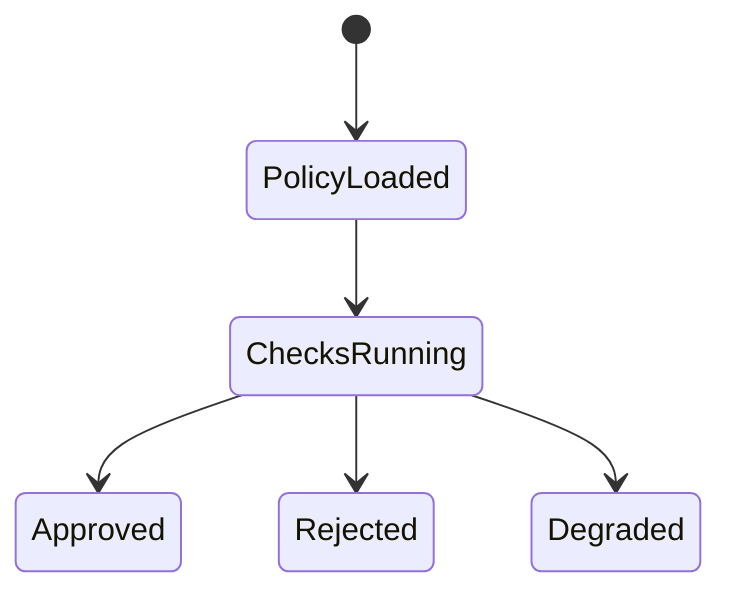

# Chapter 04: Risk Service

## Abstract

Risk Service 是签名前风控服务。它接收 QuoteRequest、PricingResult 和 projected inventory，读取库存、限额、VaR 和 toxic flow 信号，输出 RiskDecision。只有 RiskDecision 为 approved 时，Quote Service 才能调用 Signer Service。当前后端实现提供 `BasicRiskEngine`，覆盖 chain allowlist、token allowlist、amount limit、min amount out、max slippage 和 projected token inventory hard limit 等硬 gate。

## Learning Objectives

- 理解 Risk Service 与 Pricing Service 的边界。
- 定义 RiskDecision。
- 说明 policyVersion 和 reasonCode。
- 设计风控状态机的工程实现。

## Background

Volume3 定义了风险模型。后端需要把模型实现为可测试 pipeline，并确保 Signer 无法被未批准请求调用。

## Problem Statement

风控如果只是注释或人工流程，就无法保护资金。Risk Service 必须成为代码路径中的强制步骤。

## Requirements

### Functional Requirements

- 校验市场状态、定价结果、库存、限额、VaR、toxic flow。
- 第一阶段代码至少校验 enabled chain、token allowlist、max amount、min output、max slippage 和 projected inventory hard limit。
- 输出 approved 或 rejected。
- 输出 reasonCode 和 policyVersion。
- 持久化 risk decision。

### Non-Functional Requirements

- 决策必须可回放。
- reasonCode 稳定。
- policy 变更可审计。

## Existing Solutions

简单系统只做 amount limit。当前实现使用 `BasicRiskEngine` 作为可配置硬 gate，并在 Quote Service 中传入本次 quote 成交后的 tokenIn/tokenOut 库存投影。生产系统需要在同一接口下继续扩展 VaR、toxic flow 和外部依赖健康检查。

## Trade-Off Analysis

多维风控增加延迟，但能显著降低错误签名风险。实时路径应缓存必要输入。

## System Design



## Architecture Diagram

Risk Service 是 Signer 前的强制 gate。Signer request 必须携带 approved decision context。

## Sequence Diagram



## State Machine



## Data Model

`RiskDecision` includes `status`, `reasonCode`, `policyVersion`, `checks`, `createdAt`, `traceId`. 当前实现输出稳定 reasonCode：`CHAIN_NOT_ENABLED`、`TOKEN_NOT_ALLOWED`、`AMOUNT_IN_LIMIT_EXCEEDED`、`AMOUNT_OUT_TOO_SMALL`、`SLIPPAGE_TOO_WIDE`、`TOKEN_IN_INVENTORY_LIMIT_EXCEEDED`、`TOKEN_OUT_INVENTORY_LIMIT_EXCEEDED`。

## API Design

Internal interface:

```ts
evaluate(input: RiskInput): Promise<RiskDecision>
```

## Engineering Decisions

- Risk Service owns policyVersion.
- Audit write failure blocks signing.
- Rejected quotes do not receive signature.
- 默认 `BasicRiskEngine` 比 allow-all 更接近生产路径；`AllowAllRiskEngine` 只保留为开发 fallback。

## Failure Scenarios

- Policy store unavailable：reject。
- Inventory stale：degrade or reject。
- Audit write failed：reject。
- Toxic score unavailable：fallback by policy。

## Security Considerations

RiskDecision 不能由客户端提供。Signer Service 应验证调用方身份和 approved context。

## Performance Considerations

Risk checks 应短路失败，但仍记录失败节点。重型分析异步完成，实时路径读取缓存。

## Testing Strategy

测试每个 reasonCode、policy missing、inventory stale、approved path 和 audit failure。

## Interview Notes

Risk Service 是 RFQ 系统区别于普通报价 API 的关键。回答时强调“签名前强制 gate”。

## Summary

Risk Service 将风险模型转化为工程执行路径，是保护 signer 和资金的核心服务。

## References

- Volume3 Risk Engine
- Pre-trade risk checks
