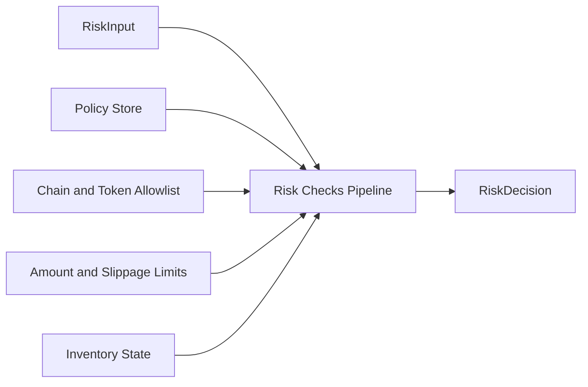
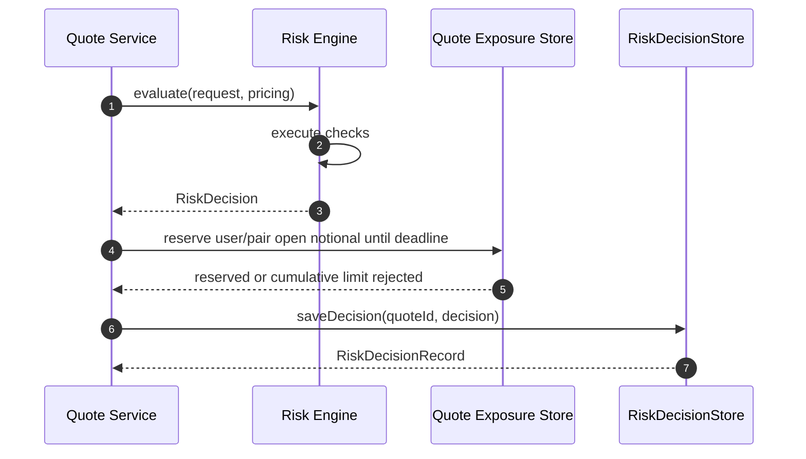
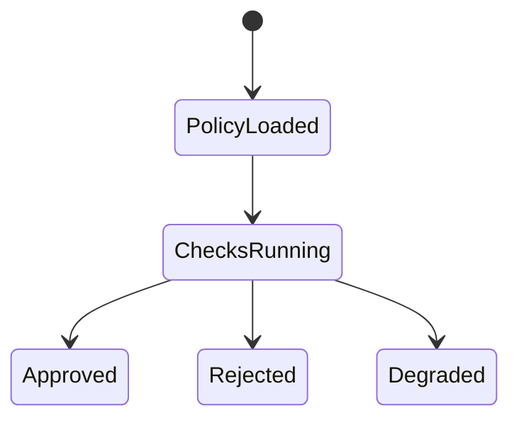

# Chapter 04: Risk Service

## Abstract

Risk Service 是签名前风控服务。它接收 QuoteRequest、PricingResult 和 projected inventory，读取库存、限额、VaR 和 toxic flow 信号，输出 RiskDecision。只有 RiskDecision 为 approved 时，Quote Service 才能调用 Signer Service。默认运行时使用 `TokenLimitRiskEngine`，以 `(chainId, tokenAddress)` 为授权和限额键，覆盖 chain allowlist、per-token amount/min-output/inventory limit、max slippage、quoted spread guard 和 toxic-flow gate。`BasicRiskEngine` 保留为嵌入式基础策略，但不再作为默认生产 wiring。

## Learning Objectives

- 理解 Risk Service 与 Pricing Service 的边界。
- 定义 RiskDecision。
- 说明 policyVersion 和 reasonCode。
- 设计风控状态机的工程实现。

## Background

Volume3 定义了风险模型。后端需要把模型实现为可测试 pipeline，并确保 Signer 无法被未批准请求调用。

## Problem Statement

风控如果只是注释或人工流程，就无法保护资金。Risk Service 必须成为代码路径中的强制步骤。

## Requirements

### Functional Requirements

- 校验市场状态、定价结果、库存、限额、VaR、toxic flow。
- 第一阶段代码至少校验 enabled chain、chain-scoped token limit、per-token max amount/min output/projected inventory、max slippage 和 max quoted spread。
- 输出 approved 或 rejected。
- 输出 reasonCode 和 policyVersion。
- 持久化 risk decision。

### Non-Functional Requirements

- 决策必须可回放。
- reasonCode 稳定。
- policy 变更可审计。

## Existing Solutions

简单系统只做全局 amount limit，但 raw units 无法跨 token 比较，同一地址也不能跨 chain 隐式共享权限。当前默认实现使用 `TokenLimitRiskEngine`：`RFQ_RISK_POLICY_JSON` 为每个 chain/token 分别给出 `maxAmountIn`、`minAmountOut`、`maxNotionalUsd` 和 `maxAbsoluteInventory` canonical uint256 string，并用全局 `maxUserOpenNotionalUsd`、`maxPairOpenNotionalUsd`、`minLiquidityUsd`、`maxVolatilityBps` 控制累计签名敞口和市场状态；Quote Service 把定价使用的同一份已验证 snapshot 与成交后的 tokenIn/tokenOut 库存投影传入 Risk Engine。单笔名义金额采用两侧 token limit 中更小的 `maxNotionalUsd`，只信任 token registry 标记的 USD-reference token 和 decimals，并通过 BigInt 交叉相乘比较，避免 USDC 6 decimals 与 WETH 18 decimals 被浮点或 raw-unit 混算。交易对没有 USD-reference token、snapshot 流动性不足或波动率越界时均 fail closed。活动签名报价另由 TTL-bound exposure reservation 计数，避免多个各自合法的并发 quote 累积越过用户或交易对限额。策略仍支持 restricted user 和 per-user toxic score gate；生产系统后续在同一接口下扩展 portfolio VaR、动态 toxic score cache 和外部 policy store。

Risk Engine 本身也是签名前依赖。只要 `evaluate(input)` 抛出异常，Quote Service 必须 fail closed：保存 rejected quote，返回 `RISK_REJECTED`，内部稳定 reasonCode 为 `RISK_ENGINE_UNAVAILABLE`，并且不调用 Signer Service。这个选择把未知风控状态等价处理为拒绝，而不是让 dependency failure 变成可签名路径或通用 500。Risk decision 审计存储同样位于 signer 边界之前：`RiskDecisionStore` 写入失败时返回 `QUOTE_STORE_UNAVAILABLE`，best-effort 将 requested quote 标记为 `failed`，并阻断签名，因为一个不可回放的 approved decision 不应生成可执行签名。

## Trade-Off Analysis

多维风控增加延迟，但能显著降低错误签名风险。实时路径应缓存必要输入。

## System Design



## Architecture Diagram

Risk Service 是 Signer 前的强制 gate。Signer request 必须携带 approved decision context。

## Sequence Diagram



## State Machine



## Data Model

`TokenLimitRiskPolicy` 包含 `policyVersion`、`enabledChainIds`、`tokenLimits`、`restrictedUsers`、`toxicFlowScores`、`maxUserOpenNotionalUsd`、`maxPairOpenNotionalUsd`、`minLiquidityUsd` 和四个 bps 上限。每个 `TokenRiskLimit` 固定 `chainId`、`tokenAddress`、`maxAmountIn`、`minAmountOut`、`maxNotionalUsd`、`maxAbsoluteInventory`。稳定 reasonCode 还包含 `USER_OPEN_NOTIONAL_LIMIT_EXCEEDED`、`PAIR_OPEN_NOTIONAL_LIMIT_EXCEEDED` 和 `TREASURY_LIQUIDITY_INSUFFICIENT`；它们写入 `risk_decisions`，但不向公共 API 暴露阈值。`quote_exposure_reservations` 同时保存 user/pair 名义敞口和方向性 `tokenOut/amountOut` 流动性预留，以及可选的 same-block Treasury 余额证据；它不替代成交后的 inventory ledger。

其他稳定拒绝原因继续包括 `CHAIN_NOT_ENABLED`、`TOKEN_NOT_ALLOWED`、`MARKET_LIQUIDITY_TOO_LOW`、`MARKET_VOLATILITY_LIMIT_EXCEEDED`、`AMOUNT_IN_LIMIT_EXCEEDED`、`AMOUNT_OUT_TOO_SMALL`、`QUOTE_NOTIONAL_LIMIT_EXCEEDED`、`USD_REFERENCE_REQUIRED`、`SLIPPAGE_TOO_WIDE`、`QUOTED_SPREAD_TOO_WIDE`、toxic-flow 与 inventory limit 原因，以及依赖失败时的 `RISK_ENGINE_UNAVAILABLE`。

Risk decision audit persistence rejects malformed root payloads, missing `decision` objects, inherited `quoteId` / `decision` fields, inherited required decision fields, and inherited rejected `reasonCode` before field access or state mutation；it validates `quoteId` as an own primitive-string `SafeIdentifier` and validates the derived `riskDecisionId` before storing。同一 quote 的 decision/status/reason/policyVersion 不允许被改写；数据库强制 approved decision 的 `reasonCode` 为 NULL，而 rejected decision 必须携带稳定且非空的 `reasonCode`。PostgreSQL `risk_decisions.reason_code` CHECK constraint 必须匹配后端 `RiskRejectReasonCode` union，新增或删除稳定原因时由 schema consistency gate 阻止单边变更。

## API Design

Internal interface:

```ts
evaluate(input: RiskInput): Promise<RiskDecision>
```

## Engineering Decisions

- Risk Service owns policyVersion.
- Audit write failure blocks signing.
- RiskDecisionStore mirrors the PostgreSQL risk_decisions contract and participates in readiness / metrics as `riskDecisionStore`.
- Rejected quotes do not receive signature.
- 默认 `TokenLimitRiskEngine` 是签名前强制 gate；代码库不提供 allow-all 风控实现，测试需要放行时应显式注入局部 test double。
- `maxQuotedSpreadBps` 是 pricing engine 的安全护栏；即使 pricing 依赖返回可计算 quote，只要最终 quoted spread 超过 policy，就拒绝签名。
- `BasicRiskPolicy` 在构造期 fail fast：malformed policy object、inherited policy fields、policy array fields、toxic-flow score entries and inherited score fields must be rejected before field access，之后 `policyVersion` 必须非空，`enabledChainIds` 和 `tokenAllowlist` 必须非空且不能包含重复项，`restrictedUsers` 和 per-user `toxicFlowScores` 也不能包含重复用户，地址字段必须是 20-byte hex address，amount / inventory bigint limit 必须为正，所有 bps 字段和 toxic-flow score 必须是 0 到 10000 bps 内的安全整数。这样可以避免错误 policy 以静默全拒绝、静默放宽、覆盖 toxic-flow score 或畸形 allowlist 的形式进入签名前路径。
- `BasicRiskEngine` snapshots `BasicRiskPolicy` at construction after validation. External callers must not be able to mutate `policyVersion`, limits, allowlists, restricted users or toxic-flow scores after construction and silently change signing risk gates.
- `TokenLimitRiskPolicy` 使用 exact-field parser，拒绝 unknown/inherited fields、重复 chain id、重复大小写地址、未启用 chain 的 token limit、没有任何 token limit 的 enabled chain、非 canonical/超 uint256 的 amount 或 liquidity limit，以及越界 bps。构造器复制 policy，`getTokenLimit()` 返回 defensive copy。
- 默认 wiring 在启动时逐项检查 risk-policy token 存在于 `RFQ_TOKEN_REGISTRY_JSON` 且已 whitelist，并要求每个 managed market pair 的 tokenIn/tokenOut 都有同 chain 的 limit。自定义 Pricing Engine 不能绕过默认 Risk Engine 的 policy/registry 校验；自定义 Risk Engine 则明确接管该责任。
- `RiskInput` is validated before policy evaluation: malformed root payloads, missing required own top-level `request` / `pricing` fields, inherited optional `inventoryProjection`, and missing required own projection / position fields fail before nested field access, then request fields, pricing amounts, spread/impact/skew bps, pricingVersion and optional inventory projection chain/token alignment must be sane before the engine can return `approved`. Address and uint-like fields must be real strings before regex validation, and positive uint fields must use canonical decimal form without leading zeros, so direct service callers cannot bypass `/quote` validation through inherited object properties or JavaScript regex coercion. Quote Service also validates projected inventory before calling the risk adapter, so malformed `projectSettlement` output cannot be ignored by a custom risk engine that would otherwise return `approved`.
- 活动签名报价的累计 user/pair 限额使用 18-decimal USD integer，PostgreSQL 在应用层排序后逐个获取 quote/user/pair advisory transaction locks，再对未过期且状态为 requested/signed/failed 的 quote 执行 SUM + INSERT；failed signed quote 仍可能在链上重试，不能提前释放。同一 pair 的正反方向共享锁键，精确等于限额允许，超过才拒绝。
- submitted/settled quote 仅从 active SUM 排除，不立即删除 reservation；reorg 恢复 signed 状态后同一行会再次生效。过期行按每次预留最多 100 条使用 `FOR UPDATE SKIP LOCKED` 清理，避免高并发清理互相阻塞。
- Treasury 流动性 SUM 与名义敞口 SUM 的生命周期不同：它计算同 `(chainId, tokenOut)` 的全部未过期 reservation，即使 quote 已 submitted/settled 也等到 TTL 再释放。这样会短暂低估可用余额，但不会在链 RPC 快照与数据库状态并发变化时超卖。provider health、RPC 读取或 reservation store 失败都会让 `risk` readiness degraded。
- Risk Engine dependency failure or malformed `RiskDecision` output 必须 fail closed 为 `RISK_REJECTED` / `RISK_ENGINE_UNAVAILABLE`，并阻断签名。Quote Service 在写入 RiskDecisionStore 或调用 Signer 前验证 risk adapter 返回值：approved 只能包含 `status` 和非空 `policyVersion`，rejected 必须包含稳定 `reasonCode`，未知字段、继承字段、空 policyVersion 或临时 reasonCode 都不能进入签名前路径。

## Failure Scenarios

- Policy store unavailable：reject。
- Inventory stale：degrade or reject。
- Audit write failed：return `QUOTE_STORE_UNAVAILABLE`, best-effort mark the requested quote `failed`, and block Signer。
- Toxic score unavailable：fallback by policy。
- Risk engine unavailable：reject with `RISK_ENGINE_UNAVAILABLE`，不调用 Signer，不返回 signature。
- Quote exposure store unavailable：`risk` readiness degraded，quote 请求 fail closed；签名或审计写入失败时释放预留，释放失败也不会越过 `expires_at` 继续计数。
- Treasury liquidity unavailable or malformed：记录 `RISK_ENGINE_UNAVAILABLE` 并阻断 Signer；余额不足记录 `TREASURY_LIQUIDITY_INSUFFICIENT`，不得用离线 inventory 替代真实 custody balance。
- Rejected quote persistence unavailable：preserve `RISK_REJECTED` as the API result, keep Signer blocked, and repair requested quote state through reconciliation。

## Security Considerations

RiskDecision 不能由客户端提供。Signer Service 应验证调用方身份和 approved context。
Public API responses must not expose internal risk thresholds, inventory limits, toxic-flow scores, quoted-spread caps, policyVersion or internal reasonCode values. Quote rejection is returned as stable `RISK_REJECTED` with traceId, while detailed `reasonCode` and `policyVersion` stay in internal audit records, metrics labels and operator logs.

## Performance Considerations

Risk checks 应短路失败，但仍记录失败节点。重型分析异步完成，实时路径读取缓存。

## Testing Strategy

测试每个 reasonCode、cross-chain address isolation、6/18 decimals 限额、policy/registry mismatch、inventory、quoted spread、活动报价 exact boundary、反向 pair、TTL、failure release、same-block treasury/balance RPC 读取、同 tokenOut 并发超卖、PostgreSQL advisory-lock ordering 和 dependency fail-closed。Treasury 余额不足与 RPC 不可用测试都必须断言 Signer 调用仍为 0。

## Interview Notes

Risk Service 是 RFQ 系统区别于普通报价 API 的关键。回答时强调“签名前强制 gate”。

## Summary

Risk Service 将风险模型转化为工程执行路径，是保护 signer 和资金的核心服务。

## References

- Volume3 Risk Engine
- Pre-trade risk checks
