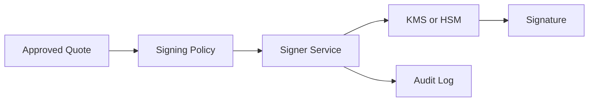
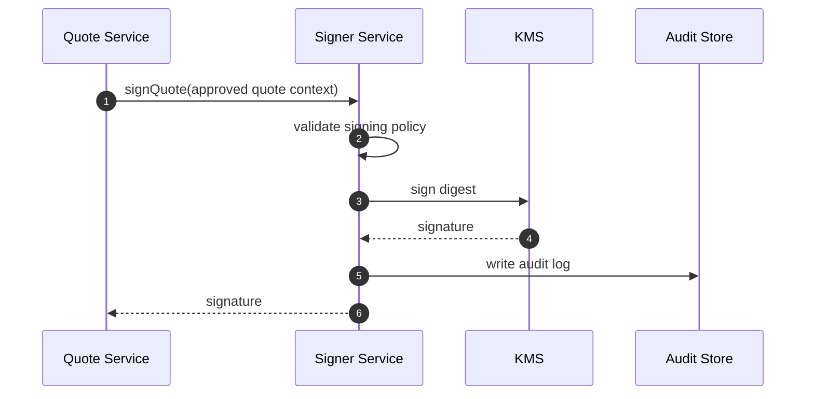
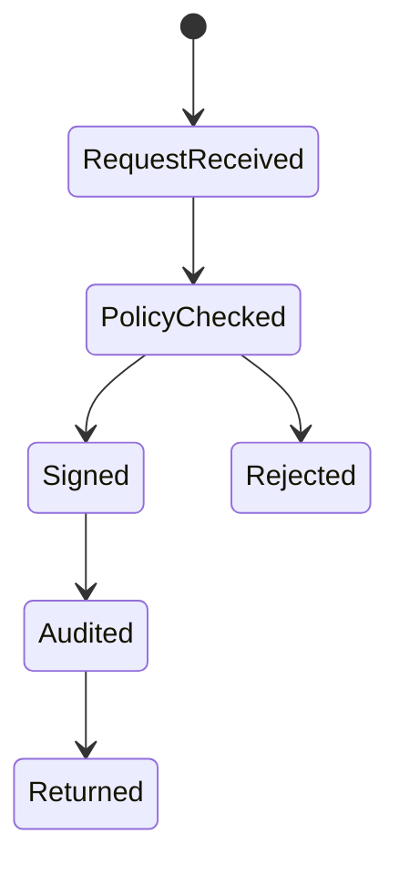

# Chapter 05: Signer Service

## Abstract

Signer Service 是高安全边界服务。它只负责对经过 Risk Service 批准的 Quote 进行 EIP-712 签名，不负责定价、不负责风控、不接受任意 payload signing。Signer 的安全性直接影响 RFQSettlement 的资金安全。

## Learning Objectives

- 明确 Signer Service 的职责和禁止事项。
- 理解 KMS/HSM 和密钥轮换。
- 定义签名请求上下文。
- 设计 signer unavailable 和 signer compromise 的处理。

## Background

Signed quote 是链上结算授权。Signer 如果被滥用，攻击者可以构造恶意 quote。因此 signer 必须独立部署、最小权限、强审计。

## Problem Statement

如果普通业务服务直接持有私钥，任何业务漏洞都可能升级为资金事故。需要独立 Signer Service。

## Requirements

### Functional Requirements

- 接收 approved quote。
- 构造 EIP-712 typed data。
- 使用 KMS/HSM 或安全私钥签名。
- 返回 signature。
- 记录 signing audit log。

### Non-Functional Requirements

- 不接受任意消息签名。
- 只允许可信服务调用。
- 支持 key rotation。
- 签名失败必须可观测，且 quote API 必须返回稳定的 `SIGNER_UNAVAILABLE`。
- readiness 必须验证 signer 具备签名和验签能力，失败时 `/ready` 返回 degraded，避免不可签名实例继续接收 quote 流量。

## Existing Solutions

本地私钥适合开发，不适合生产。KMS/HSM 更适合生产 signer。当前后端 skeleton 已提供 `LocalEIP712SignerService`，使用 `viem/accounts` 对 `ProductionGradeRFQ` EIP-712 typed data 签名；`PlaceholderSignerService` 仅作为测试 fallback。

## Trade-Off Analysis

KMS 增加集成复杂度和延迟，但显著降低密钥泄露风险。生产系统必须接受该成本。

## System Design



## Architecture Diagram

Signer Service 不暴露公网，只接受 Quote Service 或 Risk-approved internal request。

## Sequence Diagram



## State Machine



## Data Model

`SigningRequest` includes quote, quoteId, snapshotId, riskDecisionId, policyVersion, traceId. `SigningAudit` records signer address, digest, timestamp and result.

## API Design

Internal interface:

```ts
signQuote(input: SignQuoteInput): Promise<`0x${string}`>
```

## Engineering Decisions

- Signer 不做风险判断。
- Signer 验证 approved context。
- 当前 skeleton 使用本地 EIP-712 signer，配置来自 `RFQ_SIGNER_PRIVATE_KEY` 和 `RFQ_SETTLEMENT_ADDRESS`。
- 当前后端使用 `ObservedSignerService` 包装 signer，记录 `rfq_signer_requests_total`、`rfq_signer_errors_total` 和 `rfq_signer_latency_seconds`，固定 `operation` label 为 `sign` 或 `verify`。
- `/ready` 使用固定 probe quote 执行 signer sign + verify 检查；探针签名不返回给用户，也不改变 quote repository 状态。
- Production signer 使用 KMS/HSM，并保持同一 `signQuote` 接口。
- Key rotation 写入 runbook。

## Failure Scenarios

- KMS unavailable：return `SIGNER_UNAVAILABLE`，记录 `rfq_signer_errors_total{operation="sign"}`。
- signer readiness probe failed：`/ready` returns degraded before the instance is considered routable。
- policy mismatch：reject signing。
- audit write failed：do not return signature。
- key compromise：pause settlement and rotate key。

## Security Considerations

Signer 是最高风险服务。需要网络隔离、服务身份、审计、限额和 emergency disable。

## Performance Considerations

KMS latency 进入 quote p99，需要监控 signer latency、signer error rate 和 queue depth。当前 reference implementation 已暴露 signer latency histogram，可用于 signer p95 alert。

## Testing Strategy

测试 typed data、wrong domain、wrong verifying contract、policy mismatch、KMS failure、readiness signer degraded、audit failure 和 rotation process。

## Interview Notes

Signer Service 的正确答案不是“后端用私钥签名”，而是“隔离签名能力并只签 approved quote”。

## Summary

Signer Service 把风险决策变成链上可验证授权，是 RFQ 系统的最高安全边界之一。

## References

- EIP-712
- KMS signing
- Key rotation
