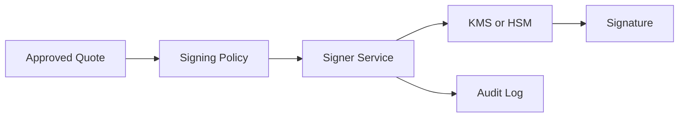
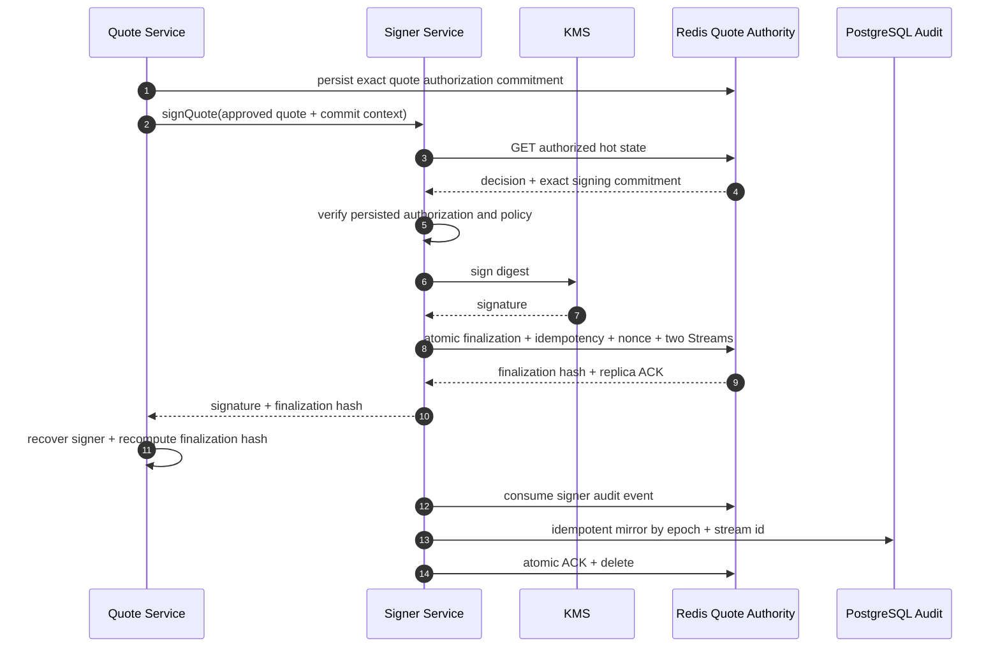
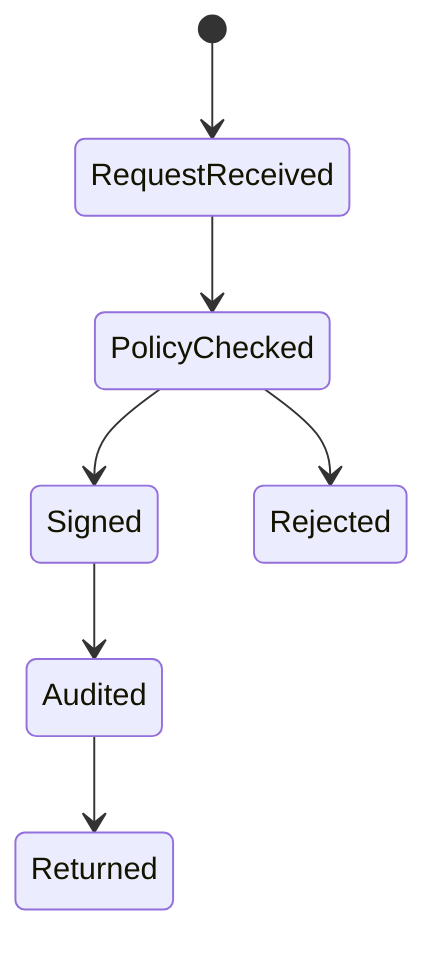

# Chapter 05: Signer Service

## Abstract

Signer Service 是高安全边界服务。它只负责对经过 Risk Service 批准的 Quote 进行 EIP-712 签名，不负责定价、不负责风控、不接受任意 payload signing。Signer 的安全性直接影响 RFQSettlement 的资金安全。

## Learning Objectives

- 明确 Signer Service 的职责和禁止事项。
- 理解 KMS/HSM 和密钥轮换。
- 定义签名请求上下文。
- 设计 signer unavailable 和 signer compromise 的处理。

## Background

Signed quote 是链上结算授权。Signer 如果被滥用，攻击者可以构造恶意 quote。因此 signer 必须独立部署、最小权限、强审计。

## Problem Statement

如果普通业务服务直接持有私钥，任何业务漏洞都可能升级为资金事故。需要独立 Signer Service。

## Requirements

### Functional Requirements

- 接收 approved quote。
- 构造 EIP-712 typed data。
- 使用 KMS/HSM 或安全私钥签名。
- 返回 signature。
- 记录 signing audit log。

### Non-Functional Requirements

- 不接受任意消息签名。
- 只允许可信服务调用。
- 支持 key rotation。
- 签名失败必须可观测，且 quote API 必须返回稳定的 `SIGNER_UNAVAILABLE`。
- readiness 必须验证 signer 具备签名和验签能力，失败时 `/ready` 返回 degraded，避免不可签名实例继续接收 quote 流量。

## Existing Solutions

本地私钥适合开发，不适合生产。当前后端为开发环境提供 `LocalEIP712SignerService`，为生产独立进程提供 AWS KMS `ECC_SECG_P256K1` signer，并允许通过 `external` mode 注入其他 HSM 实现。代码库不保留 placeholder signer 或 deterministic fake signature 实现；生产部署不会把 Ethereum private key 挂载进 API Pod。

## Trade-Off Analysis

KMS 增加集成复杂度和延迟，但显著降低密钥泄露风险。生产系统必须接受该成本。

## System Design



## Architecture Diagram

Signer Service 不暴露公网，只接受 Quote Service 或 Risk-approved internal request。

## Sequence Diagram



## State Machine



## Data Model

`SigningRequest` includes quote, quoteId, snapshotId, riskDecisionId, policyVersion, traceId. `SigningAudit` records signer address, digest, timestamp and result.

## API Design

Internal interface:

```ts
signQuote(input: SignQuoteInput): Promise<`0x${string}`>
```

## Engineering Decisions

- Signer 不做风险判断。
- Signer 验证 approved context。
- 本地开发使用 `RFQ_SIGNER_MODE=local`、`RFQ_SIGNER_PRIVATE_KEY` 和 `RFQ_SETTLEMENT_ADDRESS`。默认 Anvil key 只允许用于 unset `NODE_ENV`、`development` 或 `test`；任何非本地环境都拒绝 local mode 和原始私钥。
- API 生产进程使用 `RFQ_SIGNER_MODE=remote`，只持有 HTTPS signer origin、内部 bearer token、trusted signer、settlement address 和 signer CA；`RemoteSignerService` 默认使用原生 HTTP(S) keep-alive pool，`RFQ_SIGNER_SERVICE_MAX_CONNECTIONS` 以 1-256 的有界整数限制每个 API 进程的 active/free sockets，关闭时主动销毁连接。TLS 仍执行 Node 默认 hostname/CA 校验。客户端使用同一个 AbortController deadline 覆盖连接、响应流与 JSON 解码，成功的 `/internal/sign` 和 `/ready` body 在解码前执行 1 KiB 流式上限，非成功 body 直接销毁且不解析。超限、停滞、畸形或 signer identity 不匹配统一返回 `SIGNER_UNAVAILABLE`，随后仍独立执行 EIP-712 恢复地址校验。注入 Fetch 只保留为确定性 adapter 测试边界，不是默认生产传输。
- 独立 signer 生产进程使用 `RFQ_SIGNER_MODE=aws-kms`。启动必须同时获得 KMS 配置、trusted signer、settlement address、TLS certificate/key、token registry 和 risk policy；API ServiceAccount 不具备 `kms:Sign`，只有 signer ServiceAccount 绑定 key-scoped IAM role。
- `/internal/sign` 先使用 constant-time digest comparison 验证 bearer token，再要求完整的 `riskDecisionId`、`riskPolicyVersion` 与 `traceId`，验证 `riskDecisionId=rd_${quoteId}`，并独立限制 enabled chain、whitelisted token、TTL、clock skew、input/output raw amount。原子模式还从 Redis quote authority 读取 approved hot state，逐字段验证 quote、snapshot、principal、定价分解、policy 与 idempotency 的 SHA-256 commitment；失败发生在 KMS/HSM 调用之前。Signer 不查询 PostgreSQL，也不执行第二套风险模型。
- 通过 envelope 校验后，Signer 计算与结算合约一致的 EIP-712 digest，完成签名与恢复地址验证，再把 `quoteId`、`snapshotId`、`riskDecisionId`、`riskPolicyVersion`、`traceId`、digest、signature hash、current signer、settlement、chain、deadline、bounded outcome 和 canonical timestamp 写入 `SignerAuditStore`。成功审计 admission 之前不得返回 signature；审计失败返回通用 503 并增加 `rfq_signer_service_audit_errors_total`。
- 生产默认使用 `RFQ_SIGNER_AUDIT_BACKEND=redis-stream` 和 `RFQ_SIGNER_ATOMIC_QUOTE_COMMIT=true`。成功路径的一次 Lua 同时执行授权 commitment 复核、quote finalization、idempotency completion、nonce index、issuance event、signer audit event 与 digest-based dedupe；所有 key 必须共享一个 Redis Cluster hash tag。`rediss://`、healthy AOF 和至少一个 `WAIT` replica acknowledgement 都是返回 signature 的前置条件。普通内存队列不能作为该边界。
- 每个 Signer replica 运行同一个 consumer group mirror。它先验证 stream payload hash 和完整 audit envelope，再以 `<streamEpoch>:<entryId>` 唯一键写 PostgreSQL，最后用 Lua 原子执行 `XACK + XDEL`。PostgreSQL commit 后崩溃会触发 `ON CONFLICT DO NOTHING` 重放；commit 前崩溃或 payload 损坏则保留 pending event，不会静默丢弃。`RFQ_SIGNER_AUDIT_STREAM_EPOCH` 在生产必填，只有审计流被破坏性重建时才轮换。
- 独立 `RFQ_SIGNER_AUDIT_DATABASE_URL` 使用 verify-full TLS、1 到 3 个小连接池和 100 到 10000 ms 有界查询超时。Signer 审计账号只拥有 `signer_audit_events` 的 `INSERT` 和 `signer_audit_events_id_seq` 的 `USAGE`，不能持有 API 或迁移权限。直接 PostgreSQL backend 保留为回滚模式，本地开发才允许 memory backend。
- `RFQ_TRUSTED_SIGNER_OVERLAP_ADDRESSES` 只在 key rotation window 使用，最多包含四个 distinct non-zero 地址。它允许 settlement verifier 接受旧/新 quote，但 Signer Service 始终只使用 `RFQ_TRUSTED_SIGNER_ADDRESS` 对应的当前 KMS key 生成新签名。
- `AwsKmsSignerProvider` 固定调用 `Sign` 的 `MessageType=DIGEST` 与 `SigningAlgorithm=ECDSA_SHA_256`，只发送本地计算的 32-byte EIP-712 digest。AWS SDK credential chain 使用 workload identity；API Pod 不挂载 AWS access key 或 Ethereum private key。
- `KmsSignerService` 对 DER sequence、short-form length、INTEGER tag、unsigned canonical padding、secp256k1 order 和 trailing bytes 做严格校验。KMS 返回 high-s 时转换为 low-s，再尝试 recovery id 27/28；只有恢复地址唯一匹配显式 `RFQ_TRUSTED_SIGNER_ADDRESS` 才返回签名，不允许从首个 KMS 响应自举信任地址。
- Signer adapter 只有在签名过程本身已经绑定或恢复 trusted identity 时才可声明字面量 `signaturesSelfVerified: true`。独立 signer 对该 capability 省略重复 recovery；未声明的 custom adapter 仍必须执行 server-side verify，`false` 或其他值在启动时拒绝。API 的 `RemoteSignerService` 无论如何都独立恢复返回签名，因此内部优化不会移除公共报价边界的 EIP-712 校验。
- 当前后端使用 `ObservedSignerService` 包装 signer，记录 `rfq_signer_requests_total`、`rfq_signer_errors_total` 和 `rfq_signer_latency_seconds`，固定 `operation` label 为 `sign` 或 `verify`。
- `ObservedSignerService` validates inner signer and metrics dependency methods at construction. Missing `inner.signQuote`, `inner.verifyQuoteSignature`, `metricsService.recordSignerRequest`, `metricsService.recordSignerError` or `metricsService.recordSignerLatency` must fail before quote signing starts.
- `ObservedSignerService` rejects malformed dependency envelopes as non-array objects before reading signer or metrics methods, so a signer wrapper cannot start with array-shaped dependencies that later misclassify signer availability.
- `ObservedSignerService` validates inner signer results before returning them to Quote Service. `signQuote()` must return a canonical 65-byte low-s signature with normalized `v` accepted by `RFQSettlement`, and `verifyQuoteSignature()` must return a runtime boolean; malformed signer adapter output is mapped to `SIGNER_UNAVAILABLE` and records the corresponding signer error metric.
- 独立 signer `/ready` 验证 migration 036 的授权上下文与 `source_stream_id` 字段、PostgreSQL sink、Redis AOF 和未满 backlog，再使用当前时间和已配置 token envelope 构造 probe quote并执行 sign + verify；probe 不写用户签名审计，也不要求伪造风险决策。成功结果缓存 30 秒且并发探针合并，避免健康检查放大 KMS 调用。API `/ready` 只调用 signer `/ready`，不发送静态生产签名请求。
- Local signer validates malformed config, signing request and quote objects before field access, then requires local signer config fields, signing request fields and signed quote fields to be own fields before validating private key, settlement address, `quoteId` and `snapshotId` as primitive-string `SafeIdentifier` values with 1-128 characters matching `[A-Za-z0-9_:-]`, plus signed quote shape before producing any EIP-712 signature. Signed quote amount fields and nonce must be real strings in canonical decimal form without leading zeros, so the signer cannot create an EIP-712 artifact from a value encoding that `/quote`, routing, pricing, risk or settlement would reject. Direct signer callers cannot pass inherited object properties or boxed `String` wrappers and rely on JavaScript regex coercion before EIP-712 signing. Malformed verification inputs, including inherited quote fields, return `false` instead of leaking lower-level signing-library errors.
- Local signer verification rejects high-s ECDSA signatures and invalid `v` values before address recovery, matching `RFQSettlement` canonical signature rules so `/submit` cannot accept a signature that chain settlement would reject.
- Production code does not ship a placeholder signer; tests that need signer behavior inject a local cryptographic signer while retaining the same explicit signer identity boundary.
- `LocalEIP712SignerService` snapshots `LocalEIP712SignerConfig` at construction after validation. External callers must not be able to mutate the settlement address after construction and silently change the EIP-712 verifying contract.
- Production signer 使用 KMS/HSM，并保持同一 `signQuote` 接口；默认 AWS 实现关闭时会释放其 SDK client。
- 目标 KMS key 上线前执行 `make aws-kms-integration-check`。该 canary 复用生产 `readSignerRuntimeConfig -> createSignerRuntime -> KmsSignerService`，以短 TTL 合成 Quote 验证 `MessageType=DIGEST`、严格 DER、low-s、EIP-712 Settlement domain 和显式 trusted signer；输出只保留 digest 与 signature hash，原始 signature、key id 和 provider error 不进入 stdout/stderr。
- Key rotation 使用两阶段 backend rollout：先让全部 replica 验证 old/new signer，再切换 KMS signing primary；等待最后 old quote 的 TTL、receipt/finality 与 indexer buffer 后，在链上和 backend 显式退休 old signer。

## Failure Scenarios

- KMS 或 signer transport unavailable：return `SIGNER_UNAVAILABLE`，API 记录 `rfq_signer_errors_total{operation="sign"}`，signer 记录 `rfq_signer_service_requests_total{outcome="error"}`。
- failed quote persistence unavailable after signer error：仍保留 `SIGNER_UNAVAILABLE` 作为 primary API error，避免状态存储故障掩盖 signer outage。
- signer readiness probe failed：`/ready` returns degraded before the instance is considered routable。
- configured KMS key 与 `RFQ_TRUSTED_SIGNER_ADDRESS` 不匹配：reject signing and fail readiness。
- malformed DER、non-canonical integer、out-of-range r/s 或 unexpected algorithm：return `SIGNER_UNAVAILABLE`，不尝试宽松解析。
- policy mismatch：reject signing。
- audit write failed：do not return signature。
- Redis audit backlog full、AOF unhealthy 或 replica acknowledgement 不足：do not return signature；mirror failure 保留 pending event 并重试。
- persisted signing commitment missing/mismatched：在访问 KMS/HSM 前 reject；原子提交状态冲突增加 `rfq_signer_atomic_quote_commits_total{result="state_invalid"}`。
- atomic commit 后 HTTP response 丢失：API 从 Redis hot state 恢复并独立验签；只有明确不存在 finalization 才释放 exposure，未知状态保守等待 reconciliation/TTL。
- key compromise：pause settlement and rotate key。

## Security Considerations

Signer 是最高风险服务。需要网络隔离、服务身份、审计、限额和 emergency disable。

## Performance Considerations

KMS latency 进入 quote p99，需要监控 signer latency、signer error rate 和 queue depth。当前 reference implementation 暴露 `validation|digest|authorization|signature|audit` stage histogram，以及 atomic quote commit、audit stream append、duplicate、backlog、replica ACK failure、mirror insert/replay 和 mirror error 指标。原子模式下 gateway `issuance_persistence` 不再记录成功样本，终态成本归入 signer `audit` stage。Redis admission 降低同步 PostgreSQL pool contention，但 AOF 与 replica ACK 仍属于计时链路，必须通过真实依赖栈 benchmark 证明效果。

## Testing Strategy

测试 typed data、wrong domain、wrong verifying contract、policy mismatch、KMS failure、错误 KMS key、high-s normalization、malformed DER corpus、AWS request parameters、readiness signer degraded、audit admission failure、full backlog、missing replica ACK、unhealthy AOF、consumer reclaim、PostgreSQL idempotent replay、poison event retention 和 rotation process。`make aws-kms-canary-check` 还验证生产 runtime 配置、独立地址恢复、显式调用确认、错误/关闭脱敏和 unexpected key；目标环境的 credentialed canary 仍必须实际调用 KMS，fixture 不能证明 IAM、region 或 key state。

## Interview Notes

Signer Service 的正确答案不是“后端用私钥签名”，而是“隔离签名能力并只签 approved quote”。

## Summary

Signer Service 把风险决策变成链上可验证授权，是 RFQ 系统的最高安全边界之一。

## References

- [EIP-712](https://eips.ethereum.org/EIPS/eip-712)
- [AWS KMS Sign](https://docs.aws.amazon.com/kms/latest/APIReference/API_Sign.html)
- [AWS KMS key specs](https://docs.aws.amazon.com/kms/latest/developerguide/symm-asymm-choose-key-spec.html)
- Key rotation
