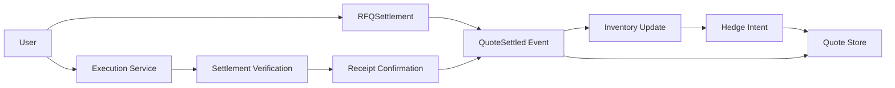
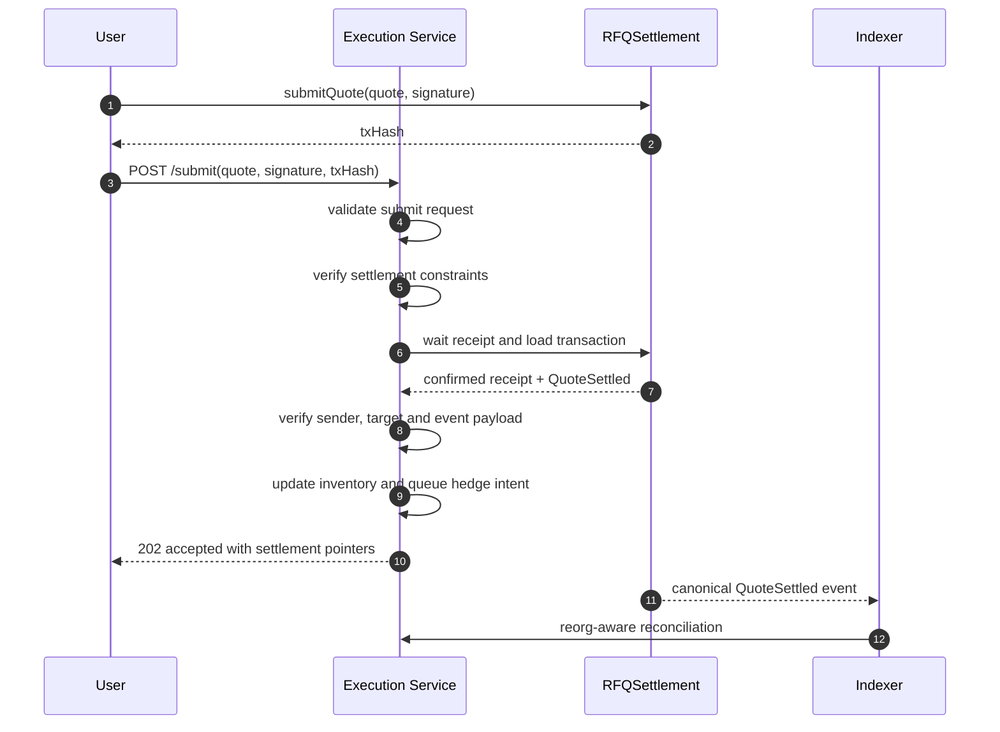
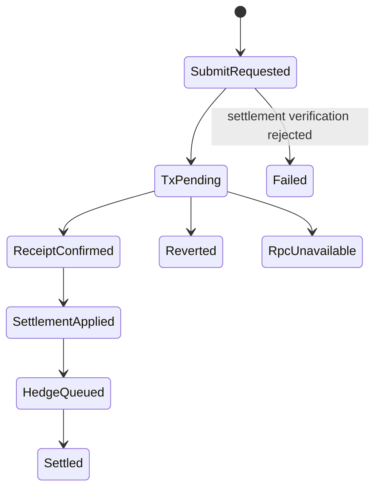

# Chapter 06: Execution Service

## Abstract

Execution Service 处理 quote 提交路径。用户钱包调用 `RFQSettlement.submitQuote` 后，把 `txHash` 与 signed quote 交给 `/submit`。参考实现从配置的 RPC 独立确认 transaction、receipt 和 `QuoteSettled` event，再执行 inventory、hedge、PnL 与状态更新；同步 synthetic settlement 只保留给显式开启的本地参考环境。

## Learning Objectives

- 区分 wallet broadcast、receipt confirmation 和 local simulation。
- 定义 `/submit` 的职责。
- 说明链上事件如何回写 quote 状态。
- 识别 execution failure 与 settlement failure。

## Background

RFQ 用户拿到 signed quote 后由自己的钱包提交链上交易，因此满足合约的 `msg.sender == quote.user` 约束。后端不能用普通热钱包代发同一调用，只能确认用户交易，或引入受信任 forwarder / account abstraction 后另行修改合约信任模型。

## Problem Statement

后端不能仅凭 `/submit` 成功就认为成交。只有链上事件确认后，quote 才算 settled。

## Requirements

### Functional Requirements

- 接收 quote、signature 和 wallet txHash。
- 等待配置的 confirmation 数量。
- 校验 transaction sender、target、receipt status 与唯一匹配的 `QuoteSettled`。
- 事件确认后更新库存、创建 hedge intent、记录 PnL 与 quote 状态。
- 本地模式可显式启用 synthetic evidence。

### Non-Functional Requirements

- submit 必须幂等。
- tx 状态必须可查询。
- RPC failure 不等于 quote invalid。
- 事件消费必须处理 reorg。

## Existing Solutions

直接钱包提交满足当前合约调用者约束并保持自托管。普通 backend relay 会让 `msg.sender` 变成后端账户，与 `quote.user` 不一致，因此不属于当前可用方案。

## Trade-Off Analysis

Receipt confirmation 会增加 RPC 延迟，但后端不持有用户交易权限，并能在任何链下副作用前验证链上事实。未来 relay 必须采用 ERC-2771、账户抽象或 permit 风格的独立设计，不能复用普通钱包发送逻辑冒充用户。

## System Design

## Architecture Diagram

Execution Service 与 Event Indexer 配合。前者处理提交意图，后者确认链上结果。

## Sequence Diagram

## State Machine

## Data Model

Execution state includes `quoteId`, `txHash`, `hedgeOrderId`, `status`, `submittedAt`, `confirmedAt`, `revertReason`, `blockNumber`.

## API Design

`POST /submit` accepts an optional `txHash`; receipt-confirmed production mode requires it, while explicitly enabled local simulation omits it. A successful confirmation returns HTTP 202 with `accepted`, `txHash`, consumed `settlementEventId`, queued `hedgeOrderId`, and `pnlId` where available. `GET /quote/:id` remains the durable status surface. `GET /settlements/:id` exposes the consumed event including `quoteHash`、`nonce`、`blockNumber` and `logIndex` for reorg-aware reconciliation.

## Engineering Decisions

- Settlement event is source of truth.
- `/submit` uses `LocalSettlementVerifier` to mirror RFQSettlement signature shape, canonical low-s/v checks, EIP-712 trusted signer recovery, chainId、deadline、token whitelist、token pair 和 amount shape checks before consuming settlement evidence. The verifier reuses the backend signer typed-data builder, so `ProductionGradeRFQ` domain name/version, quote fields, `chainId`, and `settlementAddress` stay aligned with signed quote creation.
- `txHash` is an optional closed-schema field and is normalized to lowercase, but remains an untrusted lookup key. `ReceiptSettlementEvidenceProvider` waits for configured confirmations, requires transaction `from == quote.user` and `to == configured RFQSettlement`, decodes `submitQuote` calldata and matches every quote field plus signature, then requires receipt success and exactly one trusted-contract `QuoteSettled` whose `quoteHash`、user、tokens、amounts and nonce match the submitted signed quote. This independently proves the `quoteHash` and `nonce` emitted by `RFQSettlement.QuoteSettled` before any off-chain settlement side effect.
- Receipt-confirmed requests may consume a quote whose wall-clock deadline has passed, because the contract already enforced deadline at transaction execution and the matching event proves settlement occurred. Requests without txHash still reject expired quotes before synthetic evidence or any side effect; a fake txHash only postpones the decision until RPC verification and cannot manufacture a settlement event.
- RPC timeout or unavailable transaction data returns `SETTLEMENT_UNAVAILABLE` and leaves the quote retryable. Sender/target mismatch、missing event or ambiguous event also leave the quote signed because txHash is untrusted and must not become a quote-cancellation primitive. A receipt-confirmed revert is terminal only after transaction sender and target have matched the quote and configured contract. None of these rejection paths may write settlement events or trigger inventory、hedge or PnL side effects.
- `RFQ_ALLOW_SIMULATED_SETTLEMENT` defaults to true only for unset/local/test `NODE_ENV`. Non-local environments default it to false and fail startup unless `RFQ_RECEIPT_CONFIG_JSON` contains at least one chain. Every receipt-chain settlement address must equal `RFQ_SETTLEMENT_ADDRESS`, preventing the signer domain and receipt verifier from silently targeting different contracts.
- `LocalSettlementVerifierPolicy` 在构造期 fail fast：malformed policy object, inherited policy fields and policy array fields must be rejected before field access，之后 required own `verifierVersion` 必须非空，required own `enabledChainIds` 和 `tokenWhitelist` 必须非空且不能包含重复项，chain id 必须是正安全整数，token whitelist entries、`settlementAddress` 和 `trustedSignerAddress` 必须是真实字符串且是 20-byte hex address。错误 policy 不能以 inherited fields、空白版本、空白 allowlist、重复 whitelist、畸形地址或 JavaScript regex coercion 进入 `/submit` 结算验证路径。
- `LocalSettlementVerifier` snapshots `LocalSettlementVerifierPolicy` at construction after validation. External callers must not be able to mutate `verifierVersion`, enabled chains, token whitelist, settlement domain or trusted signer after construction and silently change settlement verification or audit output.
- `LocalSettlementVerifier.verify()` rejects malformed root payloads, missing or inherited root `quoteId` / `request` fields, `quoteId` values that are not primitive-string 1-128 character `SafeIdentifier` values, missing `request.quote`, and inherited `request` / `request.quote` required fields before signature shape, canonical checks or settlement policy evaluation. It also validates quote fields before policy checks: chain id and deadline must be own positive safe integers, user/token fields must be own 20-byte address strings, amount fields and nonce must be own canonical positive uint strings without leading zeros, and the signature must be an own 65-byte hex string. After canonical shape validation, settlement verification only converts `amountOut` and `minAmountOut` to BigInt for the minimum-output comparison, then recovers the EIP-712 signer against the configured `settlementAddress` and requires it to equal `trustedSignerAddress`. Public `/submit` should still be protected by gateway validation first, but direct service calls must not turn malformed settlement verification input into unclassified `TypeError` failures or JavaScript regex coercion from boxed `String` identifiers.
- Settlement verification failure returns `SETTLEMENT_REVERTED`, marks the quote `failed` with the verifier internal reason code when available, and must not update inventory, queue hedge intent, record PnL, or mark the quote settled.
- If marking the quote `failed` after `SETTLEMENT_REVERTED` cannot be persisted, the API still returns the original `SETTLEMENT_REVERTED` response and emits `rfq_quote_status_update_errors_total{target_status="FAILED"}`. The persistence failure must not mask the settlement rejection reason.
- Settlement verifier dependency failure returns `SETTLEMENT_UNAVAILABLE` with HTTP 503, keeps the quote `signed`, and must not update inventory, queue hedge intent, record PnL, or mark the quote failed. This path is retryable until the signed quote expires.
- Settlement event store write failure returns `SETTLEMENT_EVENT_STORE_UNAVAILABLE` with HTTP 503 before inventory update, hedge intent, PnL attribution, or quote status mutation. The quote remains `signed` and retryable while TTL is valid.
- Settlement event ingestion validates `txHash` as a runtime string and a 32-byte hex string before storing it in lowercase and building the idempotency key. Direct service callers cannot pass `String` wrapper objects and rely on JavaScript `RegExp.test()` coercion before inventory mutation.
- Settlement event ingestion validates `blockNumber` and `logIndex` as non-negative safe integers before building the idempotency key or applying inventory side effects. PostgreSQL mirrors this for `settlement_events.block_number` and `settlement_events.log_index` with a `0..9007199254740991` range check so reorg sorting and reconciliation never read an event ordinal that runtime code cannot safely represent.
- Settlement event ingestion validates `quoteId` as an own primitive-string `SafeIdentifier`, requires own `quote` and `txHash` fields, rejects inherited optional `blockNumber` / `logIndex`, and validates the derived `settlementEventId` (`se_${chainId}_${txHash}_${logIndex}`) before quote hashing, inventory mutation or event indexing. Settlement status lookups also validate `settlementEventId` before reading either store implementation. The signed quote shape is validated before quote hashing or inventory mutation: chain id and deadline must be own positive safe integers, user/token fields must be own 20-byte addresses, token pair must be distinct, amount fields and nonce must be own canonical positive uint strings without leading zeros, and `amountOut >= minAmountOut`. The resulting settlement event persists the signed `nonce` alongside `quoteHash`, tx/log ordinals and amount fields so chain indexers can prove the `QuoteSettled` event matches the stored `chainId:user:nonce` quote key. This validation intentionally does not reject already-expired deadlines during event replay because the chain event has already been authorized by `RFQSettlement` at execution time.
- Malformed settlement event dependency, apply input, reorg input and quote envelopes are rejected as non-array objects before field access, idempotency-key lookup, inventory mutation or replay clearing. Direct service callers must not be able to pass arrays that behave like objects and produce partial settlement side effects.
- Execution Service reuses submit request validation at the service boundary and rejects malformed execution context envelopes plus execution `quoteId` values that are not own primitive-string 1-128 character `SafeIdentifier` values before settlement verification, evidence resolution, settlement event writes, inventory mutation, hedge intent creation or PnL attribution. This keeps direct service calls aligned with the public `/submit` boundary instead of assuming every caller passed through the API gateway, and prevents inherited or boxed `String` identifiers from reaching settlement side effects through JavaScript regex coercion.
- `buildSyntheticTxHash()` also reuses submit request and execution context validation before hashing; invalid root payloads, missing quote objects, inherited `quoteId` values or non-canonical signatures must fail before a synthetic tx hash can be generated or used as settlement idempotency material.
- Submit request validation rejects non-canonical signatures before quote lookup, signer recovery, settlement verification or synthetic transaction hash generation. The accepted shape is a 65-byte hex EIP-712 signature with low-s and v equal to 27/28, or 0/1 after normalization, matching `RFQSettlement` and SDK helper behavior. Its internal validation options also reject inherited `allowExpired` fields before deadline behavior can change, keeping service-only replay handling explicit.
- `/submit` requires the submitted signature bytes to match the signature stored with the signed quote before calling the signer verifier. A different but otherwise well-shaped signature is rejected as `INVALID_SIGNATURE`, keeping execution, audit logs, quote status and settlement reconciliation bound to the exact quote artifact returned by `/quote`.
- `SkeletonExecutionService` snapshots its dependency map at construction. Required dependency entries must be own fields before method validation. External callers must not be able to replace the settlement verifier, event store, inventory service or hedge service through inherited properties or by mutating the original deps object after the execution service has been created.
- `SkeletonExecutionService` validates dependency methods at construction. A missing `settlementVerifier.verify`, `settlementEventService.applySettlementEvent`, `inventoryService.getPosition` or `hedgeService.createHedgeIntent` must fail during startup instead of surfacing as an unclassified runtime `TypeError` during `/submit`.
- `SkeletonExecutionService` rejects malformed dependency envelopes and inherited dependency entries before reading required dependency methods. Submit workers must fail at construction when settlement verifier, event store, inventory or hedge dependencies are prototype-backed or array-shaped rather than starting a partially wired execution path.
- `SkeletonExecutionService` validates the `SettlementVerificationResult` returned by the verifier dependency before settlement event writes. The result must be a closed own-field object with `status="verified"`, a non-empty primitive `verifierVersion`, and a canonical positive `amountOut` that exactly matches the submitted quote; malformed or mismatched verifier output returns `SETTLEMENT_UNAVAILABLE` before inventory, hedge, PnL or quote-status side effects.
- `SkeletonExecutionService` validates the `ApplySettlementEventResult` returned by the settlement event store before inventory position reads or hedge intent creation. The result must be a closed own-field object with an own boolean `duplicate` and a closed `event` envelope whose `settlementEventId`, `quoteId`, `chainId`, `txHash`, `quoteHash`, block/log ordinals, quote parties, amounts, nonce and canonical `observedAt` match the validated submit request and synthetic event key. Malformed or mismatched event-store output returns `SETTLEMENT_EVENT_STORE_UNAVAILABLE` and blocks follow-up side effects that would otherwise publish a hedge or response pointer for the wrong settlement event.
- `/submit` rejects `failed` quotes with `QUOTE_FAILED` before execution, so terminal settlement failures cannot be replayed into the execution path.
- The API gateway keeps an in-process `quoteId` reservation while `/submit` is executing. A second simultaneous submit for the same signed quote receives `QUOTE_ALREADY_USED` before settlement verification, so one slow verifier or relay path cannot turn a client double-click into two accepted HTTP responses. This is a reference-process guard; production storage and `RFQSettlement` nonce checks remain the durable cross-replica replay protection.
- Duplicate settlement events are idempotent: they return the existing `settlementEventId` but must not create a second hedge intent, PnL record, settlement metric, or inventory delta.
- Duplicate settlement events must match the original quote payload and `quoteHash` for the same `(chainId, txHash, logIndex)` key; conflicting payloads indicate event-store or indexer corruption and fail before additional side effects.
- A signed quote may bind to only one canonical settlement event at a time. The database keeps `uq_settlement_events_canonical_quote_id ... WHERE canonical = TRUE`: a replay or indexer bug cannot apply a second canonical inventory delta, while a removed event remains as audit history and a replacement transaction can become canonical after reorg.
- Settlement insert and canonical transitions enqueue a quote-scoped `post_trade_reconciliation_jobs` desired revision in the same database transaction. The separate reconciliation worker leases jobs with `FOR UPDATE SKIP LOCKED`, repairs hedge and PnL first, then writes complete quote pointers. If desired chain state changes during processing, revision-guarded completion fails stale and the newer revision remains pending.
- Quote pointer removal uses one compare-and-set update over status, transaction hash and settlement event id; canonical restoration also compares the full previously observed pointer state. An expired lease therefore cannot let an old worker clear or overwrite a replacement settlement. Canonical event replay may narrowly restore `expired -> settled` because the event was authorized on-chain before its deadline even when indexing arrives after local TTL expiry; ordinary quote lifecycle transitions still reject that terminal-state regression.
- A no-canonical revision removes reversible PnL and quote pointers and cleans up unsubmitted hedge intents. Submission-attempted or terminal CEX hedges remain as external economic evidence; a later canonical replacement creates its own settlement-scoped hedge while obsolete queued intent cleanup remains idempotent.
- Non-local execution uses `PostgresSettlementEventStore`. Event insert/reactivation and both inventory token deltas share one transaction; duplicate unique-key hits load and compare the stored payload before returning `duplicate=true`, and conflicting payloads roll back. `PostgresInventoryService` reads shared balances for pricing and risk across replicas.
- Reorg removal sets `canonical=false` and `removed_at=now()` rather than deleting the audit row, then rebuilds `inventory_positions` from canonical events in the same transaction. Exact non-canonical events can later reactivate without creating a second row. Startup takes `pg_advisory_xact_lock`, locks settlement replay order, and repairs inventory before Fastify becomes ready.
- Hedge and PnL writes are durable idempotent PostgreSQL projections after the settlement transaction. A crash between stages cannot erase the authoritative event or inventory delta; settlement-to-hedge, settlement-to-PnL, and settlement-to-quote reconciliation repair missing downstream rows and pointers.
- `settlementEventId` is derived from the full normalized `txHash` plus `chainId` and `logIndex`, not a shortened transaction prefix. Two chain events that share the same first bytes must remain independently queryable and must not overwrite each other.
- `SettlementEventService` returns defensive copies from apply, remove, get and list operations. Direct callers must not be able to mutate stored settlement events by editing a returned object, because settlement state is the source for reconciliation, inventory rebuild and status APIs.
- `SettlementEventService.getSettlementEventsByQuoteHash({ chainId, quoteHash })` mirrors the database `(chain_id, quote_hash)` index for targeted incident repair. It returns defensive copies in chain order, so operators can start from an indexed `QuoteSettled.quoteHash` log without scanning every settlement event in memory.
- `SettlementEventService` validates inventory dependency methods at construction. Missing `inventoryService.applySettlement` or `inventoryService.rebuildFromSettlements` must fail before settlement ingestion starts, because event application and reorg removal both depend on inventory mutation semantics.
- Reorg removals are explicit state transitions: `SettlementEventService.removeSettlementEvent()` accepts the removed `(chainId, txHash, logIndex, blockNumber)` event, deletes the canonical event indexes, and rebuilds inventory from the remaining settlement event stream. Duplicate removals are idempotent, while block-number conflicts fail before mutating inventory or indexes.
- Quote status reorg repair is intentionally separate from the normal `markStatus` lifecycle. `InMemoryQuoteRepository.clearSettlementStatus()` only clears `txHash`, `settlementEventId`, `hedgeOrderId` and `pnlId` when the removed settlement's `txHash` and `settlementEventId` exactly match the stored quote pointers; it returns the quote to `signed`, or to `expired` when the signed deadline has already passed. This keeps the general settled-terminal state machine strict while giving reorg handling a narrow recovery path.
- Quote status persistence after settlement is best-effort in the runnable reference path. If marking `submitted` or `settled` fails after settlement is already applied, `/submit` still returns HTTP 202 and records `rfq_quote_status_update_errors_total` because settlement remains the source of truth.
- The runnable reference path includes an internal `ReconciliationService.reconcileSettlementToQuote()` that lists applied settlement events and repairs quote `settled` status plus `txHash`/`settlementEventId` metadata without replaying settlement, inventory, hedge or PnL side effects.
- `ReconciliationService.reconcileRemovedSettlementToQuote()` accepts the removed settlement event returned by `SettlementEventService.removeSettlementEvent()` and delegates to `QuoteRepository.clearSettlementStatus()`. It reports missing quotes and pointer conflicts per removed event, so a reorged event cannot silently leave `/quote/:id` settled after the canonical event has been removed.
- `ReconciliationService.reconcileRemovedSettlementToHedge()` and `ReconciliationService.reconcileRemovedSettlementToPnl()` repair post-trade records created from a settlement event that later disappears from the canonical chain. PnL attribution and an unsubmitted, unleased queued hedge can be removed idempotently. A submission-attempted or terminal hedge is retained: the external trade may remain economic exposure and must be reconciled or compensated, never erased as if the reorg reversed it.
- `ReconciliationService.reconcileSettlementToQuote()`、`reconcileSettlementToHedge()` 和 `reconcileSettlementToPnl()` accept an optional `{ chainId, quoteHash }` filter. When an incident starts from an indexed `QuoteSettled.quoteHash`, reconciliation can repair only matching events through `SettlementEventService.getSettlementEventsByQuoteHash()`; without the filter, the same methods retain the full event-stream scan behavior.
- `ReconciliationService` snapshots its dependency map at construction. Required `quoteRepository` / `settlementEventService` entries must be own fields before method validation, and optional `pnlService` / `hedgeService` entries must be own fields when provided. A long-running repair job cannot silently switch quote repository, settlement event store, PnL store or hedge service through inherited properties or because a caller mutates the original deps object.
- `ReconciliationService` validates dependency methods at construction. Missing recovery methods such as `settlementEventService.listSettlementEvents`, `settlementEventService.getSettlementEventsByQuoteHash`, `quoteRepository.restoreSettlementStatus`, `quoteRepository.clearSettlementStatus`, `quoteRepository.findSignedQuoteByQuoteId`, `pnlService.getPnlRecordByQuoteId`, `pnlService.recordSettlement` or `hedgeService.getHedgeIntentBySettlementEvent` must fail before a repair job starts instead of surfacing as an unclassified runtime `TypeError` halfway through reconciliation.
- `ReconciliationService` rejects malformed dependency envelopes, inherited required dependency entries and inherited optional recovery dependencies before reading required or optional recovery methods. Repair workers must fail at construction when given prototype-backed or array-shaped dependency payloads rather than starting a partial reconciliation job.
- PnL attribution after settlement is best-effort and idempotent by `(quoteId, model)`. If writing the realized PnL record fails after settlement is already applied, `/submit` still returns HTTP 202 without `pnlId` and records `rfq_pnl_record_errors_total{reason="PNL_RECORD_FAILED"}` for reconciliation.
- PnL idempotency requires the repeated `(quoteId, model)` input to match the stored signed attribution payload, including `user`, token pair, amount fields, `minAmountOut`, `nonce`, and `deadline`. A retry with different quote metadata is treated as a PnL record conflict rather than silently returning the previous record.
- The runnable reference path includes `ReconciliationService.reconcileSettlementToPnl()`, which lists applied settlement events, loads the original signed quote by `quoteId`, and reuses `PnlService.recordSettlement()` so repaired PnL rows remain idempotent by `(quoteId, model)`.
- `ReconciliationService.reconcileSettlementToPnl()` reports PnL attribution conflicts per settlement event and continues scanning later events. A corrupt historical PnL row must not block repair of unrelated settlements.
- `PnlService` returns defensive copies from `recordSettlement()` and `summary()` so callers cannot mutate stored PnL attribution rows used by reconciliation, metrics and status APIs.
- The API submit handler validates the `PnlTradeRecord` returned by `PnlStore.recordSettlement()` before exposing `pnlId`, updating quote status metadata or recording PnL metrics. The record must be a closed own-field envelope whose identifiers, quote fields, gross PnL values, model, fixed `modelDescription` and canonical `realizedAt` match the submitted signed quote; malformed or mismatched PnL store output is treated as `PNL_RECORD_FAILED`, leaving settlement accepted without `pnlId` and emitting `rfq_pnl_record_errors_total`.
- Post-settlement inventory position reads are a metrics boundary, not a settlement success boundary. `SkeletonExecutionService` validates `InventoryService.getPosition()` outputs before returning them for `rfq_inventory_balance`; each position must be a closed own-field envelope with matching chain/token and bigint balance. Malformed or unavailable position reads leave the settlement accepted and hedge/PnL flow intact, but omit `inventoryPositions` so submit response semantics cannot be changed by an invalid gauge sample.
- The runnable reference path includes `ReconciliationService.reconcileSettlementToHedge()`, which lists applied settlement events and creates missing inventory-rebalance hedge intents without replaying settlement or inventory side effects.
- `ReconciliationService.reconcileSettlementToHedge()` validates existing hedge intents against settlement events by reusing the same idempotent `HedgeService.createHedgeIntent()` path. Existing intent payload conflicts are reported per event, while later settlement events continue to be repaired.
- `make reconciliation-check` builds the backend and runs a local settlement-to-quote, settlement-to-hedge and settlement-to-PnL repair smoke check against in-memory stores, including the `{ chainId, quoteHash }` targeted retry path and removed-settlement quote/hedge/PnL cleanup, proving the runbook action has an executable reference path.
- PnL attribution rejects malformed root payloads, missing `quote` objects, and inherited root or signed quote required fields before field access, then validates `quoteId` as an own primitive-string `SafeIdentifier` and validates the derived `pnlId` (`pnl_${quoteId}`) before recording realized PnL, so the runnable store cannot expose IDs that OpenAPI, SDK clients or the database SafeIdentifier checks would reject. It also validates own chain id, own quote addresses, distinct token pair, own canonical positive uint amount fields and nonce without leading zeros, positive safe-integer deadline and `amountOut >= minAmountOut`. Address, identifier and uint-like values must be real strings before regex validation, so direct reconciliation callers cannot rely on JavaScript regex coercion to record malformed attribution. The current `simulated_mid_price_v1` model emits a fixed `modelDescription` stating that `grossPnlTokenOut = amountIn - amountOut` is simulated same-decimal attribution, not cross-token accounting PnL. It computes `grossPnlBps` with BigInt arithmetic and rejects values outside the JavaScript safe integer range before exposing a number to API clients or writing `pnl_records.gross_pnl_bps`. Invalid attribution input must fail before a `pnl_records` row, metric sample or reconciliation artifact can claim a malformed settlement as realized PnL.
- Hedge intent creation failure after settlement is best-effort but risk-aware. `/submit` still returns HTTP 202 without `hedgeOrderId`, records `rfq_hedge_intent_errors_total{reason="HEDGE_INTENT_FAILED"}`, and updates Hedge Service failure pressure so follow-up quotes for the same output token include quote risk penalty.
- `SkeletonExecutionService` validates the `HedgeResult` returned by the hedge adapter before exposing `hedgeOrderId` in the submit response or recording hedge success metrics. The result must be a closed own-field object with `status="queued"`, an own safe `hedgeOrderId`, and a closed `record` envelope whose `hedgeOrderId`, `settlementEventId`, `quoteId`, `chainId`, token, side, amount, reason and canonical `createdAt` match the hedge intent created from the applied settlement. Malformed or mismatched hedge output is treated as `HEDGE_INTENT_FAILED`: settlement remains accepted, inventory stays updated, no `hedgeOrderId` is returned, and failure pressure can tighten later quotes.
- Local simulation remains available for deterministic smoke and benchmark coverage, but its synthetic evidence is rejected when a client supplies a real `txHash`.
- `/submit` does not imply settled until receipt and event confirmation succeeds.
- Ordinary backend-wallet relay is incompatible with the current `msg.sender == quote.user` contract invariant.

## Failure Scenarios

- User never broadcasts tx：quote expires。
- Relay tx reverted：status failed。
- Settlement verification rejects token whitelist or chain mismatch：return `SETTLEMENT_REVERTED` before inventory update。
- Quote failed-status store unavailable after settlement rejection：return the original `SETTLEMENT_REVERTED` and emit status update error metric。
- Chain RPC unavailable：return `SETTLEMENT_UNAVAILABLE` before inventory update; quote remains retryable if TTL is still valid。
- Quote status store unavailable after settlement：return accepted, emit status update error metric, reconcile quote status from settlement event later with `ReconciliationService.reconcileSettlementToQuote()`。
- PnL record store unavailable after settlement：return accepted without `pnlId`, emit PnL record error metric, reconstruct attribution from settlement event and signed quote state later with `ReconciliationService.reconcileSettlementToPnl()`。
- Hedge intent store unavailable after settlement：return accepted without `hedgeOrderId`, emit hedge intent error metric, and create the missing inventory-rebalance intent later with `ReconciliationService.reconcileSettlementToHedge()`。
- Reconciliation conflict in one settlement event：record the event-level error and continue repairing later settlement events for quote status, PnL, and hedge intent state。
- Settlement event store unavailable before inventory update：return `SETTLEMENT_EVENT_STORE_UNAVAILABLE`, keep quote signed, and do not create inventory, hedge, PnL, or settlement metrics。
- Settlement event store unavailable on status lookup：`GET /settlements/:id` returns `SETTLEMENT_EVENT_STORE_UNAVAILABLE` with traceId, so clients retry indexing status instead of treating the event as missing。
- Duplicate settlement event：skip inventory/PnL/hedge side effects and return the existing settlement event id。
- Reorg removed event：remove the canonical settlement event, rebuild inventory from remaining chain events plus irreversible hedge fills, run quote/hedge/PnL removed-event reconciliation, and explicitly compensate any retained external hedge before reopening normal quote size。
- Event lag：status pending until indexed。

## Security Considerations

Receipt mode never broadcasts arbitrary client calldata. It reads a configured chain by hash and validates the resulting transaction and event against the stored signed quote. Any future relay design requires an explicit contract-level forwarding or account-abstraction trust model.

## Performance Considerations

Execution path can be asynchronous. RPC latency should not block quote generation.

当前本地性能门禁包含 `make benchmark-submit`。它用 Fastify injection 为每个样本先获取 fresh signed quote，再测量 `/submit` 的签名验证、settlement event 写入、inventory update、hedge intent 创建和 PnL attribution 路径；默认 50 measured samples、p95 <= 100 ms、setup/submit errors = 0。该 benchmark 只捕捉代码级明显回归，生产容量仍必须使用真实 RPC、数据库、队列和并发流量验证。

## Testing Strategy

测试 payload generation、relay failure、tx revert、settlement verifier unavailable、settlement verifier policy fail-fast、PnL attribution input validation、event confirmation、duplicate submit、duplicate settlement side-effect suppression、reorg removal inventory replay、post-settlement status persistence failure 和 quote expired。

## Interview Notes

后端 submit 成功不是成交成功。链上事件才是 settlement source of truth。

## Summary

Execution Service 管理提交体验，但不替代 RFQSettlement 的链上权威。

## References

- Transaction relays
- Chain event indexing
