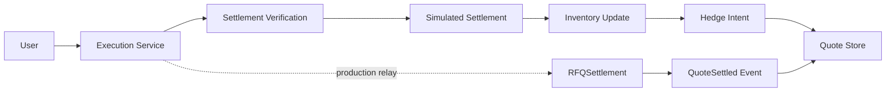
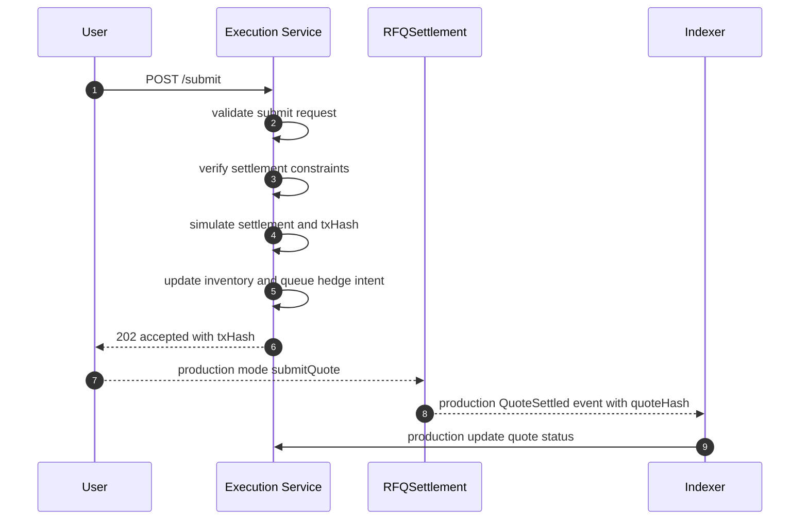
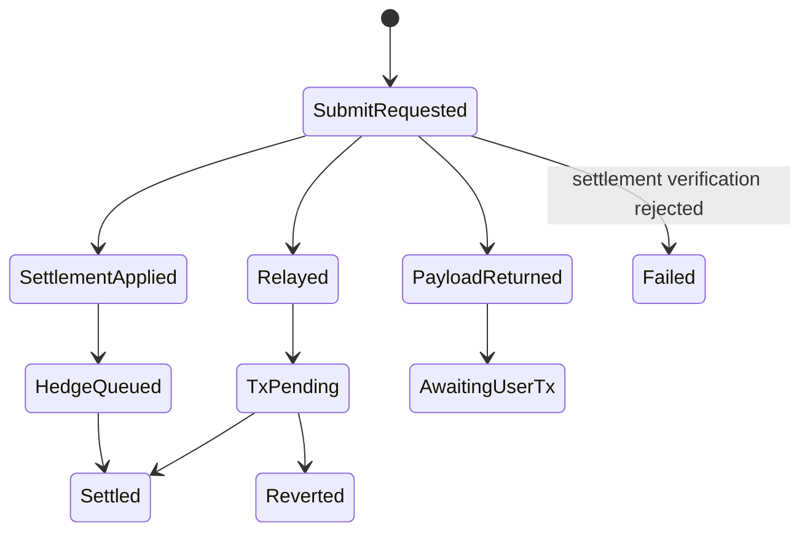

# Chapter 06: Execution Service

## Abstract

Execution Service 处理 quote 提交路径。根据产品模式，它可以生成交易 payload 给用户钱包，也可以作为 relay 提交交易。当前参考实现会先执行本地 settlement verification，再用同步模拟结算把 `/submit -> contract verification -> settlement -> inventory update -> hedge intent -> metrics` 链路跑通；生产模式下链上 `RFQSettlement` 事件仍是最终结算权威。

## Learning Objectives

- 区分 wallet submit 和 backend relay。
- 定义 `/submit` 的职责。
- 说明链上事件如何回写 quote 状态。
- 识别 execution failure 与 settlement failure。

## Background

RFQ 用户拿到 signed quote 后需要提交链上交易。某些系统让用户直接提交，某些系统提供后端 relay。两种模式影响 UX、gas payer 和信任边界。

## Problem Statement

后端不能仅凭 `/submit` 成功就认为成交。只有链上事件确认后，quote 才算 settled。

## Requirements

### Functional Requirements

- 接收 quote 和 signature。
- 构造 `submitQuote` transaction payload。
- 可选 relay 到链上。
- 追踪 txHash。
- 第一阶段先执行 settlement verification，再同步应用 settlement delta、更新库存、创建 hedge intent。
- 生产版监听 settlement event 更新最终状态。

### Non-Functional Requirements

- submit 必须幂等。
- tx 状态必须可查询。
- relay failure 不等于 quote invalid。
- 事件消费必须处理 reorg。

## Existing Solutions

直接钱包提交信任最小，但 UX 较复杂。Backend relay UX 好，但后端承担 gas 和提交风险。本项目文档支持两者，第一版可先返回 tx payload。

## Trade-Off Analysis

Relay 增加后端复杂度，但改善集成体验。直接提交更符合自托管原则。系统应保持接口可扩展。

## System Design

## Architecture Diagram

Execution Service 与 Event Indexer 配合。前者处理提交意图，后者确认链上结果。

## Sequence Diagram

## State Machine

## Data Model

Execution state includes `quoteId`, `txHash`, `hedgeOrderId`, `status`, `submittedAt`, `confirmedAt`, `revertReason`, `blockNumber`.

## API Design

`POST /submit` returns HTTP 202 with `accepted`, optionally `txHash`, a consumed `settlementEventId`, a queued `hedgeOrderId`, and a `pnlId` in the simulated settlement path. `GET /quote/:id` exposes quote settlement state plus available `txHash`, `settlementEventId`, `hedgeOrderId`, and `pnlId` pointers after submit so a client can refresh status without losing the next navigation target. `GET /settlements/:id` exposes the idempotently consumed settlement event that updated inventory, including the `quoteHash` emitted by `RFQSettlement.QuoteSettled` and `blockNumber` for reorg-aware reconciliation so indexers and reconciliation jobs can bind the chain event back to the exact EIP-712 quote payload. `GET /hedges/:id` exposes the hedge intent created after inventory update. `GET /pnl` exposes realized spread PnL summary for the runnable reference path.

## Engineering Decisions

- Settlement event is source of truth.
- 第一阶段 `/submit` uses `LocalSettlementVerifier` to mirror RFQSettlement signature shape, canonical low-s/v checks, chainId、deadline、token whitelist、token pair 和 amount shape checks before simulated settlement.
- `LocalSettlementVerifierPolicy` 在构造期 fail fast：malformed policy object and policy array fields must be rejected before field access，之后 `verifierVersion` 必须非空，`enabledChainIds` 和 `tokenWhitelist` 必须非空且不能包含重复项，chain id 必须是正安全整数，token whitelist entries 必须是真实字符串且是 20-byte hex address。错误 policy 不能以空白版本、空白 allowlist、重复 whitelist、畸形地址或 JavaScript regex coercion 进入 `/submit` 结算验证路径。
- `LocalSettlementVerifier` snapshots `LocalSettlementVerifierPolicy` at construction after validation. External callers must not be able to mutate `verifierVersion`, enabled chains or token whitelist after construction and silently change settlement verification or audit output.
- `LocalSettlementVerifier.verify()` rejects malformed root payloads, `quoteId` values that are not 1-128 character `SafeIdentifier` strings, missing `request`, and missing `request.quote` before signature shape, canonical checks or settlement policy evaluation. It also validates quote fields before policy checks: chain id and deadline must be positive safe integers, user/token fields must be 20-byte address strings, amount fields and nonce must be canonical positive uint strings without leading zeros, and the signature must be an actual 65-byte hex string. Public `/submit` should still be protected by gateway validation first, but direct service calls must not turn malformed settlement verification input into unclassified `TypeError` failures or JavaScript regex coercion.
- Settlement verification failure returns `SETTLEMENT_REVERTED`, marks the quote `failed` with the verifier internal reason code when available, and must not update inventory, queue hedge intent, record PnL, or mark the quote settled.
- If marking the quote `failed` after `SETTLEMENT_REVERTED` cannot be persisted, the API still returns the original `SETTLEMENT_REVERTED` response and emits `rfq_quote_status_update_errors_total{target_status="FAILED"}`. The persistence failure must not mask the settlement rejection reason.
- Settlement verifier dependency failure returns `SETTLEMENT_UNAVAILABLE` with HTTP 503, keeps the quote `signed`, and must not update inventory, queue hedge intent, record PnL, or mark the quote failed. This path is retryable until the signed quote expires.
- Settlement event store write failure returns `SETTLEMENT_EVENT_STORE_UNAVAILABLE` with HTTP 503 before inventory update, hedge intent, PnL attribution, or quote status mutation. The quote remains `signed` and retryable while TTL is valid.
- Settlement event ingestion validates `txHash` as a 32-byte hex string and stores it in lowercase before building the idempotency key.
- Settlement event ingestion validates `blockNumber` and `logIndex` as non-negative safe integers before building the idempotency key or applying inventory side effects. PostgreSQL mirrors this for `settlement_events.block_number` and `settlement_events.log_index` with a `0..9007199254740991` range check so reorg sorting and reconciliation never read an event ordinal that runtime code cannot safely represent.
- Settlement event ingestion validates `quoteId` as a `SafeIdentifier` and validates the derived `settlementEventId` (`se_${chainId}_${txHash}_${logIndex}`) before quote hashing, inventory mutation or event indexing. Settlement status lookups also validate `settlementEventId` before reading the in-memory store, so direct service callers cannot bypass the API gateway with blank, unsafe or overlong resource identifiers. The signed quote shape is validated before quote hashing or inventory mutation: chain id and deadline must be positive safe integers, user/token fields must be 20-byte addresses, token pair must be distinct, amount fields and nonce must be canonical positive uint strings without leading zeros, and `amountOut >= minAmountOut`. This validation intentionally does not reject already-expired deadlines during event replay because the chain event has already been authorized by `RFQSettlement` at execution time.
- Malformed settlement event dependency, apply input, reorg input and quote envelopes are rejected as non-array objects before field access, idempotency-key lookup, inventory mutation or replay clearing. Direct service callers must not be able to pass arrays that behave like objects and produce partial settlement side effects.
- Execution Service reuses submit request validation at the service boundary and rejects execution `quoteId` values that are not 1-128 character `SafeIdentifier` strings before settlement verification, synthetic tx hash generation, settlement event writes, inventory mutation, hedge intent creation or PnL attribution. This keeps direct service calls aligned with the public `/submit` boundary instead of assuming every caller passed through the API gateway.
- `buildSyntheticTxHash()` also reuses submit request validation before hashing; invalid root payloads, missing quote objects or non-canonical signatures must fail before a synthetic tx hash can be generated or used as settlement idempotency material.
- Submit request validation rejects non-canonical signatures before quote lookup, signer recovery, settlement verification or synthetic transaction hash generation. The accepted shape is a 65-byte hex EIP-712 signature with low-s and v equal to 27/28, or 0/1 after normalization, matching `RFQSettlement` and SDK helper behavior.
- `/submit` requires the submitted signature bytes to match the signature stored with the signed quote before calling the signer verifier. A different but otherwise well-shaped signature is rejected as `INVALID_SIGNATURE`, keeping execution, audit logs, quote status and settlement reconciliation bound to the exact quote artifact returned by `/quote`.
- `SkeletonExecutionService` snapshots its dependency map at construction. External callers must not be able to replace the settlement verifier, event store, inventory service or hedge service by mutating the original deps object after the execution service has been created.
- `SkeletonExecutionService` validates dependency methods at construction. A missing `settlementVerifier.verify`, `settlementEventService.applySettlementEvent`, `inventoryService.getPosition` or `hedgeService.createHedgeIntent` must fail during startup instead of surfacing as an unclassified runtime `TypeError` during `/submit`.
- `SkeletonExecutionService` rejects malformed dependency envelopes as non-array objects before reading required dependency methods. Submit workers must fail at construction when settlement verifier, event store, inventory or hedge dependencies are array-shaped rather than starting a partially wired execution path.
- `/submit` rejects `failed` quotes with `QUOTE_FAILED` before execution, so terminal settlement failures cannot be replayed into the execution path.
- Duplicate settlement events are idempotent: they return the existing `settlementEventId` but must not create a second hedge intent, PnL record, settlement metric, or inventory delta.
- Duplicate settlement events must match the original quote payload and `quoteHash` for the same `(chainId, txHash, logIndex)` key; conflicting payloads indicate event-store or indexer corruption and fail before additional side effects.
- A signed quote may bind to only one settlement event. The reference `SettlementEventService` indexes by `quoteId` as well as `(chainId, txHash, logIndex)`, and the database keeps `uq_settlement_events_quote_id` so a replay or indexer bug cannot apply a second inventory delta for the same quote.
- `settlementEventId` is derived from the full normalized `txHash` plus `chainId` and `logIndex`, not a shortened transaction prefix. Two chain events that share the same first bytes must remain independently queryable and must not overwrite each other.
- `SettlementEventService` returns defensive copies from apply, remove, get and list operations. Direct callers must not be able to mutate stored settlement events by editing a returned object, because settlement state is the source for reconciliation, inventory rebuild and status APIs.
- `SettlementEventService` validates inventory dependency methods at construction. Missing `inventoryService.applySettlement` or `inventoryService.rebuildFromSettlements` must fail before settlement ingestion starts, because event application and reorg removal both depend on inventory mutation semantics.
- Reorg removals are explicit state transitions: `SettlementEventService.removeSettlementEvent()` accepts the removed `(chainId, txHash, logIndex, blockNumber)` event, deletes the canonical event indexes, and rebuilds inventory from the remaining settlement event stream. Duplicate removals are idempotent, while block-number conflicts fail before mutating inventory or indexes.
- Quote status persistence after settlement is best-effort in the runnable reference path. If marking `submitted` or `settled` fails after settlement is already applied, `/submit` still returns HTTP 202 and records `rfq_quote_status_update_errors_total` because settlement remains the source of truth.
- The runnable reference path includes an internal `ReconciliationService.reconcileSettlementToQuote()` that lists applied settlement events and repairs quote `settled` status plus `txHash`/`settlementEventId` metadata without replaying settlement, inventory, hedge or PnL side effects.
- `ReconciliationService` snapshots its dependency map at construction so a long-running repair job cannot silently switch quote repository, settlement event store, PnL store or hedge service because a caller mutates the original deps object.
- `ReconciliationService` validates dependency methods at construction. Missing recovery methods such as `settlementEventService.listSettlementEvents`, `quoteRepository.markStatus`, `quoteRepository.findSignedQuoteByQuoteId`, `pnlService.recordSettlement` or `hedgeService.getHedgeIntentBySettlementEvent` must fail before a repair job starts instead of surfacing as an unclassified runtime `TypeError` halfway through reconciliation.
- `ReconciliationService` rejects malformed dependency envelopes as non-array objects before reading required or optional recovery methods. Repair workers must fail at construction when given array-shaped dependency payloads rather than starting a partial reconciliation job.
- PnL attribution after settlement is best-effort and idempotent by `(quoteId, model)`. If writing the realized PnL record fails after settlement is already applied, `/submit` still returns HTTP 202 without `pnlId` and records `rfq_pnl_record_errors_total{reason="PNL_RECORD_FAILED"}` for reconciliation.
- PnL idempotency requires the repeated `(quoteId, model)` input to match the stored signed attribution payload, including `user`, token pair, amount fields, `minAmountOut`, `nonce`, and `deadline`. A retry with different quote metadata is treated as a PnL record conflict rather than silently returning the previous record.
- The runnable reference path includes `ReconciliationService.reconcileSettlementToPnl()`, which lists applied settlement events, loads the original signed quote by `quoteId`, and reuses `PnlService.recordSettlement()` so repaired PnL rows remain idempotent by `(quoteId, model)`.
- `ReconciliationService.reconcileSettlementToPnl()` reports PnL attribution conflicts per settlement event and continues scanning later events. A corrupt historical PnL row must not block repair of unrelated settlements.
- `PnlService` returns defensive copies from `recordSettlement()` and `summary()` so callers cannot mutate stored PnL attribution rows used by reconciliation, metrics and status APIs.
- The runnable reference path includes `ReconciliationService.reconcileSettlementToHedge()`, which lists applied settlement events and creates missing inventory-rebalance hedge intents without replaying settlement or inventory side effects.
- `ReconciliationService.reconcileSettlementToHedge()` validates existing hedge intents against settlement events by reusing the same idempotent `HedgeService.createHedgeIntent()` path. Existing intent payload conflicts are reported per event, while later settlement events continue to be repaired.
- `make reconciliation-check` builds the backend and runs a local settlement-to-quote, settlement-to-hedge and settlement-to-PnL repair smoke check against in-memory stores, proving the runbook action has an executable reference path.
- PnL attribution rejects malformed root payloads and missing `quote` objects before field access, then validates `quoteId` as a `SafeIdentifier` and validates the derived `pnlId` (`pnl_${quoteId}`) before recording realized PnL, so the runnable store cannot expose IDs that OpenAPI, SDK clients or the database SafeIdentifier checks would reject. It also validates chain id, quote addresses, distinct token pair, canonical positive uint amount fields and nonce without leading zeros, positive safe-integer deadline and `amountOut >= minAmountOut`. Address and uint-like values must be real strings before regex validation, so direct reconciliation callers cannot rely on JavaScript regex coercion to record malformed attribution. It computes `grossPnlBps` with BigInt arithmetic and rejects values outside the JavaScript safe integer range before exposing a number to API clients or writing `pnl_records.gross_pnl_bps`. Invalid attribution input must fail before a `pnl_records` row, metric sample or reconciliation artifact can claim a malformed settlement as realized PnL.
- Hedge intent creation failure after settlement is best-effort but risk-aware. `/submit` still returns HTTP 202 without `hedgeOrderId`, records `rfq_hedge_intent_errors_total{reason="HEDGE_INTENT_FAILED"}`, and updates Hedge Service failure pressure so follow-up quotes for the same output token include quote risk penalty.
- 第一阶段 `/submit` uses simulated settlement to exercise inventory and hedge flow.
- 生产版 `/submit` does not imply settled until chain event confirmation.
- Relay mode is optional.

## Failure Scenarios

- User never broadcasts tx：quote expires。
- Relay tx reverted：status failed。
- Settlement verification rejects token whitelist or chain mismatch：return `SETTLEMENT_REVERTED` before inventory update。
- Quote failed-status store unavailable after settlement rejection：return the original `SETTLEMENT_REVERTED` and emit status update error metric。
- Chain RPC unavailable：return `SETTLEMENT_UNAVAILABLE` before inventory update; quote remains retryable if TTL is still valid。
- Quote status store unavailable after settlement：return accepted, emit status update error metric, reconcile quote status from settlement event later with `ReconciliationService.reconcileSettlementToQuote()`。
- PnL record store unavailable after settlement：return accepted without `pnlId`, emit PnL record error metric, reconstruct attribution from settlement event and signed quote state later with `ReconciliationService.reconcileSettlementToPnl()`。
- Hedge intent store unavailable after settlement：return accepted without `hedgeOrderId`, emit hedge intent error metric, and create the missing inventory-rebalance intent later with `ReconciliationService.reconcileSettlementToHedge()`。
- Reconciliation conflict in one settlement event：record the event-level error and continue repairing later settlement events for quote status, PnL, and hedge intent state。
- Settlement event store unavailable before inventory update：return `SETTLEMENT_EVENT_STORE_UNAVAILABLE`, keep quote signed, and do not create inventory, hedge, PnL, or settlement metrics。
- Settlement event store unavailable on status lookup：`GET /settlements/:id` returns `SETTLEMENT_EVENT_STORE_UNAVAILABLE` with traceId, so clients retry indexing status instead of treating the event as missing。
- Duplicate settlement event：skip inventory/PnL/hedge side effects and return the existing settlement event id。
- Reorg removed event：remove the canonical settlement event, rebuild inventory from the remaining event stream, then run quote/hedge/PnL reconciliation against canonical events before reopening normal quote size。
- Event lag：status pending until indexed。

## Security Considerations

Relay mode must prevent arbitrary transaction submission. It should only submit known `RFQSettlement.submitQuote` calls.

## Performance Considerations

Execution path can be asynchronous. RPC latency should not block quote generation.

## Testing Strategy

测试 payload generation、relay failure、tx revert、settlement verifier unavailable、settlement verifier policy fail-fast、PnL attribution input validation、event confirmation、duplicate submit、duplicate settlement side-effect suppression、reorg removal inventory replay、post-settlement status persistence failure 和 quote expired。

## Interview Notes

后端 submit 成功不是成交成功。链上事件才是 settlement source of truth。

## Summary

Execution Service 管理提交体验，但不替代 RFQSettlement 的链上权威。

## References

- Transaction relays
- Chain event indexing
