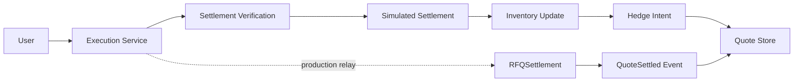
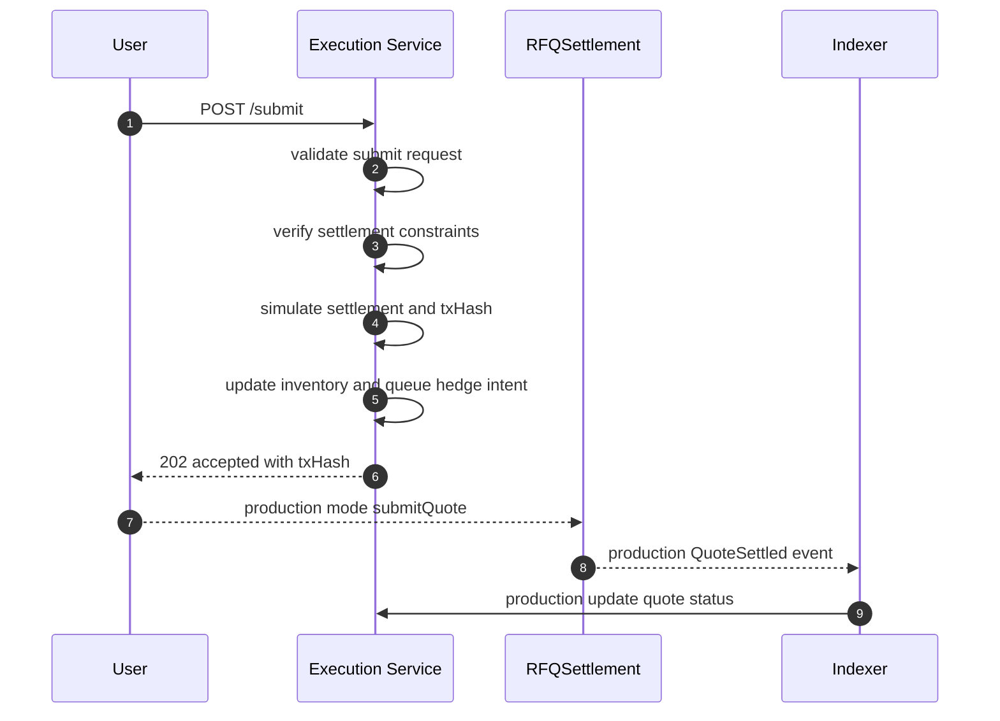
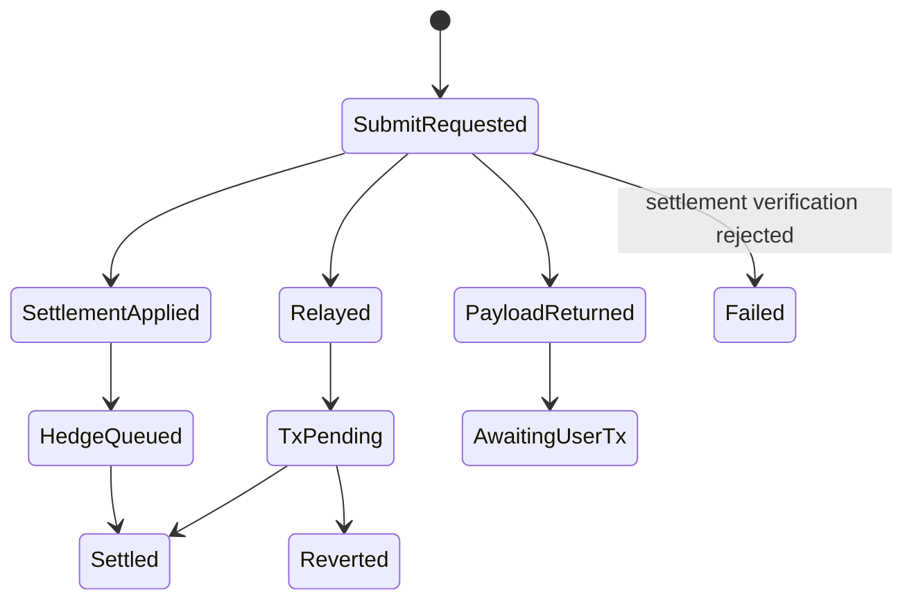

# Chapter 06: Execution Service

## Abstract

Execution Service 处理 quote 提交路径。根据产品模式，它可以生成交易 payload 给用户钱包，也可以作为 relay 提交交易。当前参考实现会先执行本地 settlement verification，再用同步模拟结算把 `/submit -> contract verification -> settlement -> inventory update -> hedge intent -> metrics` 链路跑通；生产模式下链上 `RFQSettlement` 事件仍是最终结算权威。

## Learning Objectives

- 区分 wallet submit 和 backend relay。
- 定义 `/submit` 的职责。
- 说明链上事件如何回写 quote 状态。
- 识别 execution failure 与 settlement failure。

## Background

RFQ 用户拿到 signed quote 后需要提交链上交易。某些系统让用户直接提交，某些系统提供后端 relay。两种模式影响 UX、gas payer 和信任边界。

## Problem Statement

后端不能仅凭 `/submit` 成功就认为成交。只有链上事件确认后，quote 才算 settled。

## Requirements

### Functional Requirements

- 接收 quote 和 signature。
- 构造 `submitQuote` transaction payload。
- 可选 relay 到链上。
- 追踪 txHash。
- 第一阶段先执行 settlement verification，再同步应用 settlement delta、更新库存、创建 hedge intent。
- 生产版监听 settlement event 更新最终状态。

### Non-Functional Requirements

- submit 必须幂等。
- tx 状态必须可查询。
- relay failure 不等于 quote invalid。
- 事件消费必须处理 reorg。

## Existing Solutions

直接钱包提交信任最小，但 UX 较复杂。Backend relay UX 好，但后端承担 gas 和提交风险。本项目文档支持两者，第一版可先返回 tx payload。

## Trade-Off Analysis

Relay 增加后端复杂度，但改善集成体验。直接提交更符合自托管原则。系统应保持接口可扩展。

## System Design

## Architecture Diagram

Execution Service 与 Event Indexer 配合。前者处理提交意图，后者确认链上结果。

## Sequence Diagram

## State Machine

## Data Model

Execution state includes `quoteId`, `txHash`, `hedgeOrderId`, `status`, `submittedAt`, `confirmedAt`, `revertReason`, `blockNumber`.

## API Design

`POST /submit` returns HTTP 202 with `accepted`, optionally `txHash`, a consumed `settlementEventId`, a queued `hedgeOrderId`, and a `pnlId` in the simulated settlement path. `GET /quote/:id` exposes quote settlement state when the backend can map `user:nonce` back to the issued quote. `GET /settlements/:id` exposes the idempotently consumed settlement event that updated inventory. `GET /hedges/:id` exposes the hedge intent created after inventory update. `GET /pnl` exposes realized spread PnL summary for the runnable reference path.

## Engineering Decisions

- Settlement event is source of truth.
- 第一阶段 `/submit` uses `LocalSettlementVerifier` to mirror RFQSettlement chainId、deadline、token whitelist、token pair 和 amount shape checks before simulated settlement.
- Settlement verification failure returns `SETTLEMENT_REVERTED`, marks the quote `failed`, and must not update inventory, queue hedge intent, record PnL, or mark the quote settled.
- `/submit` rejects `failed` quotes with `QUOTE_FAILED` before execution, so terminal settlement failures cannot be replayed into the execution path.
- 第一阶段 `/submit` uses simulated settlement to exercise inventory and hedge flow.
- 生产版 `/submit` does not imply settled until chain event confirmation.
- Relay mode is optional.

## Failure Scenarios

- User never broadcasts tx：quote expires。
- Relay tx reverted：status failed。
- Settlement verification rejects token whitelist or chain mismatch：return `SETTLEMENT_REVERTED` before inventory update。
- Chain RPC unavailable：return dependency error。
- Event lag：status pending until indexed。

## Security Considerations

Relay mode must prevent arbitrary transaction submission. It should only submit known `RFQSettlement.submitQuote` calls.

## Performance Considerations

Execution path can be asynchronous. RPC latency should not block quote generation.

## Testing Strategy

测试 payload generation、relay failure、tx revert、event confirmation、duplicate submit 和 quote expired。

## Interview Notes

后端 submit 成功不是成交成功。链上事件才是 settlement source of truth。

## Summary

Execution Service 管理提交体验，但不替代 RFQSettlement 的链上权威。

## References

- Transaction relays
- Chain event indexing
