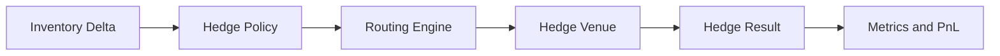
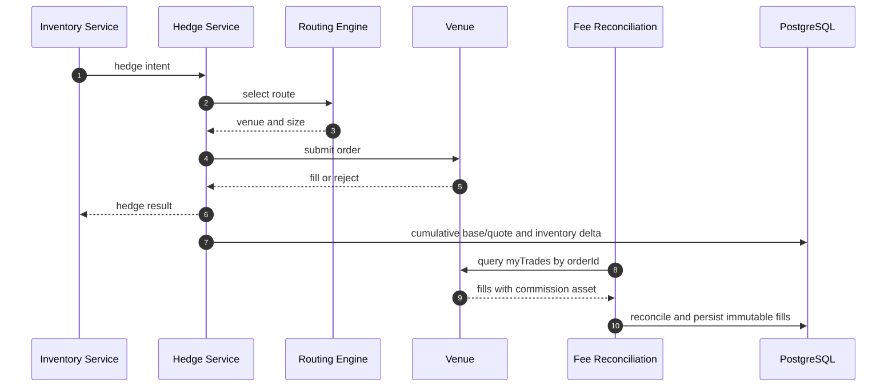
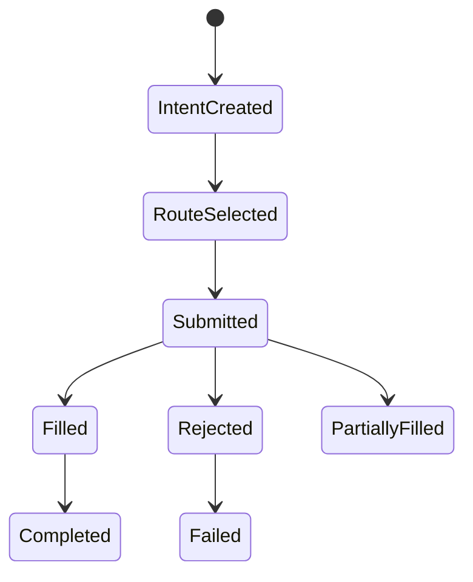

# Chapter 07: Hedge Service

## Abstract

Hedge Service 负责成交后风险再平衡。RFQSettlement 确认成交后，Inventory Service 计算 exposure delta。如果库存偏离目标，Hedge Service 选择 venue 和 route，提交对冲订单，并把结果反馈到库存、PnL 和后续风险。API 在 `/submit` 后只持久化 queued hedge intent；独立 worker 使用 PostgreSQL lease claim，并通过 Binance Spot signed REST API 执行带价格边界的 `LIMIT GTC` 订单。

## Learning Objectives

- 理解 hedge 是 post-trade path。
- 定义 hedge intent、hedge order 和 hedge result。
- 说明对冲失败如何影响后续报价。
- 设计 hedge latency 和 hedge cost 指标。

## Background

做市系统的目标不是每笔成交后都立即完全对冲，而是在风险预算内管理库存。有些 exposure 可以保留，有些需要快速对冲。

## Problem Statement

如果成交后不对冲，库存可能持续偏离目标。如果对冲失败不反馈风险，后续 quote 可能继续放大风险。当前后端实现把 hedge intent 创建失败视为 post-trade 风险事件，而不是 settlement 失败：`/submit` 仍返回 accepted、保留 settlement event、更新 inventory 和 PnL，但不返回 `hedgeOrderId`，记录 `rfq_hedge_intent_errors_total{reason="HEDGE_INTENT_FAILED"}`，并在同一 `chainId/token` 上累积 quote risk penalty，让后续报价更保守。

## Requirements

### Functional Requirements

- 接收 inventory delta。
- 判断是否需要 hedge。
- 选择 hedge venue。
- 提交 hedge order。
- 记录 hedge cost、status 和 latency。
- 反馈给 Inventory 和 Risk。
- hedge intent 创建失败时保留 settlement 结果，并输出稳定 reasonCode。
- hedge intent 创建失败后，为实际 hedge token 累积有上限的 quote risk penalty；后续报价读取 pair 两腿压力的最大值。

### Non-Functional Requirements

- hedge 操作必须幂等。
- external venue credential 必须隔离。
- hedge failure 必须告警。
- hedge 不阻塞链上 settlement；`queued` hedge intent 表示 durable store 已接收异步工作，只有 worker 持久化 venue order/fill evidence 后才能进入后续状态。
- hedge failure metric 必须区分于 submit error metric，避免把 post-trade 风险事件误报为 settlement 回滚。

## Existing Solutions

简单系统不做对冲，只记录库存。专业做市系统会根据风险预算和市场条件动态对冲。

## Trade-Off Analysis

快速对冲降低方向性风险，但可能增加交易成本。延迟对冲降低成本，但增加市场风险。Hedge Service 应支持策略配置。

## System Design

## Architecture Diagram

Hedge Service 属于异步 post-trade path，通过 event bus 与 Inventory Service 通信。

## Sequence Diagram

## State Machine

## Data Model

`HedgeOrder` includes `id`, `settlementEventId`, `token`, `side`, `amount`, `venue`, `status`, deterministic `clientOrderId`, native `venueOrderId`, cumulative base/quote evidence, independent execution and fee leases, and timestamps. `hedge_execution_fills` uses `(hedgeOrderId, venueTradeId)` as its idempotency key and stores exact price、base quantity、quote quantity、commission quantity、commission asset、maker/taker direction and venue execution time.

## API Design

Hedge Service uses internal event APIs. It does not expose public user API.

## Engineering Decisions

- Hedge failure does not revert settlement; current backend records `HEDGE_INTENT_FAILED` and leaves `hedgeOrderId` absent from the accepted submit response.
- `delta-neutral-v2` 使用可信 token registry 选择资产腿：仅 `tokenOut` 是 USD reference 时，卖出成交后收到的 `tokenIn/amountIn`；`tokenIn` 是 USD reference 时，买入成交后支付的 `tokenOut/amountOut`，两腿均为 USD reference 的稳定币交易也使用该库存补充方向。仅两腿都不是 USD reference 时规划器 fail closed。Execution Service 与 reconciliation worker 注入同一 registry 和 planner，实时路径与重放路径不会生成不同 intent。
- Hedge intent creation is idempotent by `settlementEventId`; retrying the same settlement returns the existing `hedgeOrderId` instead of creating a second hedge order.
- Hedge idempotency requires repeated `settlementEventId` input to match the stored hedge intent payload. A retry with a different quote id, token, side, amount or reason is a hedge intent conflict rather than a silent no-op. Persistent hedge rows store the required `quoteId` and `reason` from `HedgeIntentStatusResponse` so `/hedges/:id`, quote status hydration and reconciliation can join directly to both the triggering settlement event and original quote.
- Hedge Service returns defensive copies from create and status lookup operations. Direct callers must not be able to mutate queued hedge intent state by editing a returned record, because quote status hydration, `/hedges/:id` and reconciliation all depend on the stored intent.
- Hedge intents move through a minimal internal lifecycle: `queued` at creation, then `filled` with a non-empty `externalOrderId` or `failed` without changing the accepted settlement. Terminal transitions are idempotent only when the repeated filled update carries the same external order reference; conflicting terminal transitions are rejected rather than silently rewriting venue reconciliation evidence.
- Hedge failure updates risk state through `recordHedgeFailure` and `quoteRiskPenaltyBps`; Quote Service validates both pair-leg results and uses their maximum as independent `hedgeCostBps`, while `inventorySkewBps` remains the inventory-only signal. Taking the maximum avoids double charging one pair while ensuring a failed non-reference hedge remains visible when `tokenOut` is USD.
- `quoteRiskPenaltyBps` output is a Quote Service dependency boundary. If a custom Hedge Service returns a non-number, non-integer, negative value or value above 10000 bps, Quote Service treats the pricing adjustment as unavailable before calling Pricing Service and fails the requested quote with `PRICING_UNAVAILABLE`.
- `createHedgeIntent` output is an Execution Service dependency boundary. If a custom Hedge Service returns a malformed `HedgeResult`, a mismatched nested hedge record, or a record whose `createdAt` is not canonical UTC ISO, Execution Service treats it as `HEDGE_INTENT_FAILED`: the settlement stays accepted, inventory remains updated, the submit response omits `hedgeOrderId`, and follow-up quote risk pressure can still be recorded through `recordHedgeFailure`.
- Hedge failure penalty config is validated at construction: `failurePenaltyBps` and `maxFailurePenaltyBps` must be own positive safe integers, each must be at most 10000 bps, and `failurePenaltyBps` must not exceed `maxFailurePenaltyBps`. Invalid config fails fast before `/submit` can accept a settlement whose follow-up quote risk feedback would be nonsensical.
- `HedgeService` snapshots `HedgeServiceConfig` at construction after validation. External callers must not be able to mutate failure penalty increments or caps after construction and silently change follow-up quote risk feedback.
- Hedge intent and risk feedback inputs are validated before writing hedge state: required config, intent and risk fields must be own fields; `settlementEventId` and `quoteId` must be own primitive-string `SafeIdentifier` values with 1-128 characters matching `[A-Za-z0-9_:-]`, `chainId` must be an own positive safe integer, `token` must be an own runtime string and a 20-byte address, `amount` must be an own canonical positive uint string without leading zeros, and `side` / `reason` must match the supported enum values. Direct service callers cannot pass `String` wrapper objects or inherited object properties and rely on JavaScript `RegExp.test()` coercion before hedge state or risk pressure mutation.
- Hedge status lookups validate `hedgeOrderId` and `settlementEventId` as primitive-string `SafeIdentifier` values before reading local or PostgreSQL indexes, so internal callers cannot bypass the API gateway and query with blank, unsafe, boxed `String` or overlong resource identifiers.
- Non-local runtime uses `PostgresHedgeService`: one unique `hedge_orders` row per settlement event, deterministic cross-replica hedge ids, DB timestamps, durable queued/filled/failed transitions, and idempotent conflict validation. Failed rows provide shared bounded quote-risk pressure instead of pod-local failure counters.
- `PostgresHedgeJobStore` uses a short transaction with `FOR UPDATE SKIP LOCKED` to claim one due queued row, increments `attempt_count`, and writes an expiring `(lease_owner, lease_expires_at)` pair. Terminal and retry updates require the same lease owner, so a stale worker cannot overwrite a row reclaimed by another replica.
- `RFQ_HEDGE_ROUTES_JSON` maps each planner-selected `chainId/token` to a Binance base-asset symbol, token decimals, raw-unit step size, `priceTick` and `maxSlippageBps`. Worker startup loads the shared `RFQ_TOKEN_REGISTRY_JSON` and requires route decimals to match trusted token metadata exactly; this check intentionally accepts a token that is no longer whitelisted so an already-settled exposure can still be unwound. The worker rounds amount down to the step before decimal formatting; zero-after-rounding is a deterministic `HEDGE_AMOUNT_BELOW_STEP_SIZE` failure rather than an invalid venue request. It derives the reference price from the immutable signed/settled quote amounts, applies route slippage, rounds a buy ceiling upward or sell floor downward to `priceTick`, persists `bounded-limit-v1`, and only then submits `LIMIT GTC`.
- Binance 查询与下单回报必须同时包含原生 `orderId`、累计基础资产成交量 `executedQty` 和累计计价资产成交额 `cummulativeQuoteQty`。worker 将数量规范化后在同一数据库事务中写为 `base-and-quote-v2`，并要求同一原生订单号下两者保持同步单调增长；迁移前无法恢复成交额的历史记录标记为 `base-only-v1`，不得补造价格。
- 库存风险和费用会计使用两条独立 lease。订单累计量一旦增加，执行事务立即应用 inventory delta，并把 `fee_reconciliation_status` 置为 `pending`；它不等待账户成交历史。费用 worker 使用 `GET /api/v3/myTrades` 的 `symbol + orderId + fromId` 组合分页，逐笔验证 trade/order ID、买卖方向、数量、时间、手续费资产，并要求所有 fill 的 base/quote 总和与订单累计量完全相等。Binance 账户成交接口是 `Memory => Database` 数据源，短暂缺失必须重试，不能以配置费率或下单回报中的临时 fills 代替最终证据。
- `hedge_execution_fills` 对 venue trade ID 幂等，冲突重放只有所有经济字段完全一致才能成功。每笔新增记录产生 `hedge.execution-fill.v1` analytics event；订单费用状态进入 `complete` 后，`GET /hedges/:id` 按 `commissionAsset` 返回精确 `commissionTotals`。不同资产不相加，也不自动进入 `quote_snapshot_edge_v1`。完整净 PnL 仍需可靠的手续费资产估值、gas 和 hedge markout 证据。
- Every hedge id derives one stable `rfq_<sha256>` Binance client order id. The worker persists this id, queries `GET /api/v3/order` first, and calls `POST /api/v3/order` only when Binance explicitly reports the order absent. This query-before-submit rule repairs a lost HTTP response without duplicate exposure.
- 新订单在提交授权前持久化 `execution_order_type='LIMIT'`、`execution_time_in_force='GTC'`、limit price、tick、最大滑点和策略版本。数据库 CHECK 同时验证字段完整性和 tick 对齐，避免应用重启或配置变化后以不同执行边界重放。迁移前已尝试提交且策略字段为空的订单只能按确定性 client id 继续查询，不能被追认成新策略。
- Binance `-1021` 表示签名请求未通过时间窗口检查。adapter 对该错误执行一次无签名 `GET /api/v3/time`，按请求起止时间的中点计算偏移；并发 hedge/fee 请求共享同一个校时 Promise，随后各自使用新时间戳和新 HMAC 只重试一次。校时接口失败、畸形 `serverTime`、超过 24 小时的偏移或重试后仍为 `-1021` 时继续进入可重试队列，不把时钟故障解释为订单失败。
- Route persistence is write-once/idempotent for a queued job: a retry may repeat the exact venue, symbol and client id, but a deployment cannot overwrite them. Route changes require draining or explicitly reconciling old jobs by their persisted symbol/client id before rollout.
- Immediately before a new POST, `authorizeSubmission` locks the source settlement row, requires it to remain canonical, and persists `submission_attempted_at`. Reorged, never-submitted jobs stop being claimable; jobs with an attempted submission continue query-only recovery after reorg because Binance may already have accepted them.
- Retryable transport failures, HTTP 418/429/5xx, repeated timestamp errors, malformed responses and `NEW` / `PARTIALLY_FILLED` venue states remain queued. Retries use attempt-based exponential backoff capped at 60 seconds and honor a longer valid `Retry-After`; local retry count is observability data, not evidence that an external order failed. Only explicit terminal rejection/cancel/expiry, missing route, or below-step amount enters `failed`.
- `RFQ_HEDGE_MAX_ORDER_AGE_MS` is validated at startup, defaults to 30 seconds, and becomes immutable per order when `bounded-limit-v1` is prepared. After Binance still reports a pending order, PostgreSQL compares `submission_attempted_at + execution_max_order_age_ms` with database `now()` and atomically writes `cancel_requested_at` before authorizing the signed `DELETE /api/v3/order`. This avoids worker clock skew and prevents a crash from losing cancellation intent. Cancellation remains query-first and repeatable by the original client id: timeout, HTTP 5xx, `-2011`, or a temporarily missing order stays queued as unknown; a returned/query-observed `FILLED` wins a cancel race, while terminal cancellation preserves and applies any cumulative partial fill.
- HTTP 418/429 handling honors canonical Binance `Retry-After` delay-seconds up to seven days and takes the maximum of venue delay and local backoff, avoiding repeated rate-limit violations or IP-ban escalation.
- Binance `executedQty` is converted back to raw token units and checked against token decimals, venue step size, and the requested hedge amount. A venue `FILLED` status completes the job only when cumulative execution equals the raw-unit quantized target exactly; the difference between intent and target must be less than one route step and is explicit venue dust. An undersized or oversized `FILLED` response is treated as an invalid, retryable venue observation and remains queued for query-by-client-id reconciliation. Every observed cumulative partial fill atomically updates `filled_amount`, the external reference, and only the newly filled token delta in `inventory_positions`; terminal completion applies the remaining difference in the same PostgreSQL transaction. Repeated observations therefore cannot double-count exposure, while pending real fills are visible to quote risk immediately.
- The worker requires its lease to exceed four configured HTTP timeout windows plus one second, covering the worst-case `query -> time sync -> signed retry -> submit` or `query -> submit -> time sync -> signed retry` iteration. Deterministic client ids remain the second line of defense if a process stalls beyond its lease.
- Binance credentials live only in the worker Secret. Use a trade-only, IP-restricted API key with withdrawals disabled; API and signer pods must not mount it.
- Hedge persistence is intentionally after the atomic settlement+inventory transaction. Failure cannot roll back a confirmed settlement; reconciliation recreates a missing intent from the canonical event. Reorg reconciliation may delete only an unsubmitted, unleased queued intent. Once `submission_attempted_at` or a terminal venue result exists, the row is retained because external execution cannot be reversed by deleting a chain-derived projection.
- Malformed hedge config, intent and risk feedback root payloads are rejected before field access or state mutation, so post-trade hedge failures cannot turn into unclassified `TypeError` paths or partial failure-pressure updates.
- Persistent hedge rows keep `externalOrderId` nullable while an intent is only queued internally, but any non-null external order reference must be non-empty so venue reconciliation can trace it. `updatedAt` records the latest filled/failed transition while `createdAt` remains the original intent time.
- Hedge credentials isolated from Quote Service.

## Failure Scenarios

- Venue unavailable：保留 queued、按确定性 client id 查询后重试，不把未知外部状态误标为 failed。
- Partial fill：update residual exposure。
- Hedge cost too high：risk limit tightened。
- Credential failure：alert and disable venue。
- Fee reconciliation lag：保留已执行库存，检查 `fee_reconciliation_status='pending'`、`fee_last_error_code` 和 `rfq_hedge_fee_reconciliations_total`；不得重提订单或把估算费率写成实际手续费。
- Cancel response lost：保留 queued 和 `cancel_requested_at`，继续按原 client id 查询并在订单仍 pending 时幂等重试取消；不得创建替代订单或把暂时 missing 当成取消成功。
- Hedge intent creation failed：settlement remains accepted, inventory and PnL remain updated, metric `rfq_hedge_intent_errors_total` increments, and follow-up quote spread tightens through pair-level hedge risk penalty.
- Hedge status store unavailable：`GET /hedges/:id` returns `HEDGE_STORE_UNAVAILABLE` with traceId, so clients can retry status lookup instead of treating the hedge as missing.

## Security Considerations

External venue credentials must have least privilege. Withdrawal permissions should be disabled where possible.

## Performance Considerations

Hedge lag is key metric. The service should prioritize high exposure intents.

## Testing Strategy

测试 hedge skipped、route selected、step-size rounding、HMAC signing、query-before-submit、`-1021` 单飞校时与重签、venue reject、partial fill/pending retry、数据库时钟驱动的最大挂单时长、取消前意图持久化、取消与成交竞态、ambiguous cancel recovery、四窗口 lease 边界、lease conflict、idempotent retry、`myTrades` pagination、trade ID safety、eventual-consistency retry、multi-asset commission、immutable fill conflict、hedge intent creation failed does not rollback settlement、follow-up quote risk penalty、failure penalty config fail-fast、hedge status store unavailable 和 worker metrics emission。

## Interview Notes

Hedge 是成交后风险管理，不是链上结算的一部分。失败时通过风险和报价反馈控制损失。

## Summary

Hedge Service 让 RFQ 系统形成库存闭环，是从 demo 到专业做市系统的重要分界。

## References

- [Binance Spot API: Cancel order](https://github.com/binance/binance-spot-api-docs/blob/master/rest-api.md#cancel-order-trade)
- Inventory rebalancing
