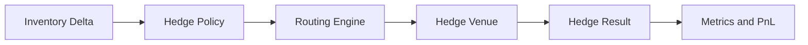
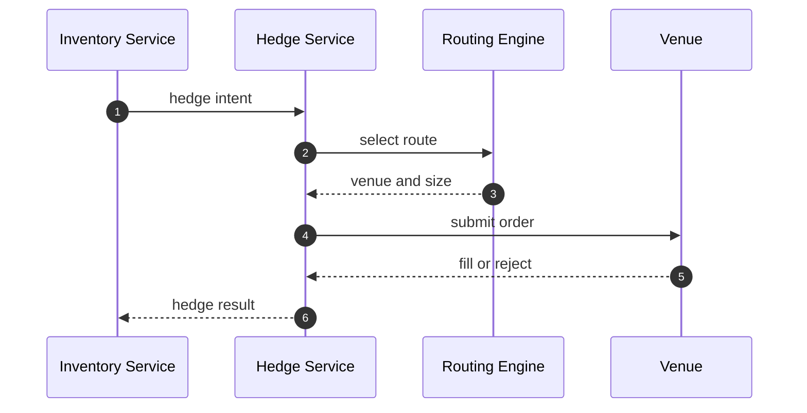
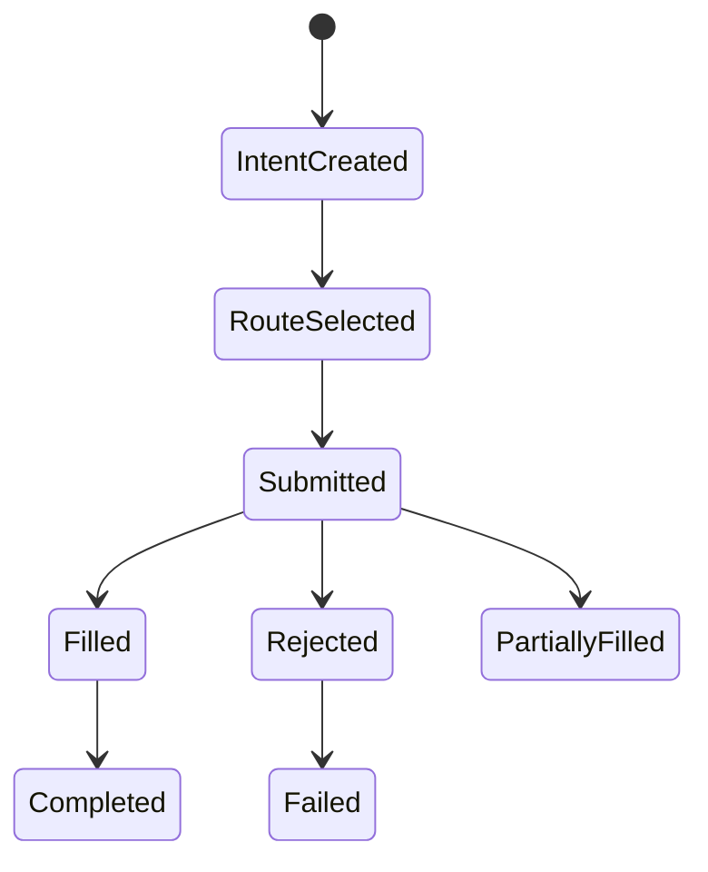

# Chapter 07: Hedge Service

## Abstract

Hedge Service 负责成交后风险再平衡。RFQSettlement 确认成交后，Inventory Service 计算 exposure delta。如果库存偏离目标，Hedge Service 选择 venue 和 route，提交对冲订单，并把结果反馈到库存、PnL 和后续风险。当前参考实现会在 `/submit` 模拟结算后立即创建 hedge intent，用于验证 post-trade path。

## Learning Objectives

- 理解 hedge 是 post-trade path。
- 定义 hedge intent、hedge order 和 hedge result。
- 说明对冲失败如何影响后续报价。
- 设计 hedge latency 和 hedge cost 指标。

## Background

做市系统的目标不是每笔成交后都立即完全对冲，而是在风险预算内管理库存。有些 exposure 可以保留，有些需要快速对冲。

## Problem Statement

如果成交后不对冲，库存可能持续偏离目标。如果对冲失败不反馈风险，后续 quote 可能继续放大风险。当前后端实现把 hedge intent 创建失败视为 post-trade 风险事件，而不是 settlement 失败：`/submit` 仍返回 accepted、保留 settlement event、更新 inventory 和 PnL，但不返回 `hedgeOrderId`，并记录 `rfq_hedge_intent_errors_total{reason="HEDGE_INTENT_FAILED"}`。

## Requirements

### Functional Requirements

- 接收 inventory delta。
- 判断是否需要 hedge。
- 选择 hedge venue。
- 提交 hedge order。
- 记录 hedge cost、status 和 latency。
- 反馈给 Inventory 和 Risk。
- hedge intent 创建失败时保留 settlement 结果，并输出稳定 reasonCode。

### Non-Functional Requirements

- hedge 操作必须幂等。
- external venue credential 必须隔离。
- hedge failure 必须告警。
- hedge 不阻塞链上 settlement；第一阶段 skeleton 中 hedge intent 只表示已进入异步队列。
- hedge failure metric 必须区分于 submit error metric，避免把 post-trade 风险事件误报为 settlement 回滚。

## Existing Solutions

简单系统不做对冲，只记录库存。专业做市系统会根据风险预算和市场条件动态对冲。

## Trade-Off Analysis

快速对冲降低方向性风险，但可能增加交易成本。延迟对冲降低成本，但增加市场风险。Hedge Service 应支持策略配置。

## System Design

## Architecture Diagram

Hedge Service 属于异步 post-trade path，通过 event bus 与 Inventory Service 通信。

## Sequence Diagram

## State Machine

## Data Model

`HedgeOrder` includes `id`, `settlementEventId`, `token`, `side`, `amount`, `venue`, `status`, `externalOrderId`, `costBps`, `createdAt`, `updatedAt`.

## API Design

Hedge Service uses internal event APIs. It does not expose public user API.

## Engineering Decisions

- Hedge failure does not revert settlement; current backend records `HEDGE_INTENT_FAILED` and leaves `hedgeOrderId` absent from the accepted submit response.
- Hedge result updates risk state.
- Hedge credentials isolated from Quote Service.

## Failure Scenarios

- Venue unavailable：retry or route elsewhere。
- Partial fill：update residual exposure。
- Hedge cost too high：risk limit tightened。
- Credential failure：alert and disable venue。
- Hedge intent creation failed：settlement remains accepted, inventory and PnL remain updated, metric `rfq_hedge_intent_errors_total` increments, and follow-up risk policy should tighten output-token exposure.

## Security Considerations

External venue credentials must have least privilege. Withdrawal permissions should be disabled where possible.

## Performance Considerations

Hedge lag is key metric. The service should prioritize high exposure intents.

## Testing Strategy

测试 hedge skipped、route selected、venue reject、partial fill、idempotent retry、hedge intent creation failed does not rollback settlement 和 metrics emission。

## Interview Notes

Hedge 是成交后风险管理，不是链上结算的一部分。失败时通过风险和报价反馈控制损失。

## Summary

Hedge Service 让 RFQ 系统形成库存闭环，是从 demo 到专业做市系统的重要分界。

## References

- Hedge execution
- Inventory rebalancing
