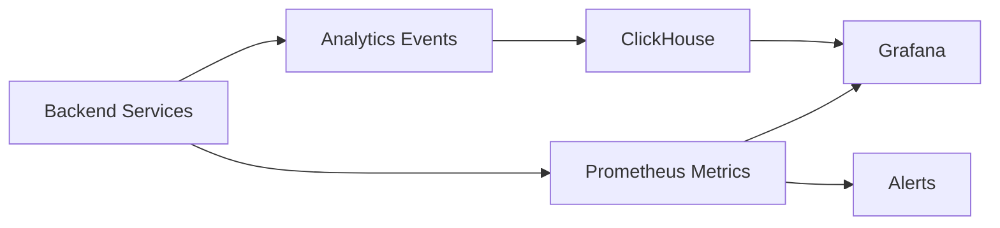
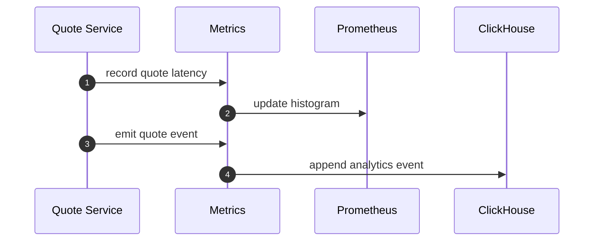
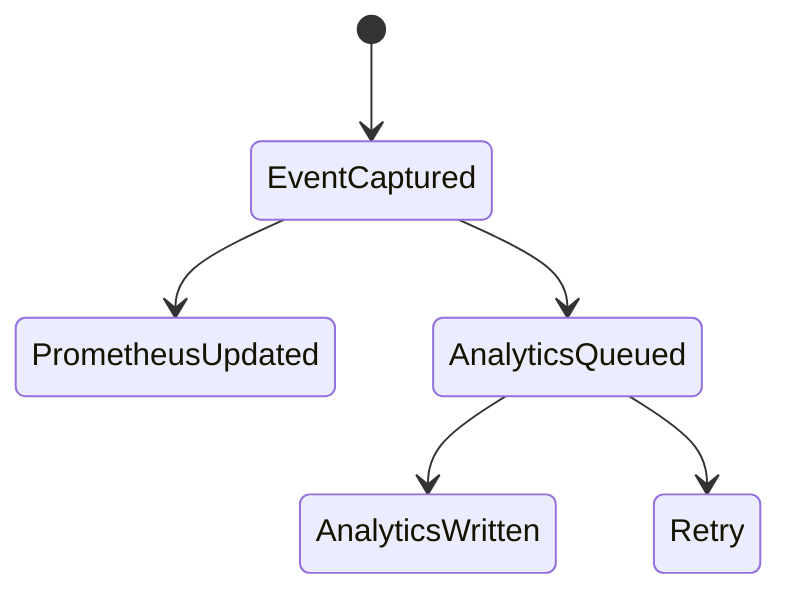

# Chapter 08: Metrics Service

## Abstract

Metrics Service 让 RFQ 系统可观测。做市系统需要同时关注技术指标和业务风险指标：quote latency、risk reject rate、signer latency、settlement success、inventory exposure、hedge lag 和 PnL。没有指标，系统无法生产运行。

## Learning Objectives

- 定义 RFQ 系统核心指标。
- 区分 Prometheus 指标和 ClickHouse 分析。
- 说明 metrics 如何支撑故障恢复。
- 设计 dashboard 和 alert。

## Background

RFQ 故障往往不是单点崩溃，而是延迟升高、拒绝率异常、事件消费落后或对冲成本上升。Metrics Service 必须覆盖完整业务漏斗。

## Problem Statement

如果只监控 HTTP 500，无法发现风险拒绝暴增、signer 延迟、inventory 偏离或 hedge lag。这些才是做市系统的关键运营风险。

## Requirements

### Functional Requirements

- 暴露 `/metrics`。
- 记录 quote requested、signed、rejected、submitted、settled。
- 记录 latency histogram。
- 记录 inventory exposure。
- 记录 hedge lag 和 hedge cost。
- 支持 PnL 分析事件。

### Non-Functional Requirements

- Metrics emission 不应阻塞业务路径。
- 指标命名稳定。
- 高基数字段不进入 Prometheus label。
- 分析事件写入 ClickHouse。

## Existing Solutions

Prometheus 适合实时指标和告警。ClickHouse 适合高维分析和 PnL 归因。本项目两者结合。

## Trade-Off Analysis

只用 Prometheus 会受 label cardinality 限制。只用 ClickHouse 告警不够实时。组合使用更适合生产。

## System Design

## Architecture Diagram

Metrics 是横切关注点，覆盖 API、Quote、Pricing、Risk、Signer、Execution、Inventory 和 Hedge。

## Sequence Diagram

## State Machine

## Data Model

Prometheus metrics:

- `rfq_quote_requests_total`
- `rfq_quote_rejections_total`
- `rfq_quote_latency_seconds`
- `rfq_submit_latency_seconds`
- `rfq_signer_latency_seconds`
- `rfq_settlement_events_total`
- `rfq_inventory_exposure_usd`
- `rfq_hedge_lag_seconds`

ClickHouse events include quoteId, snapshotId, policyVersion, pricingVersion, status and timestamps.

## API Design

`GET /metrics` exposes Prometheus text format. Analytics events are internal.

## Engineering Decisions

- No high-cardinality quoteId labels in Prometheus.
- Use ClickHouse for quote-level analysis.
- Metrics failures must not break quote path.
- 当前后端实现已暴露 quote 和 submit latency histogram，使用固定 bucket，不带 user、quoteId 或 wallet label。

## Failure Scenarios

- Prometheus scrape fails：service continues。
- ClickHouse unavailable：buffer or drop per policy。
- Metrics cardinality explosion：remove label and alert.

## Security Considerations

Metrics endpoint should not expose secrets, full user addresses as labels, or internal risk thresholds.

## Performance Considerations

Metrics emission should be non-blocking and low allocation. Histograms need sensible buckets.

## Testing Strategy

测试 metrics names、label cardinality、latency histograms、event emission 和 ClickHouse failure fallback。

## Interview Notes

RFQ observability 要覆盖业务漏斗和风险指标，不只是 HTTP 状态码。

## Summary

Metrics Service 让 RFQ 系统具备生产运行能力，是故障恢复、风险监控和 PnL 归因的基础。

## References

- Prometheus
- ClickHouse analytics
- Observability for trading systems
