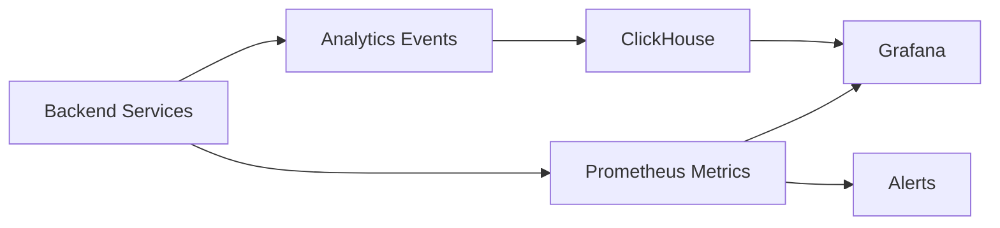
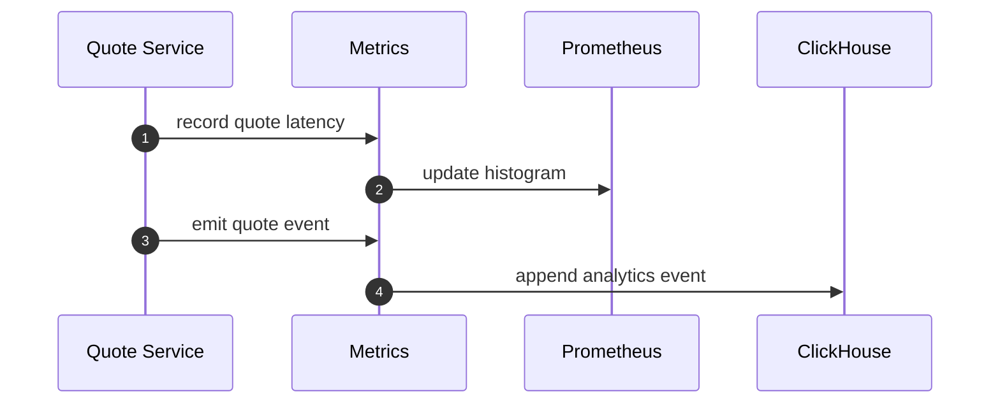
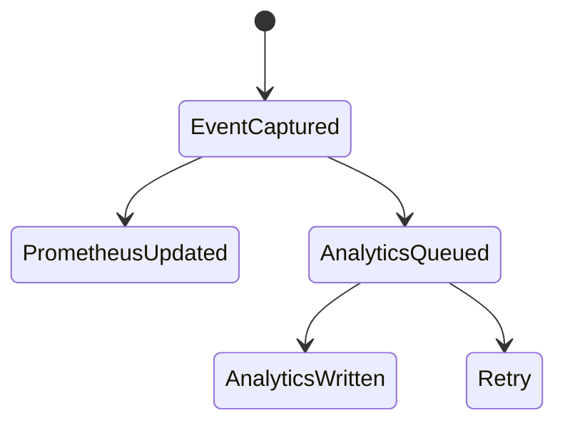

# Chapter 08: Metrics Service

## Abstract

Metrics Service 让 RFQ 系统可观测。做市系统需要同时关注技术指标和业务风险指标：quote latency、risk reject rate、signer latency、settlement success、inventory exposure、hedge lag 和 PnL。没有指标，系统无法生产运行。

## Learning Objectives

- 定义 RFQ 系统核心指标。
- 区分 Prometheus 指标和 ClickHouse 分析。
- 说明 metrics 如何支撑故障恢复。
- 设计 dashboard 和 alert。

## Background

RFQ 故障往往不是单点崩溃，而是延迟升高、拒绝率异常、事件消费落后或对冲成本上升。Metrics Service 必须覆盖完整业务漏斗。

## Problem Statement

如果只监控 HTTP 500，无法发现风险拒绝暴增、signer 延迟、inventory 偏离或 hedge lag。这些才是做市系统的关键运营风险。

## Requirements

### Functional Requirements

- 暴露 `/metrics`。
- 记录 quote requested、signed、rejected、submitted、settled。
- 记录 latency histogram。
- 记录 inventory exposure。
- 记录 hedge lag 和 hedge cost。
- 支持 PnL 分析事件。

### Non-Functional Requirements

- Metrics emission 不应阻塞业务路径。
- 指标命名稳定。
- 高基数字段不进入 Prometheus label。
- 分析事件写入 ClickHouse。

## Existing Solutions

Prometheus 适合实时指标和告警。ClickHouse 适合高维分析和 PnL 归因。本项目两者结合。

## Trade-Off Analysis

只用 Prometheus 会受 label cardinality 限制。只用 ClickHouse 告警不够实时。组合使用更适合生产。

## System Design

## Architecture Diagram

Metrics 是横切关注点，覆盖 API、Quote、Pricing、Risk、Signer、Execution、Inventory 和 Hedge。

## Sequence Diagram

## State Machine

## Data Model

Prometheus metrics:

- `rfq_quote_requests_total`
- `rfq_quote_responses_total`
- `rfq_quote_errors_total`
- `rfq_quote_rejections_total`
- `rfq_quote_latency_seconds`
- `rfq_submit_requests_total`
- `rfq_submit_accepted_total`
- `rfq_submit_errors_total`
- `rfq_submit_latency_seconds`
- `rfq_rate_limited_total`
- `rfq_signer_requests_total`
- `rfq_signer_errors_total`
- `rfq_signer_latency_seconds`
- `rfq_readiness_status`
- `rfq_dependency_status`
- `rfq_settlements_total`
- `rfq_hedge_intents_total`
- `rfq_hedge_intent_errors_total`
- `rfq_hedge_lag_seconds`
- `rfq_quote_status_update_errors_total`
- `rfq_inventory_balance`
- `rfq_pnl_trades_total`
- `rfq_pnl_record_errors_total`
- `rfq_realized_pnl_token_out`

ClickHouse events include quoteId, snapshotId, policyVersion, pricingVersion, status and timestamps.

## API Design

`GET /metrics` exposes Prometheus text format. Analytics events are internal.

## Engineering Decisions

- No high-cardinality quoteId labels in Prometheus.
- Use ClickHouse for quote-level analysis.
- Metrics failures must not break quote path.
- 当前后端实现已暴露 quote 和 submit latency histogram，使用固定 bucket，不带 user、quoteId 或 wallet label。
- Histogram observations must be finite numbers before mutation; finite negative latency values are clamped to zero, but `NaN` and `Infinity` are rejected so Prometheus output cannot contain non-numeric samples.
- `rfq_quote_rejections_total` 只使用稳定内部 `reasonCode` 作为 label，不暴露阈值、金额、地址或 quoteId。
- `rfq_hedge_lag_seconds` 使用无高基数 label 的 histogram，当前 reference path 记录 simulated settlement accepted 到 hedge intent queued 的耗时；生产版可复用同一指标记录异步 hedge queue 和 venue submit lag。
- `rfq_quote_status_update_errors_total` 使用低基数 `target_status` label，记录 settlement 已接受后 quote 状态落库失败，或 settlement rejection 后 failed 状态落库失败的次数；该指标用于触发 reconciliation，而不是让已应用 settlement 回滚或掩盖原始拒绝原因。
- `rfq_rate_limited_total` 使用固定 `endpoint="quote|submit|status"` label，把具体 HTTP route 收敛到稳定端点组，避免把 quoteId、settlementEventId、hedgeOrderId 或动态路径写入 Prometheus。
- Metrics Service validates fixed-label inputs before mutation: rate-limit endpoints must be `quote|submit|status`, signer operations must be `sign|verify`, and readiness metrics must contain exactly the supported component set with `ok|degraded` statuses.
- Metrics Service validates dynamic label values before mutation: quote rejection reasons, hedge intent error reasons, quote status update targets and PnL record error reasons must be runtime strings before label normalization, so malformed observability calls cannot turn into native `.trim()` failures or mutate counters under unintended labels.
- 当前后端实现已暴露 `rfq_pnl_trades_total` 和 `rfq_realized_pnl_token_out`，用于验证 `/submit -> settlement -> inventory -> hedge -> PnL` 闭环；生产版应将 quote-level PnL 归因写入 ClickHouse。
- `rfq_pnl_record_errors_total` 使用低基数 `reason` label，记录 settlement 已应用后 PnL 归因写入失败；该指标用于触发 settlement-to-PnL reconciliation，不能让已应用 settlement 返回错误。
- Metrics Service validates inventory gauge positions and PnL trade records before mutating counters or gauges. Inventory token, PnL user/token fields, signed PnL strings, amount fields and nonce must be runtime strings before regex validation, so `String` wrapper objects cannot rely on JavaScript `RegExp.test()` coercion. PnL trade `pnlId` and `quoteId` must be primitive-string `SafeIdentifier` values with 1-128 characters matching `[A-Za-z0-9_:-]`, amount fields and nonce must be canonical positive uint strings without leading zeros, signed PnL strings must be canonical integer strings without leading zeros or negative zero, `realizedAt` must be a canonical UTC ISO timestamp generated with `Date.prototype.toISOString()`, and invalid metric inputs must fail before incrementing `rfq_pnl_trades_total` or writing `rfq_realized_pnl_token_out`; stored inventory positions are defensive copies so caller-side object mutation cannot rewrite Prometheus output.
- 当前后端实现已暴露 `rfq_readiness_status{status="ready|degraded"}` 和 `rfq_dependency_status{component="...",status="ok|degraded"}`，用于把最近一次 `/ready` 探测结果转成 Prometheus gauge。组件 label 固定为 marketData、marketSnapshotStore、routing、pricing、risk、signer、quoteRepository、riskDecisionStore、inventory、execution、settlementEventStore、pnl 和 metrics，不能使用动态下游地址、错误消息或实例 ID。
- `rfq_readiness_status` 只表达最近一次 readiness 业务探测结果，不替代进程存活、HTTP availability 或 Kubernetes liveness。生产告警应同时查看 `/health` 可达性、`up`、HTTP error rate 和业务依赖状态。
- ClickHouse is an analytics replica only: `/quote`, `/submit`, `/ready`, settlement reconciliation, inventory mutation, hedge intent creation and PnL attribution must read operational truth from PostgreSQL, settlement events and in-process service state, never from ClickHouse query results.

## Failure Scenarios

- Prometheus scrape fails：service continues。
- `rfq_readiness_status{status="degraded"} == 1`：检查 `rfq_dependency_status` 中具体 degraded 组件，并按 market data、signer、settlement store、PnL store 等 runbook 分流。
- ClickHouse unavailable：buffer or drop per policy。
- Quote status update metric rises：run settlement-to-quote reconciliation。
- PnL record error metric rises：run settlement-to-PnL reconciliation。
- Metrics cardinality explosion：remove label and alert.

## Security Considerations

Metrics endpoint should not expose secrets, full user addresses as labels, or internal risk thresholds.

## Performance Considerations

Metrics emission should be non-blocking and low allocation. Histograms need sensible buckets.

## Testing Strategy

测试 metrics names、label cardinality、latency histograms、event emission 和 ClickHouse failure fallback。

## Interview Notes

RFQ observability 要覆盖业务漏斗和风险指标，不只是 HTTP 状态码。

## Summary

Metrics Service 让 RFQ 系统具备生产运行能力，是故障恢复、风险监控和 PnL 归因的基础。

## References

- Prometheus
- ClickHouse analytics
- Observability for trading systems
