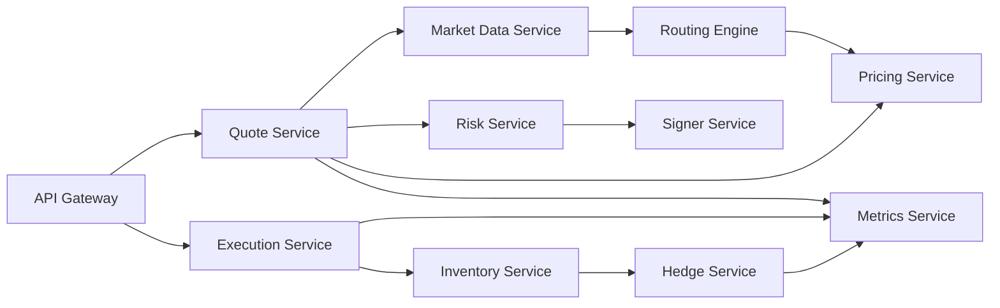

# Volume 5: Backend Engineering

本卷定义 RFQ / Prop AMM 系统的后端工程设计。后端是链下决策平面，负责编排市场数据、定价、风控、签名、执行、库存、对冲和指标。核心原则是：Quote Service 可以编排，但不能绕过 Risk Engine；Signer Service 可以签名，但不能自己决定风险。

## Chapters

1. [Chapter 01: API Gateway](Chapter01-API-Gateway.md)
2. [Chapter 02: Quote Service](Chapter02-Quote-Service.md)
3. [Chapter 03: Pricing Service](Chapter03-Pricing-Service.md)
4. [Chapter 04: Risk Service](Chapter04-Risk-Service.md)
5. [Chapter 05: Signer Service](Chapter05-Signer-Service.md)
6. [Chapter 06: Execution Service](Chapter06-Execution-Service.md)
7. [Chapter 07: Hedge Service](Chapter07-Hedge-Service.md)
8. [Chapter 08: Metrics Service](Chapter08-Metrics-Service.md)

## Core Flow

## Implementation Direction

后端使用 TypeScript + Fastify。Gateway composition root 组合报价与提交同步链路；hedge、settlement indexer、reconciliation、analytics 和 toxic-flow analyzer 已提供独立 worker 入口。模块边界允许按故障域与吞吐需求独立部署，同时保留本地单进程参考模式。
