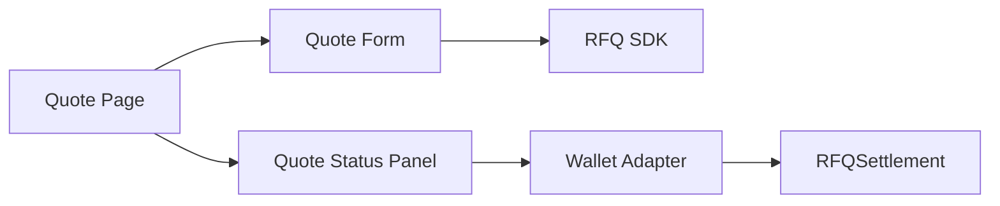
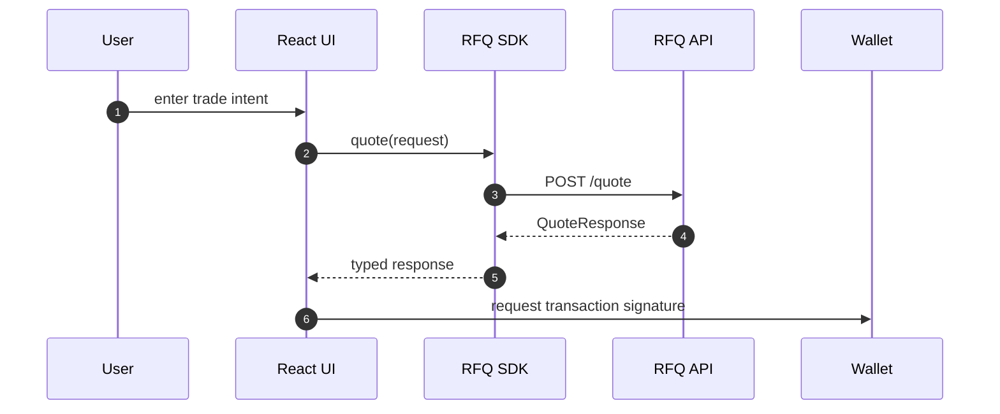
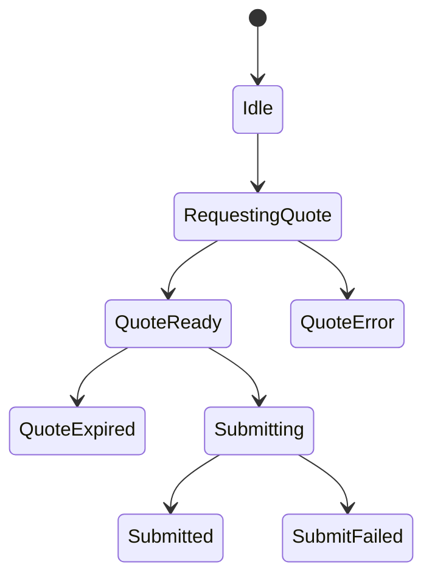

# Chapter 01: Frontend Architecture

## Abstract

前端是 RFQ 系统的用户操作面。它不负责定价和风控，但必须准确表达 quote 状态、deadline、minAmountOut、钱包网络、交易提交和错误反馈。第一版前端使用 React + Vite + TypeScript，并接入 Wagmi、Viem、RainbowKit 和 TanStack Query 作为钱包与链上交易基础。

## Learning Objectives

- 理解 RFQ Trading UI 的职责边界。
- 定义前端模块结构。
- 说明前端如何调用 SDK 和钱包。
- 明确 UI 不应执行的业务逻辑。

## Background

用户在 RFQ 系统中需要完成三个动作：输入交易意图，请求 quote，提交 signed quote。前端必须让这些状态清晰可见，尤其是 quote 过期和链上提交状态。

## Problem Statement

如果前端把 quote 当作普通 swap 价格展示，用户可能忽略 TTL、签名、nonce 和链上验证。如果前端自行计算 EIP-712 字段，容易与 SDK/合约不一致。

## Requirements

### Functional Requirements

- 支持输入 chainId、tokenIn、tokenOut、amountIn、slippageBps。
- 调用 SDK 请求 `/quote`。
- 展示 amountOut、minAmountOut、deadline、quote status。
- 连接钱包并提交 `submitQuote`。
- 展示错误码和 traceId。

### Non-Functional Requirements

- 前端不持有私钥。
- 前端不绕过 SDK typed data helper。
- 状态展示必须清晰，避免用户提交过期 quote。
- API endpoint 必须可配置，不能在前端代码中硬编码部署地址。
- 移动端布局必须可用。

## Existing Solutions

普通 swap UI 通常展示 route 和 slippage。RFQ UI 需要额外展示 quote TTL、签名状态和链上结算状态。

## Trade-Off Analysis

展示更多状态会增加 UI 复杂度，但能减少用户误解。生产 RFQ 前端应优先清晰表达执行窗口。

## System Design

## Architecture Diagram

前端按 `app/`、`pages/`、`components/`、`hooks/`、`lib/` 组织。SDK 位于独立 package，前端通过 SDK 调用 API，并通过 SDK 导出的 `rfqSettlementAbi` 与 `buildSubmitQuoteArgs` 构造 `RFQSettlement.submitQuote` 的钱包交易。当前实现通过 `VITE_RFQ_API_BASE_URL` 配置 `RFQClient` 的 base URL，默认值为 `http://localhost:3000`，并在交易台 header 展示当前 API endpoint，方便本地、Docker 和部署环境排查。

## Sequence Diagram

## State Machine

## Data Model

前端状态包括 `formState`、`quoteResponse`、`quoteCountdown`、`walletState`、`txState`、`errorState`。

## API Design

前端通过 SDK 调用 `quote(request)`、API relay `submit(request)`、状态查询方法，以及链上路径所需的 `buildSubmitQuoteArgs(quote, signature)`。公开 API 由 `docs/api/openapi.yaml` 定义；链上写入由 Wagmi `writeContract` 调用 `RFQSettlement.submitQuote`。

## Engineering Decisions

- React/Vite 作为第一版前端。
- SDK 是 API 和 EIP-712 的唯一客户端抽象。
- `VITE_RFQ_API_BASE_URL` 是前端 API endpoint 配置入口，`frontend/src/lib/config.ts` 负责规范化 trailing slash。
- `VITE_RFQ_SETTLEMENT_ADDRESS` 是浏览器侧合约写入目标；未配置时链上提交按钮保持禁用，但 API relay 路径仍可用于本地 smoke。
- `VITE_WALLETCONNECT_PROJECT_ID` 由 RainbowKit 使用，本地默认值只用于构建和离线开发。
- 前端不重新实现 Pricing 或 Risk。

## Failure Scenarios

- Wallet network mismatch：提示切换网络。
- Quote expired：禁用 submit 并要求重新询价。
- API risk rejected：展示通用原因。
- Transaction reverted：展示 tx 状态和 traceId。

## Security Considerations

前端不能信任用户输入，所有输入仍由后端和合约验证。前端不得暴露内部风控阈值。

## Performance Considerations

Quote request 应 debounce，避免输入变化导致高频请求。TanStack Query 可以缓存 quote status，但 signed quote TTL 很短，不能长期复用。

## Testing Strategy

测试 form validation、quote success、risk rejected、expired quote、wallet mismatch 和 transaction failure。

## Interview Notes

RFQ 前端的关键不是做一个 swap 表单，而是把 signed quote 的生命周期表达清楚。

## Summary

前端是 RFQ 用户体验层，必须围绕 quote 状态和链上提交生命周期设计，而不是隐藏 RFQ 的执行窗口。

## References

- React
- Vite
- Wagmi
- RainbowKit
