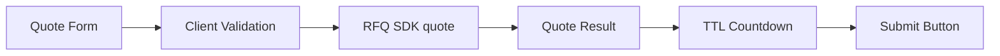
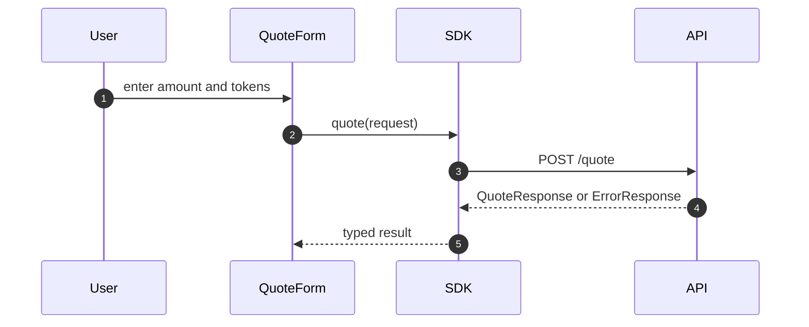
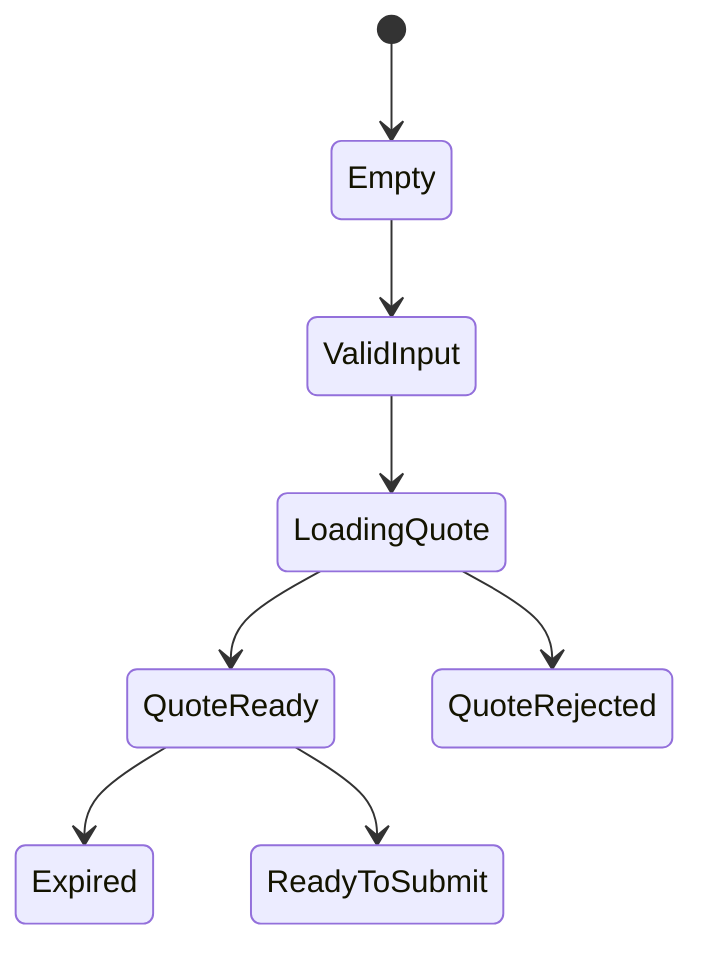

# Chapter 02: Quote UI

## Abstract

Quote UI 是用户请求 RFQ 报价的主界面。它需要收集交易意图、展示报价结果、展示 TTL 倒计时和最小输出保护，并在错误时给出可操作反馈。Quote UI 不应展示完整内部 pricing 参数，但应让用户理解 quote 是否可提交。

## Learning Objectives

- 定义 Quote Form 的字段。
- 设计 quote response 展示。
- 处理 risk rejected 和 dependency unavailable。
- 说明 TTL countdown 的 UX 重要性。

## Background

RFQ quote 是短生命周期签名授权。用户拿到 quote 后，如果等待过久，链上提交会失败。因此 UI 必须把 deadline 作为一等状态。

## Problem Statement

如果 UI 只展示 amountOut，不展示 quote TTL、minAmountOut 和状态，用户容易提交过期 quote 或误解可执行价格。

## Requirements

### Functional Requirements

- 表单字段：chainId、tokenIn、tokenOut、amountIn、slippageBps。
- 请求 quote 并展示 quoteId、snapshotId、amountOut、minAmountOut、deadline。
- 显示倒计时。
- quote 过期后禁用 submit。
- 展示 API error code 和 message。

### Non-Functional Requirements

- amount 使用用户可读格式展示，但内部保留 base unit。
- 错误反馈不能泄露内部阈值。
- 布局适配桌面和移动端。

## Existing Solutions

Swap UI 通常展示 estimated output 和 slippage。RFQ Quote UI 需要额外展示 signature lifecycle 和 expiry。

## Trade-Off Analysis

过多技术字段可能让普通用户困惑。第一版可以把 quoteId/snapshotId 放在高级状态区，同时突出 output、min output 和 expiry。

## System Design



## Architecture Diagram

Quote UI 由 QuoteForm、QuoteStatusPanel、useQuote hook 和 SDK client 组成。

## Sequence Diagram



## State Machine



## Data Model

UI state includes `request`, `response`, `expiresInSeconds`, `error`, `isLoading`, `canSubmit`。

## API Design

Quote UI calls:

```ts
client.quote(request: QuoteRequest): Promise<QuoteResponse>
```

## Engineering Decisions

- Submit button depends on non-expired quote.
- UI displays minAmountOut.
- Quote error maps from API error code.
- QuoteForm only writes numeric fields when `parseIntegerInput()` receives a primitive decimal string inside the public request contract: `chainId` must be a positive JavaScript safe integer and `slippageBps` must be between 0 and 10000, so empty strings, decimals, exponent notation, boxed `String` objects and out-of-range values do not poison request state before SDK/backend validation.
- Before calling `RFQClient.quote()`, the page runs `validateQuoteFormRequest()` to reject malformed user/token addresses, identical token pairs, non-positive `amountIn`, inherited or unknown request fields, and out-of-contract numeric fields locally; backend validation remains authoritative.
- `validateQuoteFormRequest()` requires closed own quote form request fields and treats address fields and `amountIn` as runtime `unknown` inputs at the helper boundary, so inherited fields, boxed `String` objects or other non-primitive values fail before regex validation and cannot be silently coerced into a quote request.
- `buildQuoteFromResponse()` builds the wallet submission quote only from closed own request and quote response fields. Inherited or unknown response fields are rejected before `amountOut`, `minAmountOut`, `nonce` or `deadline` can be copied into wallet calldata state.
- Quote UI binds every `QuoteResponse` to the validated request snapshot that produced it, not to the currently edited form state. Any form or wallet-driven request change clears the active quote session, submit result, post-trade statuses, chain transaction hash and PnL view before another signed quote can be submitted; in-flight quote responses are ignored when their session version is no longer current.
- TTL countdown is driven by a one-second UI clock while a quote is active. `canSubmit` depends on `expiresInSeconds > 0`, and `QuoteStatusPanel` renders the remaining seconds so users see the signed quote lifecycle rather than a static Unix deadline only.
- API submit is fail-closed inside the `submitQuote()` handler as well as through disabled buttons: when `canSubmit` is false, the page shows `Quote expired; request a new quote` and does not call `RFQClient.submit()`.

## Failure Scenarios

- Invalid address：client validation error。
- Risk rejected：show quote unavailable。
- Signer unavailable：show retry later。
- Deadline expired：disable submit。

## Security Considerations

Client validation is convenience only. Server and contract remain authoritative.

## Performance Considerations

Avoid firing quote request on every keystroke. Use explicit request button or debounce.

## Testing Strategy

测试 valid input、invalid input、numeric field parsing, submit-time request validation, quote loading、risk rejected、expired countdown 和 disabled submit。组件层测试应实际执行 `QuoteForm` 和 `QuoteStatusPanel` 的 React render path，触发受控输入、submit、refresh 和 action handlers，而不仅依赖源码字符串匹配。

## Interview Notes

Quote UI 要体现 RFQ 与 AMM 的差异：报价是签名授权，有明确有效期。

## Summary

Quote UI 将 RFQ quote 生命周期呈现给用户，是减少提交失败和误解的关键。

## References

- UX for expiring quotes
- TanStack Query
