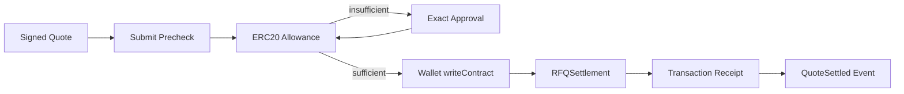
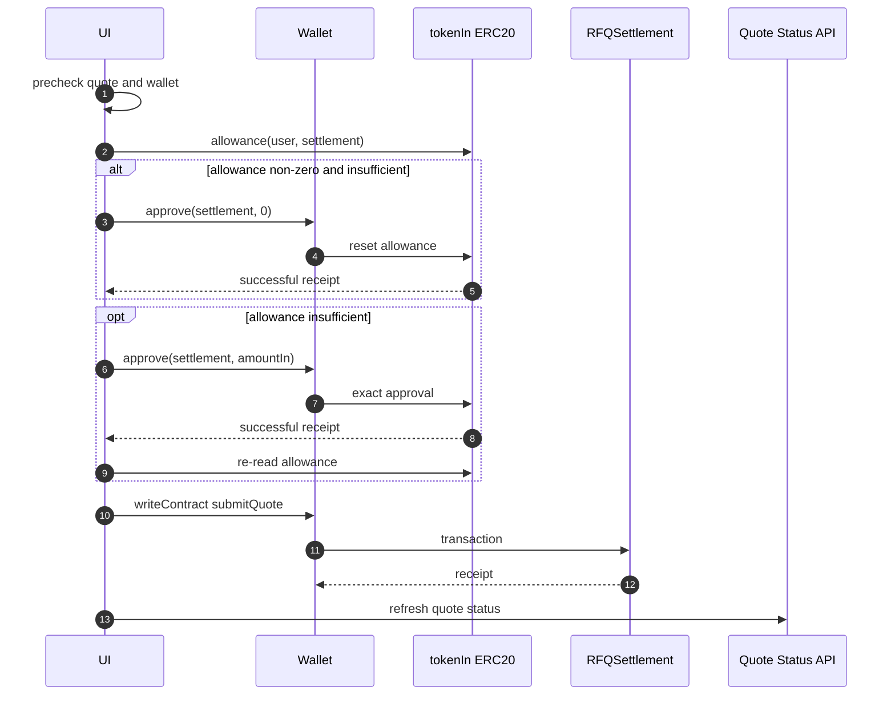
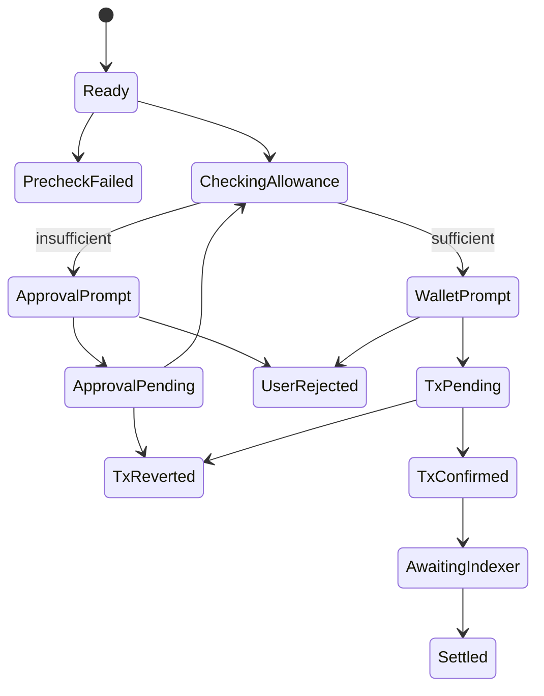

# Chapter 03: Submit Flow

## Abstract

Submit Flow 将 signed quote 变成链上交易。用户可以通过钱包直接调用 `RFQSettlement.submitQuote`，也可以通过后端 relay 路径提交。无论哪种模式，链上 settlement event 才是成交的最终事实。

## Learning Objectives

- 理解 direct wallet submit 和 backend relay。
- 定义 submit 前校验。
- 处理交易 pending、confirmed、reverted。
- 说明 quote expired 与 tx reverted 的区别。

## Background

RFQ quote 包含 signature、deadline 和 nonce。前端提交前必须确认 wallet chainId 匹配、quote 未过期、用户地址与 quote.user 一致。

## Problem Statement

如果前端在 quote 过期或网络不匹配时仍允许提交，用户会浪费 gas 或遇到不清晰失败。Submit Flow 必须明确检查点。

## Requirements

### Functional Requirements

- 检查 wallet connected。
- 检查 chainId。
- 检查 quote deadline。
- 构造 `submitQuote(quote, signature)`。
- 追踪 txHash、pending、confirmed、reverted。
- 成功后更新 quote status。

### Non-Functional Requirements

- 交易状态必须可恢复。
- UI 不把 tx submitted 当成 settled。
- 错误消息要区分钱包拒绝、RPC 错误和合约 revert。

## Existing Solutions

普通 swap UI 通常走 wallet writeContract。RFQ submit 类似，但需要传入完整 Quote struct 和 signature。

## Trade-Off Analysis

Direct wallet submit 满足 `msg.sender == quote.user` 并保持自托管。前端先确认 `tokenIn.allowance(user, settlement) >= amountIn`，不足时完成精确额度授权，再使用 Wagmi 广播 `RFQSettlement.submitQuote`。拿到 txHash 后自动调用 `/submit`；后端独立确认 receipt 与 `QuoteSettled` 后才触发 inventory、hedge 和 PnL。`Submit API` 仅用于显式开启 synthetic settlement 的本地参考环境。

## System Design

## Architecture Diagram

Submit Flow 使用 Viem/Wagmi 编码交易，钱包负责签名和广播。前端不手写 ABI tuple，而是复用 SDK 的 `rfqSettlementAbi` 和 `buildSubmitQuoteArgs`，保证浏览器、SDK 测试和合约 ABI 的参数结构一致。钱包提交失败时，UI 只读取 bounded own string 字段，并优先展示 viem/wagmi `shortMessage`、`details` 或嵌套 `cause` 中的 custom-error 文本，避免把冗长或原型链污染的错误对象直接渲染给用户。

## Sequence Diagram

## State Machine

## Data Model

Submit state includes `quote`, `signature`, `txHash`, `settlementEventId`, `hedgeOrderId`, `pnlId`, `walletChainId`, `status`, `error`, `receipt`。

## API Design

Wallet broadcast 后调用 `POST /submit` 并携带 `quote`、`signature` 和 `txHash`。HTTP 202 只在后端确认链上证据并消费 settlement event 后返回；refresh 和 polling 仍以 `GET /quote/:id` 为 durable source。`GET /settlements/:id` 展示链上事件，`GET /hedges/:id` 展示 hedge lifecycle，`GET /pnl` 展示 PnL summary。

## Engineering Decisions

- Direct wallet submit and API relay submit share the same signed quote payload.
- Direct wallet submit uses `VITE_RFQ_SETTLEMENT_ADDRESS` as the write target.
- Direct wallet submit reads allowance with `buildErc20AllowanceReadRequest()` and only enables settlement after the returned bigint covers `amountIn`.
- Approval uses `buildErc20ApprovalWriteRequest()` with the exact quoted amount. A non-zero insufficient allowance is reset to zero and confirmed first; every approval receipt must report success and the final allowance is re-read before submit becomes available.
- `writeContractAsync()` 返回 txHash 后，页面立即把该 hash 交给 SDK `/submit`；确认过程中保留 txHash 展示，并把 RPC、revert 或 event mismatch 错误与 wallet broadcast 错误分开呈现。
- Submit disabled after deadline.
- Direct wallet submit is also disabled unless the connected wallet address matches an own-field `quote.user` and the active wallet chain id matches an own-field `quote.chainId`; the click handler repeats those guards before calling `writeContractAsync`.
- Allowance reads, reset approvals, exact approvals and `submitQuote` writes all carry the signed quote `chainId`; a wallet network switch therefore produces a provider rejection instead of authorizing or submitting against the same address on another chain.
- The wallet submit click handler also repeats the active quote TTL guard. If `canSubmit` is false, it emits `Quote expired; request a new quote` and returns before `prepareWalletSubmit()` or `writeContractAsync()`.
- `prepareWalletSubmit()` rejects inherited or unknown signed quote fields and inherited quote response signature fields before copying `signature` into the SDK write request, so UI readiness and calldata construction share the same closed own-field boundary.
- Refresh hydrates settlement, hedge and PnL panels from `QuoteStatus` pointers first, with the `/submit` response only as immediate fallback.
- tx confirmed is not equal to indexed settled until status refresh confirms.
- A wallet transaction hash or accepted `/submit` response starts automatic lifecycle polling immediately. Each iteration reads `GET /quote/:id`, resolves settlement, hedge and PnL pointers from the authoritative quote status with the accepted submit response only as a temporary fallback, then fetches the referenced post-trade resources concurrently. Returned quote, settlement and hedge identifiers must match the requested resource before the UI applies them. Post-trade fetches use partial-success semantics: a temporarily missing hedge cannot hide a newer quote or settlement status, and an unavailable resource does not erase a previously validated surface while polling retries it.
- Polling uses bounded exponential delay from 1 to 8 seconds for both healthy pending states and transient failures. It continues through `signed` / `submitted`, queued hedge execution and pending fee reconciliation, and stops on rejected / expired / failed quote or after settled state plus every currently referenced settlement, PnL, hedge and fee surface has converged. Changing the quote request aborts the polling controller and the quote-session version guard rejects any already-resolving callback.
- Manual refresh and both submit paths capture the active quote-session version before awaiting network work. A user edit or wallet change therefore cannot be overwritten by an older submit response, status response or post-trade fetch. Polling failure remains retryable and does not erase the last valid status.

## Failure Scenarios

- Wallet disconnected：prompt connect。
- Wrong network：prompt switch chain。
- User rejected：show non-fatal state。
- Contract revert：show reverted and allow re-quote。
- Allowance RPC unavailable：fail closed and expose a bounded retry action。
- Token approval rejected or reverted：stop before settlement and preserve the signed quote only while its TTL remains valid。
- Indexer lag：show pending settlement confirmation。

## Security Considerations

Front-end prechecks are not security controls. Contract validation remains authoritative. Exact approval limits standing token exposure; the UI never silently upgrades a quote-scoped approval to `uint256.max`.

## Performance Considerations

Polling quote status should backoff. Do not spam `/quote/:id` during chain congestion.

## Testing Strategy

测试 wallet disconnected、wallet user mismatch、wrong chain、expired quote、user rejected、tx pending、tx reverted、settled、stale submit / refresh isolation、fallback pointer convergence、queued hedge、pending fee reconciliation、identity mismatch、poll abort 和 bounded exponential backoff。

## Interview Notes

Submit Flow 的关键是区分 wallet submission、chain confirmation 和 backend indexing。

## Summary

Submit Flow 是 RFQ 用户体验中最容易混淆的部分。前端必须清晰表达每个状态。

## References

- Wagmi writeContract
- Viem transaction receipts
- RFQSettlement submitQuote
