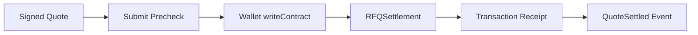
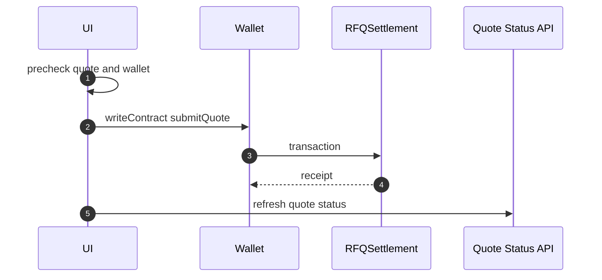
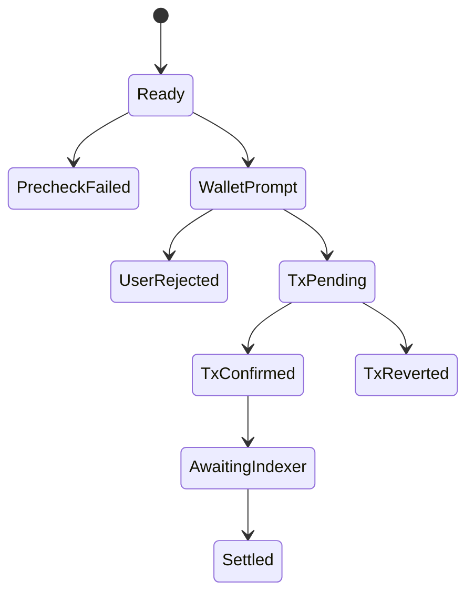

# Chapter 03: Submit Flow

## Abstract

Submit Flow 将 signed quote 变成链上交易。用户可以通过钱包直接调用 `RFQSettlement.submitQuote`，也可以通过后端 relay 路径提交。无论哪种模式，链上 settlement event 才是成交的最终事实。

## Learning Objectives

- 理解 direct wallet submit 和 backend relay。
- 定义 submit 前校验。
- 处理交易 pending、confirmed、reverted。
- 说明 quote expired 与 tx reverted 的区别。

## Background

RFQ quote 包含 signature、deadline 和 nonce。前端提交前必须确认 wallet chainId 匹配、quote 未过期、用户地址与 quote.user 一致。

## Problem Statement

如果前端在 quote 过期或网络不匹配时仍允许提交，用户会浪费 gas 或遇到不清晰失败。Submit Flow 必须明确检查点。

## Requirements

### Functional Requirements

- 检查 wallet connected。
- 检查 chainId。
- 检查 quote deadline。
- 构造 `submitQuote(quote, signature)`。
- 追踪 txHash、pending、confirmed、reverted。
- 成功后更新 quote status。

### Non-Functional Requirements

- 交易状态必须可恢复。
- UI 不把 tx submitted 当成 settled。
- 错误消息要区分钱包拒绝、RPC 错误和合约 revert。

## Existing Solutions

普通 swap UI 通常走 wallet writeContract。RFQ submit 类似，但需要传入完整 Quote struct 和 signature。

## Trade-Off Analysis

Direct wallet submit 简单可信，relay submit UX 更好但复杂。第一版以前者为主，后续支持 relay。

## System Design

## Architecture Diagram

Submit Flow 使用 Viem/Wagmi 编码交易，钱包负责签名和广播。

## Sequence Diagram

## State Machine

## Data Model

Submit state includes `quote`, `signature`, `txHash`, `hedgeOrderId`, `pnlId`, `walletChainId`, `status`, `error`, `receipt`。

## API Design

Direct submit does not require backend `/submit`; relay mode uses `POST /submit`。Both modes should converge on `GET /quote/:id` for quote status. When relay mode returns `hedgeOrderId` and `pnlId`, the UI and SDK can call `GET /hedges/:id` to show the queued hedge intent and `GET /pnl` to show realized PnL summary.

## Engineering Decisions

- Direct wallet submit is default.
- Submit disabled after deadline.
- tx confirmed is not equal to indexed settled until status refresh confirms.

## Failure Scenarios

- Wallet disconnected：prompt connect。
- Wrong network：prompt switch chain。
- User rejected：show non-fatal state。
- Contract revert：show reverted and allow re-quote。
- Indexer lag：show pending settlement confirmation。

## Security Considerations

Front-end prechecks are not security controls. Contract validation remains authoritative.

## Performance Considerations

Polling quote status should backoff. Do not spam `/quote/:id` during chain congestion.

## Testing Strategy

测试 wallet disconnected、wrong chain、expired quote、user rejected、tx pending、tx reverted、settled。

## Interview Notes

Submit Flow 的关键是区分 wallet submission、chain confirmation 和 backend indexing。

## Summary

Submit Flow 是 RFQ 用户体验中最容易混淆的部分。前端必须清晰表达每个状态。

## References

- Wagmi writeContract
- Viem transaction receipts
- RFQSettlement submitQuote
