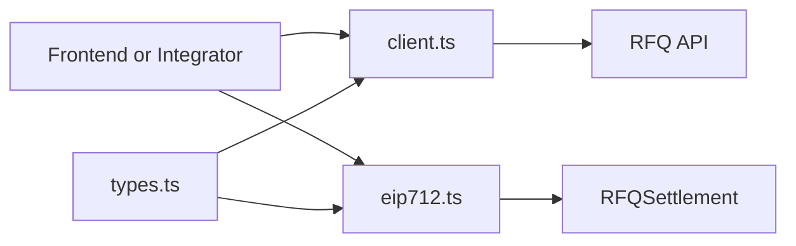
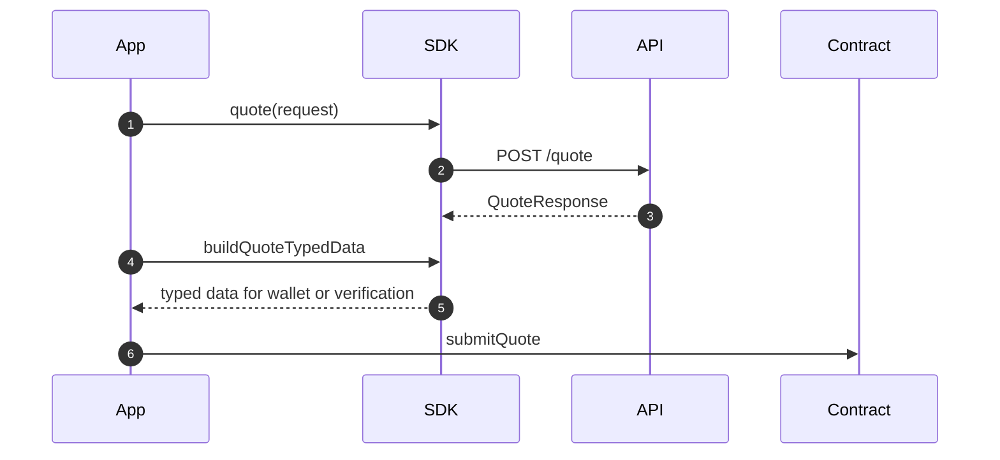
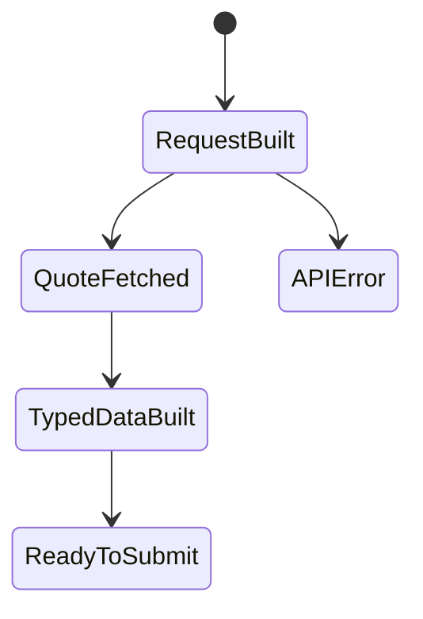

# Chapter 04: SDK

## Abstract

TypeScript SDK 是集成方使用 RFQ 系统的稳定接口。它封装 API client、类型定义、EIP-712 typed data helper 和 submit helper。SDK 的目标是减少字段不一致、签名结构错误和 amount 精度问题。

## Learning Objectives

- 定义 SDK 的模块边界。
- 说明 SDK 与 OpenAPI、合约和后端类型的关系。
- 设计 EIP-712 helper。
- 明确 SDK 不应隐藏的错误。

## Background

集成方如果直接拼 HTTP 和 EIP-712 typed data，很容易在字段顺序、chainId、amount 字符串和 verifyingContract 上出错。SDK 提供统一实现。

## Problem Statement

RFQ quote 的字段必须在后端、SDK、前端和合约之间一致。没有 SDK 时，每个集成方都会重复实现高风险逻辑。

## Requirements

### Functional Requirements

- 导出 `QuoteRequest`、`Quote`、`QuoteResponse` 类型。
- 提供 `RFQClient.quote()`。
- 提供 `buildRFQDomain()`。
- 提供 `buildQuoteTypedData()`。
- 提供 `buildSubmitQuoteArgs()` 和 `buildSubmitQuoteWriteRequest()`。

### Non-Functional Requirements

- amount 字段使用 string。
- 类型与 OpenAPI 保持一致。
- EIP-712 types 与合约字段一致。
- SDK 不吞掉 API error code。

## Existing Solutions

很多项目只提供 REST API，集成方自行实现 typed data。生产 RFQ 应提供 SDK 降低集成错误。

## Trade-Off Analysis

SDK 增加维护成本，但能显著提升集成可靠性。字段变更必须同步发布 SDK 版本。

## System Design



## Architecture Diagram

SDK 是跨 frontend 和 external integrator 的共享包。它不包含私钥签名能力，只构造 typed data 和 API 请求。

## Sequence Diagram



## State Machine



## Data Model

SDK types include `Address = 0x${string}` and `UIntString = string`。Quote mirrors Solidity struct fields.

## API Design

Public SDK interface:

```ts
const client = new RFQClient(baseUrl);
const clientWithCustomFetch = new RFQClient(baseUrl, { fetch: customFetch });
const quote = await client.quote(request);
const typedData = buildQuoteTypedData(quoteLikeStruct, verifyingContract);
const submitArgs = buildSubmitQuoteArgs(quoteLikeStruct, signature);
const submitRequest = buildSubmitQuoteWriteRequest({
  settlementAddress,
  quote: quoteLikeStruct,
  signature,
});
const treasuryArgs = buildTreasuryTransferArgs({ token, to, amount });
```

## Engineering Decisions

- SDK uses string amounts.
- SDK owns EIP-712 helper.
- SDK exports `rfqSettlementAbi`, `treasuryAbi`, `buildSubmitQuoteArgs`, `buildSubmitQuoteWriteRequest`, `hashSettlementQuote` and `buildTreasuryTransferArgs` so viem/wagmi consumers use the same contract tuple shape, write request shape, quote-hash reconciliation rule, public state getters, role constant getters and custom-error revert decoding surface as the repository tests.
- `buildSubmitQuoteWriteRequest()` returns `{ address, abi, functionName: "submitQuote", args }` after validating the settlement contract address, quote fields and signature, which keeps frontend and external integrators from manually duplicating contract-call wiring. The write request input, treasury transfer input and quote payloads must provide closed required own fields before SDK helpers build calldata, typed data or quote hashes.
- `buildSubmitQuoteArgs()` rejects non-canonical high-s ECDSA signatures and invalid `v` values before returning contract call arguments, matching backend and `RFQSettlement` signature rules.
- SDK helper functions reject non-object, inherited-field and unknown-field quote / write-request / treasury-transfer inputs before field-level validation, so JavaScript consumers get stable validation errors instead of ambiguous property access exceptions.
- SDK status helpers reject unsafe `quoteId`, `hedgeOrderId` and `settlementEventId` values before issuing HTTP requests: identifiers must be non-empty, 128 characters or fewer, and limited to letters, numbers, underscore, colon and hyphen. This prevents malformed `/quote/`, `/hedges/` or `/settlements/` calls from being mistaken for backend availability problems.
- SDK successful response validators require closed own response fields before type validation, and apply the same safe identifier rule to public status pointers such as `quoteId`, `snapshotId`, `settlementEventId`, `hedgeOrderId` and `pnlId`, so malformed gateway, custom fetch or proxy payloads cannot be accepted as usable resource links.
- `RFQClient` rejects non-string, empty, relative or non-`http(s)` base URLs at construction time, and also rejects credentials, wildcard hosts, query strings and fragments while preserving safe path prefixes such as `/rfq`. Integration configuration errors fail before any quote, submit or status request leaves the process. JavaScript callers must receive stable `RFQClientError` failures instead of native `.trim()` exceptions.
- `RFQClient` can receive an injected `fetch` implementation and validates that dependency at construction time, so server-side runtimes, tests and constrained execution environments do not rely on an implicit global transport. Client options are closed to own optional `fetch` / `traceId` fields; unknown or prototype-backed options fail before transport or trace dependencies are captured.
- `RFQClient` can receive a static or dynamic `traceId` option and sends it as `x-trace-id` on every request after validating the runtime value is a primitive string in the same `tr_`-prefixed, 128-character bounded format accepted by the backend gateway. Inherited `traceId` options fail before dependency capture. Boxed `String` trace ids fail before header construction.
- `RFQClient.getQuote()`, `getHedge()` and `getSettlement()` reject dynamic path identifiers unless the runtime value is a primitive string, non-empty, 128 characters or fewer, and limited to letters, numbers, underscore, colon or hyphen; boxed `String` identifiers fail before `encodeURIComponent()` or fetch.
- `RFQClientError` preserves request correlation even when an upstream response is non-standard: structured RFQ errors must be closed own-field `ErrorResponse` objects containing only `code`, `message` and `traceId`, then keep safe `ErrorResponse.traceId` values. The client falls back to safe `x-trace-id` response headers for unknown error bodies, non-closed error bodies, prototype-backed error bodies, malformed JSON or malformed successful response fields. Unsafe response trace ids that do not match `tr_[A-Za-z0-9._:-]+` or exceed 128 characters are ignored instead of being exposed to SDK callers.
- `RFQClientError.retryAfterSeconds` is populated only from canonical positive decimal `Retry-After` delay-seconds values that fit in a JavaScript safe integer; zero, leading-zero, decimal, exponent, HTTP-date and oversized values are ignored.
- `RFQClient.quote()` validates outgoing quote requests locally, including closed request fields, chain id, addresses, distinct token pair, canonical positive amount string without leading zeros and slippage bounds, before sending HTTP.
- `RFQClient.quote()` validates successful quote payloads field by field, including safe `quoteId`/`snapshotId`, canonical positive uint `amountOut`/`minAmountOut`/`nonce` strings without leading zeros, `amountOut >= minAmountOut`, positive `deadline`, and canonical low-s EIP-712 signature.
- SDK successful response validators require integer fields such as `deadline`, `chainId`, `blockNumber`, `logIndex`, `totalTrades` and `grossPnlBps` to be JSON number primitives in the JavaScript safe integer range. Stringified numbers and wrapper objects are rejected instead of being coerced with `Number(...)`.
- `RFQClient.submit()` validates outgoing submit payloads locally with closed top-level own `quote` / `signature` fields and the same settlement helper used for contract calls, so unknown submit fields, inherited or missing required fields, malformed quote fields or non-canonical signatures fail before an HTTP request is sent.
- SDK EIP-712 and settlement helpers reject non-string address, signature and uint-like values before regex validation. JavaScript callers cannot pass numbers or `String` wrapper objects and rely on implicit `RegExp.test()` coercion before signing or building contract calldata.
- `RFQClient.submit()` validates successful submit payloads field by field, including `accepted` status, optional 32-byte `txHash`, and safe settlement/hedge/PnL pointers when present.
- `RFQClient.getQuote()` validates successful quote status payloads field by field, including required `quoteId`/`status`, optional safe `snapshotId`, positive `deadline`, 32-byte `txHash`, safe settlement/hedge/PnL pointers, non-empty error pointers, and lifecycle payload consistency between status and settlement pointers.
- `RFQClient.getSettlement()` validates successful settlement payloads field by field, including event/quote identifiers, positive chain id, 32-byte transaction and quote hashes, non-negative block/log ordinals, user/token addresses, distinct token pair, positive amount strings, and canonical UTC ISO `observedAt` timestamp generated with `Date.prototype.toISOString()`.
- `RFQClient.getHedge()` validates successful hedge payloads field by field, including safe identifiers, positive chain id, token address, side/reason enums, positive uint amount/optional filledAmount strings, stable optional failureCode, and canonical UTC ISO timestamps generated with `Date.prototype.toISOString()`.
- `RFQClient.pnl()` validates successful PnL payloads field by field, including settlement/snapshot safe identifiers、token addresses、positive uint amount strings、canonical signed gross PnL strings without leading zeros or negative zero、token decimals、quote-time mid price and canonical UTC timestamps. It independently recomputes `fairAmountOut`、`grossPnlTokenOut` and `grossPnlBps`, requires the exact `quote_snapshot_edge_v1` model boundary, enforces `totalTrades === trades.length`, and verifies every `(chainId, tokenOut)` total against the corresponding trade records instead of summing unrelated assets.
- `RFQClient.health()` and `RFQClient.ready()` require closed own top-level response fields matching OpenAPI. `ready()` also validates readiness payloads against the fixed backend component set: marketData, marketSnapshotStore, routing, pricing, risk, signer, quoteRepository, riskDecisionStore, inventory, execution, settlementEventStore, pnl and metrics. Missing or unknown readiness components are rejected instead of being treated as valid routability state.
- SDK exposes API errors instead of flattening everything to generic Error in production.

## Failure Scenarios

- API returns risk rejected：throw typed RFQ error。
- Invalid address：client-side validation error。
- Network failure：transport error。
- EIP-712 domain mismatch：consumer must provide correct verifyingContract。

## Security Considerations

SDK should not sign with private keys. Wallet or backend Signer is responsible for signing depending on flow.

## Performance Considerations

SDK should stay lightweight. It should not bundle frontend-only wallet libraries unless submit helper needs optional adapters.

## Testing Strategy

测试 client quote request、API error parsing、typed data structure、domain builder、settlement tuple conversion、submit write request builder、Treasury tuple conversion、quote/submit/quote status/settlement/hedge/PnL response validation 和 amount string handling。

## Interview Notes

SDK 的价值是统一协议边界，尤其是 EIP-712 和 amount 精度。

## Summary

SDK 将 RFQ 系统变成可集成产品，而不是只服务自家前端。它必须严格对齐 OpenAPI 和合约。

## References

- TypeScript SDK design
- EIP-712 typed data
- Viem
