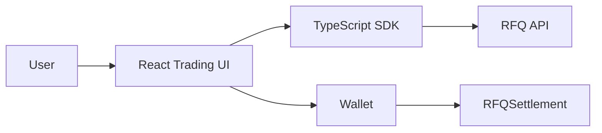

# Volume 6: Frontend And SDK

本卷定义 RFQ / Prop AMM 系统的前端和 TypeScript SDK。前端负责让用户请求 quote、理解 quote 风险、连接钱包并提交交易；SDK 负责为集成方提供稳定 typed API、EIP-712 helper 和 RFQ client。

## Chapters

1. [Chapter 01: Frontend Architecture](Chapter01-Frontend-Architecture.md)
2. [Chapter 02: Quote UI](Chapter02-Quote-UI.md)
3. [Chapter 03: Submit Flow](Chapter03-Submit-Flow.md)
4. [Chapter 04: SDK](Chapter04-SDK.md)

## Core Principle

Frontend 和 SDK 不能重新定义 quote 语义。Quote fields、EIP-712 typed data、amount base units、deadline、nonce 和 signature 必须与 backend 和 contract 保持一致。

