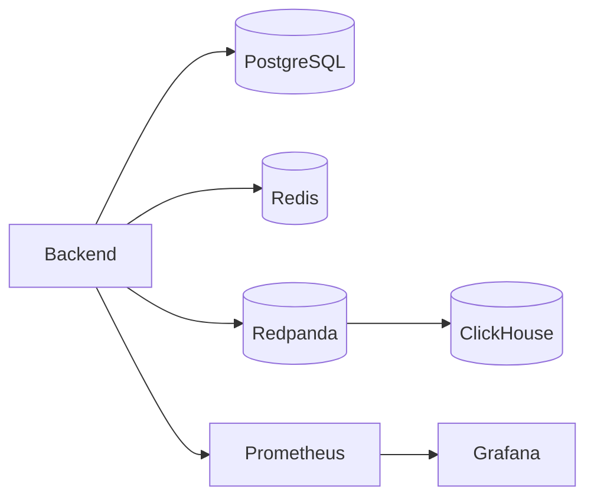
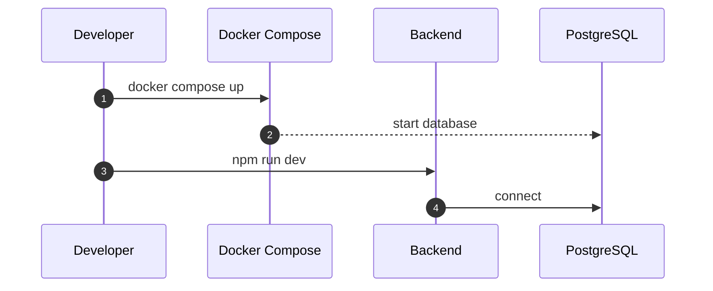
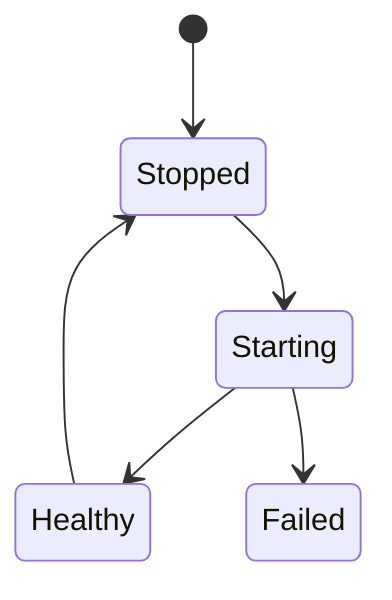

# Chapter 01: Docker

## Abstract

Docker Compose 是本项目的本地开发和集成测试基础。它提供 PostgreSQL、Redis、Redpanda、ClickHouse、Prometheus 和 Grafana 等依赖，使开发者可以在本地复现 RFQ 系统的核心运行环境。

## Learning Objectives

- 理解本地依赖如何映射到生产组件。
- 定义 Docker Compose 的服务边界。
- 说明哪些服务属于状态依赖，哪些属于应用服务。
- 为后续集成测试提供环境基础。

## Background

RFQ 系统依赖多个基础设施组件。如果开发者只能连接远程环境，测试和调试成本会很高。本地 Docker Compose 提供可重复环境。

## Problem Statement

需要让开发者在不安装大量本机服务的情况下启动核心依赖，并保持配置接近生产。

## Requirements

### Functional Requirements

- 启动 PostgreSQL。
- 启动 Redis。
- 启动 Redpanda。
- 启动 ClickHouse。
- 启动 Prometheus 和 Grafana。
- 支持后续接入 backend/frontend 服务。

### Non-Functional Requirements

- 配置可读。
- 端口明确。
- 数据卷持久化。
- 本地默认密码只用于开发。

## Existing Solutions

可以使用 Docker Compose、Dev Containers 或本机安装。当前阶段采用 Docker Compose，因为它简单直接，适合开源项目快速启动。

## Trade-Off Analysis

Docker Compose 不等同于生产部署，但能覆盖本地依赖。生产环境使用 Kubernetes 和 Helm。

## System Design

## Architecture Diagram

Docker Compose 提供依赖服务，不强制把每个应用服务都容器化。早期可以本机运行 backend/frontend，连接容器依赖。

## Sequence Diagram

## State Machine

## Data Model

Docker volumes store PostgreSQL, ClickHouse and Grafana data. These volumes are local development data, not production backups.

## API Design

No public API changes. Compose exposes service ports for local development.

## Engineering Decisions

- Redpanda is used as Kafka-compatible local event bus.
- Prometheus and Grafana included from the first deployment docs stage.
- Prometheus scrapes the host backend through `host.docker.internal:3000`; Compose maps that name to `host-gateway` so the same setup works on Docker Desktop and Linux Docker.
- Local secrets are not production secrets.

## Failure Scenarios

- Port conflict：change local ports or stop conflicting process.
- Volume corruption：recreate local volume.
- Service startup failure：inspect container logs.

## Security Considerations

Never reuse local compose credentials in production. Do not expose local services to public networks.

## Performance Considerations

Compose settings are lightweight for laptops, not production sizing.

## Testing Strategy

Smoke test: start compose, verify ports, connect backend health, scrape metrics.

## Interview Notes

Docker Compose 是开发环境，不是生产架构。面试中要区分 local reproducibility 和 production reliability。

## Summary

Docker Compose 为本项目提供可重复本地依赖环境，是后续集成测试和演示的基础。

## References

- Docker Compose
- Redpanda local development
- Prometheus and Grafana
