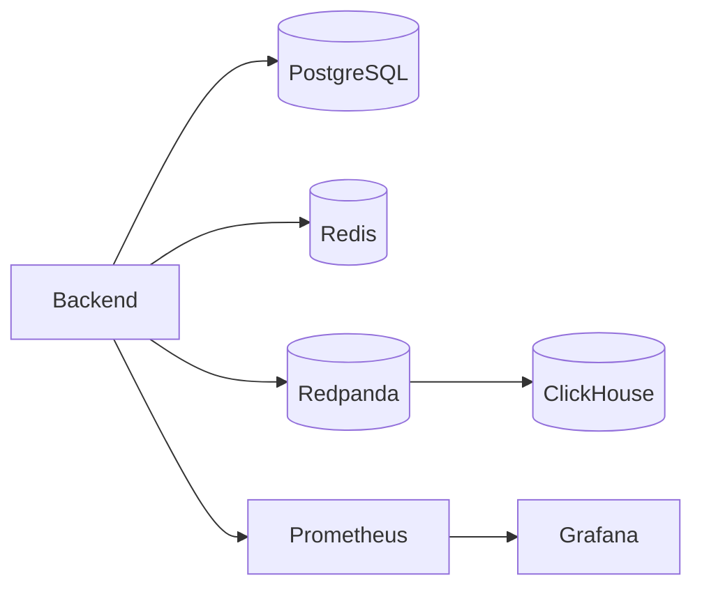
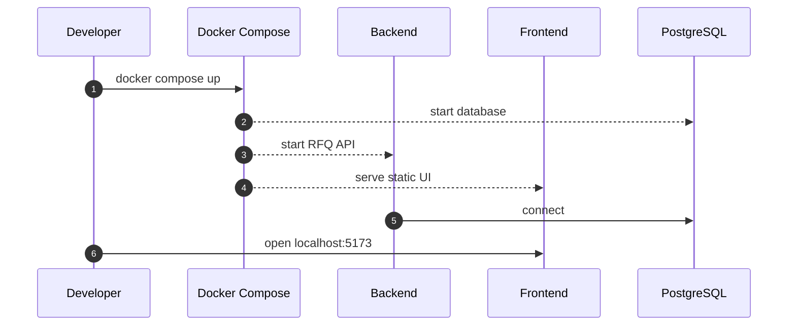
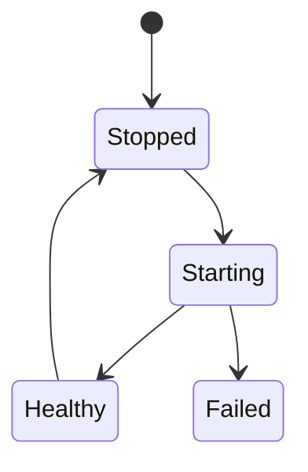

# Chapter 01: Docker

## Abstract

Docker Compose 是本项目的本地开发和集成测试基础。它提供 backend、frontend、PostgreSQL、Redis、Redpanda、ClickHouse、Prometheus 和 Grafana，使开发者可以在本地复现 RFQ 系统的核心运行环境。

## Learning Objectives

- 理解本地依赖如何映射到生产组件。
- 定义 Docker Compose 的服务边界。
- 说明哪些服务属于状态依赖，哪些属于应用服务。
- 为后续集成测试提供环境基础。

## Background

RFQ 系统依赖多个基础设施组件。如果开发者只能连接远程环境，测试和调试成本会很高。本地 Docker Compose 提供可重复环境。

## Problem Statement

需要让开发者在不安装大量本机服务的情况下启动核心依赖，并保持配置接近生产。

## Requirements

### Functional Requirements

- 启动 PostgreSQL。
- 在 PostgreSQL 首次初始化时加载 `docs/database/schema.sql`。
- 启动 Redis。
- 启动 Redpanda。
- 启动 ClickHouse。
- 启动 Prometheus 和 Grafana。
- 启动 backend API 服务。
- 启动 frontend 静态交易台。

### Non-Functional Requirements

- 配置可读。
- 端口明确。
- 数据卷持久化。
- 关键本地依赖暴露 health check。
- 本地默认密码只用于开发。

## Existing Solutions

可以使用 Docker Compose、Dev Containers 或本机安装。当前阶段采用 Docker Compose，因为它简单直接，适合开源项目快速启动。

## Trade-Off Analysis

Docker Compose 不等同于生产部署，但能覆盖本地依赖。生产环境使用 Kubernetes 和 Helm。

## System Design

## Architecture Diagram

Docker Compose 同时提供依赖服务和应用服务。`backend` 使用 `infra/docker/backend.Dockerfile` 构建 TypeScript 服务并暴露 `3000`，`frontend` 使用 `infra/docker/frontend.Dockerfile` 构建 Vite 静态资源并通过 Nginx 暴露到宿主机 `5173`。开发者仍可选择本机运行 backend/frontend，但 compose 默认路径应能直接启动参考实现。

## Sequence Diagram

## State Machine

## Data Model

Docker volumes store PostgreSQL, ClickHouse and Grafana data. These volumes are local development data, not production backups. Compose mounts `docs/database/schema.sql` into `/docker-entrypoint-initdb.d/001-schema.sql`, so a fresh `postgres-data` volume starts with the documented RFQ operational schema and seeded migration history. A one-shot `database-migrate` service serializes pending migrations before backend startup; existing databases apply through `022-portfolio-var-reservations.sql` before any API or post-trade worker checks readiness. For a populated environment, stop quote admission and wait one maximum quote TTL before migration 017; pre-017 rows receive isolated legacy principals and remain inaccessible to institutional API keys.

The analytics profile uses separate Redpanda internal (`redpanda:9092`) and host (`localhost:19092`) advertised listeners, then an idempotent `redpanda-topic-init` service creates `rfq.analytics.v1` with six local partitions. `analytics-worker` publishes PostgreSQL outbox rows and projects consumed batches into the local ClickHouse `rfq_analytics_events` table. This one-node broker and empty ClickHouse password are development defaults only.

## API Design

No public API changes. Compose exposes backend API on `localhost:3000`, frontend console on `localhost:5173`, Prometheus on `localhost:9090`, Grafana on `localhost:3001`, analytics metrics on `localhost:3002`, reconciliation metrics on `localhost:3003`, settlement-indexer metrics on `localhost:3004`, and toxic-flow analyzer metrics on `localhost:3005` when their profiles are enabled.

## Engineering Decisions

- Redpanda is used as Kafka-compatible local event bus.
- PostgreSQL uses `pg_isready` for the compose health check and loads the repository schema on first volume initialization.
- Redis uses `redis-cli ping` and ClickHouse uses `clickhouse-client --query 'SELECT 1'` for local dependency health checks.
- Prometheus and Grafana included from the first deployment docs stage.
- Prometheus scrapes the compose `backend:3000` service directly.
- Compose forwards the bounded `RFQ_CEX_*` freshness, quorum, spread and deviation controls into the backend. The local container runs with `NODE_ENV=development` and defaults to one source; production manifests require two distinct sources per configured pair.
- The credential-isolated `hedge-worker` service is behind the explicit `hedge` Compose profile. It exposes health/readiness/metrics on container port 3001, claims PostgreSQL jobs with leases, and should use Binance Spot Testnet credentials for local integration.
- The `reconciliation-worker` service is behind the explicit `reconciliation` profile. It exposes health/readiness/metrics on port 3003, claims quote-scoped desired revisions with expiring leases, and repairs post-settlement quote, hedge, and PnL projections without signer, RPC, or venue credentials.
- The `settlement-indexer` service is behind the explicit `indexer` profile. It exposes health/readiness/metrics on port 3004 and reads a local Anvil RPC by default. Its durable PostgreSQL cursor discovers wallet settlements even when `/submit` is not called; production RPC credentials remain outside Compose defaults.
- The `toxic-flow-analyzer` service is behind the explicit `toxic-flow` profile. It exposes health/readiness/metrics on port 3005, leases settlement-driven markout revisions after the configured horizon, uses the first bounded same-direction PostgreSQL market snapshot, and CAS-publishes auditable user scores without signer, RPC, CEX, Kafka or ClickHouse credentials.
- Frontend image builds static Vite assets and serves them with Nginx; `VITE_RFQ_API_BASE_URL` is injected as a Docker build arg and defaults to `http://localhost:3000`.
- Backend and frontend images define Docker health checks. Compose waits for the backend health check before starting frontend and Prometheus.
- Docker builds copy `pnpm-lock.yaml` and use `pnpm install --frozen-lockfile` so image dependency resolution is reproducible.
- `.dockerignore` excludes local caches, build output, `node_modules` and VCS metadata from the build context.
- Local secrets are not production secrets.

## Failure Scenarios

- Port conflict：change local ports or stop conflicting process.
- Redis or ClickHouse health check fails：inspect container logs before treating cache or analytics-dependent behavior as valid.
- Backend health check fails：inspect `/health`, signer configuration and container logs before relying on frontend or Prometheus.
- Docker build dependency drift：regenerate and commit `pnpm-lock.yaml` before rebuilding images.
- PostgreSQL schema changes not reflected locally：drop the `postgres-data` volume or run a migration manually; Docker entrypoint init scripts only run when the data directory is empty.
- Volume corruption：recreate local volume.
- Service startup failure：inspect container logs.

## Security Considerations

Never reuse local compose credentials in production. Do not expose local services to public networks.

## Performance Considerations

Compose settings are lightweight for laptops, not production sizing.

## Testing Strategy

Smoke test: start compose, verify backend health on `localhost:3000`, open frontend on `localhost:5173`, and confirm Prometheus can scrape `rfq-backend`. The local API smoke path also recovers the `/quote` EIP-712 signer from the returned signature before submit, using the configured signer key and settlement address, so it proves the quote artifact is cryptographically bound to the expected trusted signer rather than only matching response shape.

## Interview Notes

Docker Compose 是开发环境，不是生产架构。面试中要区分 local reproducibility 和 production reliability。

## Summary

Docker Compose 为本项目提供可重复本地依赖环境，是后续集成测试和演示的基础。

## References

- Docker Compose
- Redpanda local development
- Prometheus and Grafana
