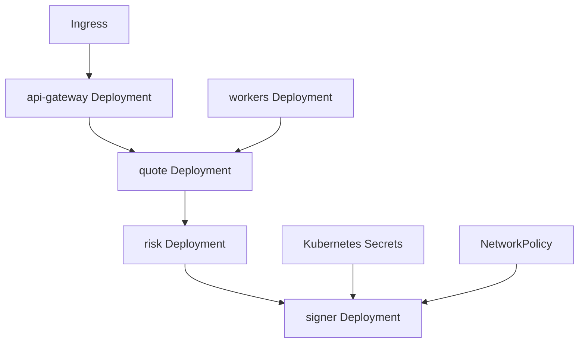
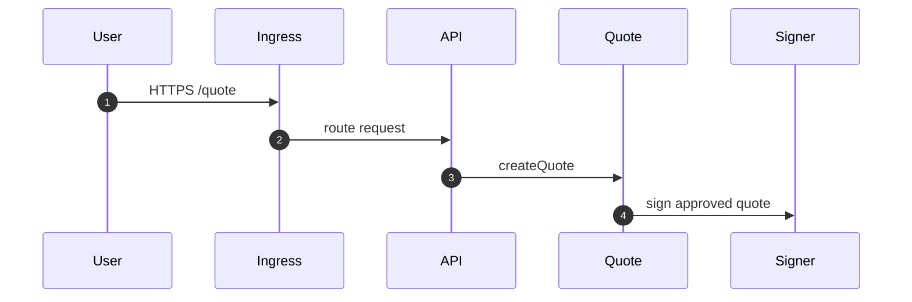
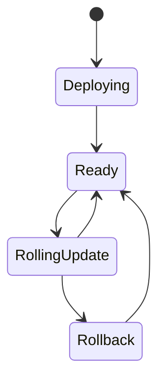

# Chapter 02: Kubernetes

## Abstract

Kubernetes 是本项目的生产运行目标之一。RFQ 系统包含 API、Quote、Pricing、Risk、Signer、Execution、Inventory、Hedge 和 Metrics 等服务，Kubernetes 可以提供部署、扩缩容、配置、健康检查和滚动更新。

## Learning Objectives

- 理解 RFQ 服务如何映射为 Kubernetes workloads。
- 区分 stateless services 和 stateful dependencies。
- 定义 readiness、liveness 和 resource limits。
- 说明 signer 的隔离部署要求。

## Background

生产 RFQ 系统需要隔离安全边界。Signer Service 不应与公开 API 混在同一个容器或权限域中。Kubernetes 的 namespace、service account、network policy 和 secret 管理可以表达这些边界。

## Problem Statement

需要把服务拆分和部署边界对齐，避免所有组件用同一权限运行。

## Requirements

### Functional Requirements

- 部署 API Gateway。
- 部署 Quote/Pricing/Risk/Signer 服务。
- 部署 Execution/Inventory/Hedge 服务。
- 配置 service discovery。
- 配置 readiness/liveness probes。

### Non-Functional Requirements

- Signer 必须网络隔离。
- Secret 不写入镜像。
- Resource request/limit 明确。
- 支持滚动发布和回滚。

## Existing Solutions

可以使用 Kubernetes、Docker Compose 生产化或 PaaS。生产级多服务系统更适合 Kubernetes + Helm。

## Trade-Off Analysis

Kubernetes 运维复杂，但能表达服务隔离和弹性。对于生产级参考架构，该复杂度合理。

## System Design

## Architecture Diagram

Signer Service should run in a restricted namespace or with strict NetworkPolicy. Public ingress only reaches API Gateway.

## Sequence Diagram

## State Machine

## Data Model

Kubernetes production design includes Deployment, Service, ConfigMap, Secret, ServiceAccount, NetworkPolicy, Ingress, HorizontalPodAutoscaler and PodDisruptionBudget. The API HPA and seven workload-specific disruption budgets are explicit resources in both raw manifests and Helm output. The chart declares Kubernetes `>=1.31` so `minDomains` and unhealthy-Pod eviction policy use their stable API behavior.

The current runnable backend manifests use:

- Raw Deployment files pin the backend image with a fail-closed all-zero SHA-256 placeholder. Release automation publishes the real digest in `release-manifest.json`; operators must replace the placeholder before apply. Production must never change these references back to `:latest`.
- `rfq-backend-config` ConfigMap for non-secret runtime settings such as `HOST=0.0.0.0`, `PORT=3000` and `NODE_ENV=production`.
- `rfq-backend-secrets` Secret for `DATABASE_URL`、`RFQ_AWS_KMS_KEY_ID`、`RFQ_TRUSTED_SIGNER_ADDRESS`、`RFQ_SETTLEMENT_ADDRESS`、`RFQ_REDIS_URL` and `RFQ_API_KEY_CONFIG_JSON`. During a bounded signer rotation only, it may also contain `RFQ_TRUSTED_SIGNER_OVERLAP_ADDRESSES`; the Helm reference remains disabled by default and must be removed after old-key retirement. The Secret must not contain `RFQ_SIGNER_PRIVATE_KEY` or plaintext institutional API secrets; the API-key JSON contains SHA-256 digests only.
- Backend pods run as `rfq-backend-kms`. On EKS its ServiceAccount annotation binds an IAM role with `kms:Sign` only on the configured asymmetric `ECC_SECG_P256K1` key; other platforms must provide an equivalent workload identity. Static AWS access keys are not mounted.
- API and five workers run with UID/GID 1000; rootless Nginx runs with its fixed UID/GID 101. All seven Deployments use `runAsNonRoot=true`, `RuntimeDefault` seccomp, a read-only root filesystem, no privilege escalation, no Linux capabilities, bounded 16Mi `/tmp`, and `automountServiceAccountToken=false`. EKS injects a separate audience-scoped IRSA token into the API Pod through its dedicated annotated ServiceAccount for KMS access.
- The API uses an `autoscaling/v2` HPA with 2 minimum replicas, 10 maximum replicas and a 70-percent CPU utilization target. Scale-up may double capacity or add four Pods per minute; scale-down waits through a 300-second stabilization window and removes at most 25 percent per minute. The cluster must provide `metrics.k8s.io`, and the API CPU request must remain realistic because utilization is calculated against that request.
- API, frontend, hedge, analytics, reconciliation, settlement-indexer and toxic-flow Deployments each have an independent `policy/v1` PDB with `maxUnavailable=1` and `unhealthyPodEvictionPolicy=AlwaysAllow`. Exact component selectors prevent one workload's disruption from consuming another workload's budget. PDBs protect only eviction-aware voluntary disruption; they do not prevent direct deletion or involuntary node and zone failures.
- The frontend is one internal-console deployment per institution. TLS Ingress accepts only reviewed private source CIDRs; its Service selects only frontend Pods. Runtime public configuration uses same-origin `/api`, while rootless Nginx injects a dedicated institutional key from `frontend.apiKeySecret` and proxies only quote, submit, status, and PnL routes. Unknown API paths, health, readiness, metrics, and admin routes are not forwarded. Frontend NetworkPolicy allows only ingress-controller traffic on 8080 and API egress on 3000; the backend policy admits the exact frontend selector.
- The frontend API-key Secret stores an Nginx `proxy_set_header` fragment and is mounted `0440` for UID/GID 101 through `fsGroup`. Provision it externally, do not commit real credentials, and roll the frontend Deployment after rotation. `runtime-config.js` contains only public values and is mounted from a ConfigMap with `Cache-Control: no-store`; its production settlement address defaults empty so wallet submission remains disabled until the exact deployed address is reviewed.
- Every Deployment also carries two exact `topologySpreadConstraints`: hostname and zone both use `maxSkew=1`, `minDomains=2` and `DoNotSchedule`. Each constraint selects only its own Deployment labels. The production cluster must expose `kubernetes.io/hostname` and `topology.kubernetes.io/zone` on at least two eligible nodes in two zones; otherwise the second replica remains Pending rather than sharing one failure domain. The Helm schema fixes these values so an environment override cannot silently weaken availability.
- Workers intentionally do not use CPU HPAs. Durable queue age/depth, dependency capacity and lease safety are their scaling signals; fixed replica counts remain explicit until reviewed custom metrics and per-worker scaling bounds exist.
- `rfq-hedge-worker-secrets` is a separate Secret containing only the worker database URL and Binance API key/secret. API pods do not mount venue credentials; worker pods do not mount signer or Redis credentials.
- `rfq-analytics-worker-secrets` contains the least-privilege outbox database URL, Kafka SASL credentials and ClickHouse credentials. API and hedge pods do not mount these values; analytics pods do not mount signer, Redis or Binance credentials.
- The hedge worker Deployment may run multiple replicas because due rows are claimed with `FOR UPDATE SKIP LOCKED`, expiring leases, and lease-owner CAS terminal updates. Its `/ready` probes PostgreSQL while `/health` only checks process liveness; the Service exposes `/metrics` for Prometheus.
- The Helm API Deployment, Service and NetworkPolicy all require `app.kubernetes.io/component=api`, so the API Service cannot select worker pods. Standard NetworkPolicy admits TCP 3000 only from namespaces matching `networkPolicy.apiIngressNamespaceLabels` or `networkPolicy.monitoringNamespaceLabels`, while `egress: []` establishes default-deny outbound policy. The raw reference manifest expects namespaces named `ingress-nginx` and `monitoring`; Helm operators must override both label maps when cluster namespace labels differ. Never replace either selector with `namespaceSelector: {}`, because that grants every namespace network access to health, metrics and authenticated API routes.
- Production Kubernetes requires Cilium DNS-aware policy enforcement. `cilium-fqdn-egress-policy.yaml` and the Helm `networkPolicy.fqdnEgress` values give every workload an independent list of exact `matchName + port` destinations; DNS is allowed only to the configured cluster DNS endpoints and unrestricted `toCIDR`、wildcard FQDN or generic 443 rules are absent. The API reference list includes PostgreSQL 5432、Redis TLS 6380、regional AWS STS/KMS 443、Binance REST 443 and WebSocket 9443、Coinbase WebSocket 443 and receipt RPC 443. The EKS ServiceAccount sets `eks.amazonaws.com/sts-regional-endpoints: "true"`; AWS SDK for JavaScript v3 uses the configured KMS Region for regional STS during IRSA credential exchange. Worker lists include only their owned PostgreSQL, Binance, Kafka TLS, ClickHouse HTTPS or RPC endpoints. Kubernetes and Cilium policy rules are additive, so retaining even one broad 443 rule in the standard NetworkPolicy would bypass the hostname restriction; this is why all outbound allow rules live exclusively in Cilium policy.
- Helm schema fixes both `networkPolicy.enabled=true` and `networkPolicy.fqdnEgress.enabled=true`, requires a non-empty endpoint list for API and every worker, rejects non-FQDN hostnames and bounds ports to 1..65535. Before rendering a production release, replace every `example.com` / `example.internal` reference with the exact host from the corresponding URL or Secret, keep endpoint and runtime configuration changes in one review, and verify the cluster DNS labels. A cluster without the Cilium CRD rejects the manifest while the standard NetworkPolicy remains fail-closed.
- The analytics worker Deployment runs multiple publisher replicas through PostgreSQL leases and one Kafka consumer group for partition assignment. Its Service exposes `/metrics` on 3002; readiness requires PostgreSQL, authenticated ClickHouse ping, connected producer and running consumer. Its Cilium policy admits only the reviewed PostgreSQL 5432、Kafka TLS 9093 and ClickHouse HTTPS 8443 FQDNs plus cluster DNS; plaintext 9092/8123 and arbitrary destinations are not reachable.
- Any non-local `NODE_ENV` requires `DATABASE_URL` with `sslmode=verify-full`. The shared parser rejects `require`, `verify-ca`, `no-verify`, unknown or duplicate URL parameters, preserves verified TLS when it builds the pg Pool, and accepts `sslrootcert` only as a bounded absolute path paired with `verify-full`. The API does not allow pod-local quote, settlement, inventory, hedge or PnL stores in production; Helm injects the URL through `databaseSecret`.
- `RFQ_RATE_LIMIT_BACKEND=redis` is mandatory in production and `RFQ_REDIS_URL` must use `rediss://`. Kubernetes and Helm inject it from the Secret; `/ready` verifies it through the `rateLimitStore` component. Plain `redis://` remains available only for explicitly local Compose and test environments.
- Helm schema fixes `env.NODE_ENV=production`; every API/worker migration init container and all five worker processes receive that exact value. This prevents a production image from treating an absent environment field as local and bypassing database, Redis, Kafka or ClickHouse transport policy. The analytics worker additionally requires Kafka TLS plus SASL and an `https://` ClickHouse origin before opening any dependency connection.
- `RFQ_API_KEY_CONFIG_JSON` is mandatory in production and comes from Helm `apiKeySecret` / `rfq-backend-secrets`, never the ConfigMap. Its entries use fixed scopes and `secretSha256`; production browser bundles must not receive these credentials.
- `RFQ_SUBMIT_RESERVATION_LEASE_MS` is reviewed non-secret configuration and defaults to 900000 ms. Every API replica uses PostgreSQL migration 008 (`008-submit-reservations.sql`) to acquire the same quote-scoped lease before settlement verification; `/ready.components.execution` degrades if the table is unavailable. The lease must remain longer than the maximum receipt wait plus operational margin, and operators must not delete active rows to force retries.
- `RFQ_QUOTE_IDEMPOTENCY_LEASE_MS` is reviewed non-secret configuration and defaults to 60000 ms for the 30-second quote TTL. It must remain strictly greater than the maximum `RFQ_QUOTE_TTL_SECONDS` in the rollout. Migration 023 (`023-quote-idempotency.sql`) creates the principal-scoped request state machine used by every API replica; `/ready.components.quoteRepository` degrades if either quote persistence or idempotency persistence is unavailable.
- Chainlink deployments set `RFQ_MARKET_DATA_PROVIDER=chainlink` in the ConfigMap and store the complete `RFQ_CHAINLINK_CONFIG_JSON` in `rfq-backend-secrets`, because RPC URLs commonly contain provider credentials. The Helm chart exposes this key only when `chainlinkConfigSecret.enabled=true`; static deployments do not mount a placeholder oracle config.
- `RFQ_TOKEN_REGISTRY_JSON` is reviewed non-secret configuration and must cover every managed market pair with chain-scoped address、symbol、decimals、whitelist、risk tier and `usdReference`. Backend startup rejects missing/duplicate/disabled metadata, pairs without an approved USD reference, and CEX pairs whose tokenOut is not a reference. The hedge worker also receives this exact global value: the raw Deployment imports `rfq-backend-config`, while Helm injects `.Values.env.RFQ_TOKEN_REGISTRY_JSON` explicitly and fails rendering when it is absent. Worker startup requires every route decimals value to equal registry metadata before any venue request. The same metadata drives `delta-neutral-v2` hedge direction, so a token metadata change is an economic policy rollout: update API, hedge worker and reconciliation worker atomically through review, restart pods, and verify `/ready` before shifting traffic.
- `RFQ_RISK_POLICY_JSON` is versioned non-secret policy. Each token limit is chain-scoped and uses raw-unit strings for max input、minimum output and absolute inventory plus an integer-dollar `maxNotionalUsd`; global `minLiquidityUsd` and `maxVolatilityBps` reject unsafe market regimes before signing. `portfolioVar` additionally versions the aggregate USD budget, confidence multiplier, horizon, snapshot freshness and every non-USD token's explicit USD-reference valuation pair. Runtime takes the smaller token-side notional limit and compares USD-reference token base units using registry decimals. Startup cross-checks every policy token against the registry, every managed pair against both token limits, and requires a valid VaR valuation pair for every non-USD risk token. Registry and risk policy changes must ship atomically in one rollout; a partial update intentionally fails startup/readiness instead of silently widening access.
- CEX market-data deployments keep `RFQ_CEX_PAIRS` and all `RFQ_CEX_*` freshness/quorum controls in reviewed non-secret configuration. Raw manifests and Helm declare Binance plus Coinbase sources for the reference pair and set `RFQ_CEX_REQUIRE_LIVE_BOOK=true`, `RFQ_CEX_MIN_SOURCES=2`, a two-second maximum source-event age, one-second future skew, and 100 bps spread/deviation guards; operators must replace the reference token addresses and symbols with the deployed market. Non-local `static` provider startup rejects an empty CEX source set or disabled enforcement. Each configured pair must provide enough distinct exchange/symbol sources before the protected readiness probe succeeds; static or base-cache data cannot mask a missing live order book. An approved Chainlink fallback requires `RFQ_MARKET_DATA_PROVIDER=chainlink`、an explicit `RFQ_CEX_REQUIRE_LIVE_BOOK=false` policy change and the exact Chainlink RPC hostname in API FQDN egress; missing the policy entry intentionally keeps readiness unavailable.
- Production settlement sets `RFQ_ALLOW_SIMULATED_SETTLEMENT=false` and injects `RFQ_RECEIPT_CONFIG_JSON` from `rfq-backend-secrets`. Each chain entry fixes `rpcUrl`、`settlementAddress`、required confirmations and receipt timeout; its settlement address must equal the EIP-712 `RFQ_SETTLEMENT_ADDRESS`. Helm enables `receiptConfigSecret` by default, so the existing signer Secret must also contain this key before rollout.
- `rfq-reconciliation-worker` runs two replicas on port 3003 with a reconciliation-only database Secret. Its Cilium policy permits only cluster DNS and the reviewed PostgreSQL FQDN/5432 pair; it receives no signer, RPC, Binance, Kafka, or ClickHouse credentials. The Helm `reconciliationWorker` block mirrors the raw Deployment, Service, probes, resource limits, lease settings and endpoint ownership.
- `rfq-settlement-indexer` runs two replicas on port 3004. Its Secret contains only a bounded-write database URL and `RFQ_SETTLEMENT_INDEXER_CONFIG_JSON`, because RPC URLs may contain provider credentials. It receives no signer, Redis, Binance, Kafka, or ClickHouse credentials. Its Cilium policy allows only cluster DNS、the reviewed PostgreSQL FQDN/5432 and exact RPC FQDN/443; changing `rpcUrl` without changing this list fails closed.
- `rfq-toxic-flow-analyzer` runs two replicas on port 3005. Its Secret contains only a least-privilege `DATABASE_URL`; the reviewed ConfigMap supplies the shared token registry plus `RFQ_TOXIC_FLOW_MARKOUT_HORIZON_SECONDS`, bounded snapshot lag, score window/scale and policy version. It receives no admin API key, signer, RPC, Redis, Binance, Kafka or ClickHouse credentials. Its Cilium policy permits only cluster DNS and the reviewed PostgreSQL FQDN/5432 pair.
- Every API, hedge, analytics, reconciliation, settlement-indexer, and toxic-flow analyzer rollout runs the same migration init container. Migration 005 (`005-post-trade-reconciliation.sql`) creates the reconciliation queue, Migration 006 (`006-quote-snapshot-pnl.sql`) installs snapshot-bound PnL, Migration 007 adds leased chain cursors, Migration 008 adds the submit lease, migrations 009-010 extend durable risk reasons, 011 installs open-quote exposure, 012-013 persist pricing attribution, 014 installs cumulative hedge execution evidence, and 015 adds immutable venue fills and fee reconciliation. Migration 016 (`016-treasury-liquidity-reservations.sql`) adds direction-specific output reservations and same-block Treasury evidence. Migration 017 (`017-quote-principal-ownership.sql`) adds immutable institutional quote ownership; migrations 018-020 install quote controls and auditable dynamic scores. Migration 021 creates the reorg-aware markout queue/evidence and permits only zeroed empty-sample score clearing. Migration 022 backfills directional quote input and adds replayable portfolio VaR JSONB evidence plus the durable rejection reason. Migration 023 adds the shared quote-idempotency owner lease and crash-recovery response cache. Migration 024 freezes route accounting metadata and persists deterministic `hedge_fill_net_v1` state without backfilling unverifiable legacy values. Deploy migration 024 before the new hedge worker and API, then update every route with base/quote assets, quote token and both decimals. Stop quote admission and wait one maximum quote TTL before migration 017 on a populated environment because legacy rows are deliberately assigned isolated principals.
- Helm `signerSecret` references the KMS key id、trusted signer address and settlement address without embedding values into chart templates. Helm `apiKeySecret` independently references the scoped API-key digest JSON. `serviceAccount.annotations` carries the workload-identity binding, not AWS credentials.
- Helm centralizes init-container and runtime image selection in `rfq-market-maker.image`. Non-empty `image.digest` renders `repository@digest` and takes precedence over `image.tag`; production promotion must set the backend digest from the signed release manifest so every API and worker replica runs exactly the same artifact. `values.schema.json` rejects `latest`, empty fallback tags, malformed digests, and unsupported pull policies before templates are applied.
- Helm `hedgeWorker.secret` references the isolated credential Secret, while `hedgeWorker.env.RFQ_HEDGE_ROUTES_JSON` contains non-secret route, decimals and raw step-size metadata. The Binance key needs only `TRADE` and `USER_DATA`, must be IP restricted, and must keep withdrawals disabled because the same worker queries account fills for exact commissions. Route and global registry values are one rollout unit; a mismatch intentionally prevents the hedge worker from starting.
- Helm `analyticsWorker.secret` references Kafka/ClickHouse/runtime database credentials while broker endpoints, fixed topic, group id, retention and batch/lease bounds remain non-secret chart values. Provision `rfq.analytics.v1` with the intended partition count and retention before rollout because workers disable auto topic creation.
- API, hedge worker, analytics worker, reconciliation worker, settlement indexer and toxic-flow analyzer Deployments run `backend/dist/db/migrate.js` in an init container before application startup. The init container alone receives `rfq-database-migration-secrets`; runtime containers retain lower-privilege database roles without DDL rights. The migration runner holds a PostgreSQL session advisory lock across discovery and every pending DDL transaction, so concurrent rollout replicas serialize the full migration chain through `023` instead of racing `_migrations` state. Reconciliation and toxic-flow workers receive the same reviewed `RFQ_TOKEN_REGISTRY_JSON` as the API because PnL and execution-price normalization must use identical token decimals.
- `terminationGracePeriodSeconds=30` and a `preStop` sleep of 5 seconds to give readiness and load balancers time to stop sending new quote traffic before the backend receives SIGTERM and closes Fastify.

## API Design

Ingress exposes the trading and status routes through scoped API-key authentication while keeping health, readiness and Prometheus paths available only to their intended probe or cluster monitoring callers.

## Engineering Decisions

- Helm manages manifests.
- Signer has separate service account and network policy.
- Readiness 使用 `/ready` 检查关键组件状态，liveness 使用 `/health` 检查进程存活，避免坏版本进入流量。
- Backend pods use graceful shutdown on `SIGTERM`/`SIGINT`; Kubernetes keeps a termination grace period and preStop delay so rolling updates avoid abruptly cutting in-flight quote or submit requests.
- `NODE_ENV=production` requires `RFQ_SIGNER_MODE=aws-kms`, region、KMS key id、trusted signer address and settlement address. Raw private key configuration is rejected. Placeholder Secret and ServiceAccount annotation values must be replaced before deploy; the first `/ready` probe proves a KMS signature recovers to the configured signer before traffic is admitted. Signer probe results are cached for 30 seconds and concurrent probes are coalesced, bounding KMS traffic without hiding failures beyond that interval.
- Settlement indexer replicas coordinate through expiring PostgreSQL leases rather than Kubernetes leader election. `/ready` requires healthy cursor/quote/settlement stores and a recent successful chain iteration; `/health` remains process-only so an RPC incident removes stale workers from readiness without restart loops destroying diagnostic state.
- API autoscaling is asymmetric: fast growth protects quote admission, while a five-minute downscale window avoids capacity flapping and repeated KMS/dependency warm-up. Worker autoscaling must not be added from CPU alone; use durable backlog metrics and preserve venue, RPC and lease limits.

## Failure Scenarios

- Bad deployment：rollback Helm release.
- Signer pod crashloop：disable quote signing and page operator.
- Dependency unavailable：readiness fails.
- Missing or malformed signer Secret：backend fails fast before serving traffic.
- Missing or malformed Redis Secret：backend fails fast；runtime Redis loss returns 503 and removes the pod from readiness without bypassing global limits.
- Pod termination during rollout：preStop delay lets endpoints drain, then SIGTERM triggers Fastify close; forced kill before grace period ends should be treated as a deployment incident.
- Missing Kafka topic or invalid SASL/ClickHouse credentials：analytics readiness fails while API trading remains available; outbox backlog is retained in PostgreSQL and must be drained after the dependency is repaired.
- Missing indexer Secret, zero settlement address, unsafe RPC URL, or lease shorter than twice the RPC timeout: indexer fails startup before serving readiness.
- RPC outage or unknown on-chain quote: the affected cursor does not advance, indexer readiness becomes stale, and API quote/receipt paths remain isolated while operators repair evidence.
- Missing Metrics Server or stale CPU samples: the API HPA reports metric errors and holds the current desired replica count; alert before traffic reaches fixed capacity.
- Node drain with one unhealthy replica: `AlwaysAllow` permits removing the unhealthy Pod rather than deadlocking maintenance, while the Deployment creates a replacement and readiness gates availability.
- Missing zone labels, one eligible zone, or insufficient cross-zone capacity: topology constraints keep replacement Pods Pending. Stop rollout or drain, restore labeled capacity, and never change `DoNotSchedule` to `ScheduleAnyway` merely to make the Deployment appear healthy.

## Security Considerations

Use least privilege service accounts. Avoid mounting broad secrets into API pods. Use network policy to restrict Signer access. Raw manifests and Helm schema fix non-root identity, seccomp, capability drop, no privilege escalation and read-only root filesystems. Do not disable the read-only root to accommodate an unknown write path; identify the path and mount a separately bounded volume. No workload receives the default Kubernetes API token. The API's audience-scoped IRSA projection is limited to KMS access, and any new worker cloud identity requires a separate review.

## Performance Considerations

Scale API and Quote services horizontally. The API HPA requires CPU requests and a healthy Metrics Server; alert when it reaches 10 replicas. Scale Signer carefully with key policy and KMS limits. Scale workers from queue-age or queue-depth custom metrics rather than polling CPU, and test venue/RPC rate limits before raising replica bounds.

## Testing Strategy

Validate manifests with dry-run, render the API HPA, all enabled PDBs and both topology selectors for every Deployment, then inspect actual Pod node and zone placement. Run smoke tests after deploy, test rollback, exercise one node drain and one simulated zone-capacity loss, and load-test both scale-up and stabilized scale-down. Verify HPA metric availability before shifting production traffic.

## Interview Notes

Kubernetes 的价值不是“能部署”，而是能表达隔离、健康、回滚和扩缩容。

## Summary

Kubernetes 是生产部署层。RFQ 系统的部署设计必须特别保护 Signer 和 post-trade worker。

## References

- Kubernetes Deployments
- NetworkPolicy
- Helm
- [Cilium DNS-based policies](https://docs.cilium.io/en/stable/security/dns/)
- [Amazon EKS regional STS endpoints](https://docs.aws.amazon.com/eks/latest/userguide/configure-sts-endpoint.html)
- [Horizontal Pod Autoscaling](https://kubernetes.io/docs/concepts/workloads/autoscaling/horizontal-pod-autoscale/)
- [Pod disruptions](https://kubernetes.io/docs/concepts/workloads/pods/disruptions/)
- [Pod topology spread constraints](https://kubernetes.io/docs/concepts/scheduling-eviction/topology-spread-constraints/)
