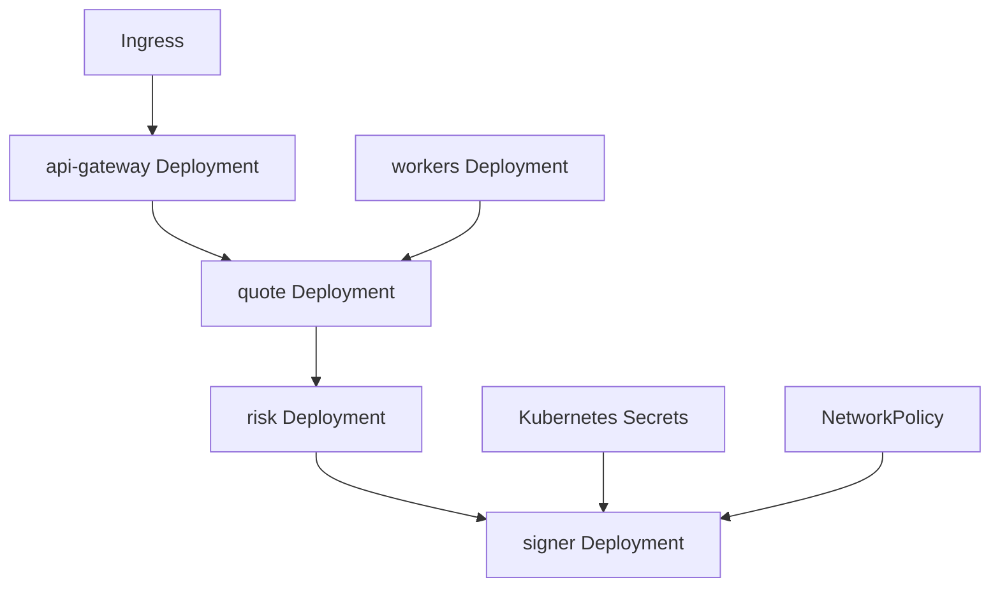
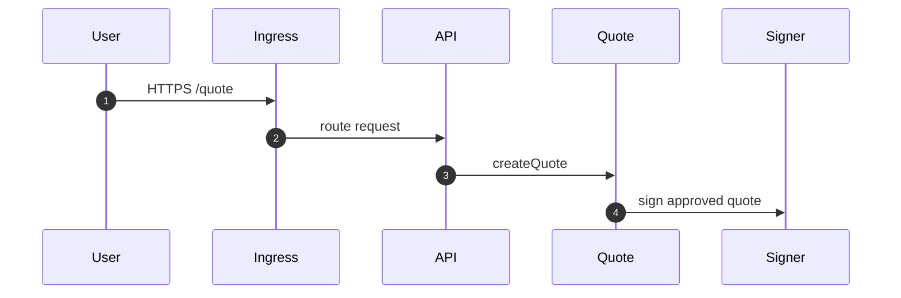
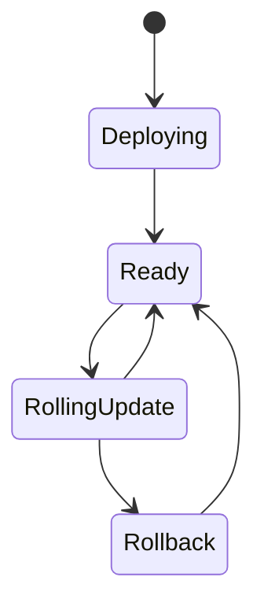

# Chapter 02: Kubernetes

## Abstract

Kubernetes 是本项目的生产运行目标之一。RFQ 系统包含 API、Quote、Pricing、Risk、Signer、Execution、Inventory、Hedge 和 Metrics 等服务，Kubernetes 可以提供部署、扩缩容、配置、健康检查和滚动更新。

## Learning Objectives

- 理解 RFQ 服务如何映射为 Kubernetes workloads。
- 区分 stateless services 和 stateful dependencies。
- 定义 readiness、liveness 和 resource limits。
- 说明 signer 的隔离部署要求。

## Background

生产 RFQ 系统需要隔离安全边界。Signer Service 不应与公开 API 混在同一个容器或权限域中。Kubernetes 的 namespace、service account、network policy 和 secret 管理可以表达这些边界。

## Problem Statement

需要把服务拆分和部署边界对齐，避免所有组件用同一权限运行。

## Requirements

### Functional Requirements

- 部署 API Gateway。
- 部署 Quote/Pricing/Risk/Signer 服务。
- 部署 Execution/Inventory/Hedge 服务。
- 配置 service discovery。
- 配置 readiness/liveness probes。

### Non-Functional Requirements

- Signer 必须网络隔离。
- Secret 不写入镜像。
- Resource request/limit 明确。
- 支持滚动发布和回滚。

## Existing Solutions

可以使用 Kubernetes、Docker Compose 生产化或 PaaS。生产级多服务系统更适合 Kubernetes + Helm。

## Trade-Off Analysis

Kubernetes 运维复杂，但能表达服务隔离和弹性。对于生产级参考架构，该复杂度合理。

## System Design

## Architecture Diagram

Signer Service should run in a restricted namespace or with strict NetworkPolicy. Public ingress only reaches API Gateway.

## Sequence Diagram

## State Machine

## Data Model

Kubernetes config includes Deployment, Service, ConfigMap, Secret, ServiceAccount, NetworkPolicy, HorizontalPodAutoscaler and PodDisruptionBudget.

The current runnable backend manifests use:

- `rfq-backend-config` ConfigMap for non-secret runtime settings such as `HOST=0.0.0.0`, `PORT=3000` and `NODE_ENV=production`.
- `rfq-backend-secrets` Secret for `RFQ_SIGNER_PRIVATE_KEY` and `RFQ_SETTLEMENT_ADDRESS`.
- Helm `signerSecret` values to reference the Secret name and key names without embedding private values into chart templates.

## API Design

No public API changes. Ingress exposes only public endpoints.

## Engineering Decisions

- Helm manages manifests.
- Signer has separate service account and network policy.
- Readiness 使用 `/ready` 检查关键组件状态，liveness 使用 `/health` 检查进程存活，避免坏版本进入流量。
- `NODE_ENV=production` requires explicit signer configuration. `RFQ_SIGNER_PRIVATE_KEY` must be a 32-byte hex string and `RFQ_SETTLEMENT_ADDRESS` must be a 20-byte hex address; placeholder Secret values must be replaced before deploy.

## Failure Scenarios

- Bad deployment：rollback Helm release.
- Signer pod crashloop：disable quote signing and page operator.
- Dependency unavailable：readiness fails.
- Missing or malformed signer Secret：backend fails fast before serving traffic.

## Security Considerations

Use least privilege service accounts. Avoid mounting broad secrets into API pods. Use network policy to restrict Signer access.

## Performance Considerations

Scale API and Quote services horizontally. Scale Signer carefully with key policy and KMS limits.

## Testing Strategy

Validate manifests with dry-run, run smoke tests after deploy, test rollback path.

## Interview Notes

Kubernetes 的价值不是“能部署”，而是能表达隔离、健康、回滚和扩缩容。

## Summary

Kubernetes 是生产部署层。RFQ 系统的部署设计必须特别保护 Signer 和 post-trade worker。

## References

- Kubernetes Deployments
- NetworkPolicy
- Helm
