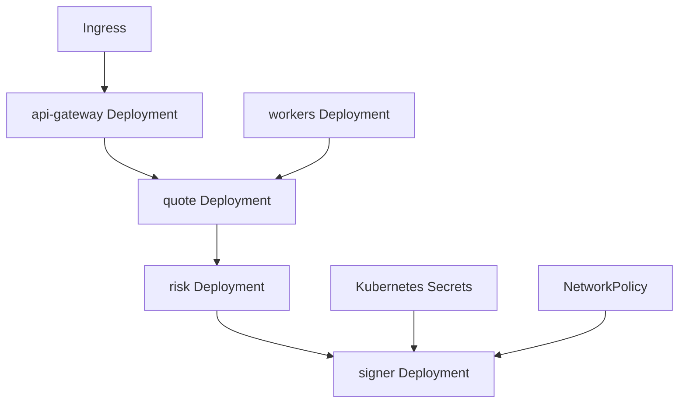
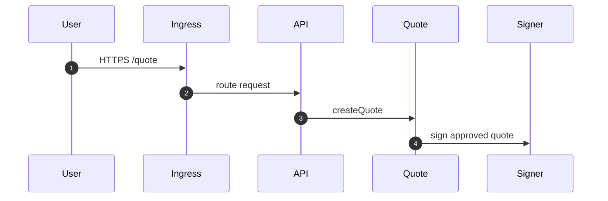
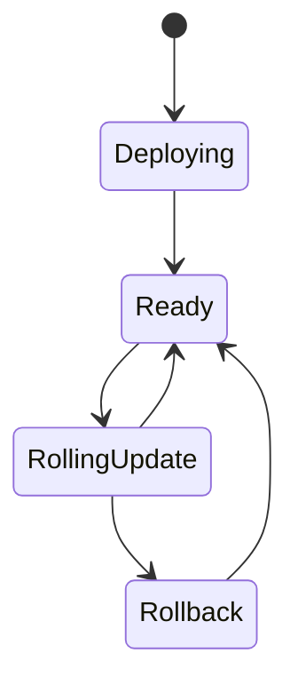

# Chapter 02: Kubernetes

## Abstract

Kubernetes 是本项目的生产运行目标之一。RFQ 系统包含 API、Quote、Pricing、Risk、Signer、Execution、Inventory、Hedge 和 Metrics 等服务，Kubernetes 可以提供部署、扩缩容、配置、健康检查和滚动更新。

## Learning Objectives

- 理解 RFQ 服务如何映射为 Kubernetes workloads。
- 区分 stateless services 和 stateful dependencies。
- 定义 readiness、liveness 和 resource limits。
- 说明 signer 的隔离部署要求。

## Background

生产 RFQ 系统需要隔离安全边界。Signer Service 不应与公开 API 混在同一个容器或权限域中。Kubernetes 的 namespace、service account、network policy 和 secret 管理可以表达这些边界。

## Problem Statement

需要把服务拆分和部署边界对齐，避免所有组件用同一权限运行。

## Requirements

### Functional Requirements

- 部署 API Gateway。
- 部署 Quote/Pricing/Risk/Signer 服务。
- 部署 Execution/Inventory/Hedge 服务。
- 配置 service discovery。
- 配置 readiness/liveness probes。

### Non-Functional Requirements

- Signer 必须网络隔离。
- Secret 不写入镜像。
- Resource request/limit 明确。
- 支持滚动发布和回滚。

## Existing Solutions

可以使用 Kubernetes、Docker Compose 生产化或 PaaS。生产级多服务系统更适合 Kubernetes + Helm。

## Trade-Off Analysis

Kubernetes 运维复杂，但能表达服务隔离和弹性。对于生产级参考架构，该复杂度合理。

## System Design

## Architecture Diagram

Signer Service should run in a restricted namespace or with strict NetworkPolicy. Public ingress only reaches API Gateway.

## Sequence Diagram

## State Machine

## Data Model

Kubernetes config includes Deployment, Service, ConfigMap, Secret, ServiceAccount, NetworkPolicy, HorizontalPodAutoscaler and PodDisruptionBudget.

The current runnable backend manifests use:

- `rfq-backend-config` ConfigMap for non-secret runtime settings such as `HOST=0.0.0.0`, `PORT=3000` and `NODE_ENV=production`.
- `rfq-backend-secrets` Secret for `DATABASE_URL`、`RFQ_AWS_KMS_KEY_ID`、`RFQ_TRUSTED_SIGNER_ADDRESS`、`RFQ_SETTLEMENT_ADDRESS`、`RFQ_REDIS_URL` and `RFQ_API_KEY_CONFIG_JSON`. It must not contain `RFQ_SIGNER_PRIVATE_KEY` or plaintext institutional API secrets; the API-key JSON contains SHA-256 digests only.
- Backend pods run as `rfq-backend-kms`. On EKS its ServiceAccount annotation binds an IAM role with `kms:Sign` only on the configured asymmetric `ECC_SECG_P256K1` key; other platforms must provide an equivalent workload identity. Static AWS access keys are not mounted.
- `rfq-hedge-worker-secrets` is a separate Secret containing only the worker database URL and Binance API key/secret. API pods do not mount venue credentials; worker pods do not mount signer or Redis credentials.
- `rfq-analytics-worker-secrets` contains the least-privilege outbox database URL, Kafka SASL credentials and ClickHouse credentials. API and hedge pods do not mount these values; analytics pods do not mount signer, Redis or Binance credentials.
- The hedge worker Deployment may run multiple replicas because due rows are claimed with `FOR UPDATE SKIP LOCKED`, expiring leases, and lease-owner CAS terminal updates. Its `/ready` probes PostgreSQL while `/health` only checks process liveness; the Service exposes `/metrics` for Prometheus.
- The worker NetworkPolicy admits metrics traffic on 3001 and limits egress ports to DNS, PostgreSQL 5432 and HTTPS 443. Because standard NetworkPolicy cannot restrict HTTPS by hostname, production clusters should additionally route 443 through an egress gateway or provider firewall allowlist for the selected Binance endpoints.
- The analytics worker Deployment runs multiple publisher replicas through PostgreSQL leases and one Kafka consumer group for partition assignment. Its Service exposes `/metrics` on 3002; readiness requires PostgreSQL, authenticated ClickHouse ping, connected producer and running consumer. NetworkPolicy allows only DNS plus PostgreSQL, Kafka and ClickHouse ports; provider firewall or egress gateway policy must narrow destinations.
- Any non-local `NODE_ENV` requires `DATABASE_URL`. The API does not allow pod-local quote, settlement, inventory, hedge or PnL stores in production; Helm injects the URL through `databaseSecret`.
- `RFQ_RATE_LIMIT_BACKEND=redis` is mandatory in production. `RFQ_REDIS_URL` may contain credentials or TLS parameters, so Kubernetes and Helm inject it from the Secret; `/ready` verifies it through the `rateLimitStore` component.
- `RFQ_API_KEY_CONFIG_JSON` is mandatory in production and comes from Helm `apiKeySecret` / `rfq-backend-secrets`, never the ConfigMap. Its entries use fixed scopes and `secretSha256`; production browser bundles must not receive these credentials.
- `RFQ_SUBMIT_RESERVATION_LEASE_MS` is reviewed non-secret configuration and defaults to 900000 ms. Every API replica uses PostgreSQL migration 008 (`008-submit-reservations.sql`) to acquire the same quote-scoped lease before settlement verification; `/ready.components.execution` degrades if the table is unavailable. The lease must remain longer than the maximum receipt wait plus operational margin, and operators must not delete active rows to force retries.
- Chainlink deployments set `RFQ_MARKET_DATA_PROVIDER=chainlink` in the ConfigMap and store the complete `RFQ_CHAINLINK_CONFIG_JSON` in `rfq-backend-secrets`, because RPC URLs commonly contain provider credentials. The Helm chart exposes this key only when `chainlinkConfigSecret.enabled=true`; static deployments do not mount a placeholder oracle config.
- `RFQ_TOKEN_REGISTRY_JSON` is reviewed non-secret configuration and must cover every managed market pair with chain-scoped address、symbol、decimals、whitelist、risk tier and `usdReference`. Backend startup rejects missing/duplicate/disabled metadata, non-USD-valued pricing pairs, and CEX pairs whose tokenOut is not the approved USD reference. A token metadata change is an economic policy rollout: update ConfigMap/Helm values through review, restart pods, and verify `/ready` before shifting traffic.
- `RFQ_RISK_POLICY_JSON` is versioned non-secret policy. Each token limit is chain-scoped and uses raw-unit strings for max input、minimum output and absolute inventory plus an integer-dollar `maxNotionalUsd`; global `minLiquidityUsd` and `maxVolatilityBps` reject unsafe market regimes before signing. Runtime takes the smaller token-side notional limit and compares USD-reference token base units using registry decimals. Startup cross-checks every policy token against the registry, every managed pair against both token limits, and requires at least one USD-reference token per pair. Registry and risk policy changes must ship atomically in one rollout; a partial update intentionally fails startup/readiness instead of silently widening access.
- CEX market-data deployments keep `RFQ_CEX_PAIRS` and all `RFQ_CEX_*` freshness/quorum controls in reviewed non-secret configuration. Raw manifests and Helm default to `RFQ_CEX_MIN_SOURCES=2`, a two-second maximum source-event age, one-second future skew, and 100 bps spread/deviation guards. Each configured pair must provide enough distinct exchange/symbol sources at startup; WebSocket egress on 443 should be narrowed to approved Binance/Coinbase hosts through the cluster egress gateway even though the baseline backend NetworkPolicy controls ingress only.
- Production settlement sets `RFQ_ALLOW_SIMULATED_SETTLEMENT=false` and injects `RFQ_RECEIPT_CONFIG_JSON` from `rfq-backend-secrets`. Each chain entry fixes `rpcUrl`、`settlementAddress`、required confirmations and receipt timeout; its settlement address must equal the EIP-712 `RFQ_SETTLEMENT_ADDRESS`. Helm enables `receiptConfigSecret` by default, so the existing signer Secret must also contain this key before rollout.
- `rfq-reconciliation-worker` runs two replicas on port 3003 with a reconciliation-only database Secret. Its NetworkPolicy permits DNS, PostgreSQL, and in-cluster Prometheus scraping only; it receives no signer, RPC, Binance, Kafka, or ClickHouse credentials. The Helm `reconciliationWorker` block mirrors the raw Deployment, Service, probes, resource limits, and lease settings.
- `rfq-settlement-indexer` runs two replicas on port 3004. Its Secret contains only a bounded-write database URL and `RFQ_SETTLEMENT_INDEXER_CONFIG_JSON`, because RPC URLs may contain provider credentials. It receives no signer, Redis, Binance, Kafka, or ClickHouse credentials. NetworkPolicy allows only DNS, PostgreSQL, HTTPS RPC egress, and in-cluster metrics ingress; an egress gateway should restrict HTTPS to approved RPC hosts.
- Every API, hedge, analytics, reconciliation, and settlement-indexer rollout runs the same migration init container. Migration 005 (`005-post-trade-reconciliation.sql`) creates the quote-scoped reconciliation queue, Migration 006 (`006-quote-snapshot-pnl.sql`) installs snapshot-bound PnL attribution, Migration 007 (`007-settlement-indexer.sql`) adds leased chain cursors, and Migration 008 (`008-submit-reservations.sql`) adds the shared submit lease. Migrations 009 and 010 extend durable risk reasons, Migration 011 installs cumulative open-quote exposure reservations, Migration 012 makes volatility premium and hedge cost durable quote components, and Migration 013 (`013-market-spread-attribution.sql`) persists executable market spread on both snapshots and signed quotes before replicas become ready.
- Helm `signerSecret` references the KMS key id、trusted signer address and settlement address without embedding values into chart templates. Helm `apiKeySecret` independently references the scoped API-key digest JSON. `serviceAccount.annotations` carries the workload-identity binding, not AWS credentials.
- Helm `hedgeWorker.secret` references the isolated credential Secret, while `hedgeWorker.env.RFQ_HEDGE_ROUTES_JSON` contains non-secret route, decimals and raw step-size metadata.
- Helm `analyticsWorker.secret` references Kafka/ClickHouse/runtime database credentials while broker endpoints, fixed topic, group id, retention and batch/lease bounds remain non-secret chart values. Provision `rfq.analytics.v1` with the intended partition count and retention before rollout because workers disable auto topic creation.
- API, hedge worker, analytics worker, reconciliation worker and settlement indexer Deployments run `backend/dist/db/migrate.js` in an init container before application startup. The init container alone receives `rfq-database-migration-secrets`; runtime containers retain lower-privilege database roles without DDL rights. The migration runner holds a PostgreSQL session advisory lock across discovery and all pending DDL transactions, so concurrent rollout replicas serialize through migrations `005`-`008` instead of racing `_migrations` state. The reconciliation worker receives the same reviewed `RFQ_TOKEN_REGISTRY_JSON` as the API because rebuilt PnL must use identical token decimals.
- `terminationGracePeriodSeconds=30` and a `preStop` sleep of 5 seconds to give readiness and load balancers time to stop sending new quote traffic before the backend receives SIGTERM and closes Fastify.

## API Design

Ingress exposes the trading and status routes through scoped API-key authentication while keeping health, readiness and Prometheus paths available only to their intended probe or cluster monitoring callers.

## Engineering Decisions

- Helm manages manifests.
- Signer has separate service account and network policy.
- Readiness 使用 `/ready` 检查关键组件状态，liveness 使用 `/health` 检查进程存活，避免坏版本进入流量。
- Backend pods use graceful shutdown on `SIGTERM`/`SIGINT`; Kubernetes keeps a termination grace period and preStop delay so rolling updates avoid abruptly cutting in-flight quote or submit requests.
- `NODE_ENV=production` requires `RFQ_SIGNER_MODE=aws-kms`, region、KMS key id、trusted signer address and settlement address. Raw private key configuration is rejected. Placeholder Secret and ServiceAccount annotation values must be replaced before deploy; the first `/ready` probe proves a KMS signature recovers to the configured signer before traffic is admitted. Signer probe results are cached for 30 seconds and concurrent probes are coalesced, bounding KMS traffic without hiding failures beyond that interval.
- Settlement indexer replicas coordinate through expiring PostgreSQL leases rather than Kubernetes leader election. `/ready` requires healthy cursor/quote/settlement stores and a recent successful chain iteration; `/health` remains process-only so an RPC incident removes stale workers from readiness without restart loops destroying diagnostic state.

## Failure Scenarios

- Bad deployment：rollback Helm release.
- Signer pod crashloop：disable quote signing and page operator.
- Dependency unavailable：readiness fails.
- Missing or malformed signer Secret：backend fails fast before serving traffic.
- Missing or malformed Redis Secret：backend fails fast；runtime Redis loss returns 503 and removes the pod from readiness without bypassing global limits.
- Pod termination during rollout：preStop delay lets endpoints drain, then SIGTERM triggers Fastify close; forced kill before grace period ends should be treated as a deployment incident.
- Missing Kafka topic or invalid SASL/ClickHouse credentials：analytics readiness fails while API trading remains available; outbox backlog is retained in PostgreSQL and must be drained after the dependency is repaired.
- Missing indexer Secret, zero settlement address, unsafe RPC URL, or lease shorter than twice the RPC timeout: indexer fails startup before serving readiness.
- RPC outage or unknown on-chain quote: the affected cursor does not advance, indexer readiness becomes stale, and API quote/receipt paths remain isolated while operators repair evidence.

## Security Considerations

Use least privilege service accounts. Avoid mounting broad secrets into API pods. Use network policy to restrict Signer access.

## Performance Considerations

Scale API and Quote services horizontally. Scale Signer carefully with key policy and KMS limits.

## Testing Strategy

Validate manifests with dry-run, run smoke tests after deploy, test rollback path.

## Interview Notes

Kubernetes 的价值不是“能部署”，而是能表达隔离、健康、回滚和扩缩容。

## Summary

Kubernetes 是生产部署层。RFQ 系统的部署设计必须特别保护 Signer 和 post-trade worker。

## References

- Kubernetes Deployments
- NetworkPolicy
- Helm
