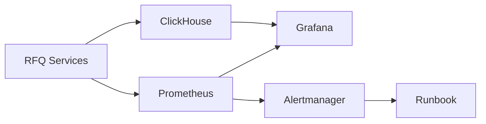
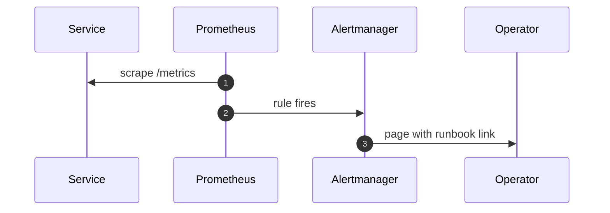
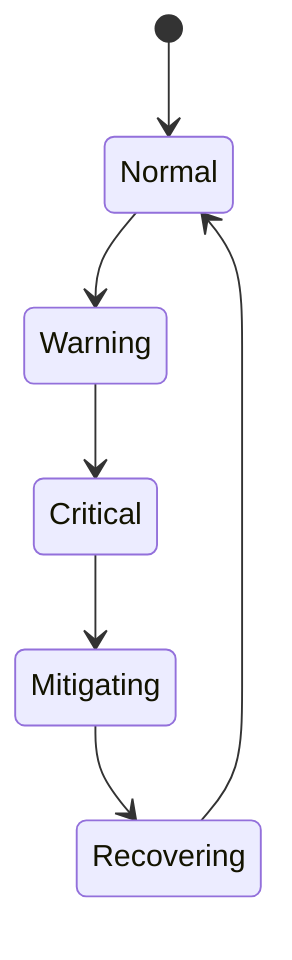

# Chapter 03: Monitoring

## Abstract

Monitoring 是 RFQ 系统生产运行的核心能力。系统必须监控技术健康，也必须监控业务风险。HTTP 200 不代表做市系统健康；signer 延迟、risk reject spike、inventory exposure、event lag 和 hedge failure 都可能代表更严重问题。

## Learning Objectives

- 定义 RFQ 系统的核心 SLI/SLO。
- 设计 Prometheus 和 Grafana 指标。
- 区分技术告警和风险告警。
- 说明监控如何连接 Runbook。

## Background

RFQ 系统的故障通常表现为指标异常。例如 `/quote` 仍返回，但 reject rate 暴增；链上成交成功，但 indexer lag 导致库存滞后；hedge venue 拒绝订单导致风险累积。

## Problem Statement

需要一套指标体系，让团队能在损失扩大前发现问题。

## Requirements

### Functional Requirements

- 监控 quote latency。
- 监控 quote rejection rate。
- 监控 signer latency 和 error rate。
- 监控 settlement event lag。
- 监控 inventory exposure。
- 监控 hedge lag 和 hedge failure。

### Non-Functional Requirements

- Prometheus label 不高基数。
- Dashboard 可按服务和业务流查看。
- 告警有 runbook 链接。
- Metrics failure 不影响交易路径。

## Existing Solutions

Prometheus + Grafana 是服务监控标准组合。ClickHouse 用于高维业务分析。两者结合覆盖实时告警和深度分析。

## Trade-Off Analysis

只用 Prometheus 不适合 quoteId 级别分析。只用 ClickHouse 不适合实时告警。因此两套系统分工明确。

## System Design

## Architecture Diagram

Metrics spans API, Quote, Pricing, Risk, Signer, Execution, Inventory and Hedge.

## Sequence Diagram

## State Machine

## Data Model

Key metrics include:

- `rfq_quote_requests_total`
- `rfq_quote_responses_total`
- `rfq_quote_errors_total`
- `rfq_quote_latency_seconds`
- `rfq_quote_rejections_total` with bounded `reason`; alert separately on `TREASURY_LIQUIDITY_INSUFFICIENT` and `RISK_ENGINE_UNAVAILABLE`
- `rfq_quote_paused`
- `rfq_quote_pairs_paused` without chain or token labels
- `rfq_quote_control_updates_total` for successful global or pair CAS updates
- `rfq_quote_control_errors_total` with bounded `operation="read|update"`; pair identifiers stay in the audit table rather than metric labels
- `rfq_submit_requests_total`
- `rfq_submit_accepted_total`
- `rfq_submit_errors_total`
- `rfq_submit_reservation_contention_total`
- `rfq_submit_reservation_errors_total` with bounded `operation` label
- `rfq_submit_latency_seconds`
- `rfq_rate_limited_total`
- `rfq_api_auth_rejections_total`
- `rfq_signer_requests_total`
- `rfq_signer_errors_total`
- `rfq_signer_latency_seconds`
- `rfq_market_data_cache_hits_total`
- `rfq_market_data_cache_misses_total`
- `rfq_cex_order_book_sources`
- `rfq_cex_order_book_pairs`
- `rfq_cex_order_book_deviation_rejected_sources`
- `rfq_cex_order_book_max_update_age_seconds`
- `rfq_cex_order_book_connector_errors_total`
- `rfq_readiness_status`
- `rfq_dependency_status`
- `rfq_settlements_total`
- `rfq_hedge_intents_total`
- `rfq_hedge_intent_errors_total`
- `rfq_hedge_lag_seconds`
- `rfq_hedge_worker_jobs_total`
- `rfq_hedge_worker_iteration_errors_total`
- `rfq_hedge_worker_last_processed_timestamp_seconds`
- `rfq_hedge_fee_reconciliations_total`
- `rfq_hedge_fee_iteration_errors_total`
- `rfq_hedge_fee_last_processed_timestamp_seconds`
- `rfq_hedge_fee_pending`
- `rfq_hedge_fee_oldest_due_age_seconds`
- `rfq_quote_status_update_errors_total`
- `rfq_inventory_balance`
- `rfq_pnl_trades_total`
- `rfq_pnl_record_errors_total`
- `rfq_realized_pnl_token_out`
- `rfq_analytics_outbox_published_total`
- `rfq_analytics_outbox_retries_total`
- `rfq_analytics_outbox_deleted_total`
- `rfq_analytics_publisher_iteration_errors_total`
- `rfq_analytics_clickhouse_events_total`
- `rfq_analytics_consumer_errors_total`
- `rfq_analytics_last_published_timestamp_seconds`
- `rfq_analytics_last_consumed_timestamp_seconds`
- `rfq_analytics_outbox_pending`
- `rfq_analytics_outbox_oldest_age_seconds`
- `rfq_analytics_outbox_cleanup_eligible`
- `rfq_settlement_indexer_ranges_total`
- `rfq_settlement_indexer_events_total`
- `rfq_settlement_indexer_errors_total`
- `rfq_settlement_indexer_reorgs_total`
- `rfq_settlement_indexer_reorg_removed_events_total`
- `rfq_settlement_indexer_next_block`
- `rfq_settlement_indexer_safe_head`
- `rfq_settlement_indexer_lag_blocks`
- `rfq_settlement_indexer_last_poll_timestamp_seconds`
- `rfq_settlement_indexer_cursor_update_age_seconds`

## API Design

`GET /metrics` exposes Prometheus text format. Grafana dashboards consume Prometheus and ClickHouse.

## Engineering Decisions

- No quoteId/user address labels in Prometheus.
- Signer metrics use only the low-cardinality `operation` label: `sign` or `verify`.
- Rate-limit metrics use only the fixed `endpoint` label: `quote`, `submit` or `status`; dynamic route params must stay out of Prometheus labels.
- Readiness metrics mirror the last `/ready` probe with fixed labels: `rfq_readiness_status{status="ready|degraded"}` and `rfq_dependency_status{component="marketData|marketSnapshotStore|routing|pricing|risk|signer|quoteRepository|quoteControl|riskDecisionStore|rateLimitStore|inventory|execution|settlementEventStore|pnl|metrics",status="ok|degraded"}`.
- Quote-control metrics intentionally exclude operator identity and free-form reason. A pause gauge indicates the current safety state, update count supplies an audit correlation signal, and operation errors identify failed read/update paths without creating high-cardinality labels.
- Readiness alerting should page on sustained degraded status, then route by the degraded component instead of relying on a single generic health alarm.
- Dependency component alerting uses the fixed `component` label from readiness probes so operators can route incidents without parsing error messages.
- Quote error alerting should correlate errors with risk rejection, rate limit, market data, pricing and signer metrics before changing quote availability.
- Quote response alerting should compare requests, signed responses, errors and rejections so operators can distinguish fail-closed behavior from signer or dependency failure.
- Submit error alerting must compare errors with accepted settlements, rate-limit counters and settlement reverts before deciding whether to pause submit traffic.
- Submit reservation errors are fail-closed PostgreSQL incidents; contention is a separate client/replay signal and must not be treated as storage failure.
- Submit latency alerting should inspect verification, settlement event persistence, inventory, hedge and PnL work before lowering quote availability.
- Signer throughput alerting should compare quote demand with `sign` operations; safe quote flow must never bypass the signer.
- Market-data cache alerting should compare `rfq_market_data_cache_hits_total` and `rfq_market_data_cache_misses_total` before increasing quote limits; a cold cache points to disabled prefetch, stale CEX order book streams or unsupported pair configuration.
- CEX order-book alerting uses fixed source/pair states, latest-cycle maximum event age, latest-cycle deviation rejections and connector error rates. A synchronized socket alone is not healthy: `ready` requires a valid two-sided book whose exchange event timestamp is within `RFQ_CEX_MAX_SOURCE_AGE_MS`; blocked pairs must remain on the lower-priority provider or fail closed until quorum and deviation checks recover.
- Hedge worker alerting correlates newly created intents with terminal/retry outcomes and last processed time. Repeated retries or iteration errors require checking PostgreSQL leases and querying Binance by persisted client order id before any manual action.
- Hedge fee alerting correlates the exact-fill reconciliation outcome with pending depth, oldest due age and last progress. Account-history lag reduces accounting freshness but must not trigger replacement orders; a persistent base/quote mismatch requires preserving the fill evidence and reconciling it against the venue account export.
- Rate-limit alerting should inspect `endpoint` first, then separate abuse, broken client retries and real demand before changing global limits.
- Settlement throughput alerting should compare accepted submits with new settlement events to distinguish true settlement stalls from duplicate replay traffic.
- Hedge intent throughput alerting should compare settlements with hedge intents because hedge lag histograms are silent when no intent is created.
- Inventory balance alerting uses token native units in the reference implementation; production exposure limits should normalize to USD, delta and venue-specific hedge capacity.
- Realized PnL alerting uses output-token units in the reference implementation; production dashboards should reconcile this with quote-level ClickHouse attribution and treasury accounting.
- PnL throughput alerting should compare settlements with realized PnL trades because best-effort attribution must not fail silently.
- Use ClickHouse for quote-level analysis.
- Analytics gauges come from PostgreSQL outbox stats at scrape time; if that query fails, process counters remain scrapeable while `/ready` reports degraded. Alerts distinguish worker down, backlog age/size, broker retries and ClickHouse consumer failures.
- ClickHouse event-id deduplication is eventual under `ReplacingMergeTree`; dashboards that count unique business events must use `FINAL` or `uniqExact(event_id)`/`argMax` according to query cost and freshness requirements.
- ClickHouse dashboards may explain quote funnels, latency, PnL attribution and customer support questions, but they must never be used as the operational source of truth for quote status, settlement state, inventory, hedge execution, readiness or reconciliation decisions.
- Post-trade convergence exposes `rfq_reconciliation_jobs_total` with an `outcome` label, `rfq_reconciliation_iteration_errors_total`, `rfq_reconciliation_pending_jobs`, `rfq_reconciliation_oldest_pending_age_seconds`, and `rfq_reconciliation_last_processed_timestamp_seconds`. Outcome is a closed enum (`repaired`, `already_consistent`, `retry_scheduled`, `stale_revision`); quote or settlement identifiers never become metric labels.
- Alert on reconciliation worker availability, pending count or age, repeated retries, and pending work without last-processed progress. A stale revision is normal during a reorg or rapid canonical replacement and should be interpreted with backlog convergence rather than paged on by itself.
- Settlement indexer metrics use only configured `chain_id` plus closed `outcome` (`applied`, `duplicate`) and `code` enums. Transaction hashes, quote hashes, users, RPC URLs and provider errors must never become labels or log fields.
- Alert on indexer process availability, confirmed-block lag, any bounded ingestion error, and `DEEP_REORG` separately. `QUOTE_NOT_FOUND` or `EVENT_MISMATCH` is an economic consistency incident: do not skip the log to make lag green. Compare the configured RPC with an independent provider and restore quote evidence first.
- Every critical alert links to runbook.

## Failure Scenarios

- Signer latency p99 spikes：reduce quote traffic or disable signing.
- Readiness is degraded：inspect `rfq_dependency_status` and follow the component-specific runbook before restarting healthy pods.
- Dependency component degraded：route by the fixed `component` label and apply the matching store, signer, market data, pricing or risk mitigation.
- Quote latency p95 spikes：check market data, pricing, risk and signer dependency latency.
- Quote error spike：separate invalid requests, rate limits, risk rejection, stale market data, pricing failures and signer failures.
- CEX order book unavailable：keep affected CEX cache entries invalidated, verify exchange event time and full-snapshot synchronization, and do not refresh `observedAt` from a polling timer.
- CEX source divergence：pause or fall back for the whole pair until the bad source is identified; never average two mutually inconsistent venues into a signed quote.
- Quote response stall：compare signed responses with quote errors, risk rejections and signer health before reopening traffic.
- Risk reject spike：check market volatility, inventory limits, token allowlist and toxic flow signals.
- Signer sign throughput stalls：check signer routing, dependency readiness and fail-closed behavior before resuming quote traffic.
- Submit error spike：separate invalid client payloads, rate limits, expired or replayed quotes, settlement reverts and dependency failures.
- Submit latency p95 spikes：check settlement verification, quote status persistence, inventory updates, hedge intent enqueue and PnL attribution.
- Rate limit spike：check abusive clients, retry storms, ingress behavior and whether legitimate demand needs a controlled limit change.
- Settlement throughput stalls：check duplicate replays, verifier output, settlement event store writes and indexer ingestion.
- Hedge intent throughput stalls：check hedge store writes, venue routing, worker health and missing post-settlement reconciliation.
- Inventory exposure over limit：tighten risk limits.
- Inventory balance threshold breach：reduce quotes that add to the exposed side, hedge down the token and reconcile settlement events.
- Negative realized PnL：pause affected pairs if pricing, market snapshots or settlement attribution cannot explain the loss.
- PnL throughput stalls：run settlement-to-PnL reconciliation and verify market snapshots are available for attribution.
- Event lag grows：pause risky pairs.
- Settlement indexer lag grows: stop increasing exposure on affected chains, verify `safe_head - next_block`, database lease ownership and RPC `eth_getLogs` health, then let the durable cursor catch up without manual jumps.
- Settlement indexer deep reorg: page immediately, pause affected-chain quoting, compare block hashes across providers, and follow the audited cursor recovery procedure; never delete checkpoints just to clear the alert.
- Hedge failure spike：widen spread and page operator.

## Security Considerations

Metrics endpoint must not leak private keys, full wallet labels, or internal thresholds.

## Performance Considerations

Metrics collection must be low overhead. Histograms should use bounded buckets.

本地性能回归使用 `make benchmark-quote` 和 `make benchmark-submit`。Quote benchmark 输出 `POST /quote` 的 samples、errors、p50、p95 和 max latency，默认门禁为 p95 <= 50 ms 且 errors = 0。Submit benchmark 为每个样本先生成 fresh signed quote，再测量 `POST /submit` 的 settlement、inventory、hedge 和 PnL 接受路径，默认门禁为 50 measured samples、p95 <= 100 ms 且 setup/submit errors = 0。CI 通过 `make verify` 运行这些门禁。生产环境仍应使用真实网络、真实 signer、真实数据库和并发流量做容量测试，本地 benchmark 只用于捕捉代码级明显回归。

## Testing Strategy

Test metrics presence, alert rules, dashboard JSON validity and runbook links.

## Interview Notes

Production monitoring for RFQ must include business-risk metrics, not only CPU and HTTP errors.

## Summary

Monitoring connects system behavior to operator action. Without it, RFQ cannot be considered production-grade.

## References

- Prometheus
- Grafana
- Alertmanager
