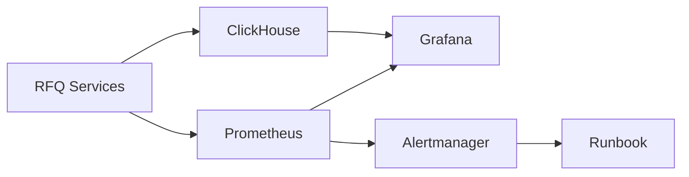
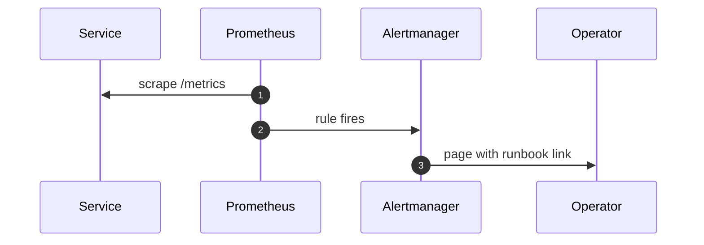
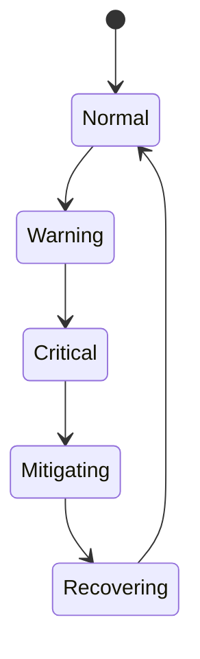

# Chapter 03: Monitoring

## Abstract

Monitoring 是 RFQ 系统生产运行的核心能力。系统必须监控技术健康，也必须监控业务风险。HTTP 200 不代表做市系统健康；signer 延迟、risk reject spike、inventory exposure、event lag 和 hedge failure 都可能代表更严重问题。

## Learning Objectives

- 定义 RFQ 系统的核心 SLI/SLO。
- 设计 Prometheus 和 Grafana 指标。
- 区分技术告警和风险告警。
- 说明监控如何连接 Runbook。

## Background

RFQ 系统的故障通常表现为指标异常。例如 `/quote` 仍返回，但 reject rate 暴增；链上成交成功，但 indexer lag 导致库存滞后；hedge venue 拒绝订单导致风险累积。

## Problem Statement

需要一套指标体系，让团队能在损失扩大前发现问题。

## Requirements

### Functional Requirements

- 监控 quote latency。
- 监控 quote rejection rate。
- 监控 signer latency 和 error rate。
- 监控 settlement event lag。
- 监控 inventory exposure。
- 监控 hedge lag 和 hedge failure。

### Non-Functional Requirements

- Prometheus label 不高基数。
- Dashboard 可按服务和业务流查看。
- 告警有 runbook 链接。
- Metrics failure 不影响交易路径。

## Existing Solutions

Prometheus + Grafana 是服务监控标准组合。ClickHouse 用于高维业务分析。两者结合覆盖实时告警和深度分析。

## Trade-Off Analysis

只用 Prometheus 不适合 quoteId 级别分析。只用 ClickHouse 不适合实时告警。因此两套系统分工明确。

## System Design

## Architecture Diagram

Metrics spans API, Quote, Pricing, Risk, Signer, Execution, Inventory and Hedge.

## Sequence Diagram

## State Machine

## Data Model

Key metrics include:

- `rfq_quote_requests_total`
- `rfq_quote_responses_total`
- `rfq_quote_errors_total`
- `rfq_quote_latency_seconds`
- `rfq_quote_rejections_total`
- `rfq_submit_requests_total`
- `rfq_submit_accepted_total`
- `rfq_submit_errors_total`
- `rfq_submit_latency_seconds`
- `rfq_signer_requests_total`
- `rfq_signer_errors_total`
- `rfq_signer_latency_seconds`
- `rfq_readiness_status`
- `rfq_dependency_status`
- `rfq_settlements_total`
- `rfq_hedge_intents_total`
- `rfq_hedge_intent_errors_total`
- `rfq_quote_status_update_errors_total`
- `rfq_inventory_balance`
- `rfq_pnl_trades_total`
- `rfq_pnl_record_errors_total`
- `rfq_realized_pnl_token_out`

## API Design

`GET /metrics` exposes Prometheus text format. Grafana dashboards consume Prometheus and ClickHouse.

## Engineering Decisions

- No quoteId/user address labels in Prometheus.
- Signer metrics use only the low-cardinality `operation` label: `sign` or `verify`.
- Readiness metrics mirror the last `/ready` probe with fixed labels: `rfq_readiness_status{status="ready|degraded"}` and `rfq_dependency_status{component="marketData|pricing|risk|signer|quoteRepository|inventory|execution|settlementEventStore|pnl|metrics",status="ok|degraded"}`.
- Readiness alerting should page on sustained degraded status, then route by the degraded component instead of relying on a single generic health alarm.
- Use ClickHouse for quote-level analysis.
- Every critical alert links to runbook.

## Failure Scenarios

- Signer latency p99 spikes：reduce quote traffic or disable signing.
- Readiness is degraded：inspect `rfq_dependency_status` and follow the component-specific runbook before restarting healthy pods.
- Quote latency p95 spikes：check market data, pricing, risk and signer dependency latency.
- Risk reject spike：check market volatility, inventory limits, token allowlist and toxic flow signals.
- Inventory exposure over limit：tighten risk limits.
- Event lag grows：pause risky pairs.
- Hedge failure spike：widen spread and page operator.

## Security Considerations

Metrics endpoint must not leak private keys, full wallet labels, or internal thresholds.

## Performance Considerations

Metrics collection must be low overhead. Histograms should use bounded buckets.

## Testing Strategy

Test metrics presence, alert rules, dashboard JSON validity and runbook links.

## Interview Notes

Production monitoring for RFQ must include business-risk metrics, not only CPU and HTTP errors.

## Summary

Monitoring connects system behavior to operator action. Without it, RFQ cannot be considered production-grade.

## References

- Prometheus
- Grafana
- Alertmanager
