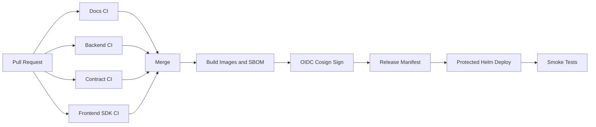
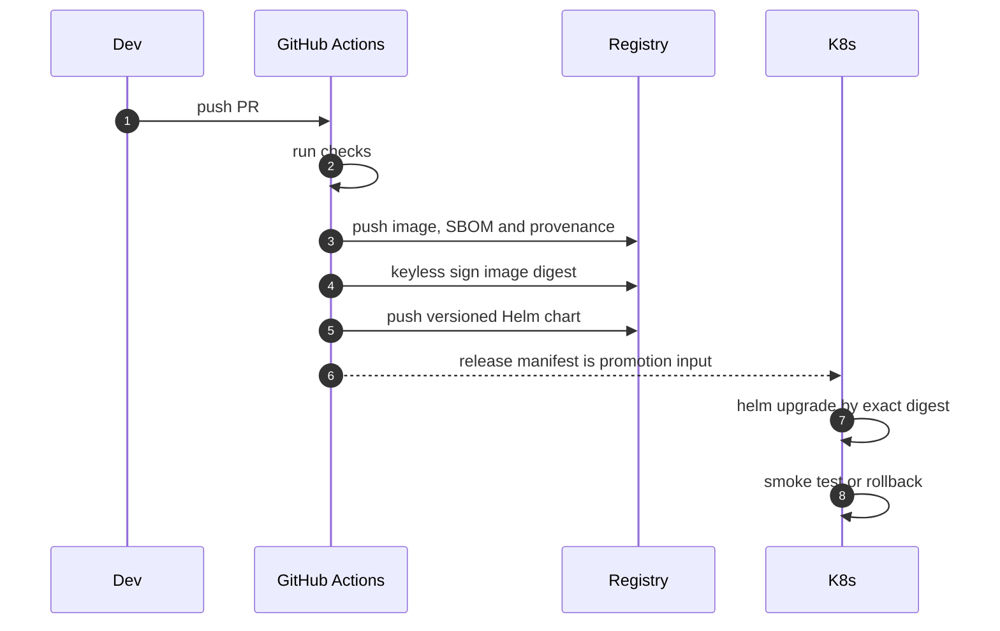
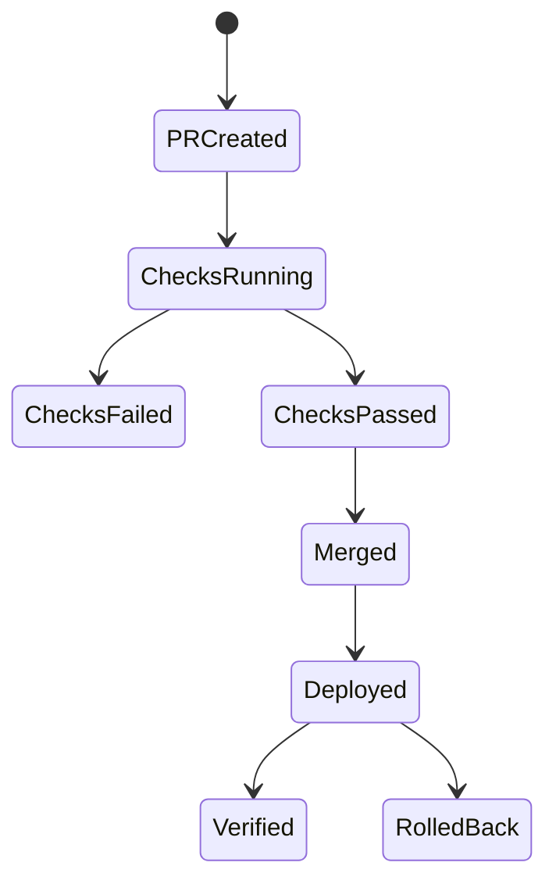

# Chapter 04: CI-CD

## Abstract

CI/CD 是项目质量门禁。RFQ 系统跨 Markdown 文档、TypeScript 后端、React 前端、SDK 和 Solidity 合约。CI 必须在合并前检查文档、类型、测试和安全边界。CD 必须支持可回滚部署。

## Learning Objectives

- 定义 backend、contract、docs CI。
- 说明 gates：typecheck、unit test、Foundry test、lint、EIP-712 consistency、contract ABI consistency 和 API error consistency。
- 设计部署和回滚流程。
- 把 CI 结果和生产风险联系起来。

## Background

当前仓库把 CI 分为 backend、contract 和 docs 三条独立门禁。三者都递归拉取 submodule，避免 ABI 或 skeleton 检查在干净 runner 上因缺少锁定的 OpenZeppelin 源码而失败；Backend CI 执行统一的 `make verify`，Contract CI 执行 Foundry 构建和测试，Docs CI 校验跨代码、配置、部署清单和文档的一致性。所有第三方 Action 都固定到完整 commit SHA，并保留审计过的版本注释。

发布与部署被刻意拆开。`release.yml` 只在语义化版本 tag 或人工 dispatch 时运行，也不会从 pull request 触发。它先在仅有 `contents:read` 的独立 job 中递归拉取 submodule、安装依赖并重跑完整 `make verify` 与 Foundry tests；只有通过后，publish job 才取得 GHCR/OIDC 权限并构建产物。环境部署由受保护的环境工作流或运维系统消费 release manifest 中的 digest。

## Problem Statement

没有 CI，EIP-712 字段不一致、OpenAPI 分叉、合约测试缺失和文档破损都可能进入主分支。

## Requirements

### Functional Requirements

- Docs CI 检查必需文档。
- Backend CI 运行 typecheck 和 tests。
- Contract CI 运行 Foundry tests。
- Frontend/SDK CI 运行 typecheck。
- 部署前需要镜像构建和 smoke test。
- 发布 backend/frontend 镜像、Helm chart 和机器可读 release manifest。
- 生产部署必须按镜像 digest，而不是 `latest` 或可移动 tag。

### Non-Functional Requirements

- CI 快速反馈。
- 关键安全测试阻断合并。
- 部署可回滚。
- secrets 只在部署 job 可用。
- 发布 job 使用最小 `GITHUB_TOKEN` 权限和 OIDC，不保存长期签名私钥。

## Existing Solutions

GitHub Actions 负责质量门禁和 GHCR artifact release；Helm 负责环境侧 promotion。两者之间以 commit、chart version、image digest 和签名作为稳定契约，而不是重新构建源码。

## Trade-Off Analysis

更严格 CI 会增加等待时间，但能避免资金相关系统出现低级错误。安全相关测试必须优先。

## System Design



## Architecture Diagram

CI validates source. CD promotes immutable artifacts. Helm release history provides rollback.

## Sequence Diagram



## State Machine



## Data Model

发布产物包括 backend/frontend OCI image、BuildKit SBOM、SLSA provenance、Cosign digest signature、版本化 Helm chart 和 `release-manifest.json`。Manifest 固定源 commit、两个镜像仓库与 digest、已发布 tags，以及 chart OCI 地址和版本。tag 便于发现，digest 才是部署身份。

## API Design

No public API changes. CI 已通过一致性脚本验证 OpenAPI、SDK、后端 route、错误码和部署配置。

## Engineering Decisions

- Separate docs, backend and contract workflows.
- Contract tests, EIP-712 consistency, SDK contract ABI consistency and API error consistency are required gates.
- Contract jobs set `FOUNDRY_DISABLE_NIGHTLY_WARNING=1` to keep CI logs focused on actionable failures while the workflow still pins the Foundry toolchain installation step.
- Checkout、Node、Foundry、Docker、Cosign、Helm 和 artifact Actions 都使用完整 40 字符 commit SHA；Dependabot 每周提出升级 PR，升级仍需通过门禁。
- Release workflow grants only `contents:read`、`actions:read`、`packages:write` and `id-token:write`. Cosign uses GitHub OIDC identity，仓库不保存镜像签名私钥。
- Buildx 对两个镜像生成 registry-attached SBOM and `mode=max` provenance，随后只对返回的 digest 签名。
- Helm `image.digest` 优先于 `image.tag`。生产 promotion 必须从 release manifest 传入 digest；tag fallback 只用于本地或非生产调试。
- Deployment job uses environment protection，并与 release job 分离；环境失败不能诱发相同版本的重新构建。

生产 promotion 示例：

```sh
helm upgrade --install rfq-market-maker \
  oci://ghcr.io/OWNER/charts/rfq-market-maker \
  --version 1.2.3 \
  --set-string image.repository=ghcr.io/OWNER/REPOSITORY-backend \
  --set-string image.digest=sha256:RELEASE_MANIFEST_DIGEST \
  --atomic --wait
```

部署前应使用 `cosign verify` 校验 OIDC issuer、workflow identity 和 digest，并将验证结果保存到 promotion audit。原始 Kubernetes manifests 使用不存在的全零 digest 作为 fail-closed 占位值，必须替换后才能拉取镜像。

## Failure Scenarios

- Typecheck fails：block merge.
- Contract test fails：block merge.
- Contract ABI consistency fails：block merge because SDK consumers may call stale Solidity interfaces.
- Deploy smoke fails：rollback.
- Secret unavailable：deployment fails closed.
- Registry tag 被重写：digest promotion 不受影响；若签名或 provenance 不匹配则阻断部署。
- Release 中一个镜像构建失败：workflow 不发布 chart/release manifest，版本不可 promotion。

## Security Considerations

Never expose deployment secrets to pull_request from forks. Release workflow 没有 `pull_request` trigger，也没有集群凭据。完整 SHA pin 防止 Action tag 被静默移动；OIDC keyless signing 把签名身份绑定到仓库 workflow，生产 verifier 还必须约束 issuer 和 subject，而不是只检查存在某个签名。

## Performance Considerations

Use path filters and caching to reduce CI time. Security gates still run on critical paths.

## Testing Strategy

本地 `make ci-check` 验证 workflow trigger、最小权限、完整 SHA pin、submodule checkout、SBOM/provenance、digest signing、Helm package 和 release manifest。`make deployment-check` 验证原始清单不存在 `:latest`，并验证每个 Helm Deployment 的 init container 与 runtime container 共用 digest-aware image helper。发布流程仍需在受控 tag 上做一次真实 GHCR canary，随后在 staging 校验 Cosign identity、Helm `--atomic` rollback 和 smoke test。

## Interview Notes

CI/CD for smart contract systems must prioritize tests that protect funds and typed data consistency.

## Summary

CI 把架构规则转成自动门禁；release workflow 把同一份已审计源码转成有 SBOM、provenance、签名和 digest 的不可变产物；受保护的环境 promotion 再消费这些产物。三阶段分离后，回滚选择旧 digest 即可，不需要在事故期间重新构建。

## References

- GitHub Actions: secure use reference
- Docker Buildx attestations
- Sigstore Cosign keyless signing
- Helm OCI registries and atomic upgrade
- Foundry CI
