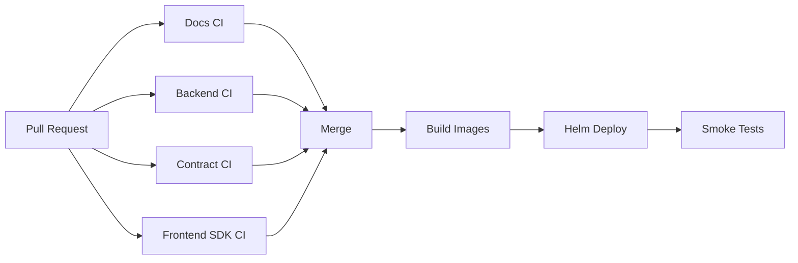
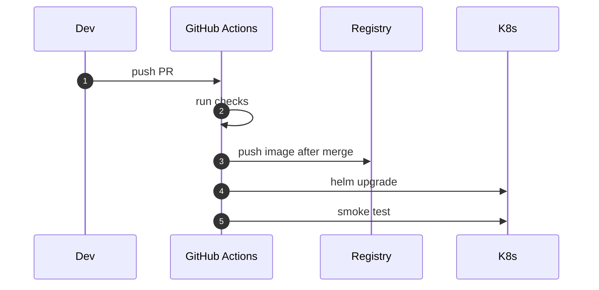
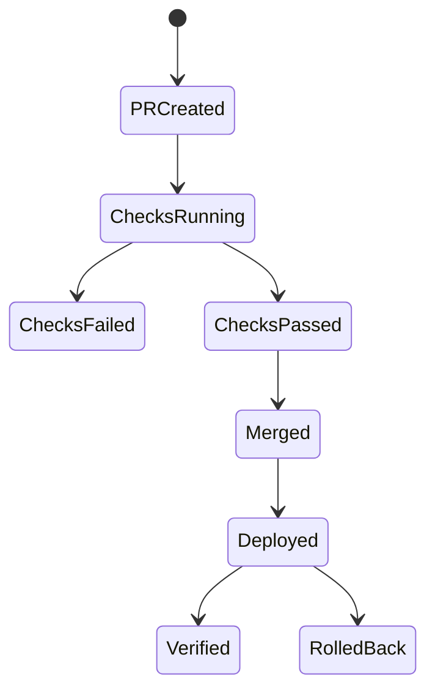

# Chapter 04: CI-CD

## Abstract

CI/CD 是项目质量门禁。RFQ 系统跨 Markdown 文档、TypeScript 后端、React 前端、SDK 和 Solidity 合约。CI 必须在合并前检查文档、类型、测试和安全边界。CD 必须支持可回滚部署。

## Learning Objectives

- 定义 backend、contract、docs CI。
- 说明 future gates：typecheck、unit test、Foundry test、lint。
- 设计部署和回滚流程。
- 把 CI 结果和生产风险联系起来。

## Background

当前仓库已有基础 GitHub Actions skeleton。随着代码实现增加，CI 将从目录存在检查升级为类型检查、测试和构建。

## Problem Statement

没有 CI，EIP-712 字段不一致、OpenAPI 分叉、合约测试缺失和文档破损都可能进入主分支。

## Requirements

### Functional Requirements

- Docs CI 检查必需文档。
- Backend CI 运行 typecheck 和 tests。
- Contract CI 运行 Foundry tests。
- Frontend/SDK CI 运行 typecheck。
- 部署前需要镜像构建和 smoke test。

### Non-Functional Requirements

- CI 快速反馈。
- 关键安全测试阻断合并。
- 部署可回滚。
- secrets 只在部署 job 可用。

## Existing Solutions

GitHub Actions 足够支撑开源项目 CI/CD。后续可接入 container registry、Kubernetes 和 Helm。

## Trade-Off Analysis

更严格 CI 会增加等待时间，但能避免资金相关系统出现低级错误。安全相关测试必须优先。

## System Design

## Architecture Diagram

CI validates source. CD promotes immutable artifacts. Helm release history provides rollback.

## Sequence Diagram

## State Machine

## Data Model

CI artifacts include test reports, coverage, built images, SBOM and deployment metadata.

## API Design

No public API changes. CI should validate OpenAPI consistency once implementation exists.

## Engineering Decisions

- Separate docs, backend and contract workflows.
- Contract tests become required gate before production.
- Deployment job uses environment protection.

## Failure Scenarios

- Typecheck fails：block merge.
- Contract test fails：block merge.
- Deploy smoke fails：rollback.
- Secret unavailable：deployment fails closed.

## Security Considerations

Never expose deployment secrets to pull_request from forks. Use GitHub environments and least privilege tokens.

## Performance Considerations

Use path filters and caching to reduce CI time. Security gates still run on critical paths.

## Testing Strategy

Test CI workflows through PRs, verify failure blocks, verify rollback command in staging.

## Interview Notes

CI/CD for smart contract systems must prioritize tests that protect funds and typed data consistency.

## Summary

CI/CD turns architecture rules into automated gates. It is required for production-grade credibility.

## References

- GitHub Actions
- Helm release rollback
- Foundry CI
