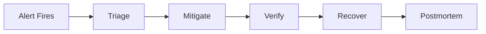
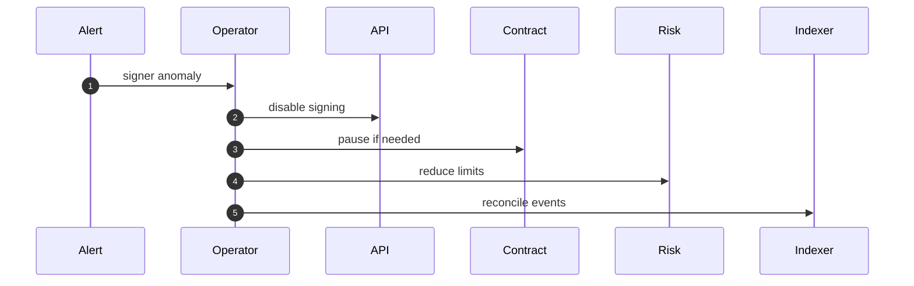
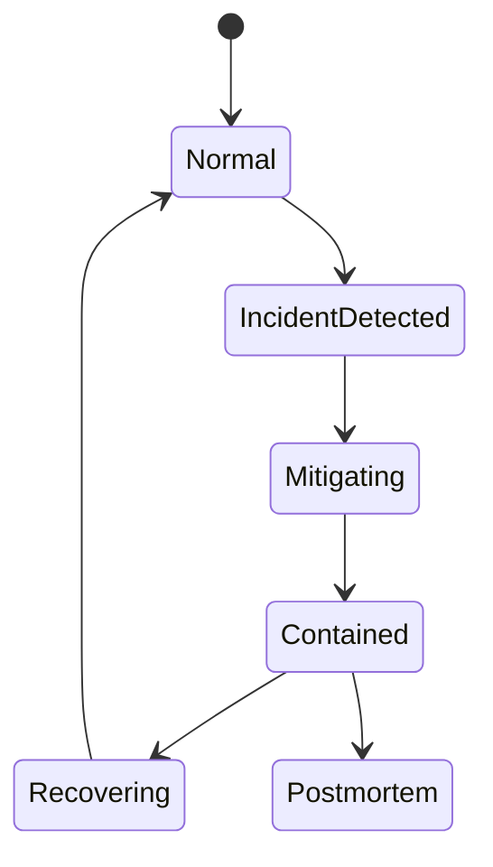

# Chapter 05: Runbook

## Abstract

Runbook 是故障发生时的操作手册。RFQ 系统需要覆盖 signer incident、market data incident、settlement incident、indexer lag、inventory mismatch、hedge failure 和 database degradation。Runbook 的目标是降低响应时间和减少人为判断错误。

## Learning Objectives

- 定义 RFQ 系统主要事故类型。
- 说明每类事故的检测、缓解和恢复。
- 连接 alert、dashboard 和操作步骤。
- 设计事后复盘和审计。

## Background

生产做市系统在高波动或依赖故障时必须快速降级。没有 runbook，操作员可能在压力下做出错误操作，例如继续签名、错误轮换 signer 或重复更新库存。

## Problem Statement

需要一套明确流程，指导 operator 在事故中保护资金、限制库存风险和恢复服务。

## Requirements

### Functional Requirements

- 提供 signer incident runbook。
- 提供 market data stale runbook。
- 提供 indexer lag runbook。
- 提供 hedge failure runbook。
- 提供 post-settlement reconciliation runbook。
- 提供 emergency pause procedure。

### Non-Functional Requirements

- 每个 runbook 关联 alert。
- 操作步骤可审计。
- 恢复前必须验证状态。
- 事故后必须复盘。

## Existing Solutions

通用 SRE runbook 提供框架，但 RFQ 系统需要加入 signer、settlement、inventory 和 hedge 特有步骤。

## Trade-Off Analysis

Runbook 需要持续维护，但能显著减少事故响应混乱。对于资金系统，这是必要文档。

## System Design

## Architecture Diagram

Runbook connects observability, admin controls, contract pause, risk config and incident communication.

## Sequence Diagram

## State Machine

## Data Model

Incident record includes `incidentId`, `severity`, `startTime`, `endTime`, `affectedServices`, `actionsTaken`, `operator`, `linkedAlerts`, `postmortemUrl`.

## API Design

Future admin APIs may support disabling quote signing, lowering limits, disabling tokens and pausing routes. All require authentication and audit.

## Engineering Decisions

- 不确定 signer 安全时先 pause。
- Market data stale 时拒绝报价。
- Indexer lag 时降低 quote notional。
- Hedge failure 时扩大 spread 或暂停 pair。

## Failure Scenarios

### Alert Routing Matrix

| Alert | Primary Triage | Immediate Mitigation | Verification |
| --- | --- | --- | --- |
| `RFQBackendDown` | Check Prometheus `up{job="rfq-backend"}`, pod status and `/health` reachability. | Route traffic away from unhealthy pods and pause rollout if this follows deployment. | `/health`, `/ready` and `GET /metrics` return successfully from healthy pods. |
| `RFQQuoteTrafficStopped` | Confirm whether quote demand stopped or the API stopped receiving `/quote`. | Check ingress, rate limiting, market data and signer readiness before restarting services. | `rfq_quote_requests_total` increases and sample `/quote` requests complete. |
| `RFQQuoteErrorsSpike` | Compare `rfq_quote_errors_total` with rate limits, validation failures, risk rejection labels, market data freshness, pricing and signer health. | Fail closed for unsafe pairs, fix client payload or config drift, and only restart pods after dependency health is understood. | Quote errors return to baseline while valid quote requests receive signed responses within latency SLO. |
| `RFQQuoteResponsesStalled` | Compare `rfq_quote_requests_total`, `rfq_quote_responses_total`, quote errors, risk rejections and signer metrics. | Fail closed for unsafe tokens, restore signer or market data dependencies, and avoid widening limits until signed quote responses recover. | Valid `/quote` requests produce signed responses and `rfq_quote_responses_total` increases again. |
| `RFQSubmitTrafficSpike` | Inspect submit source, quote TTL distribution and nonce reuse signals. | Tighten rate limits and lower per-user submit burst while preserving valid settlement flow. | `rfq_submit_requests_total` returns to baseline and duplicate or invalid submit errors do not rise. |
| `RFQSubmitErrorsSpike` | Compare `rfq_submit_errors_total` with `rfq_rate_limited_total`, validation errors, quote status failures and settlement reverts. | Pause risky submit traffic only if settlement or replay protection is uncertain; otherwise fix client payloads, limits or dependency health by root cause. | Submit errors return to baseline while valid signed quotes still settle and inventory, hedge and PnL paths advance. |
| `RFQSubmitLatencyP95High` | Break down settlement verification, quote repository, inventory update, hedge intent and PnL attribution latency. | Reduce submit concurrency, pause risky pairs if settlement state is lagging, and keep valid replay protection active. | `rfq_submit_latency_seconds` p95 returns below threshold and accepted submissions still produce settlement, hedge and PnL records. |
| `RFQRateLimitSpike` | Break down `rfq_rate_limited_total` by `endpoint` and compare source IP, ingress and client release timing. | Block abusive clients at the edge, tune endpoint limits only after confirming legitimate demand, and keep signer and settlement paths fail-closed. | Rate-limited volume returns to baseline and normal quote, submit and status requests succeed within configured limits. |
| `RFQQuoteLatencyP95High` | Break down market data, pricing, risk and signer latency. | Reduce quote size limits or disable slow pairs until p95 latency is stable. | `rfq_quote_latency_seconds` p95 returns under threshold for at least two windows. |
| `RFQQuoteRiskRejectSpike` | Review risk reject reason labels, inventory exposure, volatility and token allowlist changes. | Widen spread, reduce limits or pause affected pairs instead of bypassing risk. | `rfq_quote_rejections_total` returns to expected baseline and no unsafe quote is signed. |
| `RFQSignerErrors` | Treat signer failures as a security-sensitive incident until key health is known. | Stop signing, verify KMS/HSM or local signer health, and pause settlement if compromise is plausible. | Signer `sign` and `verify` operations pass, old quotes expire, and settlement signer allowlist is correct. |
| `RFQSignerSignThroughputStalled` | Compare quote requests, risk rejections and `rfq_signer_requests_total{operation="sign"}` to see whether safe quote flow is reaching the signer. | Fail closed, inspect signer routing and dependency readiness, and do not bypass signing to restore traffic. | Safe quote requests reach signer `sign` operations and signed quote responses recover. |
| `RFQSignerLatencyP95High` | Check signer dependency latency, key provider status and request queue depth. | Reduce quote traffic, shorten affected route exposure, and fail closed if deadlines become unreliable. | `rfq_signer_latency_seconds` p95 returns below threshold and quote TTL remains usable. |
| `RFQReadinessDegraded` | Inspect `rfq_dependency_status` to identify the degraded component. | Route by component: market data, routing, pricing, risk, signer, quote repository, inventory, execution, settlement event store, PnL or metrics. | `/ready` returns ready and all fixed dependency gauges return `ok`. |
| `RFQDependencyComponentDegraded` | Read the `component` label on `rfq_dependency_status{status="degraded"}` and map it to the owning service or store. | Apply the component-specific mitigation before restarting healthy pods; use readiness degradation as the blast-radius signal. | The affected dependency gauge returns `ok` and `/ready` recovers without unrelated component degradation. |
| `RFQHedgeIntentErrors` | Check settlement event, hedge store and venue credential health. | Tighten quote limits for exposed output token, disable failing venue if errors continue, and repair missing intents with `ReconciliationService.reconcileSettlementToHedge()`. | Hedge intents are present for new settlements and `rfq_hedge_intent_errors_total` stops increasing. |
| `RFQHedgeIntentThroughputStalled` | Compare `rfq_settlements_total` and `rfq_hedge_intents_total`, then inspect hedge store, venue routing and post-settlement worker health. | Widen spread or pause exposed pairs until hedge intents resume, and reconcile missing intents from settlement events with `ReconciliationService.reconcileSettlementToHedge()`. | New settlements produce hedge intents and exposed inventory no longer grows without a hedge plan. |
| `RFQSettlementThroughputStalled` | Compare `rfq_submit_accepted_total` and `rfq_settlements_total`, then inspect duplicate settlement events, verifier output and event-store writes. | Pause submit traffic if new valid settlements cannot be persisted; otherwise rate-limit replaying clients and repair settlement event ingestion. | Accepted submits produce new settlement events and duplicate replays do not dominate the accepted submit stream. |
| `RFQHedgeLagHigh` | Check hedge queue delay, venue latency and worker backlog. | Widen spread for exposed tokens, reduce quote limits and route hedge traffic to a healthy venue. | `rfq_hedge_lag_seconds` p95 returns under threshold and new settlements receive hedge intents promptly. |
| `RFQInventoryExposureHigh` | Inspect `rfq_inventory_balance` by `chain_id` and `token`, then compare recent settlements, hedge lag and risk limits. | Reduce or pause quotes that worsen the exposed token, hedge down inventory and verify settlement replay protection before manual reconciliation. | Inventory balance returns within configured limit and new quotes reflect updated inventory-aware spread. |
| `RFQQuoteStatusUpdateErrors` | Use settlement event as source of truth and inspect quote repository writes. If the incident starts from an indexed `QuoteSettled.quoteHash`, scope the repair with `{ chainId, quoteHash }`. | Run settlement-to-quote reconciliation via `ReconciliationService.reconcileSettlementToQuote()` without replaying contract settlement; validate the local reference path with `make reconciliation-check`. | `/quote/:quoteId` reflects submitted or settled status for affected events. |
| `RFQPnlRecordErrors` | Check PnL store health and settlement-to-PnL attribution inputs. If the incident starts from an indexed `QuoteSettled.quoteHash`, scope the repair with `{ chainId, quoteHash }`. | Run settlement-to-PnL reconciliation via `ReconciliationService.reconcileSettlementToPnl()` from settlement events and signed quote records; validate the local reference path with `make reconciliation-check`. | `/pnl` includes repaired records and `rfq_pnl_record_errors_total` stops increasing. |
| `RFQPnlThroughputStalled` | Compare `rfq_settlements_total` and `rfq_pnl_trades_total`, then inspect PnL store writes, market snapshot availability and best-effort attribution logs. | Run settlement-to-PnL reconciliation with `ReconciliationService.reconcileSettlementToPnl()` and keep quoting conservative until realized PnL attribution catches up; use `{ chainId, quoteHash }` for single-event recovery. | New settlements create PnL trade records and `/pnl` reflects the recovered attribution stream. |
| `RFQRealizedPnlNegative` | Inspect `rfq_realized_pnl_token_out` by `chain_id` and `token`, then compare pricing version, market snapshot, spread policy and settlement records. | Widen spread or pause affected pairs, stop signing if pricing is stale, and reconcile PnL attribution before resuming normal quote size. | Realized PnL returns above zero for the affected token and new settlements use the corrected pricing and risk policy. |

### Signer Compromise

1. Disable Signer Service.
2. Pause RFQSettlement if blast radius is unknown.
3. Remove compromised signer.
4. Wait for old quotes to expire.
5. Reconcile settlements.
6. Rotate key and restore.

### Emergency Pause Procedure

Use this procedure when signer compromise, settlement replay uncertainty, treasury exposure, broken token whitelist, or unsafe market data could put funds at risk. Pausing settlement is a privileged action and must be recorded in the incident timeline.

1. Declare incident severity, assign an incident commander and capture the triggering alert, traceId or transaction hash.
2. Stop new quote signing for affected chains or pairs so users cannot receive fresh executable quotes during the pause decision.
3. Call `RFQSettlement.setPaused(true)` from the owner-controlled admin path and record the transaction hash, operator identity and approval trail.
4. Verify `RFQSettlement.paused()` is true and run a negative submit canary that must revert with `Paused`.
5. Keep `/quote` fail-closed or risk-limited for affected pairs, and keep `/submit` status endpoints available so clients and operators can inspect already observed settlements.
6. Reconcile settlement, inventory, hedge and PnL state from `QuoteSettled` events before unpausing; do not manually replay settlement side effects from API logs.
7. Before unpause, verify signer allowlist, token whitelist, treasury address, nonce replay protection, readiness and alert health.
8. Call `RFQSettlement.setPaused(false)` only after two-person approval, then run a small quote/submit canary and watch `rfq_submit_errors_total`, `rfq_settlements_total`, inventory exposure and hedge lag.
9. Close the pause window with a postmortem link, affected block range, reconciled settlement count and remaining follow-up actions.

### Market Data Stale

1. Stop signing affected pairs.
2. Verify source health.
3. Compare fallback sources.
4. Resume with conservative spread.

### Indexer Lag

1. Check event consumer offset.
2. Stop high-notional quote signing.
3. Replay from last confirmed block and apply removed/reorg logs through `SettlementEventService.removeSettlementEvent()`.
4. For each removed event, run `ReconciliationService.reconcileRemovedSettlementToQuote()` so `/quote/:quoteId` no longer points at a non-canonical settlement.
5. Run `ReconciliationService.reconcileRemovedSettlementToHedge()` and `ReconciliationService.reconcileRemovedSettlementToPnl()` for the same removed event so hedge and realized PnL stores no longer retain post-trade records from the reorged settlement.
6. Reconcile inventory from the canonical settlement event stream before restoring normal quote size.

### Hedge Failure

1. Disable failing venue.
2. Route to backup venue if available.
3. Tighten risk limits.
4. Record residual exposure.

### Post-Settlement Persistence Drift

Alerts: `RFQQuoteStatusUpdateErrors`, `RFQHedgeIntentErrors`, `RFQHedgeLagHigh`, `RFQPnlRecordErrors`.

1. Treat the settlement event as source of truth and do not revert or replay contract settlement from the API path.
2. If the incident is tied to a specific on-chain log, read `chainId` and indexed `QuoteSettled.quoteHash`, then pass `{ chainId, quoteHash }` to the reconciliation method so the repair uses `SettlementEventService.getSettlementEventsByQuoteHash()` instead of a full event-stream scan.
3. Start `ReconciliationService.reconcileSettlementToQuote()` for `rfq_quote_status_update_errors_total` and repair `submitted` or `settled` status from settlement events.
4. Start `ReconciliationService.reconcileSettlementToHedge()` for `rfq_hedge_intent_errors_total`; if hedge intent creation keeps failing, tighten quote limits for the affected output token.
5. Check `rfq_hedge_lag_seconds` and hedge worker backlog; if lag remains high, widen spread and reduce quote limits before re-enabling full traffic.
6. Start `ReconciliationService.reconcileSettlementToPnl()` for `rfq_pnl_record_errors_total` and rebuild missing realized PnL rows from settlement events and signed quote records.
7. When the drift follows a reorg removal, run `ReconciliationService.reconcileRemovedSettlementToQuote()`, `ReconciliationService.reconcileRemovedSettlementToHedge()` and `ReconciliationService.reconcileRemovedSettlementToPnl()` for the removed event before canonical event-stream reconciliation.
8. Verify `/settlements/:settlementEventId`, `/quote/:quoteId`, `/hedges/:hedgeOrderId`, `/pnl` and `GET /metrics` before closing the incident.

### Pod Termination Or Rollout Drain

Alerts: Kubernetes rollout timeout, elevated 5xx during deployment, pods killed before graceful shutdown.

1. Confirm the Deployment has `preStop` sleep and `terminationGracePeriodSeconds` configured.
2. Verify old pods receive SIGTERM and log Fastify close without duplicate shutdown attempts.
3. Check `/ready` endpoints are removed from service endpoints before pods exit.
4. Watch `rfq_quote_errors_total`, `rfq_submit_errors_total` and HTTP 5xx dashboards during rollout.
5. If forced kills occur before the grace period, pause rollout, increase drain time, and inspect slow in-flight submit or settlement dependencies.

## Security Considerations

Runbook operations are privileged. Require multi-person approval for signer removal, contract pause/unpause and treasury operations.

## Performance Considerations

Incident commands must be fast and documented. Avoid relying on slow ad hoc database queries during critical incidents.

## Testing Strategy

Run game days: signer unavailable, stale market data, indexer lag, hedge venue failure. Verify alert, action and recovery.

## Interview Notes

Runbook shows production maturity. A senior engineer should explain not only how to build RFQ, but how to operate it during incidents.

## Summary

Runbook turns monitoring signals into concrete actions. It is required to protect funds and inventory in production.

## References

- SRE incident response
- Smart contract emergency pause
- Key rotation procedures
