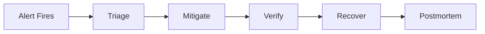
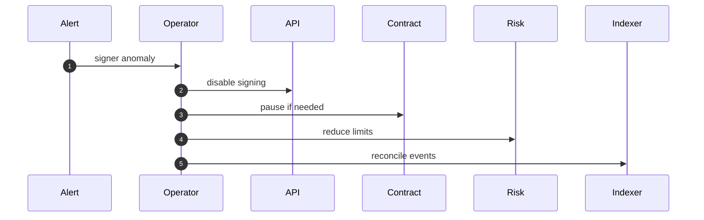
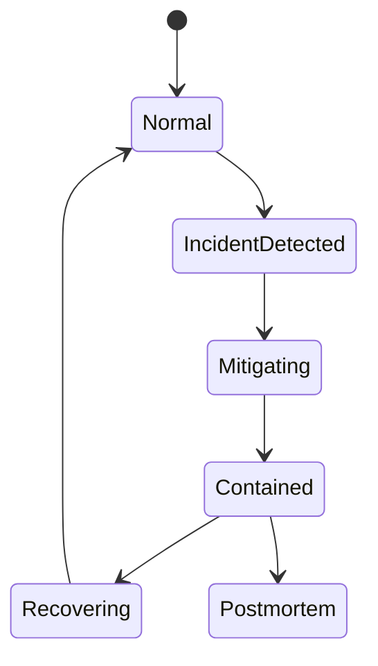

# Chapter 05: Runbook

## Abstract

Runbook 是故障发生时的操作手册。RFQ 系统需要覆盖 signer incident、market data incident、settlement incident、indexer lag、inventory mismatch、hedge failure 和 database degradation。Runbook 的目标是降低响应时间和减少人为判断错误。

## Learning Objectives

- 定义 RFQ 系统主要事故类型。
- 说明每类事故的检测、缓解和恢复。
- 连接 alert、dashboard 和操作步骤。
- 设计事后复盘和审计。

## Background

生产做市系统在高波动或依赖故障时必须快速降级。没有 runbook，操作员可能在压力下做出错误操作，例如继续签名、错误轮换 signer 或重复更新库存。

## Problem Statement

需要一套明确流程，指导 operator 在事故中保护资金、限制库存风险和恢复服务。

## Requirements

### Functional Requirements

- 提供 signer incident runbook。
- 提供 market data stale runbook。
- 提供 indexer lag runbook。
- 提供 hedge failure runbook。
- 提供 post-settlement reconciliation runbook。
- 提供 emergency pause procedure。

### Non-Functional Requirements

- 每个 runbook 关联 alert。
- 操作步骤可审计。
- 恢复前必须验证状态。
- 事故后必须复盘。

## Existing Solutions

通用 SRE runbook 提供框架，但 RFQ 系统需要加入 signer、settlement、inventory 和 hedge 特有步骤。

## Trade-Off Analysis

Runbook 需要持续维护，但能显著减少事故响应混乱。对于资金系统，这是必要文档。

## System Design

## Architecture Diagram

Runbook connects observability, admin controls, contract pause, risk config and incident communication.

## Sequence Diagram

## State Machine

## Data Model

Incident record includes `incidentId`, `severity`, `startTime`, `endTime`, `affectedServices`, `actionsTaken`, `operator`, `linkedAlerts`, `postmortemUrl`.

## API Design

Future admin APIs may support disabling quote signing, lowering limits, disabling tokens and pausing routes. All require authentication and audit.

## Engineering Decisions

- 不确定 signer 安全时先 pause。
- Market data stale 时拒绝报价。
- Indexer lag 时降低 quote notional。
- Hedge failure 时扩大 spread 或暂停 pair。

## Failure Scenarios

### Signer Compromise

1. Disable Signer Service.
2. Pause RFQSettlement if blast radius is unknown.
3. Remove compromised signer.
4. Wait for old quotes to expire.
5. Reconcile settlements.
6. Rotate key and restore.

### Market Data Stale

1. Stop signing affected pairs.
2. Verify source health.
3. Compare fallback sources.
4. Resume with conservative spread.

### Indexer Lag

1. Check event consumer offset.
2. Stop high-notional quote signing.
3. Replay from last confirmed block.
4. Reconcile inventory.

### Hedge Failure

1. Disable failing venue.
2. Route to backup venue if available.
3. Tighten risk limits.
4. Record residual exposure.

### Post-Settlement Persistence Drift

Alerts: `RFQQuoteStatusUpdateErrors`, `RFQHedgeIntentErrors`, `RFQPnlRecordErrors`.

1. Treat the settlement event as source of truth and do not revert or replay contract settlement from the API path.
2. Start settlement-to-quote reconciliation for `rfq_quote_status_update_errors_total` and repair `submitted` or `settled` status from settlement events.
3. Start settlement-to-hedge reconciliation for `rfq_hedge_intent_errors_total`; if hedge intent creation keeps failing, tighten quote limits for the affected output token.
4. Start settlement-to-PnL reconciliation for `rfq_pnl_record_errors_total` and rebuild missing realized PnL rows from settlement events and market snapshots.
5. Verify `/settlements/:settlementEventId`, `/quote/:quoteId`, `/hedges/:hedgeOrderId`, `/pnl` and `GET /metrics` before closing the incident.

### Pod Termination Or Rollout Drain

Alerts: Kubernetes rollout timeout, elevated 5xx during deployment, pods killed before graceful shutdown.

1. Confirm the Deployment has `preStop` sleep and `terminationGracePeriodSeconds` configured.
2. Verify old pods receive SIGTERM and log Fastify close without duplicate shutdown attempts.
3. Check `/ready` endpoints are removed from service endpoints before pods exit.
4. Watch `rfq_quote_errors_total`, `rfq_submit_errors_total` and HTTP 5xx dashboards during rollout.
5. If forced kills occur before the grace period, pause rollout, increase drain time, and inspect slow in-flight submit or settlement dependencies.

## Security Considerations

Runbook operations are privileged. Require multi-person approval for signer removal, contract pause/unpause and treasury operations.

## Performance Considerations

Incident commands must be fast and documented. Avoid relying on slow ad hoc database queries during critical incidents.

## Testing Strategy

Run game days: signer unavailable, stale market data, indexer lag, hedge venue failure. Verify alert, action and recovery.

## Interview Notes

Runbook shows production maturity. A senior engineer should explain not only how to build RFQ, but how to operate it during incidents.

## Summary

Runbook turns monitoring signals into concrete actions. It is required to protect funds and inventory in production.

## References

- SRE incident response
- Smart contract emergency pause
- Key rotation procedures
