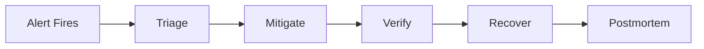
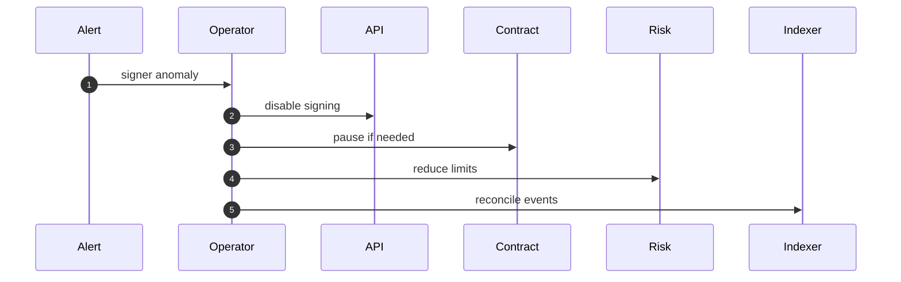
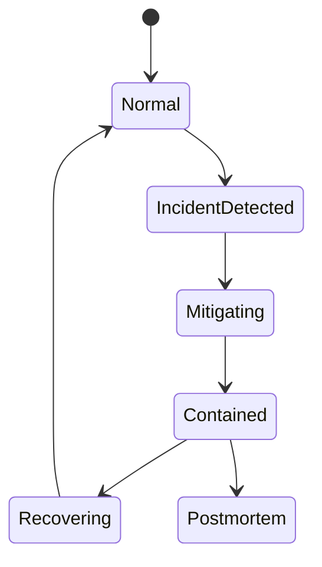

# Chapter 05: Runbook

## Abstract

Runbook 是故障发生时的操作手册。RFQ 系统需要覆盖 signer incident、market data incident、settlement incident、indexer lag、inventory mismatch、hedge failure 和 database degradation。Runbook 的目标是降低响应时间和减少人为判断错误。

## Learning Objectives

- 定义 RFQ 系统主要事故类型。
- 说明每类事故的检测、缓解和恢复。
- 连接 alert、dashboard 和操作步骤。
- 设计事后复盘和审计。

## Background

生产做市系统在高波动或依赖故障时必须快速降级。没有 runbook，操作员可能在压力下做出错误操作，例如继续签名、错误轮换 signer 或重复更新库存。

## Problem Statement

需要一套明确流程，指导 operator 在事故中保护资金、限制库存风险和恢复服务。

## Requirements

### Functional Requirements

- 提供 signer incident runbook。
- 提供 market data stale runbook。
- 提供 indexer lag runbook。
- 提供 hedge failure runbook。
- 提供 post-settlement reconciliation runbook。
- 提供 emergency pause procedure。

### Non-Functional Requirements

- 每个 runbook 关联 alert。
- 操作步骤可审计。
- 恢复前必须验证状态。
- 事故后必须复盘。

## Existing Solutions

通用 SRE runbook 提供框架，但 RFQ 系统需要加入 signer、settlement、inventory 和 hedge 特有步骤。

## Trade-Off Analysis

Runbook 需要持续维护，但能显著减少事故响应混乱。对于资金系统，这是必要文档。

## System Design

## Architecture Diagram

Runbook connects observability, admin controls, contract pause, risk config and incident communication.

## Sequence Diagram

## State Machine

## Data Model

Incident record includes `incidentId`, `severity`, `startTime`, `endTime`, `affectedServices`, `actionsTaken`, `operator`, `linkedAlerts`, `postmortemUrl`.

## API Design

Future admin APIs may support disabling quote signing, lowering limits, disabling tokens and pausing routes. All require authentication and audit.

## Engineering Decisions

- 不确定 signer 安全时先 pause。
- Market data stale 时拒绝报价。
- Indexer lag 时降低 quote notional。
- Hedge failure 时扩大 spread 或暂停 pair。

## Failure Scenarios

### Alert Routing Matrix

| Alert | Primary Triage | Immediate Mitigation | Verification |
| --- | --- | --- | --- |
| `RFQBackendDown` | Check Prometheus `up{job="rfq-backend"}`, pod status and `/health` reachability. | Route traffic away from unhealthy pods and pause rollout if this follows deployment. | `/health`, `/ready` and `GET /metrics` return successfully from healthy pods. |
| `RFQQuoteTrafficStopped` | Confirm whether quote demand stopped or the API stopped receiving `/quote`. | Check ingress, rate limiting, market data and signer readiness before restarting services. | `rfq_quote_requests_total` increases and sample `/quote` requests complete. |
| `RFQQuoteErrorsSpike` | Compare `rfq_quote_errors_total` with rate limits, validation failures, risk rejection labels, market data freshness, pricing and signer health. | Fail closed for unsafe pairs, fix client payload or config drift, and only restart pods after dependency health is understood. | Quote errors return to baseline while valid quote requests receive signed responses within latency SLO. |
| `RFQQuoteResponsesStalled` | Compare `rfq_quote_requests_total`, `rfq_quote_responses_total`, quote errors, risk rejections and signer metrics. | Fail closed for unsafe tokens, restore signer or market data dependencies, and avoid widening limits until signed quote responses recover. | Valid `/quote` requests produce signed responses and `rfq_quote_responses_total` increases again. |
| `RFQSubmitTrafficSpike` | Inspect submit source, quote TTL distribution and nonce reuse signals. | Tighten rate limits and lower per-user submit burst while preserving valid settlement flow. | `rfq_submit_requests_total` returns to baseline and duplicate or invalid submit errors do not rise. |
| `RFQSubmitErrorsSpike` | Compare `rfq_submit_errors_total` with `rfq_rate_limited_total`, validation errors, quote status failures and settlement reverts. | Pause risky submit traffic only if settlement or replay protection is uncertain; otherwise fix client payloads, limits or dependency health by root cause. | Submit errors return to baseline while valid signed quotes still settle and inventory, hedge and PnL paths advance. |
| `RFQSubmitLatencyP95High` | Break down settlement verification, quote repository, inventory update, hedge intent and PnL attribution latency. | Reduce submit concurrency, pause risky pairs if settlement state is lagging, and keep valid replay protection active. | `rfq_submit_latency_seconds` p95 returns below threshold and accepted submissions still produce settlement, hedge and PnL records. |
| `RFQRateLimitSpike` | Break down `rfq_rate_limited_total` by `endpoint` and compare source IP, ingress and client release timing. | Block abusive clients at the edge, tune endpoint limits only after confirming legitimate demand, and keep signer and settlement paths fail-closed. | Rate-limited volume returns to baseline and normal quote, submit and status requests succeed within configured limits. |
| `RFQQuoteLatencyP95High` | Break down market data, pricing, risk and signer latency. | Reduce quote size limits or disable slow pairs until p95 latency is stable. | `rfq_quote_latency_seconds` p95 returns under threshold for at least two windows. |
| `RFQQuoteRiskRejectSpike` | Review risk reject reason labels, inventory exposure, volatility and token allowlist changes. | Widen spread, reduce limits or pause affected pairs instead of bypassing risk. | `rfq_quote_rejections_total` returns to expected baseline and no unsafe quote is signed. |
| `RFQSignerErrors` | Treat signer failures as a security-sensitive incident until key health is known. | Stop signing, verify KMS/HSM or local signer health, and pause settlement if compromise is plausible. | Signer `sign` and `verify` operations pass, old quotes expire, and settlement signer allowlist is correct. |
| `RFQSignerSignThroughputStalled` | Compare quote requests, risk rejections and `rfq_signer_requests_total{operation="sign"}` to see whether safe quote flow is reaching the signer. | Fail closed, inspect signer routing and dependency readiness, and do not bypass signing to restore traffic. | Safe quote requests reach signer `sign` operations and signed quote responses recover. |
| `RFQSignerLatencyP95High` | Check signer dependency latency, key provider status and request queue depth. | Reduce quote traffic, shorten affected route exposure, and fail closed if deadlines become unreliable. | `rfq_signer_latency_seconds` p95 returns below threshold and quote TTL remains usable. |
| `RFQMarketDataCacheCold` | Compare `rfq_market_data_cache_hits_total` and `rfq_market_data_cache_misses_total`, then inspect `RFQ_MARKET_PAIRS`, `RFQ_CEX_PAIRS`, CEX stream health and market data readiness. | Keep quote limits conservative, disable pairs with cold or stale order books, and restore background prefetch before relying on tighter spreads. | Cache hits increase on valid `/quote` traffic and misses stop dominating the quote path. |
| `RFQCexOrderBookUnavailable` | Inspect source states, maximum exchange-event age, WebSocket state, Binance update-id continuity and Coinbase snapshot/update timestamps. | Keep the CEX cache invalidated, allow the connector to obtain a new full snapshot, and use only a separately healthy lower-priority provider while recovery is in progress. | Required sources are `ready`, event age stays inside `RFQ_CEX_MAX_SOURCE_AGE_MS`, and affected pairs return to `usable`. |
| `RFQCexOrderBookPairBlocked` | Compare every configured venue mid price, spread, event time and the pair's `RFQ_CEX_MIN_SOURCES` quorum. | Pause the pair or retain oracle fallback; isolate the divergent venue and never relax the deviation threshold merely to restore quote volume. | Quorum is restored, deviation rejections return to zero, and all accepted sources fit the configured bps guard. |
| `RFQCexOrderBookConnectorErrors` | Break down errors by the fixed exchange label, then inspect REST snapshot reachability, WebSocket reconnects, malformed payloads and sequence gaps. | Restore exchange/network connectivity and let the connector resynchronize from a full snapshot; do not reuse the pre-error local book. | Connector error rate returns to baseline and synchronized fresh sources remain stable for two windows. |
| `RFQReadinessDegraded` | Inspect `rfq_dependency_status` to identify the degraded component. | Route by component: market data, routing, pricing, risk, signer, quote repository, inventory, execution, settlement event store, PnL or metrics. | `/ready` returns ready and all fixed dependency gauges return `ok`. |
| `RFQDependencyComponentDegraded` | Read the `component` label on `rfq_dependency_status{status="degraded"}` and map it to the owning service or store. | Apply the component-specific mitigation before restarting healthy pods; use readiness degradation as the blast-radius signal. | The affected dependency gauge returns `ok` and `/ready` recovers without unrelated component degradation. |
| `RFQHedgeIntentErrors` | Check settlement event, hedge store and venue credential health. | Tighten quote limits for exposed output token, disable failing venue if errors continue, and repair missing intents with `ReconciliationService.reconcileSettlementToHedge()`. | Hedge intents are present for new settlements and `rfq_hedge_intent_errors_total` stops increasing. |
| `RFQHedgeIntentThroughputStalled` | Compare `rfq_settlements_total` and `rfq_hedge_intents_total`, then inspect hedge store, venue routing and post-settlement worker health. | Widen spread or pause exposed pairs until hedge intents resume, and reconcile missing intents from settlement events with `ReconciliationService.reconcileSettlementToHedge()`. | New settlements produce hedge intents and exposed inventory no longer grows without a hedge plan. |
| `RFQSettlementThroughputStalled` | Compare `rfq_submit_accepted_total` and `rfq_settlements_total`, then inspect duplicate settlement events, verifier output and event-store writes. | Pause submit traffic if new valid settlements cannot be persisted; otherwise rate-limit replaying clients and repair settlement event ingestion. | Accepted submits produce new settlement events and duplicate replays do not dominate the accepted submit stream. |
| `RFQHedgeLagHigh` | Check hedge queue delay, venue latency and worker backlog. | Widen spread for exposed tokens, reduce quote limits and route hedge traffic to a healthy venue. | `rfq_hedge_lag_seconds` p95 returns under threshold and new settlements receive hedge intents promptly. |
| `RFQHedgeWorkerIterationErrors` | Check worker `/ready`, PostgreSQL connectivity, expired leases and structured iteration errors. | Keep ambiguous jobs queued, restore the database path, and reduce risk-increasing quote limits while workers cannot claim jobs. | Iteration errors stop, leases advance, and due rows are claimed again. |
| `RFQHedgeWorkerRetries` | Group queued rows by stable `last_error_code`, then query Binance using each persisted `client_order_id`. | Fix rate limit, clock, network or venue issues without changing client ids; pause exposed pairs when retry volume grows. | Retry rate returns to baseline and each existing external order reaches an explicit terminal state. |
| `RFQHedgeWorkerProcessingStalled` | Compare new hedge intents, worker last-processed timestamp, due rows and lease expiry across replicas. | Restore or roll back workers, leave unknown external states queued, and tighten inventory limits until backlog drains. | Last-processed time advances, queued depth falls, and inventory exposure remains within policy. |
| `RFQInventoryExposureHigh` | Inspect `rfq_inventory_balance` by `chain_id` and `token`, then compare recent settlements, hedge lag and risk limits. | Reduce or pause quotes that worsen the exposed token, hedge down inventory and verify settlement replay protection before manual reconciliation. | Inventory balance returns within configured limit and new quotes reflect updated inventory-aware spread. |
| `RFQQuoteStatusUpdateErrors` | Use settlement event as source of truth and inspect quote repository writes. If the incident starts from an indexed `QuoteSettled.quoteHash`, scope the repair with `{ chainId, quoteHash }`. | Run settlement-to-quote reconciliation via `ReconciliationService.reconcileSettlementToQuote()` without replaying contract settlement; validate the local reference path with `make reconciliation-check`. | `/quote/:quoteId` reflects submitted or settled status for affected events. |
| `RFQPnlRecordErrors` | Check PnL store health and settlement-to-PnL attribution inputs. If the incident starts from an indexed `QuoteSettled.quoteHash`, scope the repair with `{ chainId, quoteHash }`. | Run settlement-to-PnL reconciliation via `ReconciliationService.reconcileSettlementToPnl()` from settlement events and signed quote records; validate the local reference path with `make reconciliation-check`. | `/pnl` includes repaired records and `rfq_pnl_record_errors_total` stops increasing. |
| `RFQPnlThroughputStalled` | Compare `rfq_settlements_total` and `rfq_pnl_trades_total`, then inspect PnL store writes, market snapshot availability and best-effort attribution logs. | Run settlement-to-PnL reconciliation with `ReconciliationService.reconcileSettlementToPnl()` and keep quoting conservative until realized PnL attribution catches up; use `{ chainId, quoteHash }` for single-event recovery. | New settlements create PnL trade records and `/pnl` reflects the recovered attribution stream. |
| `RFQRealizedPnlNegative` | Inspect `rfq_realized_pnl_token_out` by `chain_id` and `token`, then compare pricing version, market snapshot, spread policy and settlement records. | Widen spread or pause affected pairs, stop signing if pricing is stale, and reconcile PnL attribution before resuming normal quote size. | Realized PnL returns above zero for the affected token and new settlements use the corrected pricing and risk policy. |
| `RFQAnalyticsWorkerDown` | Check analytics pod state, `/health`, `/ready`, migration completion and worker logs without treating ClickHouse as trading truth. | Restart or roll back only the analytics Deployment; keep API/hedge services isolated and preserve all unpublished outbox rows. | Worker `/ready` returns ok, Prometheus `up` recovers and pending outbox age starts falling. |
| `RFQAnalyticsOutboxBacklog` | Inspect `analytics_outbox` pending count, oldest `created_at`, expired leases and stable `last_error_code`; verify the fixed topic exists. | Restore PostgreSQL-to-Redpanda connectivity, SASL/TLS and topic permissions. Do not delete pending rows or mark them published manually. | `rfq_analytics_outbox_pending` and oldest age drain toward zero while publish and consume counters advance. |
| `RFQAnalyticsPublishRetries` | Compare broker health, topic metadata, all-replica acknowledgements, request timeout and publisher lease duration. | Repair Redpanda or network policy, retain deterministic event ids and allow bounded retries; avoid enabling automatic topic creation during the incident. | Retry rate returns to baseline and each acknowledged row receives `published_at` under its current lease owner. |
| `RFQAnalyticsConsumerErrors` | Inspect the first uncommitted partition offset, envelope/header validation, ClickHouse table schema and authenticated ping. | Fix the consumer or ClickHouse schema before advancing offsets. Never skip malformed evidence without an approved replay/audit record. | The blocked offset inserts successfully, consumer offsets advance and duplicate event ids converge through the replacing projection. |
| `RFQAnalyticsProjectionStalled` | Compare published and ClickHouse event rates, consumer-group lag, last-consumed timestamp and the first uncommitted partition offset. | Restore ClickHouse inserts or consumer assignment without resetting offsets; keep PostgreSQL as operational truth while replay catches up. | ClickHouse event counter and last-consumed timestamp advance, and consumer lag drains for every partition. |
| `RFQAnalyticsOutboxCleanupStalled` | Check retention configuration, cleanup batch size, publisher iteration errors and old rows with non-null `published_at`. | Repair janitor polling and delete only published rows older than retention in bounded batches; never include pending rows. | `rfq_analytics_outbox_deleted_total` advances and retained table size stabilizes without losing unpublished events. |
| `RFQReconciliationWorkerDown` | Check reconciliation pod state, migration 005, `/ready`, PostgreSQL connectivity and expired leases. | Restore or roll back the worker Deployment; do not replay `/submit` or mutate settlement events to force projections. | Prometheus `up` recovers and pending desired revisions begin draining. |
| `RFQReconciliationBacklog` | Inspect pending count, oldest `requested_at`, lease expiry, desired/processed revisions and stable `last_error_code`. | Repair the failing quote, hedge, PnL, or job-store dependency; keep settlement rows unchanged and reduce risk-increasing quote limits while hedge projection is delayed. | Pending count and oldest age converge toward zero across replicas. |
| `RFQReconciliationRetries` | Group jobs by stable `last_error_code` and inspect the referenced quote plus canonical settlement history. | Fix the named dependency or data conflict; never advance `processed_revision` manually because that suppresses recovery. | Retry rate returns to baseline and each job reaches its current desired revision. |
| `RFQReconciliationProcessingStalled` | Compare pending jobs, last-processed timestamp, active lease owners and pod readiness. | Restart only after lease expiry or roll back the worker; preserve the newer desired revision when an old worker finishes stale. | Last-processed time advances and no due job remains behind an expired lease. |
| `RFQSettlementIndexerDown` | Check indexer pod, migration 007, `/health`, `/ready`, Secret injection and Prometheus target state. | Restore or roll back only the indexer Deployment; keep API receipt confirmation available and reduce affected-chain quote limits while independent discovery is down. | `up{job="rfq-settlement-indexer"}` recovers and durable cursors resume advancing. |
| `RFQSettlementIndexerLagHigh` | Compare `safe_head`, `next_block`, cursor lease owner, RPC latency and database writes for the affected `chain_id`. | Stop risk-increasing quotes, restore RPC/database capacity, and let the worker replay from its durable cursor without manually skipping blocks. | `rfq_settlement_indexer_lag_blocks` drains to baseline and sampled confirmed events appear in `settlement_events`. |
| `RFQSettlementIndexerErrors` | Group only by the bounded `code` label. For `QUOTE_NOT_FOUND` restore the signed quote row; for `EVENT_MISMATCH` compare contract log, stored quote and EIP-712 hash; for lease/RPC errors inspect ownership and provider health. | Keep the cursor fixed, pause affected-chain quoting if inventory may be stale, and never suppress the offending log. | Error counters stop increasing and the exact blocked range commits with matching settlement evidence. |
| `RFQSettlementIndexerDeepReorg` | Compare checkpoint and canonical block hashes across at least two independent RPC providers and determine the common ancestor depth. | Pause affected-chain quote signing and settlement-dependent risk increases. Do not delete checkpoints or jump `next_block`; use an approved recovery change if the rollback window must be expanded. | One audited common ancestor is established, orphan events are non-canonical, replacement logs are indexed, and inventory/reconciliation converge. |
| `RFQSettlementIndexerProgressStalled` | Compare range commits, last poll, cursor age, lease expiry and RPC latency while confirmed blocks remain eligible. | Repair the blocked database/RPC path or wait for an active lease to expire; never create a second cursor or jump the existing one. | Poll and cursor timestamps advance, range commits resume, and lag drains. |
| `RFQSettlementIndexerDuplicateStorm` | Determine whether clients are repeatedly calling `/submit`, multiple RPCs are replaying the same range, or a lease is expiring before CAS commit. | Rate-limit abusive callback retries, fix lease/request-timeout sizing, and retain the canonical idempotency keys. | Duplicate rate returns to baseline with exactly one inventory delta per settlement event. |
| `RFQSettlementIndexerReorgDetected` | Inspect reorg depth, removed-event count, checkpoint hashes and post-trade reconciliation revisions. | Reduce affected-chain exposure until replacement canonical logs and downstream projections converge. | Old events remain non-canonical, one replacement can become canonical, and inventory/quote/hedge/PnL state agrees. |

When `rfq_dependency_status{component="rateLimitStore",status="degraded"}` is active, confirm Redis endpoint, TLS, credentials, latency and keyspace health before restarting API pods. Keep affected pods out of readiness and preserve `RATE_LIMIT_UNAVAILABLE` fail-closed behavior; switching production replicas to process-local buckets would multiply the effective limit and is not an acceptable mitigation. Recovery is complete only after Redis `PING` succeeds, `/ready` reports `rateLimitStore=ok`, and a controlled multi-replica request test observes one shared quota.

For a confirmed chain reorg, call the settlement removal path with exact `chainId`、`txHash`、`blockNumber` and `logIndex`. Verify the database transaction changed the event to `canonical=false`, populated `removed_at`, and rebuilt `inventory_positions` before running removed-settlement reconciliation for hedge, PnL, and quote pointers. Never delete the settlement audit row manually. Recovery requires canonical chain-order queries to exclude the event and shared inventory reads from two API replicas to return the same repaired balances.

### Signer Compromise

1. Disable Signer Service.
2. Pause RFQSettlement if blast radius is unknown.
3. Remove compromised signer.
4. Wait for old quotes to expire.
5. Reconcile settlements.
6. Rotate key and restore.

### Emergency Pause Procedure

Use this procedure when signer compromise, settlement replay uncertainty, treasury exposure, broken token whitelist, or unsafe market data could put funds at risk. Pausing settlement is a privileged action and must be recorded in the incident timeline.

1. Declare incident severity, assign an incident commander and capture the triggering alert, traceId or transaction hash.
2. Stop new quote signing for affected chains or pairs so users cannot receive fresh executable quotes during the pause decision.
3. Call `RFQSettlement.setPaused(true)` from the owner-controlled admin path and record the transaction hash, operator identity and approval trail.
4. Verify `RFQSettlement.paused()` is true and run a negative submit canary that must revert with `Paused`.
5. Keep `/quote` fail-closed or risk-limited for affected pairs, and keep `/submit` status endpoints available so clients and operators can inspect already observed settlements.
6. Reconcile settlement, inventory, hedge and PnL state from `QuoteSettled` events before unpausing; do not manually replay settlement side effects from API logs.
7. Before unpause, verify signer allowlist, token whitelist, treasury address, nonce replay protection, readiness and alert health.
8. Call `RFQSettlement.setPaused(false)` only after two-person approval, then run a small quote/submit canary and watch `rfq_submit_errors_total`, `rfq_settlements_total`, inventory exposure and hedge lag.
9. Close the pause window with a postmortem link, affected block range, reconciled settlement count and remaining follow-up actions.

### Market Data Stale

1. Stop signing affected pairs.
2. Verify source health.
3. Compare fallback sources.
4. Resume with conservative spread.

### Indexer Lag

Alerts: `RFQSettlementIndexerDown`, `RFQSettlementIndexerLagHigh`, `RFQSettlementIndexerErrors`, `RFQSettlementIndexerDeepReorg`, `RFQSettlementIndexerProgressStalled`, `RFQSettlementIndexerDuplicateStorm`, `RFQSettlementIndexerReorgDetected`.

1. Read `rfq_settlement_indexer_safe_head`, `rfq_settlement_indexer_next_block`, lag, last-poll time and cursor-update age for the affected `chain_id`; do not infer progress from pod liveness alone.
2. Stop high-notional or risk-increasing quote signing on the affected chain while confirmed settlements may be absent from inventory.
3. Inspect `settlement_indexer_cursors` lease owner/expiry/revision and the latest `settlement_indexer_checkpoints`. Wait for a live lease to expire before restarting or scaling workers; never overwrite `next_block` while an owner can still commit.
4. Verify the configured contract address, deployment `startBlock`, confirmation depth and RPC `eth_getLogs` response against an independent provider. RPC URLs and provider errors remain secret and must not be pasted into shared incident channels.
5. For `QUOTE_NOT_FOUND`, restore the exact signed quote audit row keyed by `(chainId, user, nonce)` from the authoritative backup. For `EVENT_MISMATCH`, recompute the EIP-712 quote hash and compare emitted user/tokens/amounts/nonce. Never skip the log to release later ranges.
6. For a checkpoint mismatch inside `reorgLookbackBlocks`, allow the worker to find the common ancestor. Verify orphaned events become `canonical=false`, inventory rebuilds, and the cursor rolls back only after event removals. Crash-before-cursor-commit leftovers are reconciled against confirmed logs in the replayed range automatically.
7. For `DEEP_REORG`, pause automatic recovery and compare at least two RPC providers. Expand/reseed the rollback window only through a reviewed change record containing old/new cursor, checkpoint hashes, affected settlement ids and rollback owner.
8. For each removed event, verify the post-trade reconciliation job advances its desired revision. PnL and unsubmitted hedges may be removed; submission-attempted or terminal CEX hedges remain economic evidence and require separately approved compensation if no longer desired.
9. Resume normal quote size only after lag reaches baseline, a sampled wallet transaction is discovered without relying on `/submit`, inventory matches canonical events, and quote/hedge/PnL projections converge.

### Hedge Failure

1. Disable failing venue.
2. Route to backup venue if available.
3. Tighten risk limits.
4. Record residual exposure.

### Post-Settlement Persistence Drift

Alerts: `RFQQuoteStatusUpdateErrors`, `RFQHedgeIntentErrors`, `RFQHedgeLagHigh`, `RFQPnlRecordErrors`, `RFQReconciliationWorkerDown`, `RFQReconciliationBacklog`, `RFQReconciliationRetries`, `RFQReconciliationProcessingStalled`.

1. Treat the settlement event as source of truth and do not revert or replay contract settlement from the API path.
2. If the incident is tied to a specific on-chain log, read `chainId` and indexed `QuoteSettled.quoteHash`, then pass `{ chainId, quoteHash }` to the reconciliation method so the repair uses `SettlementEventService.getSettlementEventsByQuoteHash()` instead of a full event-stream scan.
3. Verify the durable job for the quote has `processed_revision < desired_revision`; the reconciliation worker should repair hedge, PnL, then complete quote pointers automatically. Use `ReconciliationService.reconcileSettlementToQuote()` only as a scoped diagnostic/manual fallback.
4. Start `ReconciliationService.reconcileSettlementToHedge()` for `rfq_hedge_intent_errors_total`; if hedge intent creation keeps failing, tighten quote limits for the affected output token.
5. Check `rfq_hedge_lag_seconds` and hedge worker backlog; if lag remains high, widen spread and reduce quote limits before re-enabling full traffic.
6. Start `ReconciliationService.reconcileSettlementToPnl()` for `rfq_pnl_record_errors_total` and rebuild missing realized PnL rows from settlement events and signed quote records.
7. When the drift follows a reorg removal, run `ReconciliationService.reconcileRemovedSettlementToQuote()`, `ReconciliationService.reconcileRemovedSettlementToHedge()` and `ReconciliationService.reconcileRemovedSettlementToPnl()` for the removed event before canonical event-stream reconciliation.
8. Verify `/settlements/:settlementEventId`, `/quote/:quoteId`, `/hedges/:hedgeOrderId`, `/pnl` and `GET /metrics` before closing the incident.

Never set `processed_revision = desired_revision` by hand. If canonical state changes while a lease is active, the trigger deliberately increments `desired_revision` without stealing that lease; the old worker releases stale and the next claim converges the newest state. For a replacement settlement after reorg, confirm the old event remains `canonical=false`, exactly one event for the quote is `canonical=true`, obsolete unsubmitted hedges are removed, and external submission evidence is preserved.

For a growing queued hedge backlog, inspect `attempt_count`, `next_attempt_at`, lease expiry and `last_error_code` before taking action. Do not manually mark retryable or unknown orders failed. Query Binance by the persisted `client_order_id`; if it exists, reconcile its terminal status, and if it is pending continue polling. Only release a stuck lease after `lease_expires_at`, and never submit an ad-hoc replacement with a different client id. Check `rfq_hedge_worker_jobs_total`, `rfq_hedge_worker_iteration_errors_total` and the last processed timestamp, then reduce quote limits or pause risk-increasing pairs until backlog and inventory exposure recover.

Before changing `RFQ_HEDGE_ROUTES_JSON`, drain queued jobs or record every persisted `venue_symbol/client_order_id` pair for reconciliation. The store rejects route overwrite after first preparation; do not bypass this guard with SQL updates.

The `RFQHedgeWorkerIterationErrors`, `RFQHedgeWorkerRetries`, and `RFQHedgeWorkerProcessingStalled` alerts all use this procedure. Close them only after lease ownership is healthy, query-before-submit reconciliation is working, queued depth is falling, and inventory exposure is within policy.

### Analytics Pipeline Backlog

Alerts: `RFQAnalyticsWorkerDown`, `RFQAnalyticsOutboxBacklog`, `RFQAnalyticsPublishRetries`, `RFQAnalyticsConsumerErrors`, `RFQAnalyticsProjectionStalled`, `RFQAnalyticsOutboxCleanupStalled`.

1. Confirm API settlement, inventory and hedge state remains healthy in PostgreSQL. Analytics degradation must not be mitigated by reading ClickHouse back into the operational path.
2. Query unpublished `analytics_outbox` rows ordered by `available_at, id`; group only by stable `last_error_code`, and inspect lease expiry before taking ownership action.
3. Verify `rfq.analytics.v1` exists with the expected partition count, producer ACL permits writes, consumer-group ACL permits reads/offset commits, and TLS/SASL values come from the analytics-only Secret.
4. Compare `rfq_analytics_outbox_published_total` with `rfq_analytics_clickhouse_events_total`. A broker-side lead indicates consumer/ClickHouse lag; no publishing with growing pending rows indicates publisher/Redpanda failure.
5. For a ClickHouse failure, run an authenticated ping and compare `rfq_analytics_events` columns/engine with the worker DDL. Repair inserts first; offsets intentionally remain uncommitted and replay afterward.
6. Expect duplicate `event_id` rows after a crash between Kafka acknowledgement, PostgreSQL `published_at`, ClickHouse insert and offset commit. Validate logical counts using `FINAL` or an `argMax`/unique-event query; never rewrite outbox ids.
7. Resume normal operation only when oldest pending age falls below threshold, publisher retries stop, consumer offsets advance and a sampled quote lifecycle is present end to end.

### Pod Termination Or Rollout Drain

Alerts: Kubernetes rollout timeout, elevated 5xx during deployment, pods killed before graceful shutdown.

1. Confirm the Deployment has `preStop` sleep and `terminationGracePeriodSeconds` configured.
2. Verify old pods receive SIGTERM and log Fastify close without duplicate shutdown attempts.
3. Check `/ready` endpoints are removed from service endpoints before pods exit.
4. Watch `rfq_quote_errors_total`, `rfq_submit_errors_total` and HTTP 5xx dashboards during rollout.
5. If forced kills occur before the grace period, pause rollout, increase drain time, and inspect slow in-flight submit or settlement dependencies.

## Security Considerations

Runbook operations are privileged. Require multi-person approval for signer removal, contract pause/unpause and treasury operations.

## Performance Considerations

Incident commands must be fast and documented. Avoid relying on slow ad hoc database queries during critical incidents.

## Testing Strategy

Run game days: signer unavailable, stale market data, indexer lag, hedge venue failure. Verify alert, action and recovery.

## Interview Notes

Runbook shows production maturity. A senior engineer should explain not only how to build RFQ, but how to operate it during incidents.

## Summary

Runbook turns monitoring signals into concrete actions. It is required to protect funds and inventory in production.

## References

- SRE incident response
- Smart contract emergency pause
- Key rotation procedures
