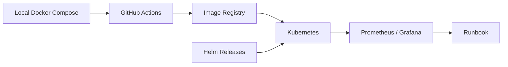

# Volume 7: Production Deployment

本卷定义 RFQ / Prop AMM 系统从本地开发到生产部署的路径。部署不是把服务跑起来就结束，而是要保证依赖可重复、配置可审计、指标可观测、CI 可阻断错误、故障有 runbook。

## Chapters

1. [Chapter 01: Docker](Chapter01-Docker.md)
2. [Chapter 02: Kubernetes](Chapter02-Kubernetes.md)
3. [Chapter 03: Monitoring](Chapter03-Monitoring.md)
4. [Chapter 04: CI-CD](Chapter04-CI-CD.md)
5. [Chapter 05: Runbook](Chapter05-Runbook.md)

## Deployment Principle

RFQ 系统的生产部署必须围绕三个目标：保护 signer、保护库存、保护结算路径。所有部署设计都应支持快速降级、暂停、回放和审计。

