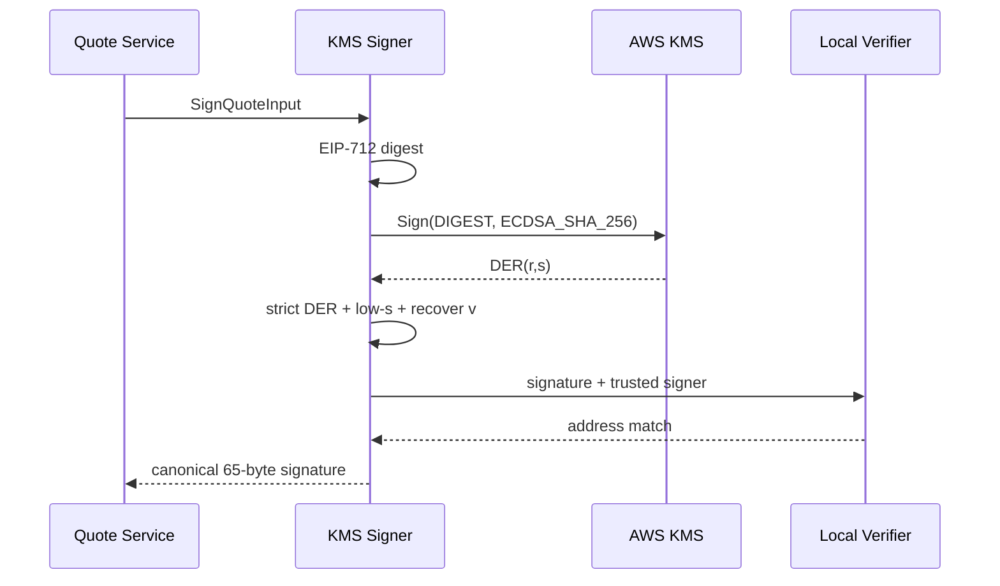

# ADR-0005: Use KMS For Production Quote Signing

## Status

Accepted

## Context

RFQ quote signature is an on-chain spending authorization. If an API container receives a raw Ethereum private key, a process escape、dependency compromise、debug dump or overly broad Kubernetes Secret permission can turn an application incident into direct treasury loss. Horizontal scaling also copies the same private key into every API replica and makes key access difficult to audit independently.

The signer must preserve the existing `SignerService` contract、EIP-712 domain and low-s signature rules. Settlement verification must know the expected signer before the first KMS call; trusting whichever address can recover the first returned signature would allow a wrong key id or compromised provider to redefine the trust root.

AWS KMS supports asymmetric `ECC_SECG_P256K1` signing keys and returns ECDSA signatures in DER form. It does not return the Ethereum recovery id, so the application must decode `(r,s)`, normalize `s`, and choose `v` by recovering against an independently configured signer address.

## Decision

Non-local standalone backend processes use `RFQ_SIGNER_MODE=aws-kms` and the official AWS SDK v3 KMS client. The API Pod receives only:

- KMS key id or alias;
- AWS region and bounded retry count;
- expected `RFQ_TRUSTED_SIGNER_ADDRESS`;
- EIP-712 `RFQ_SETTLEMENT_ADDRESS`.

AWS credentials come from workload identity. The IAM principal receives `kms:Sign` only for the selected signing key. `RFQ_SIGNER_PRIVATE_KEY` is rejected in non-local modes.

The runtime hashes EIP-712 typed data locally and calls KMS with `MessageType=DIGEST` and `ECDSA_SHA_256`. DER parsing is strict: canonical short-form lengths、unsigned minimally encoded integers、no trailing bytes and `0 < r,s < secp256k1n`. High-s values are converted to low-s. Recovery ids 27 and 28 are tested, and exactly one candidate must recover to the configured trusted signer.

`RFQ_SIGNER_MODE=local` remains available only for unset `NODE_ENV`、`development` and `test`. A caller that injects another HSM-backed `SignerService` uses `external` mode and must still configure the trusted signer and settlement address.

## Consequences

### Positive

- Raw Ethereum private keys are absent from production API Pods and Kubernetes Secrets.
- KMS access is independently auditable through cloud audit logs and IAM policy.
- A wrong KMS key、wrong signer address or malformed signature fails closed before a quote is returned.
- Existing quote、SDK、contract and settlement interfaces remain unchanged.

### Negative

- Every quote adds KMS network latency、cost and service quota dependency.
- AWS KMS is the built-in provider, so non-AWS deployments must inject another `SignerService`.
- KMS key rotation requires coordinated contract trusted-signer update and runtime configuration rollout.

### Mitigation

- Observe signer latency and error metrics and remove degraded Pods through readiness.
- Keep quote TTL short and do not retry outside the bounded AWS SDK retry policy.
- Use workload identity、least-privilege `kms:Sign` policy and provider audit logs.
- Exercise signer rotation and compromise procedures through the production runbook.

## Alternatives Considered

### Private Key In Kubernetes Secret

Rejected for non-local environments. Secret encryption at rest does not prevent the key from being materialized in every API process.

### Dedicated Remote Signer Service

Valid for multi-cloud or HSM deployments and supported through `external` mode. It adds another authenticated network protocol and operational service, so it is not the default implementation.

### Contract Wallet Or Threshold Signing

Potential future direction for stronger governance. It changes signer and settlement semantics and is outside the current minimal deterministic settlement contract.
