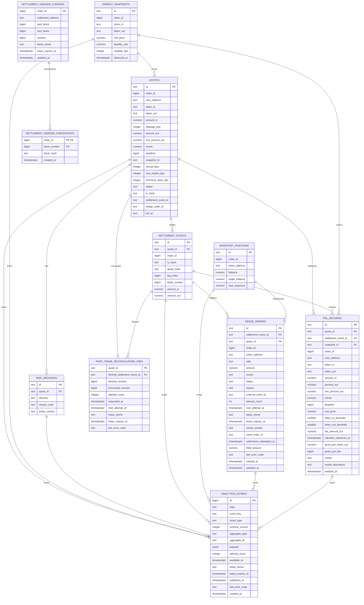

# ER Diagram

本图描述 RFQ 系统第一版操作型数据库关系。PostgreSQL 保存权威业务状态，ClickHouse 保存分析副本。

## Notes

- `settlement_events` 使用 `(chain_id, tx_hash, log_index)` 作为幂等键，并持久化 `quote_hash` 以绑定链上 `QuoteSettled` 事件和链下 EIP-712 quote payload。
- `settlement_events` 额外使用 `(chain_id, quote_hash)` 索引支持从 indexed `QuoteSettled.quoteHash` 回查本地成交事件，并与 `SettlementEventService.getSettlementEventsByQuoteHash` 保持同一访问路径，方便链上事件排障、reconciliation 和跨链环境下的 quote payload 证明。
- `settlement_events.log_index` 和 `settlement_events.block_number` 使用 BIGINT 保存链上 event ordinal，但必须位于 JavaScript safe integer range `0..9007199254740991`，与 indexer、reorg removal 和运行时排序逻辑的 number 表示一致。
- `settlement_events.quote_id` 是 `quotes.id` 的非空外键；partial unique index `(quote_id) WHERE canonical = TRUE` 保证一个 signed quote 同时最多绑定一个 canonical settlement，同时允许 reorg 后的新交易形成新的 canonical event，并保留旧事件审计历史。
- `settlement_events.canonical` 与 `removed_at` 保留 reorg 审计历史：canonical event 必须没有 `removed_at`，removed event 必须有时间戳。正常查询和 reconciliation 只读取 canonical rows；同一精确事件重新成为 canonical 时可以幂等重激活，而不是插入第二条 event。
- `idx_settlement_events_canonical_block` 为 canonical chain-order replay 提供 partial index。服务启动时使用 transaction-scoped advisory lock，在同一数据库事务内从 canonical events 重建 `inventory_positions`，避免多副本同时修复投影。
- `settlement_indexer_cursors` 为每条链保存不可变 settlement address/start block、下一扫描块、单调 revision 和 expiring lease。worker 只有同时匹配 lease owner、revision 与 expected next block 才能提交游标，避免旧副本覆盖新进度。
- `settlement_indexer_checkpoints` 保存已提交 range 末端的 block hash。每次扫描先比较最近 checkpoint；分叉时在 `reorgLookbackBlocks` 内寻找共同祖先，按 reverse chain order 标记 orphaned settlement events non-canonical，再回退 cursor。超出窗口时 fail closed 并等待人工确认。
- `idx_settlement_events_canonical_chain_block` 支持 indexer 在 crash-before-cursor-commit 和 reorg 恢复时只读取受影响链与 block range，不对完整事件表做全量扫描。
- `quotes` 使用 partial unique index `(chain_id, user_address, nonce) WHERE nonce IS NOT NULL`，保证 signed quote 的 `chainId:user:nonce` 本地查找键唯一，同时允许 requested / rejected quote 在签名前没有 nonce。
- 数据库层使用 CHECK constraints 固化应用层关键不变量：操作表 primary id 使用 SafeIdentifier 约束、quote lifecycle status、risk decision status / reason_code consistency、hedge side/status（`queued`、`filled`、`failed`）、hedge `venue` 非空、PnL attribution model / model description、20-byte address、distinct token pair、market snapshot `source` 非空、market snapshot `bid_price <= mid_price <= ask_price`、market snapshot `volatility_bps` 在 0..10000 bps、signed quote pricing bps component ranges、32-byte tx/quote hash、65-byte canonical low-s EIP-712 signature with `v` in 27/28、`amount_out >= min_amount_out`，以及正数 signed amount/nonce、settled amount/nonce 和 hedge amount。
- `quotes`、`market_snapshots`、`risk_decisions`、`settlement_events`、`inventory_positions`、`hedge_orders` 和 `pnl_records` 的 primary id 都必须符合 SafeIdentifier：非空、不超过 128 个字符，并且只包含 letters、numbers、underscore、colon 或 hyphen，避免数据库保存 API/SDK 无法查询或展示的资源主键。
- `quotes` 的 status payload consistency 约束要求 signed payload 字段全有或全无，requested/rejected 状态不能携带 signed payload 字段，signed/expired/submitted/settled 状态必须保留完整 signed quote payload metadata，只有 rejected/failed 状态可以携带非空 `reject_code`，submitted/settled 状态必须至少保留 `tx_hash` 和 `settlement_event_id`。
- `quotes.pricing_version`、`quotes.risk_policy_version` 和 `quotes.reject_code` 在状态允许为 NULL 时可以缺失，但一旦写入必须是非空字符串，避免 signed/rejected/failed quote 带着不可解释的空白元数据。
- `quotes.deadline` 使用 BIGINT 保存 EIP-712 signed quote 的 Unix seconds，而不是 timestamptz；它必须位于 JavaScript safe integer range `1..9007199254740991`，保证数据库值与 API、Signer、Settlement verifier 和链上 `uint256 deadline` 语义一致。
- `quotes.snapshot_id` 是指向 `market_snapshots.id` 的必填 foreign key，用于报价回放；每条持久化 quote 都必须能回到用于定价的 market snapshot。
- `quotes.slippage_bps` 保存原始 `QuoteRequest.slippageBps`，必须是 `0..10000` bps 内的整数。EIP-712 `SignedQuote` 只携带最终 `minAmountOut`，数据库单独保留请求滑点，才能在报价回放、风控审计和用户争议处理中解释 `min_amount_out` 如何由 `amount_out` 推导而来。
- `quotes.spread_bps`、`quotes.size_impact_bps` 和 `quotes.inventory_skew_bps` 保存 signed quote 的定价组成。`spread_bps` 和 `size_impact_bps` 必须在 `0..10000` bps，`inventory_skew_bps` 必须在 `-10000..10000` bps；这些字段和 `pricing_version` 一起解释 `amount_out` 如何从 market snapshot、route liquidity、inventory skew 和 hedge risk penalty 推导而来。
- `market_snapshots.source` 必须是非空字符串，用于保留行情来源、provider 或聚合管线版本，避免报价回放时无法解释价格输入。
- `market_snapshots.liquidity_usd` 必须是非空正整数数值，匹配 Market Data、Routing 和 Pricing 对 `liquidityUsd` positive uint string 的运行时约束。
- `market_snapshots.volatility_bps` 必须是 `0..10000` bps 内的整数，与 Market Data、Routing 和 Pricing 对 required `volatilityBps` / volatility premium 的输入契约一致。
- runtime `MarketSnapshotStore` 必须镜像 `market_snapshots` 表的核心契约：同一 `snapshot_id` 只能对应同一 chain/token pair、price、liquidity、volatility、source 和 observedAt；完全相同写入可幂等重放，任何字段改写都必须失败，避免 quote 回放时一个 `snapshotId` 指向多个价格输入。
- `quotes.settlement_event_id`、`quotes.hedge_order_id`、`quotes.pnl_id` 是分别指向 `settlement_events.id`、`hedge_orders.id`、`pnl_records.id` 的 nullable foreign keys，保证 `GET /quote/:id` 状态指针不能悬空；权威成交、对冲和 PnL 明细仍分别位于这些下游表。
- `hedge_orders.status` 使用 `queued`、`filled`、`failed` 表达内部 intent 生命周期；`external_order_id` 可以在内部 queued intent 阶段为 NULL，但一旦外部 venue 返回引用就必须是非空字符串，`updated_at` 记录 filled/failed 状态转换时间。
- `hedge_orders.attempt_count`、`next_attempt_at`、`lease_owner` 和 `lease_expires_at` 构成多 worker 共享的 durable queue。lease 字段必须同时为空或同时存在，只有 queued row 可以持有 lease，终态转换必须清除 lease。`idx_hedge_orders_queued_claim` 支持按 due time 使用 `FOR UPDATE SKIP LOCKED` claim。
- `venue_symbol` 和 `client_order_id` 在外部调用前持久化；`uq_hedge_orders_venue_client_order` 防止同一 venue client id 指向多个本地 hedge。Binance client id 由 hedge id 确定性派生，worker 每次先查询再决定是否提交，避免 timeout 后重复对冲。
- `submission_attempted_at` 在 POST 前经 canonical settlement row lock 授权写入，或在 query-first 发现已有外部订单时写入。Reorg 后 worker 不再 claim 从未尝试提交的 intent，但会继续追踪 submission-attempted job 直到明确终态，避免遗忘可能已被 CEX 接受的订单。
- `last_error_code` 只保存低基数稳定错误码，不保存可能包含凭据或高基数 venue message。retryable/unknown/pending 状态保持 queued，只有确定失败才进入 failed；filled row 必须有 `external_order_id` 和正数 `filled_amount`。每次观察到更大的累计成交量时，`filled_amount` 与新增 token inventory delta 在同一数据库事务中提交；重复查询只应用差额，pending partial fill 也会立即进入风险敞口。
- `quotes.snapshot_id` 使用索引支持报价回放；nullable status pointers 使用 partial indexes，只索引非空的 `settlement_event_id`、`hedge_order_id` 和 `pnl_id`，支持审计 join 和 reconciliation 查询，同时避免大量未成交 quote 的空指针污染索引。
- 所有带 `chain_id` 的操作表都使用 CHECK constraint 限制为 JavaScript safe integer range `1..9007199254740991`，与后端、SDK 和 OpenAPI 的 `chainId` 契约一致，避免数据库保存无法被运行时代码安全表示的链 ID。
- `quotes.tx_hash` 是状态查询冗余字段，用于快速展示链上交易哈希；权威成交事件仍由 `settlement_events` 和 `quote_hash` 绑定。
- `risk_decisions.policy_version` 用于解释风控变更后的历史行为，必须是非空字符串；`reason_code` 只允许出现在 rejected decision 上，approved decision 必须保持 NULL，且 rejected reason 必须来自后端 `RiskRejectReasonCode` 稳定枚举。
- `inventory_positions` 是当前操作状态，不替代事件账本。
- `settlement_events` insert/reactivation 与 tokenIn/tokenOut 两条 `inventory_positions` delta 在同一个 PostgreSQL transaction 中提交；token address 按字典序加锁，避免相反交易对并发更新产生 deadlock。重复 event 不重复更新库存。
- 生产 Quote Service 直接读取共享 `inventory_positions` 计算 skew 和 projected exposure，不依赖 pod-local inventory cache；因此多副本风险决策看到同一个已提交敞口。
- `hedge_orders.settlement_event_id` 是 `settlement_events.id` 的非空外键，并使用 unique index `(settlement_event_id)` 防止同一 settlement event 重复创建 hedge intent；`quote_id` 是 `quotes.id` 的非空外键，保证 `/hedges/:id` 返回的 `quoteId` 可直接回到本地 quote；`reason` 必须匹配 Hedge Service 支持的 intent reason；`venue` 必须是非空字符串，用于保留对冲路由、交易场所或内部库存通道；`external_order_id` 可以在内部 queued intent 阶段为 NULL，但一旦写入必须是非空字符串。
- `quotes`、`inventory_positions` 和 `hedge_orders` 使用共享 `set_updated_at()` trigger，在每次 `UPDATE` 时由数据库刷新 `updated_at`，避免应用层漏写导致状态页或运维排障看到陈旧更新时间。
- `pnl_records` 使用 `(quote_id, model)` 和 `(settlement_event_id, model)` 双重幂等约束，并通过外键绑定实际 settlement event 与原始 market snapshot。`quote_snapshot_edge_v1` 使用持久化 `mid_price`、可信 token decimals 和 `amount_in` 计算 `fair_amount_out`，再以 `fair_amount_out - amount_out` 得到 tokenOut base units 口径的 gross PnL；`gross_pnl_bps` 保持 safe-integer signed `gross_pnl_bps` 约束。该模型明确排除 fee、gas 和 hedge execution，不能替代完整会计 PnL。
- migration `006-quote-snapshot-pnl` 不会伪造旧数据的 token decimals。旧 `simulated_mid_price_v1` 记录先进入 `pnl_records_legacy_simulated_v1` 审计归档，相关 quote pointer 被清空，再由 reconciliation 从 canonical settlement、不可变 snapshot 和运行时 token registry 重建新模型。
- `hedge_orders` 与 `pnl_records` 是 settlement event 之后的 durable idempotent projections。它们不与链上 event+inventory 强行放在同一长事务；若进程在步骤间崩溃，settlement event 作为 source of truth，由 reconciliation 补齐缺失 projection 和 quote pointers。
- `post_trade_reconciliation_jobs` 以 `quote_id` 为唯一收敛键。settlement insert 或 `canonical` 变化在同一事务中通过 trigger 更新 `desired_settlement_event_id` 与单调 `desired_revision`；多 worker 使用 `FOR UPDATE SKIP LOCKED` 和 expiring lease claim。worker 只有在 lease owner 与 revision 同时匹配时才推进 `processed_revision`，旧 revision 的副作用会由仍待处理的新 revision 再次收敛。
- canonical job 按 hedge、PnL、quote pointer 顺序幂等补齐；没有 canonical event 的 job 清除可逆 quote/PnL projection，并只删除尚未向外部 venue 提交的 hedge。已 submission-attempted 或 terminal 的 CEX 证据保留，交由人工补偿而不是伪装成随链 reorg 消失。
- `analytics_outbox` 实现 transactional outbox，由数据库 trigger 在 quote、market snapshot、risk、settlement、inventory、hedge 和 PnL 行发生有效业务变化的同一事务中追加。它不对 `aggregate_id` 建立跨表外键，因为一个统一事件表承载多种 aggregate；事件 payload 只保存分析所需字段，78 位金额全部编码为十进制字符串。
- `idx_analytics_outbox_pending` 支持多 publisher 使用 `FOR UPDATE SKIP LOCKED` 和 expiring lease 并发 claim。Kafka acknowledgement 成功后才写 `published_at`；失败只更新 `available_at` 和稳定 `last_error_code`。已发布行按 retention 分批删除，未发布行不会因重试次数耗尽而丢弃。
- Outbox 到 Redpanda 是 at-least-once：publisher 可能在 broker 已确认但 `published_at` 尚未提交时崩溃。每条 envelope 使用稳定 `ao_<outbox_id>` event id，ClickHouse 以 `ReplacingMergeTree(ingested_at) ORDER BY event_id` 收敛重复；分析查询需要在要求即时去重时使用 `FINAL` 或 `argMax`。Kafka offset 只在 ClickHouse batch insert 成功后提交。
- `enqueue_rfq_analytics_event()` 使用 migration owner 的 `SECURITY DEFINER` 权限并固定 `search_path = pg_catalog, public`，使低权限业务角色无需直接获得 outbox/identity sequence 写权限。函数体只接受 trigger row，不拼接动态 SQL。Analytics worker 使用独立数据库角色，权限限定为 outbox `SELECT/UPDATE/DELETE`；它不应拥有 quote、settlement、inventory 或 hedge 状态写权限。
