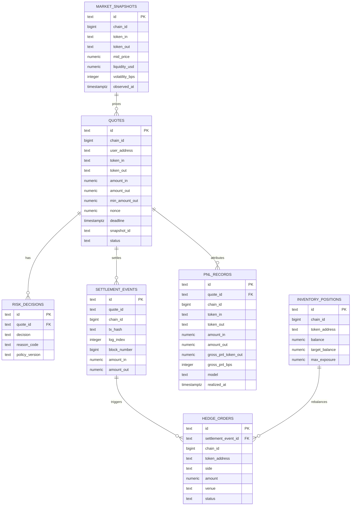

# ER Diagram

本图描述 RFQ 系统第一版操作型数据库关系。PostgreSQL 保存权威业务状态，ClickHouse 保存分析副本。

## Notes

- `settlement_events` 使用 `(chain_id, tx_hash, log_index)` 作为幂等键。
- `quotes` 使用 partial unique index `(chain_id, user_address, nonce) WHERE nonce IS NOT NULL`，保证 signed quote 的 `chainId:user:nonce` 本地查找键唯一，同时允许 requested / rejected quote 在签名前没有 nonce。
- `quotes.snapshot_id` 对应 `market_snapshots.id`，用于报价回放。
- `risk_decisions.policy_version` 用于解释风控变更后的历史行为。
- `inventory_positions` 是当前操作状态，不替代事件账本。
- `pnl_records` 使用 `(quote_id, model)` 防止同一归因模型对同一成交重复入账；生产版可将明细同步到 ClickHouse 做高维分析。
