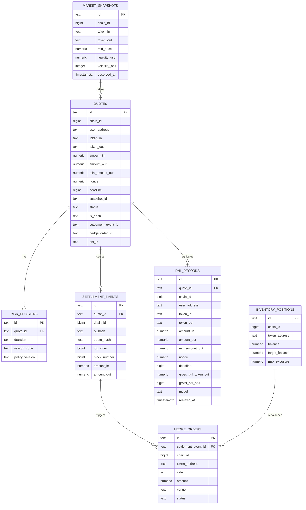

# ER Diagram

本图描述 RFQ 系统第一版操作型数据库关系。PostgreSQL 保存权威业务状态，ClickHouse 保存分析副本。

## Notes

- `settlement_events` 使用 `(chain_id, tx_hash, log_index)` 作为幂等键，并持久化 `quote_hash` 以绑定链上 `QuoteSettled` 事件和链下 EIP-712 quote payload。
- `settlement_events.log_index` 和 `settlement_events.block_number` 使用 BIGINT 保存链上 event ordinal，但必须位于 JavaScript safe integer range `0..9007199254740991`，与 indexer、reorg removal 和运行时排序逻辑的 number 表示一致。
- `settlement_events.quote_id` 是 `quotes.id` 的非空外键，并使用 unique index `(quote_id)` 保证一个 signed quote 只能绑定一个 settlement event；这同时保证 settlement-to-quote reconciliation 总能回到本地签发记录。
- `quotes` 使用 partial unique index `(chain_id, user_address, nonce) WHERE nonce IS NOT NULL`，保证 signed quote 的 `chainId:user:nonce` 本地查找键唯一，同时允许 requested / rejected quote 在签名前没有 nonce。
- 数据库层使用 CHECK constraints 固化应用层关键不变量：操作表 primary id 非空、quote lifecycle status、risk decision status / reason_code consistency、hedge side/status、hedge `venue` 非空、PnL attribution model、20-byte address、distinct token pair、market snapshot `source` 非空、market snapshot `bid_price <= mid_price <= ask_price`、market snapshot `volatility_bps` 在 0..10000 bps、32-byte tx/quote hash、65-byte canonical low-s EIP-712 signature with `v` in 27/28、`amount_out >= min_amount_out`，以及正数 signed amount/nonce、settled amount/nonce 和 hedge amount。
- `quotes`、`market_snapshots`、`risk_decisions`、`settlement_events`、`inventory_positions`、`hedge_orders` 和 `pnl_records` 的 primary id 都必须是非空字符串，避免状态查询、审计 join 或 reconciliation 任务遇到空白主键。
- `quotes` 的 status payload consistency 约束要求 signed payload 字段全有或全无，requested/rejected 状态不能携带 signed payload 字段，signed/expired/submitted/settled 状态必须保留完整 signed quote payload metadata，只有 rejected/failed 状态可以携带非空 `reject_code`，submitted/settled 状态必须至少保留 `tx_hash` 和 `settlement_event_id`。
- `quotes.pricing_version`、`quotes.risk_policy_version` 和 `quotes.reject_code` 在状态允许为 NULL 时可以缺失，但一旦写入必须是非空字符串，避免 signed/rejected/failed quote 带着不可解释的空白元数据。
- `quotes.deadline` 使用 BIGINT 保存 EIP-712 signed quote 的 Unix seconds，而不是 timestamptz；它必须位于 JavaScript safe integer range `1..9007199254740991`，保证数据库值与 API、Signer、Settlement verifier 和链上 `uint256 deadline` 语义一致。
- `quotes.snapshot_id` 是指向 `market_snapshots.id` 的必填 foreign key，用于报价回放；每条持久化 quote 都必须能回到用于定价的 market snapshot。
- `market_snapshots.source` 必须是非空字符串，用于保留行情来源、provider 或聚合管线版本，避免报价回放时无法解释价格输入。
- `market_snapshots.liquidity_usd` 必须是非空正整数数值，匹配 Market Data、Routing 和 Pricing 对 `liquidityUsd` positive uint string 的运行时约束。
- `market_snapshots.volatility_bps` 必须是 `0..10000` bps 内的整数，与 Market Data、Routing 和 Pricing 对 required `volatilityBps` / volatility premium 的输入契约一致。
- `quotes.settlement_event_id`、`quotes.hedge_order_id`、`quotes.pnl_id` 是分别指向 `settlement_events.id`、`hedge_orders.id`、`pnl_records.id` 的 nullable foreign keys，保证 `GET /quote/:id` 状态指针不能悬空；权威成交、对冲和 PnL 明细仍分别位于这些下游表。
- `quotes.snapshot_id` 使用索引支持报价回放；nullable status pointers 使用 partial indexes，只索引非空的 `settlement_event_id`、`hedge_order_id` 和 `pnl_id`，支持审计 join 和 reconciliation 查询，同时避免大量未成交 quote 的空指针污染索引。
- 所有带 `chain_id` 的操作表都使用 CHECK constraint 限制为 JavaScript safe integer range `1..9007199254740991`，与后端、SDK 和 OpenAPI 的 `chainId` 契约一致，避免数据库保存无法被运行时代码安全表示的链 ID。
- `quotes.tx_hash` 是状态查询冗余字段，用于快速展示链上交易哈希；权威成交事件仍由 `settlement_events` 和 `quote_hash` 绑定。
- `risk_decisions.policy_version` 用于解释风控变更后的历史行为，必须是非空字符串；`reason_code` 只允许出现在 rejected decision 上，approved decision 必须保持 NULL。
- `inventory_positions` 是当前操作状态，不替代事件账本。
- `hedge_orders.settlement_event_id` 是 `settlement_events.id` 的非空外键，并使用 unique index `(settlement_event_id)` 防止同一 settlement event 重复创建 hedge intent；`venue` 必须是非空字符串，用于保留对冲路由、交易场所或内部库存通道；`external_order_id` 可以在内部 queued intent 阶段为 NULL，但一旦写入必须是非空字符串。
- `quotes`、`inventory_positions` 和 `hedge_orders` 使用共享 `set_updated_at()` trigger，在每次 `UPDATE` 时由数据库刷新 `updated_at`，避免应用层漏写导致状态页或运维排障看到陈旧更新时间。
- `pnl_records` 使用 `(quote_id, model)` 防止同一归因模型对同一成交重复入账，并保存 `user_address`、amount、`min_amount_out`、`nonce`、safe-integer `deadline` 和 safe-integer signed `gross_pnl_bps` 作为 signed attribution snapshot；生产版可将明细同步到 ClickHouse 做高维分析。
