# ER Diagram

本图描述 RFQ 系统第一版操作型数据库关系。PostgreSQL 保存权威业务状态，ClickHouse 保存分析副本。

```mermaid
erDiagram
  QUOTES ||--o{ RISK_DECISIONS : has
  QUOTES ||--o| QUOTE_SUBMIT_RESERVATIONS : reserves
  QUOTES |o--o| QUOTE_IDEMPOTENCY_REQUESTS : replays
  QUOTES ||--o| QUOTE_EXPOSURE_RESERVATIONS : limits
  QUOTES ||--o{ QUOTE_EXPOSURE_LEDGER_EVENTS : audits
  QUOTES ||--o| QUOTE_EXPOSURE_LEDGER_PROJECTION_VERSIONS : orders
  QUOTES ||--o{ SETTLEMENT_EVENTS : settles
  SETTLEMENT_EVENTS ||--o{ HEDGE_ORDERS : triggers
  HEDGE_ORDERS ||--o{ HEDGE_EXECUTION_FILLS : reconciles
  QUOTES ||--o{ PNL_RECORDS : attributes
  SETTLEMENT_EVENTS ||--o{ PNL_RECORDS : realizes
  MARKET_SNAPSHOTS ||--o{ PNL_RECORDS : values
  QUOTES ||--o| POST_TRADE_RECONCILIATION_JOBS : converges
  SETTLEMENT_EVENTS ||--o{ POST_TRADE_RECONCILIATION_JOBS : desires
  SETTLEMENT_INDEXER_CURSORS ||--o{ SETTLEMENT_INDEXER_CHECKPOINTS : checkpoints
  MARKET_SNAPSHOTS ||--o{ QUOTES : prices
  INVENTORY_POSITIONS ||--o{ HEDGE_ORDERS : rebalances
  QUOTES ||--o{ ANALYTICS_OUTBOX : emits
  MARKET_SNAPSHOTS ||--o{ ANALYTICS_OUTBOX : emits
  RISK_DECISIONS ||--o{ ANALYTICS_OUTBOX : emits
  SETTLEMENT_EVENTS ||--o{ ANALYTICS_OUTBOX : emits
  INVENTORY_POSITIONS ||--o{ ANALYTICS_OUTBOX : emits
  HEDGE_ORDERS ||--o{ ANALYTICS_OUTBOX : emits
  HEDGE_EXECUTION_FILLS ||--o{ ANALYTICS_OUTBOX : emits
  PNL_RECORDS ||--o{ ANALYTICS_OUTBOX : emits
  QUOTE_CONTROL ||--o{ QUOTE_CONTROL_AUDIT : records
  QUOTE_PAIR_CONTROL ||--o{ QUOTE_PAIR_CONTROL_AUDIT : records
  TOXIC_FLOW_SCORES ||--o{ TOXIC_FLOW_SCORE_AUDIT : records
  SETTLEMENT_EVENTS ||--o| TOXIC_FLOW_MARKOUT_JOBS : schedules
  SETTLEMENT_EVENTS ||--o| TOXIC_FLOW_MARKOUTS : measures
  MARKET_SNAPSHOTS ||--o{ TOXIC_FLOW_MARKOUTS : marks
  QUOTES ||--o{ SIGNER_AUDIT_EVENTS : correlates

  QUOTES {
    text id PK
    text principal_id
    bigint chain_id
    text user_address
    text token_in
    text token_out
    numeric amount_in
    integer slippage_bps
    numeric amount_out
    numeric min_amount_out
    numeric nonce
    bigint deadline
    text snapshot_id
    text route_id
    text route_venue
    numeric route_expected_liquidity_usd
    timestamptz route_decided_at
    integer spread_bps
    integer size_impact_bps
    integer market_spread_bps
    integer inventory_skew_bps
    integer volatility_premium_bps
    integer hedge_cost_bps
    text status
    text tx_hash
    text settlement_event_id
    text hedge_order_id
    text pnl_id
  }

  QUOTE_SUBMIT_RESERVATIONS {
    text quote_id PK, FK
    text owner_token
    timestamptz acquired_at
    timestamptz expires_at
  }

  QUOTE_IDEMPOTENCY_REQUESTS {
    text principal_id PK
    text idempotency_key PK
    text request_hash
    text state
    text owner_token
    timestamptz lease_expires_at
    text quote_id
    jsonb response
    text error_code
    text error_message
    integer error_status_code
    timestamptz completed_at
    timestamptz created_at
    timestamptz updated_at
  }

  QUOTE_EXPOSURE_RESERVATIONS {
    text quote_id PK, FK
    bigint chain_id
    text user_address
    text token_low
    text token_high
    text token_in
    numeric amount_in
    text token_out
    numeric amount_out
    numeric notional_usd_e18
    text settlement_address
    text treasury_address
    numeric treasury_available_balance
    numeric treasury_block_number
    jsonb var_evaluation
    jsonb delta_evaluation
    timestamptz expires_at
    timestamptz ledger_expires_at
  }

  QUOTE_EXPOSURE_LEDGER_EVENTS {
    text source_stream_id PK
    text operation
    text quote_id FK
    bigint chain_id
    jsonb payload
    timestamptz mirrored_at
  }

  QUOTE_EXPOSURE_LEDGER_PROJECTION_VERSIONS {
    text quote_id PK, FK
    text source_epoch
    numeric stream_milliseconds
    numeric stream_sequence
    text operation
    timestamptz updated_at
  }

  MARKET_SNAPSHOTS {
    text id PK
    bigint chain_id
    text token_in
    text token_out
    numeric mid_price
    numeric liquidity_usd
    integer market_spread_bps
    integer volatility_bps
    timestamptz observed_at
  }

  RISK_DECISIONS {
    text id PK
    text quote_id FK
    text decision
    text reason_code
    text policy_version
  }

  SIGNER_AUDIT_EVENTS {
    bigint id PK
    text quote_id
    text snapshot_id
    smallint context_version
    text risk_decision_id
    text risk_policy_version
    text trace_id
    bytea quote_digest
    bytea signature_hash
    text signer_address
    text settlement_address
    bigint chain_id
    bigint deadline
    text outcome
    timestamptz occurred_at
    text source_stream_id UK
    timestamptz recorded_at
  }

  SETTLEMENT_EVENTS {
    text id PK
    text quote_id FK
    bigint chain_id
    text tx_hash
    text quote_hash
    bigint log_index
    bigint block_number
    numeric amount_in
    numeric amount_out
    timestamptz settled_at
  }

  INVENTORY_POSITIONS {
    text id PK
    bigint chain_id
    text token_address
    numeric balance
    numeric target_balance
    numeric max_exposure
  }

  HEDGE_ORDERS {
    text id PK
    text settlement_event_id FK
    text quote_id FK
    bigint chain_id
    text token_address
    text side
    numeric amount
    text venue
    text status
    text reason
    text external_order_id
    text venue_order_id
    int attempt_count
    timestamptz next_attempt_at
    text lease_owner
    timestamptz lease_expires_at
    text venue_symbol
    text client_order_id
    timestamptz submission_attempted_at
    numeric filled_amount
    text execution_evidence_version
    numeric executed_quote_quantity
    text fee_reconciliation_status
    int fee_attempt_count
    timestamptz fee_next_attempt_at
    text fee_lease_owner
    timestamptz fee_lease_expires_at
    text fee_last_error_code
    timestamptz fee_reconciled_at
    text route_accounting_version
    text venue_base_asset
    text venue_quote_asset
    text venue_quote_token_address
    int venue_base_decimals
    int venue_quote_decimals
    numeric venue_step_size_raw
    text execution_order_type
    text execution_time_in_force
    numeric execution_limit_price
    numeric execution_price_tick
    int execution_max_slippage_bps
    text execution_policy_version
    bigint execution_max_order_age_ms
    timestamptz cancel_requested_at
    timestamptz risk_failure_at
    text hedge_net_pnl_model
    text hedge_net_pnl_status
    numeric hedge_net_pnl_quote_quantity
    text hedge_net_pnl_reason_code
    jsonb hedge_unvalued_commission_assets
    timestamptz hedge_net_pnl_realized_at
    text last_error_code
    timestamptz created_at
    timestamptz updated_at
  }

  HEDGE_EXECUTION_FILLS {
    text hedge_order_id PK,FK
    text venue_trade_id PK
    text venue
    text venue_symbol
    text venue_order_id
    numeric price
    numeric base_quantity
    numeric quote_quantity
    numeric commission_quantity
    text commission_asset
    timestamptz executed_at
    boolean is_buyer
    boolean is_maker
  }

  PNL_RECORDS {
    text id PK
    text quote_id FK
    text settlement_event_id FK
    text snapshot_id FK
    bigint chain_id
    text user_address
    text token_in
    text token_out
    numeric amount_in
    numeric amount_out
    numeric min_amount_out
    numeric nonce
    bigint deadline
    numeric mid_price
    smallint token_in_decimals
    smallint token_out_decimals
    numeric fair_amount_out
    timestamptz valuation_observed_at
    numeric gross_pnl_token_out
    bigint gross_pnl_bps
    text model
    text model_description
    timestamptz realized_at
  }

  ANALYTICS_OUTBOX {
    bigint id PK
    text topic
    text event_key
    text event_type
    integer schema_version
    text aggregate_type
    text aggregate_id
    jsonb payload
    integer attempt_count
    timestamptz available_at
    text lease_owner
    timestamptz lease_expires_at
    timestamptz published_at
    text last_error_code
    timestamptz created_at
  }

  POST_TRADE_RECONCILIATION_JOBS {
    text quote_id PK
    text desired_settlement_event_id FK
    bigint desired_revision
    bigint processed_revision
    integer attempt_count
    timestamptz requested_at
    timestamptz next_attempt_at
    text lease_owner
    timestamptz lease_expires_at
    text last_error_code
  }

  SETTLEMENT_INDEXER_CURSORS {
    bigint chain_id PK
    text settlement_address
    bigint start_block
    bigint next_block
    bigint revision
    text lease_owner
    timestamptz lease_expires_at
    timestamptz updated_at
  }

  SETTLEMENT_INDEXER_CHECKPOINTS {
    bigint chain_id PK,FK
    bigint block_number PK
    text block_hash
    timestamptz created_at
  }

  QUOTE_CONTROL {
    boolean singleton PK
    boolean paused
    bigint version
    varchar reason
    varchar updated_by
    timestamptz updated_at
  }

  QUOTE_CONTROL_AUDIT {
    bigint version PK
    boolean paused
    varchar reason
    varchar updated_by
    timestamptz updated_at
  }

  QUOTE_PAIR_CONTROL {
    bigint chain_id PK
    char token_low PK
    char token_high PK
    boolean paused
    bigint version
    varchar reason
    varchar updated_by
    timestamptz updated_at
  }

  QUOTE_PAIR_CONTROL_AUDIT {
    bigint chain_id PK
    char token_low PK
    char token_high PK
    bigint version PK
    boolean paused
    varchar reason
    varchar updated_by
    timestamptz updated_at
  }

  TOXIC_FLOW_SCORES {
    bigint chain_id PK
    char user_address PK
    integer score_bps
    integer post_trade_drift_bps
    bigint sample_size
    integer window_seconds
    varchar policy_version
    timestamptz observed_at
    bigint version
    varchar updated_by
    timestamptz updated_at
  }

  TOXIC_FLOW_SCORE_AUDIT {
    bigint chain_id PK
    char user_address PK
    bigint version PK
    integer score_bps
    integer post_trade_drift_bps
    bigint sample_size
    integer window_seconds
    varchar policy_version
    timestamptz observed_at
    varchar updated_by
    timestamptz updated_at
  }

  TOXIC_FLOW_MARKOUT_JOBS {
    text settlement_event_id PK, FK
    boolean desired_canonical
    bigint desired_revision
    bigint processed_revision
    integer attempt_count
    timestamptz settled_at
    varchar lease_owner
    timestamptz lease_expires_at
  }

  TOXIC_FLOW_MARKOUTS {
    text settlement_event_id PK, FK
    text quote_id FK
    text post_snapshot_id FK
    bigint chain_id
    char user_address
    numeric execution_price
    numeric post_mid_price
    integer post_trade_drift_bps
    integer toxicity_score_bps
    integer horizon_seconds
    boolean canonical
  }
```

## Notes

- `settlement_events` 使用 `(chain_id, tx_hash, log_index)` 作为幂等键，并持久化 `quote_hash` 以绑定链上 `QuoteSettled` 事件和链下 EIP-712 quote payload。
- `settlement_events` 额外使用 `(chain_id, quote_hash)` 索引支持从 indexed `QuoteSettled.quoteHash` 回查本地成交事件，并与 `SettlementEventService.getSettlementEventsByQuoteHash` 保持同一访问路径，方便链上事件排障、reconciliation 和跨链环境下的 quote payload 证明。
- `settlement_events.log_index` 和 `settlement_events.block_number` 使用 BIGINT 保存链上 event ordinal，但必须位于 JavaScript safe integer range `0..9007199254740991`，与 indexer、reorg removal 和运行时排序逻辑的 number 表示一致。
- `settlement_events.settled_at` 保存 receipt/indexer 从 canonical block 读取的区块时间，是 markout horizon 和 API `observedAt` 的权威起点；`created_at` 只表示数据库摄取时间。Migration 021 不使用 `created_at` 猜测历史成交时间，无法恢复区块时间的 legacy rows 保持 `settled_at=NULL` 且不会自动进入 markout 队列。
- `settlement_events.quote_id` 是 `quotes.id` 的非空外键；partial unique index `(quote_id) WHERE canonical = TRUE` 保证一个 signed quote 同时最多绑定一个 canonical settlement，同时允许 reorg 后的新交易形成新的 canonical event，并保留旧事件审计历史。
- `settlement_events.canonical` 与 `removed_at` 保留 reorg 审计历史：canonical event 必须没有 `removed_at`，removed event 必须有时间戳。正常查询和 reconciliation 只读取 canonical rows；同一精确事件重新成为 canonical 时可以幂等重激活，而不是插入第二条 event。
- `idx_settlement_events_canonical_block` 为 canonical chain-order replay 提供 partial index。服务启动时使用 transaction-scoped advisory lock，在同一数据库事务内从 canonical events 重建 `inventory_positions`，避免多副本同时修复投影。
- `settlement_indexer_cursors` 为每条链保存不可变 settlement address/start block、下一扫描块、单调 revision 和 expiring lease。worker 只有同时匹配 lease owner、revision 与 expected next block 才能提交游标，避免旧副本覆盖新进度。
- `settlement_indexer_checkpoints` 保存已提交 range 末端的 block hash。每次扫描先比较最近 checkpoint；分叉时在 `reorgLookbackBlocks` 内寻找共同祖先，按 reverse chain order 标记 orphaned settlement events non-canonical，再回退 cursor。超出窗口时 fail closed 并等待人工确认。
- `idx_settlement_events_canonical_chain_block` 支持 indexer 在 crash-before-cursor-commit 和 reorg 恢复时只读取受影响链与 block range，不对完整事件表做全量扫描。
- `quotes` 使用 partial unique index `(chain_id, user_address, nonce) WHERE nonce IS NOT NULL`，保证 signed quote 的 `chainId:user:nonce` 本地查找键唯一，同时允许 requested / rejected quote 在签名前没有 nonce。
- `quotes.principal_id` 是链下机构授权边界：创建 quote 时写入并保持不可变，轮换 API key 只更换 `keyId` 而保持 principal。quote status、submit、derived settlement/hedge status 和 PnL 查询都从该字段判定所有权；wallet address 不替代 tenant ownership，且该字段不进入 EIP-712 或公共响应。
- `quote_control` 是全局单行控制状态，`singleton=TRUE` 约束阻止多行分叉。管理端以 `expectedVersion` 执行 compare-and-swap，成功时递增 version，并在同一数据库语句中向 `quote_control_audit` 写入 paused、reason、认证 actor 和数据库时间；冲突必须重新读取后人工复核。
- `quote_control_audit.version` 一一对应每个成功状态版本，初始 migration 状态为 version 0；当前表和 audit 表都把 version 限制在 JavaScript safe integer `0..9007199254740991`。reason 必须非空、去除首尾空白且不含控制字符；paused 状态不能缺少 reason。生产报价读取失败时 fail closed，不允许退回 pod-local enabled 状态。
- `quote_pair_control` 使用 `(chain_id, token_low, token_high)` 保存无方向交易对控制。地址写入前统一为 lowercase 并排序，避免 `A/B` 与 `B/A` 形成两个独立开关；不存在的 pair row 表示从未配置且默认 enabled。首次 CAS 更新要求 `expectedVersion=0` 并创建 version 1，后续只更新精确匹配的 version。每个成功版本在同一 SQL statement 中写入 `quote_pair_control_audit`，因此多副本和并发操作员不能静默覆盖状态。
- `toxic_flow_scores` 以 `(chain_id, normalized user_address)` 保存最新的派生毒性分数、成交后漂移、样本量、观察窗口和 analyzer policy version。它不是原始成交事实；自动 markout analyzer 或人工回填只能通过 expectedVersion CAS 更新，并在同一 SQL statement 中向 `toxic_flow_score_audit` 写入完整版本。未知用户沿用基础风控，已知但过期、超前或畸形的 score 必须 fail closed 为 `RISK_ENGINE_UNAVAILABLE`。
- `toxic_flow_score_audit` 保留每次成功更新的 actor、数据库时间和 analyzer 观察时间。生产排障应将 quote 的 `risk_policy_version` 中 `:tf<version>` 与此表关联，禁止覆盖或删除旧版本来修正模型结果。
- `toxic_flow_markout_jobs` 由具有权威 `settled_at` 的 canonical settlement insert/reorg trigger 驱动，以 settlement event 为幂等键，并用 revision、lease owner 和 `FOR UPDATE SKIP LOCKED` 支持多 analyzer 副本。horizon 在 claim 时由统一部署配置计算，避免把策略参数写死在数据库 trigger 中。
- `toxic_flow_markouts` 保存执行价、horizon 后首个同方向 market snapshot、maker-side drift 和规则 toxicity score。负 drift 表示 maker 在成交后遭遇不利价格变化。reorg 不删除证据，而是将派生 markout 标为 non-canonical、重新聚合用户窗口并发布零样本清分版本，防止旧高分继续生效。
- `/quote` 先读取全局控制，再校验请求并读取对应 pair 控制；任一状态 paused 都在定价和签名前返回 `QUOTE_PAUSED`，任一表不可读、状态畸形或 migration 缺失都返回 `QUOTE_CONTROL_UNAVAILABLE`。pair 暂停与全局暂停一样只限制新 signed quote，不改变既有 quote 的 submit、settlement、inventory、hedge 或 reconciliation 义务。
- `quote_exposure_reservations` 是 Redis 活动账本的 PostgreSQL 查询投影。`expires_at` 记录签名 quote deadline，`ledger_expires_at` 额外覆盖库存刷新 grace；后台镜像只按有界批次清理后者已过期的行。生产准入不读取或锁定这张表。
- `quote_exposure_ledger_events` 按 `<epoch>:<stream-id>` 幂等保存 reserve/release 原始证据。`quote_exposure_ledger_projection_versions` 保存每个 quote 已应用的 epoch 和 Redis stream position；即使多个 consumer 乱序恢复，也不能让旧 reserve 复活已 release 的投影。只有 PostgreSQL event insert、position compare 和活动投影变更全部提交后才确认并删除 Redis stream entry。
- Redis/Valkey 是生产活动 exposure 的唯一授权源。Lua 在一个 hash-tag keyspace 内以 exact decimal string 原子维护 user/pair/output totals、directional token deltas、deadline index 和 stream append；链级有界 lease 包围 VaR read-evaluate-commit。PostgreSQL 实现仅保留为本地测试与显式回滚工具，故障期间禁止自动形成双授权源。
- 数据库层使用 CHECK constraints 固化应用层关键不变量：操作表 primary id 使用 SafeIdentifier 约束、quote lifecycle status、risk decision status / reason_code consistency、hedge side/status（`queued`、`filled`、`failed`）、hedge `venue` 非空、PnL attribution model / model description、20-byte address、distinct token pair、market snapshot `source` 非空、market snapshot `bid_price <= mid_price <= ask_price`、market snapshot `market_spread_bps` 与 market snapshot `volatility_bps` 在 0..10000 bps、signed quote pricing bps component ranges、32-byte tx/quote hash、65-byte canonical low-s EIP-712 signature with `v` in 27/28、`amount_out >= min_amount_out`，以及正数 signed amount/nonce、settled amount/nonce 和 hedge amount。
- `quotes`、`market_snapshots`、`risk_decisions`、`settlement_events`、`inventory_positions`、`hedge_orders` 和 `pnl_records` 的 primary id 都必须符合 SafeIdentifier：非空、不超过 128 个字符，并且只包含 letters、numbers、underscore、colon 或 hyphen，避免数据库保存 API/SDK 无法查询或展示的资源主键。
- `quotes` 的 status payload consistency 约束要求 signed payload 字段全有或全无，requested/rejected 状态不能携带 signed payload 字段，signed/expired/submitted/settled 状态必须保留完整 signed quote payload metadata，只有 rejected/failed 状态可以携带非空 `reject_code`，submitted/settled 状态必须至少保留 `tx_hash` 和 `settlement_event_id`。
- `quotes.pricing_version`、`quotes.risk_policy_version` 和 `quotes.reject_code` 在状态允许为 NULL 时可以缺失，但一旦写入必须是非空字符串，避免 signed/rejected/failed quote 带着不可解释的空白元数据。
- `quotes.deadline` 使用 BIGINT 保存 EIP-712 signed quote 的 Unix seconds，而不是 timestamptz；它必须位于 JavaScript safe integer range `1..9007199254740991`，保证数据库值与 API、Signer、Settlement verifier 和链上 `uint256 deadline` 语义一致。
- `quotes.snapshot_id` 是指向 `market_snapshots.id` 的必填 foreign key，用于报价回放；每条持久化 quote 都必须能回到用于定价的 market snapshot。
- `quotes.route_id`、`route_venue`、`route_expected_liquidity_usd` 和 `route_decided_at` 保存 routing adapter 在定价前选定的不可变证据。四个字段必须全空或全有，venue 当前固定为 `internal_inventory`，expected liquidity 必须为正数；数据库 BEFORE UPDATE trigger 也拒绝首次写入后的字段变化，不能通过绕开应用仓储改写。历史记录无法可靠恢复 routing 决策，因此 migration `034` 不伪造回填；新报价在 route 写入失败时 fail closed，不进入 pricing 或 signer。
- 内部 inventory route id 由 `chainId + full normalized tokenIn + full normalized tokenOut` 构成，完整地址避免共享前缀的 token 发生确定性碰撞。`quote.routing.v1` 在 route 从空变为非空时只写一次 transactional outbox，payload 关联 quote、snapshot、directional pair、venue、liquidity 和 decision time。
- `quotes.slippage_bps` 保存原始 `QuoteRequest.slippageBps`，必须是 `0..10000` bps 内的整数。EIP-712 `SignedQuote` 只携带最终 `minAmountOut`，数据库单独保留请求滑点，才能在报价回放、风控审计和用户争议处理中解释 `min_amount_out` 如何由 `amount_out` 推导而来。
- `quotes.spread_bps`、`quotes.size_impact_bps`、`quotes.market_spread_bps`、`quotes.inventory_skew_bps`、`quotes.volatility_premium_bps` 和 `quotes.hedge_cost_bps` 保存 signed quote 的定价组成。除可正可负的 `inventory_skew_bps` 必须在 `-10000..10000` 外，其余 bps 字段必须在 `0..10000`；这些字段和 `pricing_version` 一起解释 `amount_out` 如何从 market snapshot、route liquidity、可执行 market spread、inventory、volatility 和 hedge pressure 推导而来。
- `market_snapshots.source` 必须是非空字符串，用于保留行情来源、provider 或聚合管线版本，避免报价回放时无法解释价格输入。
- `market_snapshots.liquidity_usd` 必须是非空正整数数值，匹配 Market Data、Routing 和 Pricing 对 `liquidityUsd` positive uint string 的运行时约束。
- `market_snapshots.market_spread_bps` 必须是 `0..10000` bps 内的整数，保存 snapshot 当时 mid 到当前 RFQ 方向外部最优可执行价格的折价；base-to-quote 对应 bid，quote-to-base 对应 inverse ask。迁移 `013` 对无法恢复该归因的历史快照与历史 signed quote 回填 `0`，新写入则强制完整携带。
- `market_snapshots.volatility_bps` 必须是 `0..10000` bps 内的整数，与 Market Data、Routing 和 Pricing 对 required `volatilityBps` / volatility premium 的输入契约一致。
- runtime `MarketSnapshotStore` 必须镜像 `market_snapshots` 表的核心契约：同一 `snapshot_id` 只能对应同一 chain/token pair、price、liquidity、market spread、volatility、source 和 observedAt；完全相同写入可幂等重放，任何字段改写都必须失败。
- `quotes.settlement_event_id`、`quotes.hedge_order_id`、`quotes.pnl_id` 是分别指向 `settlement_events.id`、`hedge_orders.id`、`pnl_records.id` 的 nullable foreign keys，保证 `GET /quote/:id` 状态指针不能悬空；权威成交、对冲和 PnL 明细仍分别位于这些下游表。
- `hedge_orders.status` 使用 `queued`、`filled`、`failed` 表达内部 intent 生命周期；`external_order_id` 可以在内部 queued intent 阶段为 NULL，但一旦外部 venue 返回引用就必须是非空字符串。`risk_failure_at` 由数据库 trigger 只在首次进入 `failed` 时写入，作为滚动风险窗口的稳定证据；`updated_at` 仍可随后续对账更新，不能替代失败发生时间。
- `hedge_orders.attempt_count`、`next_attempt_at`、`lease_owner` 和 `lease_expires_at` 构成多 worker 共享的 durable queue。lease 字段必须同时为空或同时存在，只有 queued row 可以持有 lease，终态转换必须清除 lease。`idx_hedge_orders_queued_claim` 支持按 due time 使用 `FOR UPDATE SKIP LOCKED` claim。
- `venue_symbol` 和 `client_order_id` 在外部调用前持久化；`uq_hedge_orders_venue_client_order` 防止同一 venue client id 指向多个本地 hedge。Binance client id 由 hedge id 确定性派生，worker 每次先查询再决定是否提交，避免 timeout 后重复对冲。
- `submission_attempted_at` 在 POST 前经 canonical settlement row lock 授权写入，或在 query-first 发现已有外部订单时写入。Reorg 后 worker 不再 claim 从未尝试提交的 intent，但会继续追踪 submission-attempted job 直到明确终态，避免遗忘可能已被 CEX 接受的订单。
- `last_error_code` 只保存低基数稳定错误码，不保存可能包含凭据或高基数 venue message。retryable/unknown/pending 状态保持 queued，只有确定失败才进入 failed；filled row 必须有 `external_order_id` 和正数 `filled_amount`。每次观察到更大的累计成交量时，`filled_amount`、`executed_quote_quantity` 与新增 token inventory delta 在同一数据库事务中提交；重复查询只应用差额，pending partial fill 也会立即进入风险敞口。新成交使用 `base-and-quote-v2`，迁移前无法恢复计价成交额的记录保留为 `base-only-v1`。
- `venue_order_id` 保存 Binance 原生安全整数订单号，和 deterministic `client_order_id` 分工：前者查询 `myTrades`，后者负责 query-before-submit 幂等。每次正数累计成交都会把独立 `fee_reconciliation_status` 置为 `pending`，但不会阻塞执行 lease 或库存事务。
- `fee_attempt_count`、`fee_next_attempt_at`、`fee_lease_owner` 和 `fee_lease_expires_at` 构成独立费用队列。`complete` 状态要求原生订单号、`base-and-quote-v2`、计价成交额和 `fee_reconciled_at` 同时存在；`pending` 可以因 `myTrades` 的 Memory-to-Database 延迟安全重试。
- `hedge_execution_fills` 以 `(hedge_order_id, venue_trade_id)` 为主键，另以 `(venue, venue_symbol, venue_trade_id)` 防止同一 venue fill 归到两个 hedge。冲突重放必须在 price、base/quote quantity、commission、asset、time 和 maker/buyer 字段上完全一致；完成费用对账前，表内 base/quote 汇总必须与订单累计证据完全相等。
- `route_accounting_version='venue-assets-v1'` 在首次外部调用前冻结 CEX base/quote asset、链上计价 token 和两侧 decimals。`hedge_fill_net_v1` 只在 fee reconciliation 同一事务中使用精确 fills、quote/base commission 和保守 step dust mark 生成；第三资产 commission 保留为 `UNVALUED_COMMISSION_ASSET`，旧路由缺少元数据时 API 返回 `LEGACY_ROUTE_ACCOUNTING_UNAVAILABLE`，两者都不会被当成零损益。
- `execution_policy_version='bounded-limit-v1'` 在首次外部提交前冻结 raw step、`LIMIT GTC`、由 signed quote 经济性推导的买入上限或卖出下限、price tick 和最大滑点。数据库要求 limit price 正数且严格落在 tick 上；迁移前已经提交的订单保留 NULL 策略并只允许 query-first 对账，不能回填成并未实际采用的限价策略。
- 同一执行策略还冻结 `execution_max_order_age_ms`。worker 只在 PostgreSQL `now()` 判定挂单到期后写入 `cancel_requested_at` 并调用 venue cancel；该时间戳是可恢复的外部副作用意图，不是取消成功证据。迁移 026 不为已经提交的旧订单补造过期策略，这些订单继续 query-only 对账。
- `quotes.snapshot_id` 使用索引支持报价回放；nullable status pointers 使用 partial indexes，只索引非空的 `settlement_event_id`、`hedge_order_id` 和 `pnl_id`，支持审计 join 和 reconciliation 查询，同时避免大量未成交 quote 的空指针污染索引。
- `signer_audit_events` 是独立 signer 的 append-only evidence。`quote_id` 与 `snapshot_id` 是逻辑关联键而非外键，使同一契约可以部署到隔离审计库并避免 signer 获得业务表权限。Migration 028 的 context version 2 要求 `risk_decision_id=rd_ || quote_id`，并同时保存有界 `risk_policy_version` 与 `trace_id`；migration 027 的历史行明确保留为 context version 1 且三个字段均为空。成功行保存 EIP-712 digest 与 signature hash，失败行不保存 signature hash；原始 signature、用户数量、token、认证信息和原始错误均不进入该表。
- 所有带 `chain_id` 的操作表都使用 CHECK constraint 限制为 JavaScript safe integer range `1..9007199254740991`，与后端、SDK 和 OpenAPI 的 `chainId` 契约一致，避免数据库保存无法被运行时代码安全表示的链 ID。
- `quotes.tx_hash` 是状态查询冗余字段，用于快速展示链上交易哈希；权威成交事件仍由 `settlement_events` 和 `quote_hash` 绑定。
- `risk_decisions.policy_version` 用于解释风控变更后的历史行为，必须是非空字符串；`reason_code` 只允许出现在 rejected decision 上，approved decision 必须保持 NULL，且 rejected reason 必须来自后端 `RiskRejectReasonCode` 稳定枚举，包括市场流动性不足、波动率越界、USD 单笔名义金额超限、活动用户/交易对累计名义金额超限、缺少可信 USD reference、确认脱锚和 UTC 日损失预算耗尽的 fail-closed 决策。USD-reference guard 将 chain、token、aggregator 和 round identity 摘要写入 policy version；daily-loss guard 写入净 PnL 与 UTC window identity 摘要，原始 oracle answer 和策略阈值都不进入公共 API。
- `inventory_positions` 是当前操作状态，不替代事件账本。
- `settlement_events` insert/reactivation 与 tokenIn/tokenOut 两条 `inventory_positions` delta 在同一个 PostgreSQL transaction 中提交；token address 按字典序加锁，避免相反交易对并发更新产生 deadlock。重复 event 不重复更新库存。
- 生产 Quote Service 直接读取共享 `inventory_positions` 计算 skew 和 projected exposure，不依赖 pod-local inventory cache；因此多副本风险决策看到同一个已提交敞口。
- `hedge_orders.settlement_event_id` 是 `settlement_events.id` 的非空外键，并使用 unique index `(settlement_event_id)` 防止同一 settlement event 重复创建 hedge intent；`quote_id` 是 `quotes.id` 的非空外键，保证 `/hedges/:id` 返回的 `quoteId` 可直接回到本地 quote；`reason` 必须匹配 Hedge Service 支持的 intent reason；`venue` 必须是非空字符串，用于保留对冲路由、交易场所或内部库存通道；`external_order_id` 可以在内部 queued intent 阶段为 NULL，但一旦写入必须是非空字符串。
- `quotes`、`inventory_positions` 和 `hedge_orders` 使用共享 `set_updated_at()` trigger，在每次 `UPDATE` 时由数据库刷新 `updated_at`，避免应用层漏写导致状态页或运维排障看到陈旧更新时间。
- `pnl_records` 使用 `(quote_id, model)` 和 `(settlement_event_id, model)` 双重幂等约束，并通过外键绑定实际 settlement event 与原始 market snapshot。`quote_snapshot_edge_v1` 使用持久化 `mid_price`、可信 token decimals 和 `amount_in` 计算 `fair_amount_out`，再以 `fair_amount_out - amount_out` 得到 tokenOut base units 口径的 gross PnL；`gross_pnl_bps` 保持 safe-integer signed `gross_pnl_bps` 约束。该模型明确排除 fee、gas 和 hedge execution，不能替代完整会计 PnL。
- migration `006-quote-snapshot-pnl` 不会伪造旧数据的 token decimals。旧 `simulated_mid_price_v1` 记录先进入 `pnl_records_legacy_simulated_v1` 审计归档，相关 quote pointer 被清空，再由 reconciliation 从 canonical settlement、不可变 snapshot 和运行时 token registry 重建新模型。
- `hedge_orders` 与 `pnl_records` 是 settlement event 之后的 durable idempotent projections。它们不与链上 event+inventory 强行放在同一长事务；若进程在步骤间崩溃，settlement event 作为 source of truth，由 reconciliation 补齐缺失 projection 和 quote pointers。
- `post_trade_reconciliation_jobs` 以 `quote_id` 为唯一收敛键。settlement insert 或 `canonical` 变化在同一事务中通过 trigger 更新 `desired_settlement_event_id` 与单调 `desired_revision`；多 worker 使用 `FOR UPDATE SKIP LOCKED` 和 expiring lease claim。worker 只有在 lease owner 与 revision 同时匹配时才推进 `processed_revision`，旧 revision 的副作用会由仍待处理的新 revision 再次收敛。
- canonical job 按 hedge、PnL、quote pointer 顺序幂等补齐；没有 canonical event 的 job 清除可逆 quote/PnL projection，并只删除尚未向外部 venue 提交的 hedge。已 submission-attempted 或 terminal 的 CEX 证据保留，交由人工补偿而不是伪装成随链 reorg 消失。
- `analytics_outbox` 实现 transactional outbox，由数据库 trigger 在 quote lifecycle、quote routing、market snapshot、risk、settlement、inventory、hedge 和 PnL 行发生有效业务变化的同一事务中追加。它不对 `aggregate_id` 建立跨表外键，因为一个统一事件表承载多种 aggregate；事件 payload 只保存分析所需字段，78 位金额全部编码为十进制字符串。
- `idx_analytics_outbox_pending` 支持多 publisher 使用 `FOR UPDATE SKIP LOCKED` 和 expiring lease 并发 claim。Kafka acknowledgement 成功后才写 `published_at`；失败只更新 `available_at` 和稳定 `last_error_code`。已发布行按 retention 分批删除，未发布行不会因重试次数耗尽而丢弃。
- Outbox 到 Redpanda 是 at-least-once：publisher 可能在 broker 已确认但 `published_at` 尚未提交时崩溃。每条 envelope 使用稳定 `ao_<outbox_id>` event id，ClickHouse 以 `ReplacingMergeTree(ingested_at) ORDER BY event_id` 收敛重复；分析查询需要在要求即时去重时使用 `FINAL` 或 `argMax`。Kafka offset 只在 ClickHouse batch insert 成功后提交。
- `enqueue_rfq_analytics_event()` 使用 migration owner 的 `SECURITY DEFINER` 权限并固定 `search_path = pg_catalog, public`，使低权限业务角色无需直接获得 outbox/identity sequence 写权限。函数体只接受 trigger row，不拼接动态 SQL。Analytics worker 使用独立数据库角色，权限限定为 outbox `SELECT/UPDATE/DELETE`；它不应拥有 quote、settlement、inventory 或 hedge 状态写权限。
