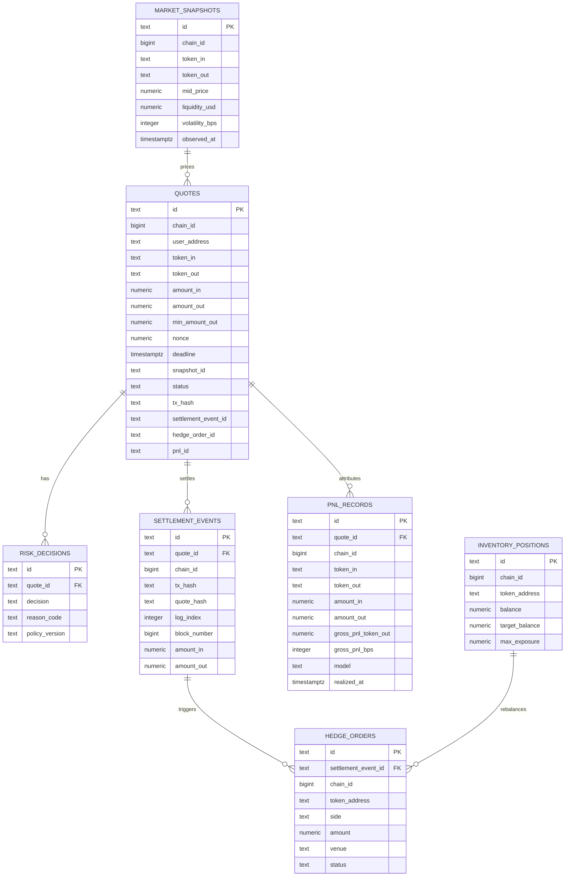

# ER Diagram

本图描述 RFQ 系统第一版操作型数据库关系。PostgreSQL 保存权威业务状态，ClickHouse 保存分析副本。

## Notes

- `settlement_events` 使用 `(chain_id, tx_hash, log_index)` 作为幂等键，并持久化 `quote_hash` 以绑定链上 `QuoteSettled` 事件和链下 EIP-712 quote payload。
- `settlement_events.quote_id` 是 `quotes.id` 的非空外键，并使用 unique index `(quote_id)` 保证一个 signed quote 只能绑定一个 settlement event；这同时保证 settlement-to-quote reconciliation 总能回到本地签发记录。
- `quotes` 使用 partial unique index `(chain_id, user_address, nonce) WHERE nonce IS NOT NULL`，保证 signed quote 的 `chainId:user:nonce` 本地查找键唯一，同时允许 requested / rejected quote 在签名前没有 nonce。
- 数据库层使用 CHECK constraints 固化应用层关键不变量：quote lifecycle status、risk decision、hedge side/status、PnL attribution model、20-byte address、32-byte tx/quote hash、65-byte EIP-712 signature，以及正数成交/对冲金额。
- `quotes.snapshot_id` 对应 `market_snapshots.id`，用于报价回放。
- `quotes.tx_hash`、`quotes.settlement_event_id`、`quotes.hedge_order_id`、`quotes.pnl_id` 是面向 `GET /quote/:id` 的状态指针；权威成交、对冲和 PnL 明细仍分别位于 `settlement_events`、`hedge_orders`、`pnl_records`。
- `risk_decisions.policy_version` 用于解释风控变更后的历史行为。
- `inventory_positions` 是当前操作状态，不替代事件账本。
- `hedge_orders.settlement_event_id` 是 `settlement_events.id` 的非空外键，并使用 unique index `(settlement_event_id)` 防止同一 settlement event 重复创建 hedge intent。
- `pnl_records` 使用 `(quote_id, model)` 防止同一归因模型对同一成交重复入账；生产版可将明细同步到 ClickHouse 做高维分析。
