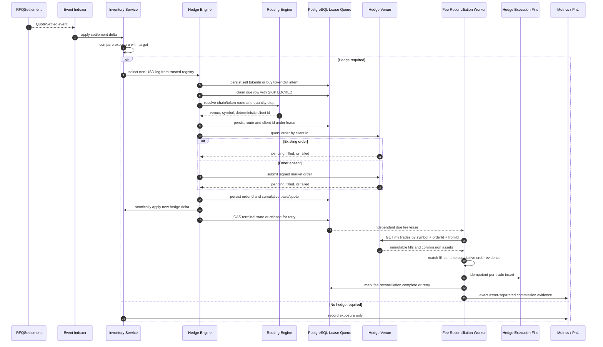

# Hedge Sequence Diagram

本图描述成交后库存变化如何触发对冲。

## Notes

- Hedge Engine 是异步路径，不应阻塞链上 settlement。
- 仅 `tokenOut` 是 USD reference 时卖出收到的 `tokenIn/amountIn`；`tokenIn` 是 USD reference 时买入支付的 `tokenOut/amountOut`，包括稳定币对的库存补充。实时提交和 reconciliation 必须使用同一 planner。
- 对冲失败必须告警，并影响后续 quote spread 和 risk limit。
- 网络超时或 pending 不是失败证据；必须保留 queued，并在下次 lease claim 后先按 deterministic client id 查询。
- 库存更新不等待 `myTrades`；账户成交历史可能短暂落后，费用 lease 独立重试，直到逐笔 base/quote 总和与订单累计证据一致。
- `commissionAsset` 不同的费用保持分组，不能直接相加或未经估值写入净 PnL。
