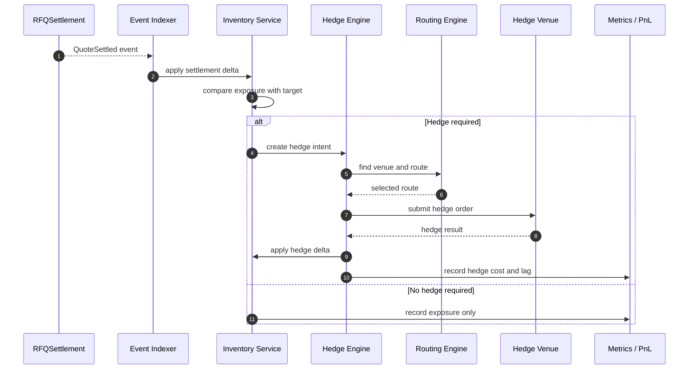

# Hedge Sequence Diagram

本图描述成交后库存变化如何触发对冲。

```mermaid
sequenceDiagram
  autonumber
  participant Chain as RFQSettlement
  participant Indexer as Event Indexer
  participant Inventory as Inventory Service
  participant Hedge as Hedge Engine
  participant Routing as Routing Engine
  participant Venue as Hedge Venue
  participant Metrics as Metrics / PnL

  Chain-->>Indexer: QuoteSettled event
  Indexer->>Inventory: apply settlement delta
  Inventory->>Inventory: compare exposure with target
  alt Hedge required
    Inventory->>Hedge: create hedge intent
    Hedge->>Routing: find venue and route
    Routing-->>Hedge: selected route
    Hedge->>Venue: submit hedge order
    Venue-->>Hedge: hedge result
    Hedge->>Inventory: apply hedge delta
    Hedge->>Metrics: record hedge cost and lag
  else No hedge required
    Inventory->>Metrics: record exposure only
  end
```

## Notes

- Hedge Engine 是异步路径，不应阻塞链上 settlement。
- 对冲失败必须告警，并影响后续 quote spread 和 risk limit。
