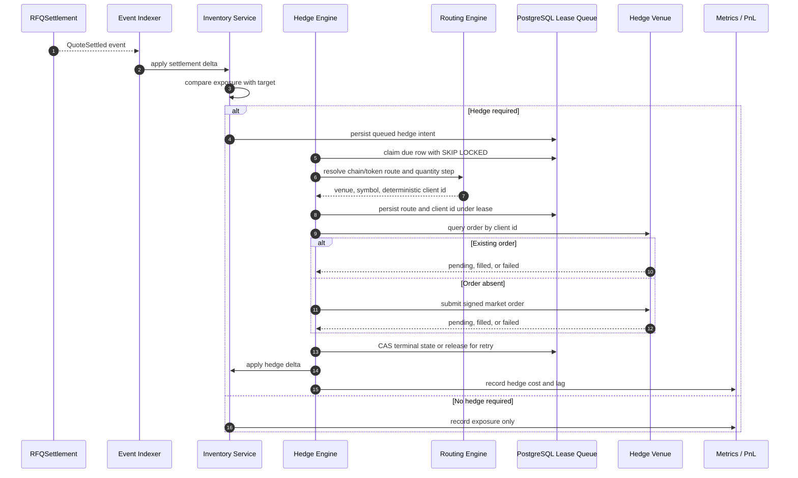

# Hedge Sequence Diagram

本图描述成交后库存变化如何触发对冲。

## Notes

- Hedge Engine 是异步路径，不应阻塞链上 settlement。
- 对冲失败必须告警，并影响后续 quote spread 和 risk limit。
- 网络超时或 pending 不是失败证据；必须保留 queued，并在下次 lease claim 后先按 deterministic client id 查询。
