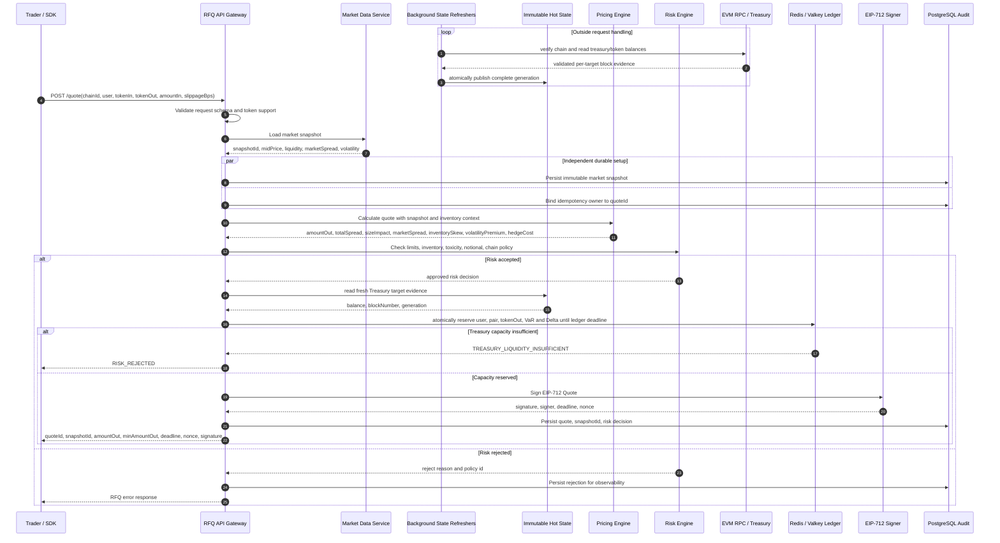

# Quote Sequence Diagram

本图描述当前 `POST /quote` 的生产链路。市场数据、库存、估值与 Treasury balance 在请求外刷新；报价请求只消费有 freshness bound 的内存状态，依次通过定价、风控与 Redis exposure reservation，再进入 EIP-712 签名。

## Design Notes

- `Risk Engine` 必须位于 `Signer` 之前。
- `deadline` 必须足够短，避免市场状态漂移。
- `snapshotId` 是排查报价争议、风控争议和 PnL 归因的关键字段。
- Rejected quote 也应该记录，但不能返回可执行签名。
- 生产环境必须把新鲜 Treasury `tokenOut` hot balance 与所有未过期 quote 的输出预留比较；请求不回源 RPC，刷新失败后旧 generation 只在 freshness bound 内可用。
- 链状态和 Redis 无法原子提交，因此 reservation 保留到 quote deadline 之后的同步 grace，且 grace 必须长于 Treasury hot-state 最大年龄，优先保证不超卖。
