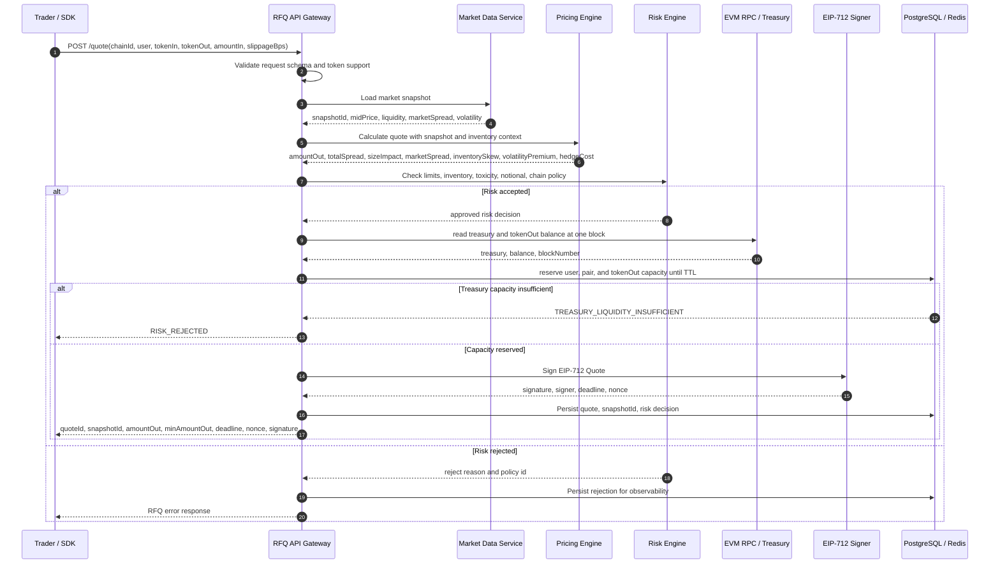

# Quote Sequence Diagram

本图描述 `POST /quote` 的第一阶段目标链路。实现时，报价必须先通过市场数据、定价和风控，再进入 EIP-712 签名。

## Design Notes

- `Risk Engine` 必须位于 `Signer` 之前。
- `deadline` 必须足够短，避免市场状态漂移。
- `snapshotId` 是排查报价争议、风控争议和 PnL 归因的关键字段。
- Rejected quote 也应该记录，但不能返回可执行签名。
- 生产环境必须把真实 Treasury `tokenOut` 余额与所有未过期 quote 的输出预留比较；链 RPC 和数据库无法原子提交，因此 settled reservation 仍保留到 TTL，优先保证不超卖。
