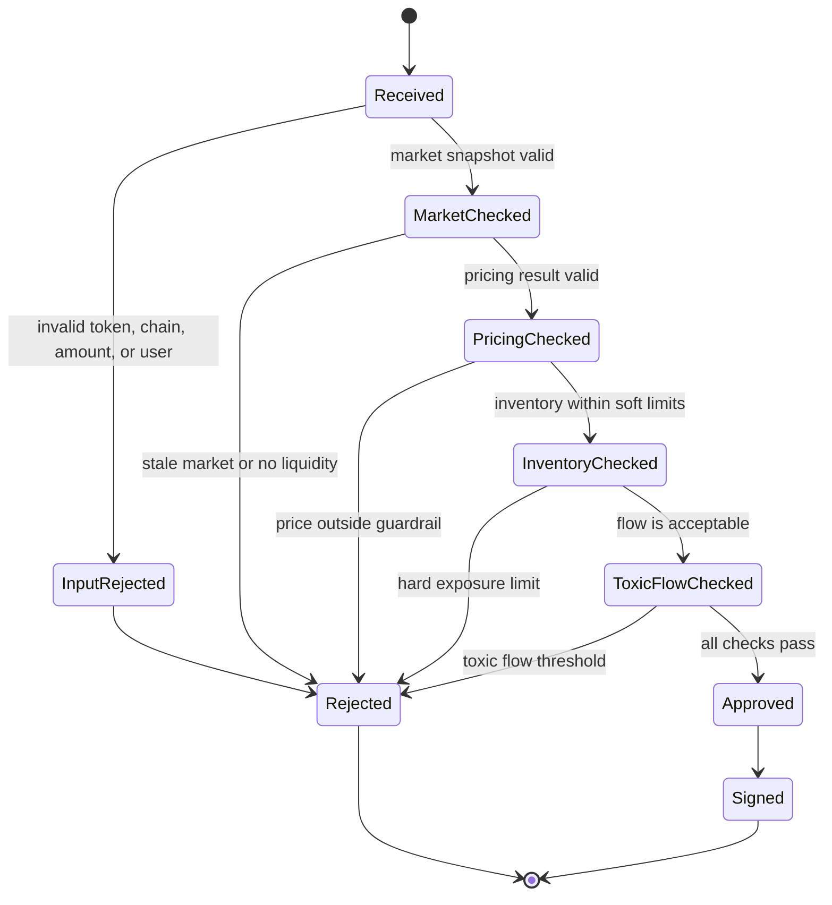

# Risk State Machine

本图描述 quote 在风险系统中的状态变化。

## Risk Outputs

- `decision`: `approved` or `rejected`
- `reasonCode`: stable internal reason
- `policyVersion`: risk policy version used for audit
- `maxNotionalUsd`: policy limit at decision time
- `inventoryExposureBefore`: exposure before quote signing
