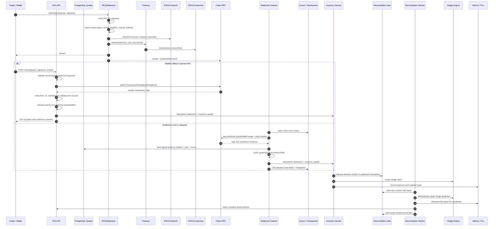

# Submit Sequence Diagram

本图描述 signed quote 经用户钱包提交到链上，再由后端确认交易回执并更新链下状态的流程。Synthetic settlement 只保留给显式开启的本地参考环境；生产链路以链上 `QuoteSettled` 事件为最终 source of truth。

## Invariants

- 合约验证失败时不能更新 nonce 为已使用。
- `txHash` 只是非可信查询键；receipt、transaction 和 event 必须由配置的 RPC 独立读取。
- 非本地环境默认禁止 synthetic settlement，无真实匹配事件时不得更新库存。
- 事件消费必须使用 `chainId + txHash + logIndex` 幂等，并保存 `quoteHash` 和 `blockNumber` 作为链上 `QuoteSettled` 与链下 quote payload 的一致性锚点和 reorg 排查依据。
- Hedge failure 不能回滚已经确认的 settlement，但必须进入风险和告警闭环。
- API 在 settlement 后任意一步崩溃不能丢失 post-trade projection；durable desired revision 必须由独立 worker 最终收敛，旧 revision 不能覆盖 reorg 后的新 canonical 状态。
- 钱包成功但 callback 丢失不能丢失成交；independent indexer 必须从 confirmed log 恢复同一幂等事件。游标只能在整段日志验证和应用完成后 CAS 前移。
- Checkpoint hash 分叉时必须先将 orphan event 标记为 non-canonical，再回退 cursor；超出自动回溯窗口时 fail closed，不得跳块。
