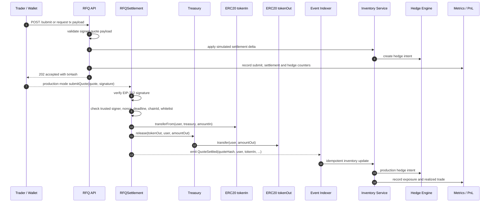

# Submit Sequence Diagram

本图描述 signed quote 从用户提交到链上结算，再到链下状态更新的流程。当前 backend skeleton 在 `/submit` 中同步模拟 settlement、inventory update 和 hedge intent；生产部署中链上 `QuoteSettled` 事件仍是最终 source of truth。

## Invariants

- 合约验证失败时不能更新 nonce 为已使用。
- 第一阶段 skeleton 可同步模拟库存更新；生产库存更新必须以链上事件为准。
- 事件消费必须使用 `chainId + txHash + logIndex` 幂等，并保存 `quoteHash` 和 `blockNumber` 作为链上 `QuoteSettled` 与链下 quote payload 的一致性锚点和 reorg 排查依据。
- Hedge failure 不能回滚已经确认的 settlement，但必须进入风险和告警闭环。
