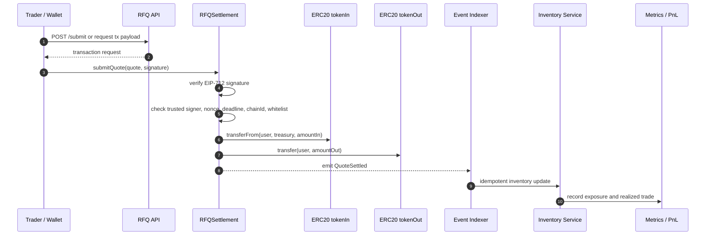

# Submit Sequence Diagram

本图描述 signed quote 从用户提交到链上结算，再到链下状态更新的流程。

```mermaid
sequenceDiagram
  autonumber
  participant User as Trader / Wallet
  participant API as RFQ API
  participant Chain as RFQSettlement
  participant TokenIn as ERC20 tokenIn
  participant TokenOut as ERC20 tokenOut
  participant Indexer as Event Indexer
  participant Inventory as Inventory Service
  participant Metrics as Metrics / PnL

  User->>API: POST /submit or request tx payload
  API-->>User: transaction request
  User->>Chain: submitQuote(quote, signature)
  Chain->>Chain: verify EIP-712 signature
  Chain->>Chain: check trusted signer, nonce, deadline, chainId, whitelist
  Chain->>TokenIn: transferFrom(user, treasury, amountIn)
  Chain->>TokenOut: transfer(user, amountOut)
  Chain-->>Indexer: emit QuoteSettled
  Indexer->>Inventory: idempotent inventory update
  Inventory->>Metrics: record exposure and realized trade
```

## Invariants

- 合约验证失败时不能更新 nonce 为已使用。
- 链下库存更新必须以链上事件为准。
- 事件消费必须使用 `chainId + txHash + logIndex` 幂等。
