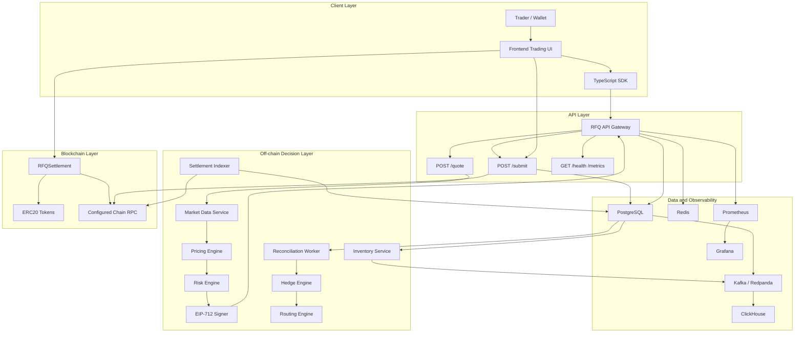

# System Overview Diagram

本图描述 RFQ / Prop AMM 做市系统的核心组件和数据流。系统采用链下复杂决策、链上最小验证的结构。

## Core Invariant

报价系统的核心不变量是 quote 和 execution 的一致性：链上提交的 `Quote` 必须等于链下签名时风控和定价通过的 `Quote`，并且必须在 TTL、nonce、token whitelist、chainId 和 trusted signer 约束下执行。
